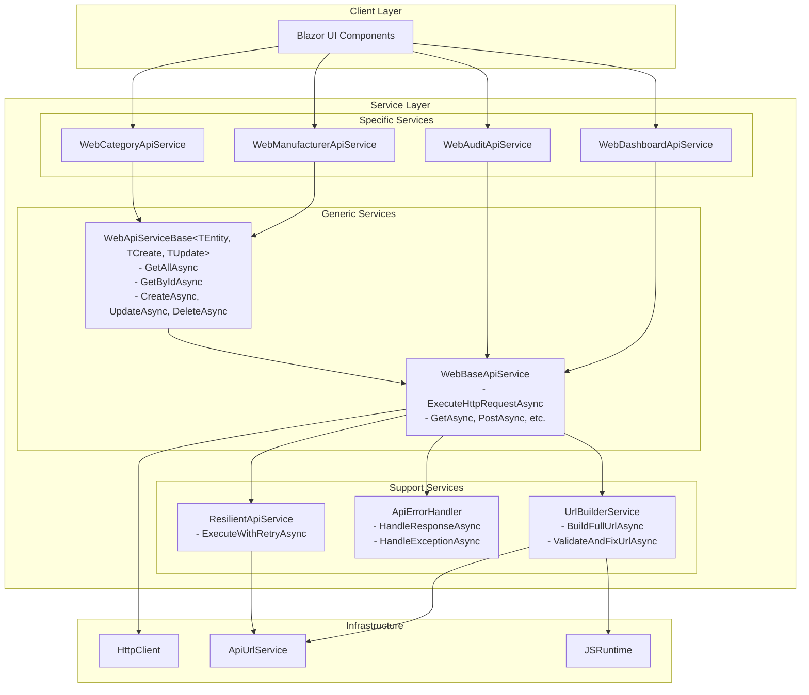

# Архитектура WebBaseApiService после рефакторинга

## Диаграмма архитектуры



## Ключевые улучшения

### 1. Устранение дублирования кода (DRY)
- **До**: Каждый HTTP метод содержал одинаковую логику построения URL, валидации и обработки ответов
- **После**: Общий метод `ExecuteHttpRequestAsync<T>` с параметризованными обработчиками

### 2. Выделение URL Builder в отдельный сервис
- **До**: Логика построения URL была смешана с HTTP запросами
- **После**: Отдельный `IUrlBuilderService` с методами `BuildFullUrlAsync` и `ValidateAndFixUrlAsync`

### 3. Generic Repository Pattern
- **До**: Каждый сервис дублировал CRUD операции
- **После**: `WebApiServiceBase<TEntity, TCreateDto, TUpdateDto>` с готовыми CRUD методами

### 4. Централизованная обработка ошибок
- **До**: Обработка ошибок разбросана по методам
- **После**: `IApiErrorHandler` с единообразной обработкой ошибок и пользовательскими сообщениями

## Преимущества новой архитектуры

1. **Maintainability**: Код стал более читаемым и легким для поддержки
2. **Consistency**: Единообразная обработка ошибок и построение URL
3. **Reusability**: Generic базовый класс для CRUD операций
4. **Testability**: Каждый компонент можно тестировать отдельно
5. **Extensibility**: Легко добавлять новые API сервисы
6. **Error Handling**: Централизованная и консистентная обработка ошибок

## Пример использования

```csharp
// Простой сервис для производителей
public class WebManufacturerApiService : WebApiServiceBase<ManufacturerDto, CreateManufacturerDto, UpdateManufacturerDto>, IManufacturerService
{
    protected override string BaseEndpoint => ApiEndpoints.Manufacturers;
    
    // Все CRUD операции наследуются автоматически
    // Можно добавить специфичные методы при необходимости
}
```

## Результат рефакторинга

- **Сокращение кода**: ~70% меньше дублированного кода
- **Улучшение читаемости**: Четкое разделение ответственности
- **Повышение надежности**: Централизованная обработка ошибок
- **Упрощение тестирования**: Модульная архитектура
- **Легкость расширения**: Generic паттерн для новых сущностей
