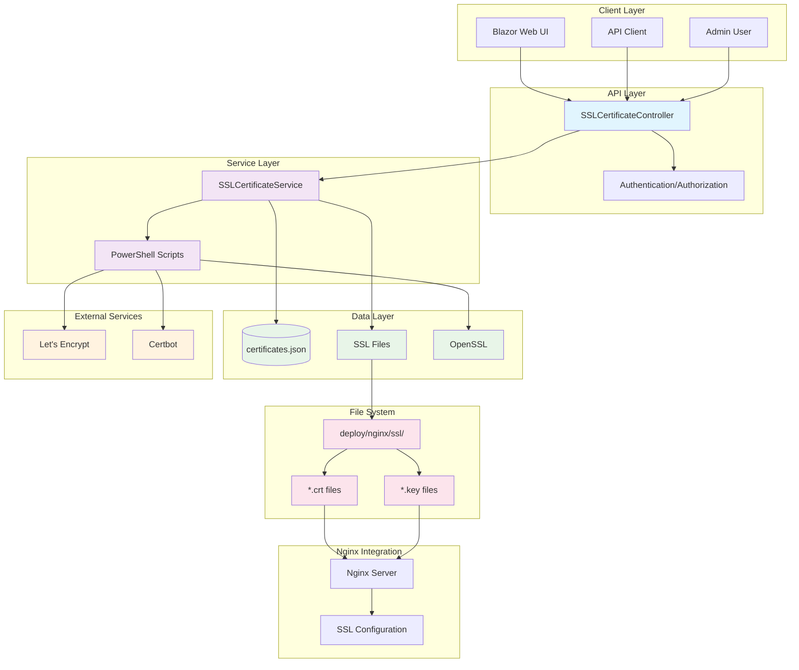
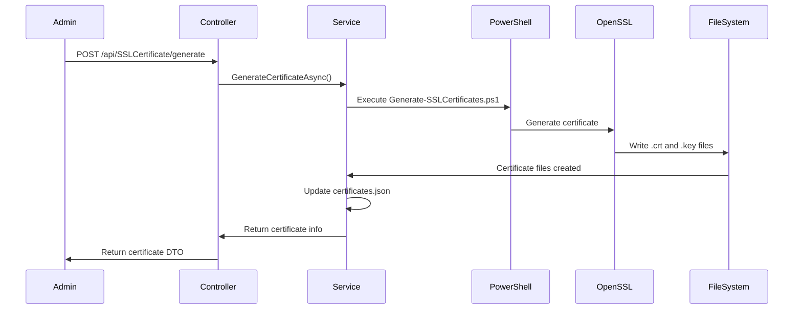
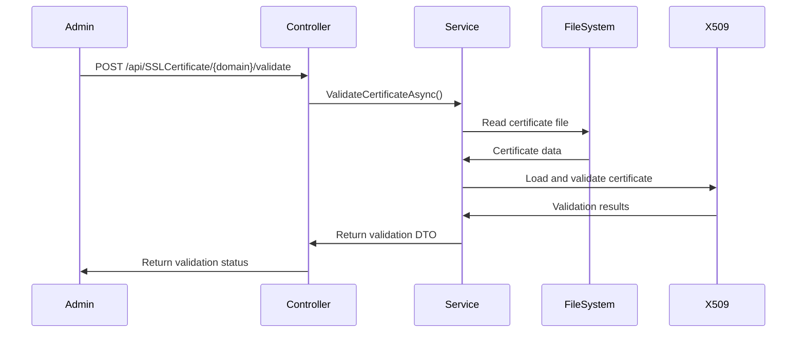
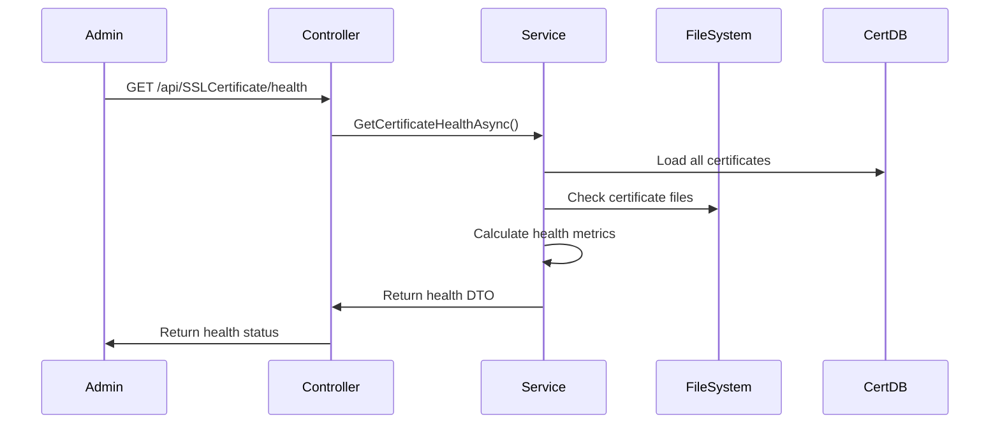

# SSL Certificate Management Architecture

```mermaid
graph TB
    %% Client Layer
    subgraph "Client Layer"
        UI[Blazor Web UI]
        API_Client[API Client]
        Admin[Admin User]
    end

    %% API Layer
    subgraph "API Layer"
        SSL_Controller[SSLCertificateController]
        Auth[Authentication/Authorization]
    end

    %% Service Layer
    subgraph "Service Layer"
        SSL_Service[SSLCertificateService]
        PowerShell[PowerShell Scripts]
    end

    %% Data Layer
    subgraph "Data Layer"
        Cert_DB[(certificates.json)]
        SSL_Files[SSL Files]
        OpenSSL[OpenSSL]
    end

    %% External Services
    subgraph "External Services"
        LetsEncrypt[Let's Encrypt]
        Certbot[Certbot]
    end

    %% File System
    subgraph "File System"
        SSL_Dir[deploy/nginx/ssl/]
        Cert_Files[*.crt files]
        Key_Files[*.key files]
    end

    %% Nginx Integration
    subgraph "Nginx Integration"
        Nginx[Nginx Server]
        SSL_Config[SSL Configuration]
    end

    %% Connections
    UI --> SSL_Controller
    API_Client --> SSL_Controller
    Admin --> SSL_Controller
    
    SSL_Controller --> Auth
    SSL_Controller --> SSL_Service
    
    SSL_Service --> PowerShell
    SSL_Service --> Cert_DB
    SSL_Service --> SSL_Files
    
    PowerShell --> OpenSSL
    PowerShell --> LetsEncrypt
    PowerShell --> Certbot
    
    SSL_Files --> SSL_Dir
    SSL_Dir --> Cert_Files
    SSL_Dir --> Key_Files
    
    Cert_Files --> Nginx
    Key_Files --> Nginx
    Nginx --> SSL_Config

    %% Styling
    classDef controller fill:#e1f5fe
    classDef service fill:#f3e5f5
    classDef data fill:#e8f5e8
    classDef external fill:#fff3e0
    classDef files fill:#fce4ec

    class SSL_Controller controller
    class SSL_Service,PowerShell service
    class Cert_DB,SSL_Files,OpenSSL data
    class LetsEncrypt,Certbot external
    class SSL_Dir,Cert_Files,Key_Files files
```

## Component Interactions

### 1. Certificate Generation Flow

```mermaid
sequenceDiagram
    participant Admin
    participant Controller
    participant Service
    participant PowerShell
    participant OpenSSL
    participant FileSystem

    Admin->>Controller: POST /api/SSLCertificate/generate
    Controller->>Service: GenerateCertificateAsync()
    Service->>PowerShell: Execute Generate-SSLCertificates.ps1
    PowerShell->>OpenSSL: Generate certificate
    OpenSSL->>FileSystem: Write .crt and .key files
    FileSystem->>Service: Certificate files created
    Service->>Service: Update certificates.json
    Service->>Controller: Return certificate info
    Controller->>Admin: Return certificate DTO
```

### 2. Certificate Validation Flow

```mermaid
sequenceDiagram
    participant Admin
    participant Controller
    participant Service
    participant FileSystem
    participant X509

    Admin->>Controller: POST /api/SSLCertificate/{domain}/validate
    Controller->>Service: ValidateCertificateAsync()
    Service->>FileSystem: Read certificate file
    FileSystem->>Service: Certificate data
    Service->>X509: Load and validate certificate
    X509->>Service: Validation results
    Service->>Controller: Return validation DTO
    Controller->>Admin: Return validation status
```

### 3. Health Monitoring Flow

```mermaid
sequenceDiagram
    participant Admin
    participant Controller
    participant Service
    participant FileSystem
    participant CertDB

    Admin->>Controller: GET /api/SSLCertificate/health
    Controller->>Service: GetCertificateHealthAsync()
    Service->>CertDB: Load all certificates
    Service->>FileSystem: Check certificate files
    Service->>Service: Calculate health metrics
    Service->>Controller: Return health DTO
    Controller->>Admin: Return health status
```
