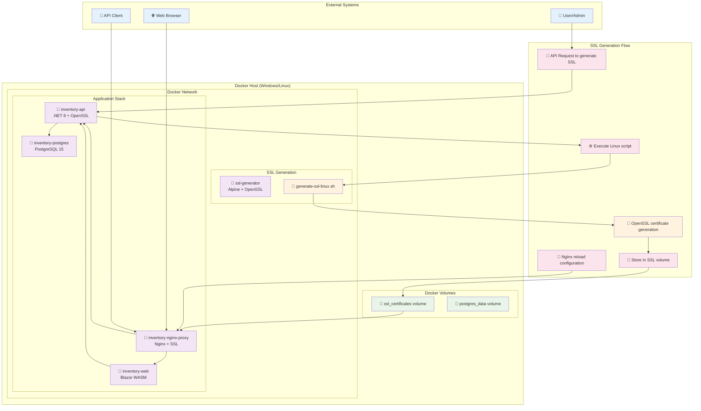

# SSL Certificate Generation in Docker Architecture



## 🐳 Docker Architecture for SSL Certificates

### **Container Structure**

#### **1. SSL Generator Container (Init Container)**
```yaml
ssl-generator:
  image: alpine:latest
  volumes:
    - ssl_certificates:/etc/nginx/ssl
    - ./scripts:/scripts:ro
  command: |
    sh -c "
      apk add --no-cache openssl &&
      chmod +x /scripts/generate-ssl-linux.sh &&
      /scripts/generate-ssl-linux.sh --environment development --output-path /etc/nginx/ssl
    "
```

**Функции:**
- ✅ Устанавливает OpenSSL в Alpine Linux
- ✅ Выполняет Linux-совместимый скрипт генерации
- ✅ Создает сертификаты в общем volume
- ✅ Завершается после генерации

#### **2. API Container (Enhanced)**
```yaml
inventory-api:
  build:
    dockerfile: src/Inventory.API/Dockerfile.ssl
  volumes:
    - ssl_certificates:/etc/nginx/ssl
  environment:
    - DOTNET_RUNNING_IN_CONTAINER=true
    - SSL__Path=/etc/nginx/ssl
```

**Функции:**
- ✅ Определяет, что работает в контейнере
- ✅ Использует Linux скрипт вместо PowerShell
- ✅ Имеет доступ к SSL volume
- ✅ Устанавливает OpenSSL и certbot

#### **3. Nginx Container (SSL Termination)**
```yaml
nginx-proxy:
  image: nginx:alpine
  volumes:
    - ssl_certificates:/etc/nginx/ssl:ro
  depends_on:
    - ssl-generator
```

**Функции:**
- ✅ Читает сертификаты из общего volume
- ✅ Настраивает SSL termination
- ✅ Проксирует HTTPS трафик к API

### **SSL Generation Process in Docker**

#### **1. Initial Setup (Развертывание)**
```bash
# 1. Запуск SSL генератора
docker-compose -f docker-compose.ssl.yml up ssl-generator

# 2. Генерация сертификатов
/scripts/generate-ssl-linux.sh --environment development --output-path /etc/nginx/ssl

# 3. Запуск всех сервисов
docker-compose -f docker-compose.ssl.yml up -d
```

#### **2. Runtime Generation (Через API)**
```bash
# 1. API получает запрос на генерацию
POST /api/SSLCertificate/generate

# 2. API определяет, что работает в контейнере
if (Environment.GetEnvironmentVariable("DOTNET_RUNNING_IN_CONTAINER") == "true")

# 3. Выполняет Linux скрипт
bash /usr/local/bin/generate-ssl-linux.sh --environment production

# 4. Сохраняет сертификаты в volume
# 5. Nginx автоматически подхватывает новые сертификаты
```

### **Volume Management**

#### **SSL Certificates Volume**
```yaml
volumes:
  ssl_certificates:
    driver: local
```

**Содержимое:**
```
/etc/nginx/ssl/
├── localhost.crt          # Self-signed certificate
├── localhost.key          # Private key
├── warehouse.cuby.crt     # Production certificate
├── warehouse.cuby.key     # Production private key
├── staging.warehouse.cuby.crt
├── staging.warehouse.cuby.key
└── *.warehouse.cuby.crt   # Wildcard certificate
```

### **Environment Detection**

#### **API Service Logic**
```csharp
// Check if we're running in a container
var isContainer = Environment.GetEnvironmentVariable("DOTNET_RUNNING_IN_CONTAINER") == "true";

if (isContainer)
{
    // Use Linux script in container
    scriptPath = "/usr/local/bin/generate-ssl-linux.sh";
    fileName = "bash";
}
else
{
    // Use PowerShell script on Windows host
    scriptPath = Path.Combine(Directory.GetCurrentDirectory(), "scripts", "Generate-SSLCertificates.ps1");
    fileName = "powershell.exe";
}
```

### **Deployment Commands**

#### **Development with SSL**
```powershell
# Self-signed certificates
.\deploy\deploy-with-ssl.ps1 -Environment development

# Let's Encrypt certificates
.\deploy\deploy-with-ssl.ps1 -Environment production -UseLetsEncrypt -Email "admin@company.com"
```

#### **Manual SSL Generation**
```bash
# Generate certificates manually
docker exec inventory-api /usr/local/bin/generate-ssl-linux.sh --environment production --force

# Check generated certificates
docker exec inventory-nginx-proxy ls -la /etc/nginx/ssl/

# View certificate details
docker exec inventory-nginx-proxy openssl x509 -in /etc/nginx/ssl/localhost.crt -text -noout
```

### **Security Considerations**

#### **1. Volume Permissions**
```bash
# Set proper permissions for SSL files
find /etc/nginx/ssl -name "*.key" -exec chmod 600 {} \;
find /etc/nginx/ssl -name "*.crt" -exec chmod 644 {} \;
```

#### **2. Container Security**
- ✅ SSL volume доступен только для чтения в Nginx
- ✅ API имеет полный доступ для генерации сертификатов
- ✅ Приватные ключи защищены правильными правами доступа

#### **3. Network Security**
- ✅ HTTPS трафик проходит через Nginx
- ✅ API доступен только через внутреннюю сеть Docker
- ✅ SSL termination на уровне Nginx

### **Troubleshooting**

#### **Common Issues**

1. **SSL Script Not Found**
```bash
# Check if script exists
docker exec inventory-api ls -la /usr/local/bin/generate-ssl-linux.sh

# Fix: Rebuild container
docker-compose -f docker-compose.ssl.yml up --build inventory-api
```

2. **OpenSSL Not Available**
```bash
# Check OpenSSL installation
docker exec inventory-api openssl version

# Fix: Rebuild with SSL Dockerfile
docker-compose -f docker-compose.ssl.yml up --build
```

3. **Certificate Generation Fails**
```bash
# Check logs
docker-compose -f docker-compose.ssl.yml logs ssl-generator

# Manual generation
docker exec inventory-api /usr/local/bin/generate-ssl-linux.sh --environment development --verbose
```

4. **Nginx SSL Errors**
```bash
# Check Nginx configuration
docker exec inventory-nginx-proxy nginx -t

# Check certificate files
docker exec inventory-nginx-proxy ls -la /etc/nginx/ssl/

# Restart Nginx
docker-compose -f docker-compose.ssl.yml restart nginx-proxy
```

### **Performance Considerations**

#### **1. Volume I/O**
- ✅ SSL volume использует локальный драйвер для быстрого доступа
- ✅ Nginx читает сертификаты только при запуске/перезагрузке

#### **2. Container Startup**
- ✅ SSL генератор запускается как init container
- ✅ Основные сервисы ждут завершения генерации SSL

#### **3. Certificate Renewal**
- ✅ Автоматическое обновление через Hangfire (планируется)
- ✅ Health check для мониторинга истечения сертификатов

## 🎯 Summary

**✅ Решено:**
- PowerShell скрипты заменены на Linux-совместимые
- OpenSSL установлен в контейнерах
- SSL сертификаты хранятся в Docker volume
- API автоматически определяет среду выполнения
- Nginx настроен для SSL termination

**🔄 Преимущества:**
- Кроссплатформенность (Windows/Linux)
- Автоматическая генерация при развертывании
- Безопасное хранение сертификатов
- Простое управление через API
- Готовность к production с Let's Encrypt
