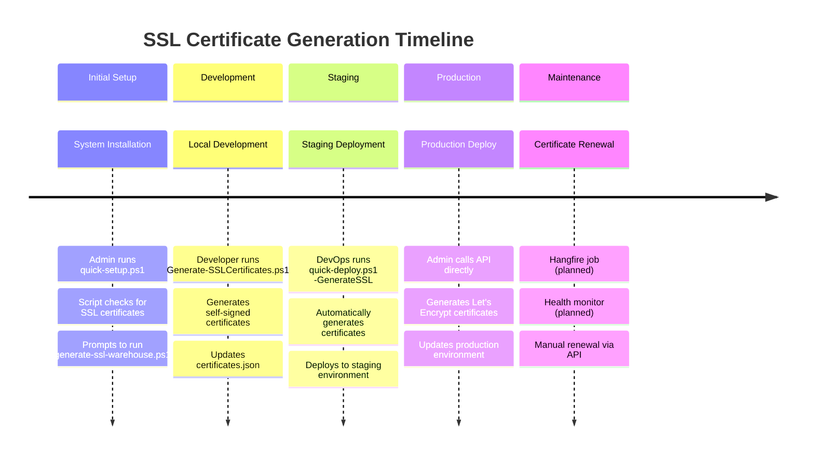

# SSL Certificate Generation Initiators

```mermaid
graph TB
    %% Human Initiators
    subgraph "Human Initiators"
        Admin[👨‍💼 System Administrator]
        DevOps[👨‍💻 DevOps Engineer]
        Developer[👨‍💻 Developer]
    end

    %% Automated Initiators
    subgraph "Automated Initiators"
        DeployScript[📜 Deployment Scripts]
        QuickSetup[🚀 quick-setup.ps1]
        QuickDeploy[⚡ quick-deploy.ps1]
        CheckDeploy[🔍 check-deployment-readiness.ps1]
    end

    %% Future Automated Initiators
    subgraph "Future Automated Initiators"
        Hangfire[⏰ Hangfire Background Jobs]
        CronJobs[🕐 Cron Jobs]
        HealthMonitor[🏥 Health Monitor Service]
        AutoRenewal[🔄 Auto-Renewal Service]
    end

    %% API Endpoints
    subgraph "API Endpoints"
        GenerateAPI[POST /api/SSLCertificate/generate]
        RenewAPI[POST /api/SSLCertificate/{domain}/renew]
        HealthAPI[GET /api/SSLCertificate/health]
    end

    %% Triggers
    subgraph "Triggers"
        InitialSetup[🏗️ Initial System Setup]
        NewDomain[🌐 New Domain Addition]
        CertExpiry[⏰ Certificate Expiry]
        ManualRenewal[🔄 Manual Renewal]
        Deployment[🚀 System Deployment]
        HealthCheck[🏥 Health Check Failure]
    end

    %% Connections
    Admin --> GenerateAPI
    DevOps --> GenerateAPI
    Developer --> GenerateAPI

    DeployScript --> GenerateAPI
    QuickSetup --> GenerateAPI
    QuickDeploy --> GenerateAPI
    CheckDeploy --> GenerateAPI

    Hangfire --> GenerateAPI
    CronJobs --> GenerateAPI
    HealthMonitor --> GenerateAPI
    AutoRenewal --> RenewAPI

    InitialSetup --> Admin
    NewDomain --> Admin
    CertExpiry --> AutoRenewal
    ManualRenewal --> Admin
    Deployment --> DeployScript
    HealthCheck --> HealthMonitor

    %% Styling
    classDef human fill:#e3f2fd
    classDef automated fill:#f3e5f5
    classDef future fill:#fff3e0
    classDef api fill:#e8f5e8
    classDef trigger fill:#fce4ec

    class Admin,DevOps,Developer human
    class DeployScript,QuickSetup,QuickDeploy,CheckDeploy automated
    class Hangfire,CronJobs,HealthMonitor,AutoRenewal future
    class GenerateAPI,RenewAPI,HealthAPI api
    class InitialSetup,NewDomain,CertExpiry,ManualRenewal,Deployment,HealthCheck trigger
```

## Current Initiators (Реальные инициаторы)

### 1. **Human Initiators (Человеческие инициаторы)**

#### **System Administrator**
- **Когда**: При первоначальной настройке системы
- **Как**: Через веб-интерфейс или API клиент
- **Пример**:
```bash
curl -X POST "https://localhost:7000/api/SSLCertificate/generate" \
  -H "Authorization: Bearer <admin_token>" \
  -H "Content-Type: application/json" \
  -d '{"domain": "warehouse.cuby", "useLetsEncrypt": true}'
```

#### **DevOps Engineer**
- **Когда**: При развертывании в новых окружениях
- **Как**: Через скрипты развертывания или API
- **Пример**:
```powershell
# В скрипте развертывания
$response = Invoke-RestMethod -Uri "https://api.company.com/api/SSLCertificate/generate" \
  -Method POST -Headers @{Authorization="Bearer $token"} \
  -Body (@{domain="staging.company.com"; useLetsEncrypt=$true} | ConvertTo-Json)
```

#### **Developer**
- **Когда**: При разработке и тестировании
- **Как**: Через локальные скрипты или API
- **Пример**:
```powershell
# Локальная генерация для разработки
.\scripts\Generate-SSLCertificates.ps1 -Environment development
```

### 2. **Automated Initiators (Автоматические инициаторы)**

#### **Deployment Scripts (Скрипты развертывания)**

##### **quick-setup.ps1**
```powershell
# 3. Генерация SSL сертификатов (self-signed)
Write-Host "`n3. Генерация SSL сертификатов..." -ForegroundColor Cyan
$domains = @("warehouse.cuby", "staging.warehouse.cuby", "test.warehouse.cuby")

foreach ($domain in $domains) {
    $certFile = "deploy/nginx/ssl/$domain.crt"
    $keyFile = "deploy/nginx/ssl/$domain.key"
    
    if (!(Test-Path $certFile) -or !(Test-Path $keyFile)) {
        Write-Host "   ⚠️  Сертификат для $domain не найден" -ForegroundColor Yellow
        Write-Host "   Запустите: .\generate-ssl-warehouse.ps1" -ForegroundColor Cyan
    }
}
```

##### **quick-deploy.ps1**
```powershell
# Generate SSL certificates if requested
if ($GenerateSSL) {
    Write-Host "🔐 Generating SSL certificates..." -ForegroundColor Yellow
    & ..\scripts\generate-ssl.ps1
}
```

##### **check-deployment-readiness.ps1**
```powershell
# 4. Проверка SSL сертификатов
Write-Host "`n4. Проверка SSL сертификатов..." -ForegroundColor Cyan
$sslDir = "deploy/nginx/ssl"
if (Test-Path $sslDir) {
    Write-Host "   Директория SSL найдена" -ForegroundColor Green
    # Проверка каждого домена
    foreach ($domain in $domains) {
        $certFile = "$sslDir/$domain.crt"
        $keyFile = "$sslDir/$domain.key"
        # ... проверка существования
    }
}
```

## Future Automated Initiators (Планируемые автоматические инициаторы)

### 3. **Hangfire Background Jobs (Фоновая задача)**

В задаче #4 "Notification Scheduling System" планируется интеграция Hangfire, которая может быть использована для автоматического обновления сертификатов:

```csharp
// Планируемая реализация
[RecurringJob("ssl-renewal", "0 2 * * 0")] // Каждое воскресенье в 2:00
public async Task RenewExpiringCertificates()
{
    var expiringCerts = await _sslService.GetCertificatesExpiringSoonAsync(30);
    foreach (var cert in expiringCerts)
    {
        await _sslService.RenewCertificateAsync(cert.Domain);
    }
}
```

### 4. **Health Monitor Service (Сервис мониторинга)**

```csharp
// Планируемая реализация
public class SSLHealthMonitorService : BackgroundService
{
    protected override async Task ExecuteAsync(CancellationToken stoppingToken)
    {
        while (!stoppingToken.IsCancellationRequested)
        {
            var health = await _sslService.GetCertificateHealthAsync();
            if (health.ExpiringSoonCertificates > 0)
            {
                // Автоматическое обновление
                await RenewExpiringCertificates();
            }
            await Task.Delay(TimeSpan.FromHours(24), stoppingToken);
        }
    }
}
```

### 5. **Cron Jobs (Системные задачи)**

```bash
# Планируемая cron задача
0 2 * * 0 /path/to/ssl-renewal.sh
```

## Timeline of SSL Certificate Generation



## Current State Summary

**✅ Реализовано:**
- Ручная генерация через API
- Автоматическая генерация через скрипты развертывания
- Проверка готовности к развертыванию

**🔄 В планах:**
- Автоматическое обновление через Hangfire
- Мониторинг здоровья сертификатов
- Cron задачи для регулярного обновления

**🎯 Основные инициаторы сейчас:**
1. **Администраторы** - через API для production
2. **DevOps** - через скрипты развертывания
3. **Разработчики** - через локальные скрипты
4. **Скрипты развертывания** - автоматически при деплое
