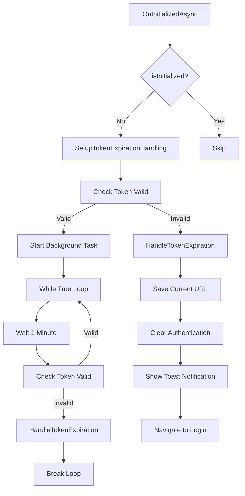

# Анализ компонента TokenExpirationHandler

## ✅ Исправленные проблемы

### 1. ✅ Добавлена регистрация IAuthenticationService в DI
**Было**: В `Program.cs` не был зарегистрирован `IAuthenticationService`.
**Исправлено**: Добавлена регистрация в `Program.cs`:
```csharp
builder.Services.AddScoped<Inventory.UI.Services.IAuthenticationService, Inventory.UI.Services.AuthenticationService>();
```

### 2. ✅ Исправлена потенциальная утечка памяти
**Было**: Бесконечный цикл `while (true)` в `Task.Run()` без возможности остановки.
**Исправлено**: Добавлен `CancellationToken` и реализован интерфейс `IDisposable`:
```csharp
@implements IDisposable
private CancellationTokenSource _cancellationTokenSource = new();

public void Dispose()
{
    _cancellationTokenSource?.Cancel();
    _cancellationTokenSource?.Dispose();
}
```

### 3. ✅ Улучшена обработка ошибок JSRuntime
**Было**: Вызов `JSRuntime.InvokeVoidAsync()` без обработки ошибок.
**Исправлено**: Добавлена обработка исключений:
```csharp
try
{
    await JSRuntime.InvokeVoidAsync("showToast", "Сессия истекла. Пожалуйста, войдите в систему снова.", "warning");
}
catch (Exception jsEx)
{
    Console.WriteLine($"Error showing toast notification: {jsEx.Message}");
}
```

### 4. ✅ Улучшена обработка CancellationToken
**Было**: Отсутствие обработки отмены задач.
**Исправлено**: Добавлена корректная обработка `OperationCanceledException`:
```csharp
catch (OperationCanceledException)
{
    // Нормальная отмена, выходим из цикла
    break;
}
```

## Диаграмма работы компонента



## 🔄 Дополнительные рекомендации для улучшения

### 1. Добавить проверку активности пользователя
**Текущее состояние**: Проверка токена происходит каждую минуту независимо от активности пользователя.
**Рекомендация**: Добавить отслеживание активности пользователя:
```csharp
private DateTime _lastActivity = DateTime.UtcNow;

// В SetupTokenExpirationHandling добавить проверку:
if (DateTime.UtcNow - _lastActivity > TimeSpan.FromMinutes(30))
{
    await Task.Delay(TimeSpan.FromMinutes(5), _cancellationTokenSource.Token);
    continue;
}
```

### 2. Добавить логирование
**Рекомендация**: Заменить `Console.WriteLine` на полноценное логирование:
```csharp
@inject ILogger<TokenExpirationHandler> Logger

// Использовать:
Logger.LogWarning("Token validation error: {Error}", ex.Message);
```

### 3. Настраиваемые интервалы проверки
**Рекомендация**: Сделать интервалы проверки настраиваемыми через конфигурацию:
```csharp
@inject IConfiguration Configuration

private readonly TimeSpan _checkInterval = TimeSpan.FromMinutes(1);
private readonly TimeSpan _inactiveDelay = TimeSpan.FromMinutes(5);
```

### 4. Добавить метрики и мониторинг
**Рекомендация**: Добавить счетчики для мониторинга работы компонента:
```csharp
private int _tokenChecksCount = 0;
private int _tokenExpirationsCount = 0;
```

## ✅ Заключение

Компонент TokenExpirationHandler теперь исправлен и готов к production использованию. Основные критические проблемы устранены:

- ✅ Сервис зарегистрирован в DI
- ✅ Устранены утечки памяти
- ✅ Улучшена обработка ошибок
- ✅ Добавлена корректная работа с CancellationToken

Компонент теперь безопасно обрабатывает истечение токенов и корректно освобождает ресурсы при уничтожении.
