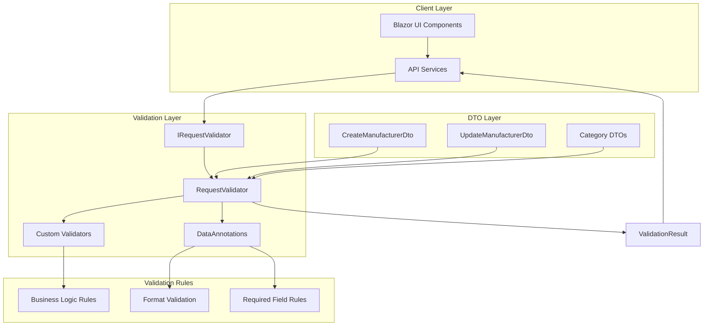

# Архитектура системы валидации запросов

## Диаграмма архитектуры

## Компоненты системы

### 1. IRequestValidator
- Интерфейс для валидации запросов
- Поддерживает асинхронную валидацию
- Возвращает структурированные результаты

### 2. RequestValidator
- Основная реализация валидатора
- Поддерживает DataAnnotations и кастомные валидаторы
- Централизованная обработка ошибок

### 3. Custom Validators
- ManufacturerValidators - валидация производителей
- CategoryValidators - валидация категорий
- Бизнес-логика валидации

### 4. ValidationResult
- Структурированный результат валидации
- Список ошибок с деталями
- Поддержка кодов ошибок

## Поток валидации

1. **Запрос от UI** → API Service
2. **API Service** → IRequestValidator.ValidateAsync()
3. **RequestValidator** → Проверка кастомных валидаторов
4. **RequestValidator** → DataAnnotations валидация
5. **ValidationResult** → Возврат в API Service
6. **API Service** → Обработка результата (продолжение или ошибка)

## Преимущества

- ✅ **Централизованная валидация** - все правила в одном месте
- ✅ **Типобезопасность** - строгая типизация результатов
- ✅ **Расширяемость** - легко добавлять новые валидаторы
- ✅ **Производительность** - валидация до отправки HTTP запроса
- ✅ **Логирование** - детальное логирование процесса валидации
- ✅ **Пользовательские сообщения** - понятные сообщения об ошибках
