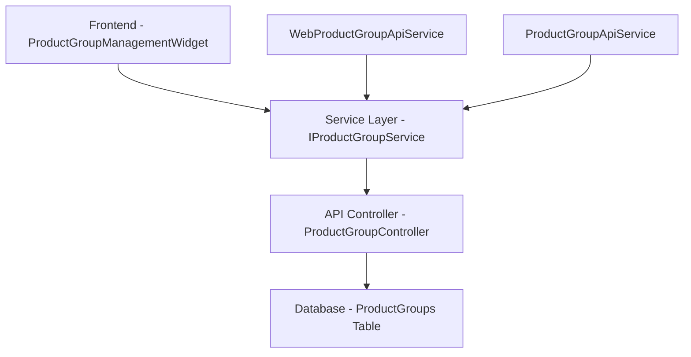
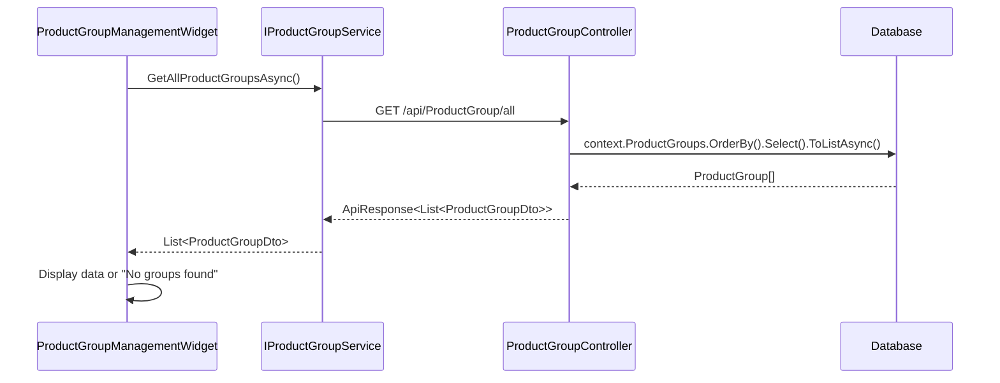
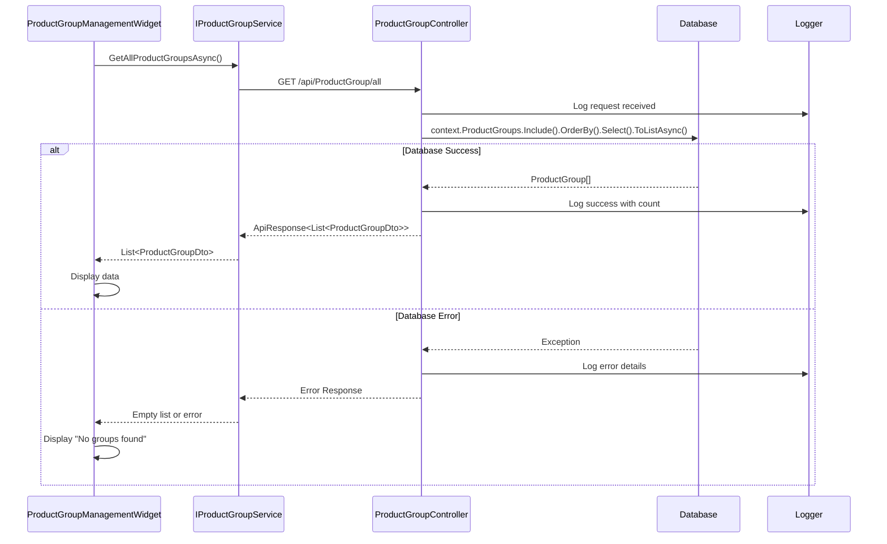
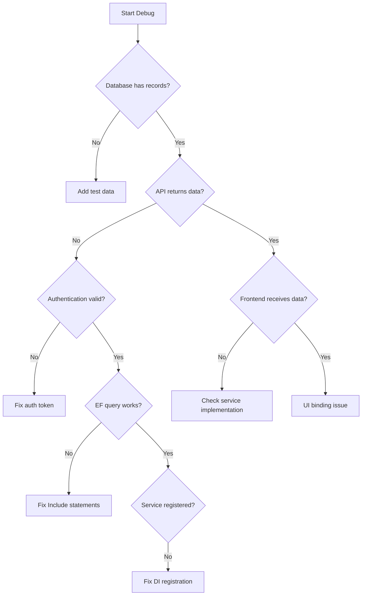

# Product Groups Empty List Bug Fix Design

## Overview

This design document addresses the critical bug where the Product Groups list appears empty on the reference data management page (http://localhost/admin/reference-data) despite having records in the database. The issue affects the administrative functionality for managing product categories and hierarchies.

## Problem Analysis

### Symptom
- Product Groups tab displays "No product groups found" message
- Database contains ProductGroup records
- Other reference data sections (Manufacturers, Units of Measure, etc.) work correctly

### Architecture Analysis

The Product Groups feature follows a standard three-tier architecture:



### Potential Root Causes

Based on analysis of the codebase, several potential issues could cause this problem:

1. **Entity Framework Navigation Property Issue**
   - The ProductGroup model uses navigation properties for hierarchy
   - Missing `.Include()` statements may cause lazy loading issues

2. **API Endpoint Path Mismatch**
   - Frontend calls `/api/ProductGroup/all` endpoint
   - Route configuration issues in ASP.NET Core

3. **Authorization/Authentication Problems**
   - Admin role requirement may be blocking data retrieval
   - Token validation issues

4. **Database Connection Issues**
   - Context not properly configured
   - Migration state problems

5. **Service Registration Issues**
   - Dependency injection configuration problems
   - Service interface implementation mismatch

## Technical Investigation Points

### Database Layer Verification
| Component | Status | Notes |
|-----------|--------|-------|
| ProductGroups Table | ✅ Exists | Confirmed in migrations |
| Entity Framework Model | ✅ Configured | Proper DbSet and relationships |
| Database Indexes | ✅ Present | ParentProductGroupId indexed |

### API Layer Analysis
| Component | Status | Potential Issue |
|-----------|--------|----------------|
| ProductGroupController | ✅ Implemented | Navigation property query without Include |
| Route Configuration | ❓ Needs verification | [Route("api/[controller]")] pattern |
| Authorization | ❓ Needs verification | [Authorize] attribute on controller |

### Frontend Layer Analysis
| Component | Status | Potential Issue |
|-----------|--------|----------------|
| ProductGroupManagementWidget | ✅ Implemented | Proper service injection |
| Service Registration | ❓ Needs verification | DI container configuration |
| API Endpoint Constants | ✅ Correct | ApiEndpoints.ProductGroupAll = "/ProductGroup/all" |

## Identified Issues and Solutions

### Issue 1: Missing Entity Framework Include Statement

**Problem**: The ProductGroupController queries use navigation properties (`pg.ParentProductGroup.Name`) without explicit `.Include()` statements, which may cause null reference issues in certain EF configurations.

**Current Code Pattern**:
```text
var productGroups = await context.ProductGroups
    .OrderBy(pg => pg.Name)
    .Select(pg => new ProductGroupDto
    {
        // ... other properties
        ParentProductGroupName = pg.ParentProductGroup != null ? pg.ParentProductGroup.Name : null,
        // ...
    })
    .ToListAsync();
```

**Solution**: Add explicit Include statement for navigation properties to ensure proper loading.

### Issue 2: API Route Resolution

**Problem**: The frontend expects `/api/ProductGroup/all` but the controller route may not resolve correctly.

**Analysis**:
- Controller uses `[Route("api/[controller]")]`
- Method uses `[HttpGet("all")]`
- Expected path: `/api/ProductGroup/all`

**Solution**: Verify route registration and add explicit route if needed.

### Issue 3: Service Registration Mismatch

**Problem**: Different service implementations between Server (Inventory.API) and Client (Inventory.Web.Client) may cause registration conflicts.

**Analysis**:
- Server uses: `ProductGroupApiService`
- Client uses: `WebProductGroupApiService`
- Both implement: `IProductGroupService`

**Solution**: Ensure proper service registration in each project's Program.cs.

### Issue 4: Authorization Scope

**Problem**: The controller has `[Authorize]` attribute which may block access if authentication is not properly configured.

**Solution**: Verify that Admin users have proper authentication tokens and role claims.

## Fix Implementation Strategy

### Phase 1: Database Query Enhancement

**Objective**: Ensure reliable data retrieval with proper navigation property loading.

**Changes Required**:
1. Add explicit Include statements for parent group relationships
2. Implement defensive null checking
3. Add comprehensive error logging

### Phase 2: API Route Verification

**Objective**: Confirm API endpoint accessibility and proper routing.

**Changes Required**:
1. Add explicit route testing
2. Verify controller registration
3. Add endpoint health checks

### Phase 3: Service Registration Audit

**Objective**: Ensure proper dependency injection configuration.

**Changes Required**:
1. Review Program.cs service registrations
2. Verify interface implementations
3. Add service validation

### Phase 4: Authentication & Authorization Review

**Objective**: Confirm access control is not blocking legitimate requests.

**Changes Required**:
1. Review authorization policies
2. Add authentication state logging
3. Verify role claims

## Data Flow Optimization

### Current Flow


### Enhanced Flow with Error Handling


## Error Handling Enhancement

### Current Error Handling
- Generic exception catching
- Basic error logging
- HTTP 500 responses

### Enhanced Error Handling Strategy
| Error Type | Detection Method | Response Strategy |
|------------|------------------|-------------------|
| Database Connection | Context availability check | Specific error message |
| Empty Result Set | Count verification | Detailed logging |
| Navigation Property Issues | Null reference handling | Graceful degradation |
| Authorization Failures | Role claim validation | Clear access denied message |

## Testing Strategy

### Verification Points
1. **Database Connectivity**: Verify ProductGroups table access
2. **API Endpoint**: Test direct API calls to `/api/ProductGroup/all`
3. **Service Layer**: Validate service method execution
4. **Frontend Integration**: Confirm data binding and display
5. **Error Scenarios**: Test with empty database, invalid auth, etc.

### Debugging Approach


## Monitoring and Validation

### Success Metrics
- Product Groups list displays existing records
- Create/Edit/Delete operations work correctly
- Hierarchy view shows proper parent-child relationships
- No console errors or API failures

### Performance Considerations
- Query optimization for large datasets
- Efficient hierarchy loading
- Minimal API calls during navigation

## Rollback Plan

If the fix causes issues:
1. Revert Entity Framework changes
2. Restore original controller implementation
3. Reset service registrations
4. Verify other reference data functionality intact