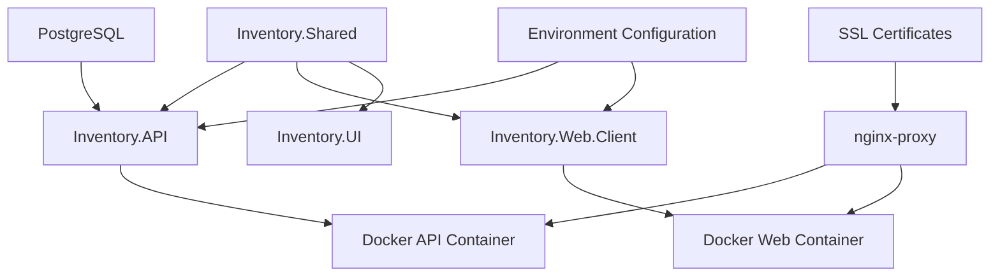
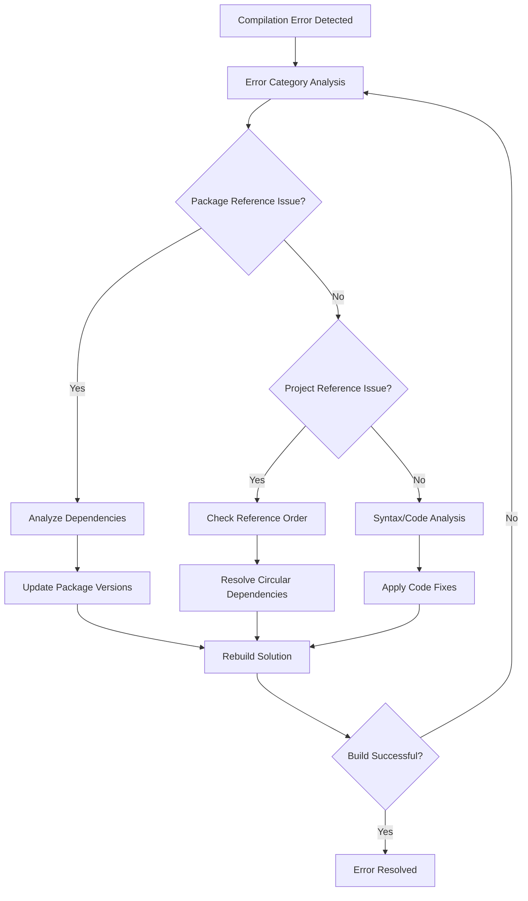
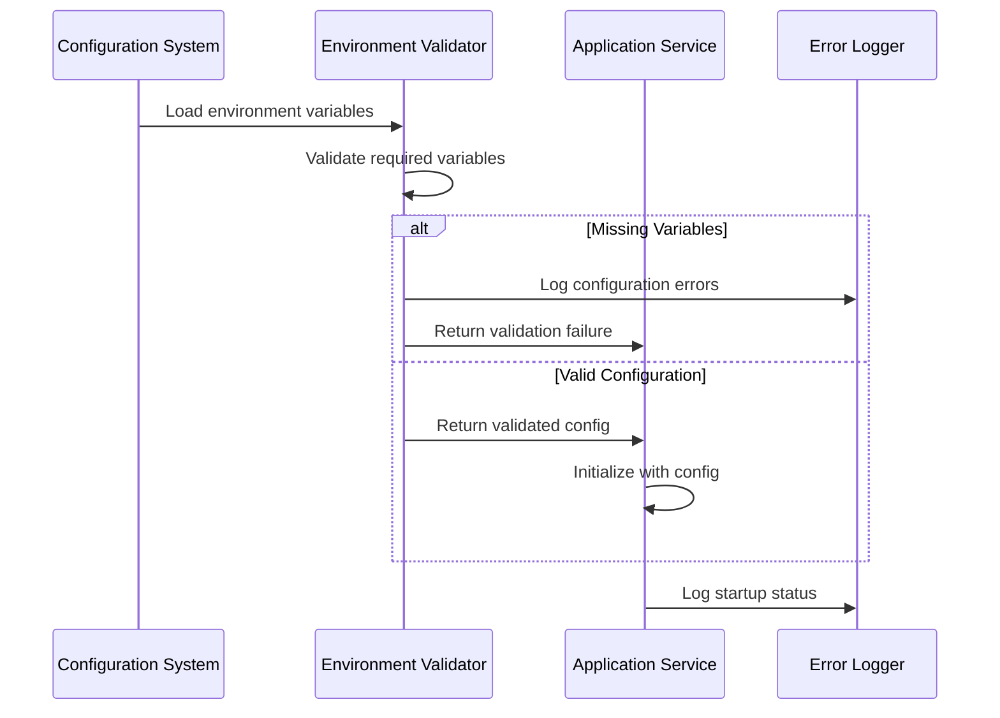
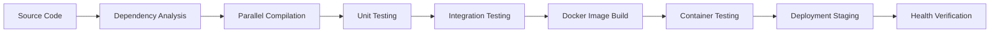

# Build and Fix Errors - Design Document

## Overview

The InventoryCtrl_2 system is a comprehensive inventory management application built with a multi-layered .NET 8 architecture. This design document outlines the systematic approach for identifying, diagnosing, and resolving build errors, compilation issues, deployment failures, and runtime exceptions. The strategy focuses on maintaining system stability while enabling continuous development and deployment workflows.

## Architecture Overview

The system architecture consists of interconnected components that must be built and deployed in proper dependency order to avoid cascading errors.

## Error Categories and Resolution Strategy

### Compilation Errors

**Category Definition**: Issues preventing successful compilation of .NET projects including syntax errors, missing references, and package dependency conflicts.

**Common Error Types**:
- Missing or incompatible package references
- Project reference circular dependencies
- Target framework mismatches
- Missing using statements or namespace conflicts
- Nullable reference type warnings in .NET 8

**Resolution Strategy**:

| Error Type | Detection Method | Resolution Approach |
|------------|------------------|-------------------|
| Package Reference Conflicts | Build output analysis | Version alignment and compatibility matrix |
| Project Dependency Issues | Dependency graph analysis | Reference order optimization |
| Framework Compatibility | Target framework validation | Unified framework targeting |
| Namespace Conflicts | Compilation error parsing | Explicit namespace qualification |

### Docker Build Failures

**Category Definition**: Errors occurring during container image creation, including Dockerfile syntax issues, multi-stage build failures, and dependency resolution problems.

**Error Analysis Framework**:

**Stage-Based Error Classification**:
- Base image selection errors
- Dependency restoration failures
- Application compilation errors in container context
- Runtime environment configuration issues
- Multi-stage build context problems

**Resolution Methodology**:

| Build Stage | Common Issues | Diagnostic Commands |
|-------------|---------------|-------------------|
| Base Image | Image availability, version compatibility | `docker pull aspnet:8.0` |
| Restore | Network issues, package source problems | `docker build --target restore` |
| Build | Compilation errors, missing files | `docker build --target build` |
| Publish | Output path issues, file permissions | `docker build --target publish` |
| Runtime | Entry point configuration, health checks | Container logs analysis |

### Environment Configuration Errors

**Category Definition**: Issues related to environment-specific settings, connection strings, JWT configuration, and service discovery failures.

**Configuration Validation Strategy**:

**Environment Variables Validation Matrix**:

| Variable Category | Required Variables | Validation Method | Error Impact |
|------------------|-------------------|------------------|--------------|
| Database | `ConnectionStrings__DefaultConnection`, `POSTGRES_*` | Connection test | Data access failure |
| Authentication | `Jwt__Key`, `Jwt__Issuer`, `Jwt__Audience` | Token validation | Authentication breakdown |
| Networking | `SERVER_IP`, `DOMAIN`, `ASPNETCORE_URLS` | Connectivity test | Service discovery failure |
| SSL/TLS | Certificate paths, SSL configuration | Certificate validation | HTTPS termination failure |

### Runtime Exception Handling

**Category Definition**: Errors occurring during application execution including authentication failures, database connectivity issues, and API endpoint failures.

**Exception Classification System**:

**Authentication Errors**:
- Missing or invalid JWT tokens
- Configuration-based authentication failures
- Token expiration and refresh issues
- Authorization policy violations

**Database Connectivity Errors**:
- Connection string configuration issues
- Database unavailability
- Migration execution failures
- Query timeout and performance issues

**API Communication Errors**:
- Service-to-service communication failures
- CORS policy violations
- Rate limiting threshold exceeded
- Middleware pipeline execution errors

**Structured Error Response Design**:

| Error Category | HTTP Status | Response Format | Client Action |
|----------------|-------------|-----------------|---------------|
| Authentication | 401 | `{"success": false, "message": "Unauthorized", "error": "UNAUTHORIZED"}` | Redirect to login |
| Authorization | 403 | `{"success": false, "message": "Forbidden", "error": "FORBIDDEN"}` | Show access denied |
| Validation | 400 | `{"success": false, "message": "Validation failed", "errors": [...]}` | Display field errors |
| Server Error | 500 | `{"success": false, "message": "Internal error", "error": "SERVER_ERROR"}` | Show generic error |

## Build Process Optimization

### Dependency Resolution Strategy

**Build Order Requirements**:
1. Inventory.Shared (foundation layer)
2. Inventory.UI (component library)
3. Inventory.Web.Client (frontend application)
4. Inventory.API (backend services with references to client and shared)

**Parallel Build Optimization**:
- Independent projects can build simultaneously
- Dependency chain must respect reference order
- Docker multi-stage builds optimize layer caching
- Test projects build independently from main applications

### Continuous Integration Considerations

**Build Pipeline Design**:

**Error Recovery Mechanisms**:
- Automatic retry for transient failures
- Rollback strategies for deployment failures
- Health check validation before traffic routing
- Gradual deployment with monitoring

### Monitoring and Diagnostics

**Error Detection and Alerting**:

**Proactive Monitoring Strategy**:
- Application health endpoints for service availability
- Container health checks for infrastructure status
- Database connection monitoring for data layer health
- SSL certificate expiration tracking
- Performance metrics for bottleneck identification

**Diagnostic Information Collection**:

| Component | Diagnostic Data | Collection Method | Error Correlation |
|-----------|----------------|------------------|------------------|
| API Services | Request/response logs, exception traces | Structured logging | Request ID tracking |
| Database | Query performance, connection pools | Database monitoring | Transaction correlation |
| Authentication | Token validation logs, user sessions | Security audit logs | User session tracking |
| Container Infrastructure | Resource utilization, health status | Docker metrics | Container correlation |

### Error Resolution Workflow

**Systematic Troubleshooting Process**:

1. **Error Classification**: Categorize the error type based on symptoms and error messages
2. **Impact Assessment**: Determine scope of impact and affected components
3. **Root Cause Analysis**: Use diagnostic tools and logs to identify underlying cause
4. **Solution Implementation**: Apply targeted fixes based on error category
5. **Validation Testing**: Verify fix effectiveness through testing protocols
6. **Prevention Strategy**: Implement measures to prevent recurrence

**Escalation Matrix**:

| Error Severity | Response Time | Resolution Team | Escalation Trigger |
|----------------|---------------|-----------------|-------------------|
| Critical (System Down) | Immediate | On-call engineer | 15 minutes |
| High (Feature Impact) | 1 hour | Development team | 4 hours |
| Medium (Performance) | 4 hours | Development team | 1 day |
| Low (Minor Issues) | Next business day | Development team | 3 days |

### Testing Strategy

**Multi-Level Testing Approach**:

**Unit Testing Framework**:
- Isolated component testing for business logic validation
- Mock dependencies for external service isolation
- Test data factories for consistent test scenarios
- Assertion libraries for comprehensive validation

**Integration Testing Strategy**:
- Database integration with test containers
- API endpoint testing with actual HTTP calls
- Service-to-service communication validation
- Authentication flow end-to-end testing

**Component Testing Approach**:
- Blazor component rendering verification
- User interaction simulation
- State management validation
- UI responsiveness testing

**Error Simulation Testing**:
- Network failure scenarios
- Database unavailability testing
- Authentication service failures
- Resource exhaustion scenarios

This design provides a comprehensive framework for systematically identifying, diagnosing, and resolving errors across the entire InventoryCtrl_2 system architecture, ensuring robust operation and maintainability.