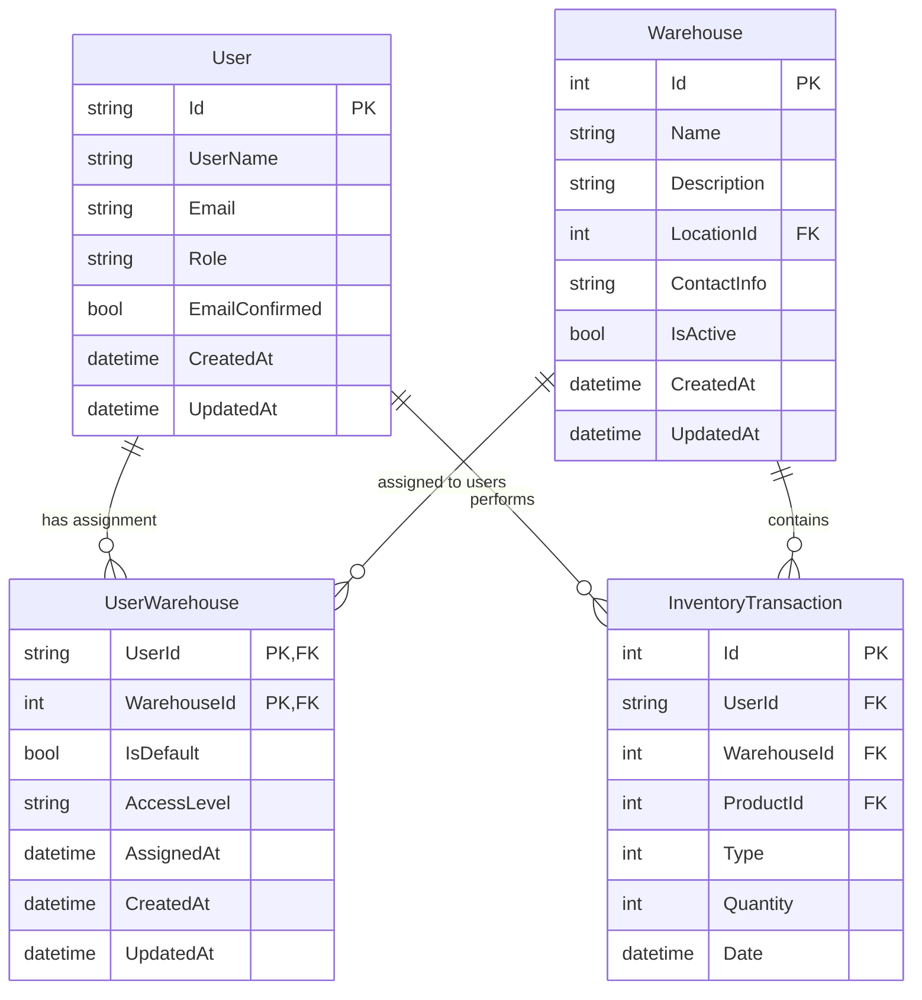
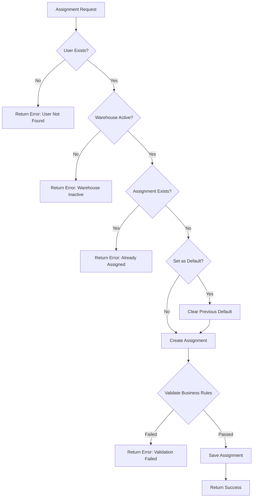

# Database Model Update: User-Warehouse Assignment

## Overview

This design document outlines the strategic approach for implementing a User-Warehouse assignment feature in the inventory control system. The feature will enable administrators to assign specific warehouses to users, establishing a direct relationship between User entities and Warehouse entities. This enhancement will improve access control, data organization, and operational efficiency by ensuring users can only access inventory data relevant to their assigned warehouses.

## Architecture

### Current System Analysis

The existing system architecture includes:

| Entity | Current Structure | Relationships |
|--------|------------------|---------------|
| **User** | Identity-based with Role field | One-to-Many with InventoryTransaction, ProductHistory |
| **Warehouse** | Basic entity with Location reference | One-to-Many with InventoryTransaction |
| **InventoryTransaction** | Links User and Warehouse | Many-to-One with both User and Warehouse |

### Proposed Architecture Changes



## Data Models & Relationship Design

### New Entity: UserWarehouse (Junction Table)

The UserWarehouse entity serves as a junction table implementing a many-to-many relationship between Users and Warehouses with additional metadata.

| Field | Type | Constraints | Purpose |
|-------|------|-------------|---------|
| UserId | string | PK, FK, Required | References User.Id |
| WarehouseId | int | PK, FK, Required | References Warehouse.Id |
| IsDefault | bool | Default: false | Indicates user's primary warehouse |
| AccessLevel | string | Required, MaxLength: 20 | Defines permission level (Full, ReadOnly, Limited) |
| AssignedAt | DateTime | Required | Timestamp of assignment |
| CreatedAt | DateTime | Required, Default: CURRENT_TIMESTAMP | Record creation time |
| UpdatedAt | DateTime | Nullable | Record modification time |

### Entity Relationship Constraints

**Primary Key**: Composite key (UserId, WarehouseId)

**Foreign Key Relationships**:
- UserId → User.Id (Cascade Delete)
- WarehouseId → Warehouse.Id (Cascade Delete)

**Business Rules**:
- Each user can have only one default warehouse (IsDefault = true)
- Users must have at least one warehouse assignment
- Admin users can access all warehouses regardless of assignments
- Regular users can only access explicitly assigned warehouses

### Access Level Definitions

| Level | Description | Permissions |
|-------|-------------|-------------|
| **Full** | Complete warehouse access | Create, Read, Update, Delete transactions and inventory |
| **ReadOnly** | View-only access | Read transactions and inventory data |
| **Limited** | Restricted operations | Read inventory, create limited transaction types |

## API Endpoints Reference

### UserWarehouse Management Endpoints

#### Assignment Operations

| Method | Endpoint | Description | Authorization |
|--------|----------|-------------|---------------|
| GET | `/api/user/{userId}/warehouses` | Get user's warehouse assignments | Admin, Manager, Self |
| POST | `/api/user/{userId}/warehouses` | Assign warehouse to user | Admin, Manager |
| PUT | `/api/user/{userId}/warehouses/{warehouseId}` | Update assignment details | Admin, Manager |
| DELETE | `/api/user/{userId}/warehouses/{warehouseId}` | Remove warehouse assignment | Admin, Manager |

#### Warehouse User Management

| Method | Endpoint | Description | Authorization |
|--------|----------|-------------|---------------|
| GET | `/api/warehouse/{warehouseId}/users` | Get warehouse's assigned users | Admin, Manager |
| POST | `/api/warehouse/{warehouseId}/users/bulk` | Bulk assign users to warehouse | Admin |
| PUT | `/api/warehouse/{warehouseId}/users/{userId}/default` | Set as user's default warehouse | Admin, Manager |

### Enhanced Existing Endpoints

#### User Controller Updates

| Method | Endpoint | Enhancement | Purpose |
|--------|----------|-------------|---------|
| GET | `/api/user/{id}` | Include warehouse assignments | Complete user profile view |
| POST | `/api/user` | Accept initial warehouse assignment | User creation with warehouse |
| PUT | `/api/user/{id}` | Update warehouse assignments | Comprehensive user management |

#### Warehouse Controller Updates

| Method | Endpoint | Enhancement | Purpose |
|--------|----------|-------------|---------|
| GET | `/api/warehouse` | Filter by user access | Show only accessible warehouses |
| GET | `/api/warehouse/{id}` | Include assigned users | Complete warehouse information |

## Data Transfer Objects (DTOs)

### UserWarehouseDto Structure

```
UserWarehouseDto:
- UserId: string
- WarehouseId: int
- WarehouseName: string
- IsDefault: bool
- AccessLevel: string
- AssignedAt: DateTime
- CreatedAt: DateTime
- UpdatedAt: DateTime
```

### Enhanced UserDto Structure

```
UserDto (Enhanced):
- Id: string
- UserName: string
- Email: string
- Role: string
- EmailConfirmed: bool
- AssignedWarehouses: List<UserWarehouseDto>
- DefaultWarehouseId: int?
- DefaultWarehouseName: string?
- CreatedAt: DateTime
- UpdatedAt: DateTime
```

### Warehouse Assignment Request DTOs

```
AssignWarehouseDto:
- WarehouseId: int (Required, Range: 1-max)
- AccessLevel: string (Required, Values: Full|ReadOnly|Limited)
- IsDefault: bool (Default: false)

BulkAssignWarehousesDto:
- UserIds: List<string> (Required, Min: 1)
- WarehouseId: int (Required)
- AccessLevel: string (Required)
- SetAsDefault: bool (Default: false)
```

## Business Logic Layer Architecture

### UserWarehouseService Design

The UserWarehouseService encapsulates all business logic related to user-warehouse assignments.

#### Core Responsibilities

| Function | Description | Business Rules |
|----------|-------------|----------------|
| **AssignWarehouse** | Create user-warehouse relationship | Validate user exists, warehouse active, prevent duplicates |
| **RemoveAssignment** | Delete user-warehouse relationship | Ensure not last assignment, handle default reassignment |
| **SetDefaultWarehouse** | Update user's primary warehouse | Clear previous default, validate assignment exists |
| **GetUserWarehouses** | Retrieve user's accessible warehouses | Apply role-based filtering, include access levels |
| **GetWarehouseUsers** | Retrieve warehouse's assigned users | Filter by access permissions, include assignment details |

#### Assignment Validation Logic



### Access Control Enhancement

#### Warehouse Access Filtering

The system will implement repository-level filtering to ensure users only access authorized warehouses:

| User Role | Access Pattern | Implementation |
|-----------|---------------|----------------|
| **Admin** | All warehouses | No filtering applied |
| **Manager** | Assigned warehouses + subordinate user warehouses | Role-based filtering |
| **User** | Only assigned warehouses | Strict assignment filtering |

#### Transaction Authorization

InventoryTransaction operations will require warehouse access validation:

| Operation | Validation Rule | Error Handling |
|-----------|----------------|----------------|
| **Create Transaction** | User must have warehouse assignment with Full or Limited access | Return 403 Forbidden |
| **Update Transaction** | User must have created transaction or have Full access to warehouse | Return 403 Forbidden |
| **View Transactions** | User must have any level access to warehouse | Filter results |

## Database Migration Strategy

### Migration Sequence

#### Phase 1: Create UserWarehouse Table

Create the junction table with all necessary constraints and indexes:

| Component | Specification |
|-----------|---------------|
| **Table Name** | UserWarehouses |
| **Primary Key** | Composite (UserId, WarehouseId) |
| **Indexes** | IX_UserWarehouses_UserId, IX_UserWarehouses_WarehouseId, IX_UserWarehouses_IsDefault |
| **Constraints** | FK_UserWarehouses_Users, FK_UserWarehouses_Warehouses |

#### Phase 2: Data Migration

Migrate existing user-warehouse relationships from InventoryTransaction data:

| Step | Description | Data Source |
|------|-------------|-------------|
| **Extract Relationships** | Identify unique User-Warehouse pairs | InventoryTransaction.UserId + WarehouseId |
| **Create Assignments** | Generate UserWarehouse records | Set AccessLevel = "Full", IsDefault based on frequency |
| **Validate Integrity** | Ensure all users have assignments | Create default assignments if needed |

#### Phase 3: Application Updates

Update application layer to use new relationship model:

| Component | Change Required | Impact |
|-----------|----------------|--------|
| **Repository Layer** | Add UserWarehouse repository and filtering | Medium |
| **Service Layer** | Implement UserWarehouseService | High |
| **Controller Layer** | Add assignment endpoints, update existing | Medium |
| **UI Layer** | Add warehouse assignment management | High |

### Rollback Strategy

| Phase | Rollback Action | Data Recovery |
|-------|----------------|---------------|
| **Phase 1** | Drop UserWarehouses table | No data loss |
| **Phase 2** | Truncate UserWarehouses table | Regenerate from transactions |
| **Phase 3** | Revert application code | Restore previous functionality |

## Testing Strategy

### Database Integration Tests

Test scenarios for UserWarehouse entity operations:

| Test Category | Scenarios | Expected Outcomes |
|---------------|-----------|-------------------|
| **CRUD Operations** | Create, Read, Update, Delete assignments | Successful operations with proper constraints |
| **Relationship Integrity** | Cascade deletes, foreign key validation | Maintain data consistency |
| **Business Rules** | Default warehouse constraints, access levels | Enforce business logic |

### API Endpoint Tests

Validate all user-warehouse management endpoints:

| Endpoint Category | Test Cases | Validation Points |
|------------------|------------|-------------------|
| **Assignment Operations** | Valid/invalid assignments, authorization | Proper response codes, data accuracy |
| **Access Control** | Role-based filtering, warehouse restrictions | Security compliance |
| **Data Consistency** | Concurrent operations, transaction boundaries | Data integrity |

### User Interface Tests

Ensure proper UI functionality for warehouse assignments:

| UI Component | Test Scenarios | User Experience |
|-------------|---------------|-----------------|
| **User Management** | Assignment dialogs, validation messages | Intuitive assignment process |
| **Warehouse Filtering** | Role-based warehouse lists | Appropriate data visibility |
| **Default Selection** | Default warehouse indicators | Clear user guidance |