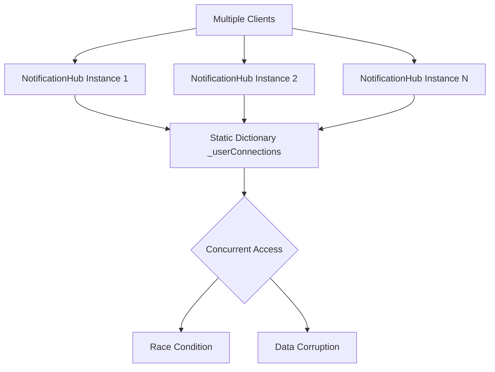
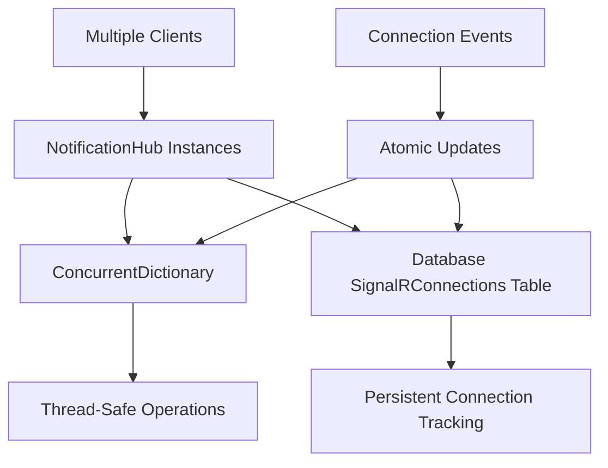
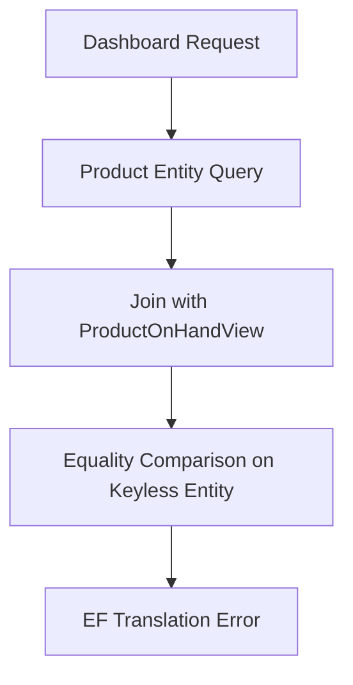
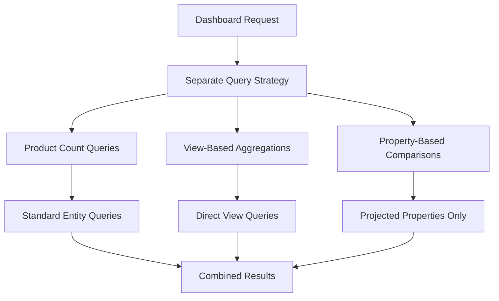
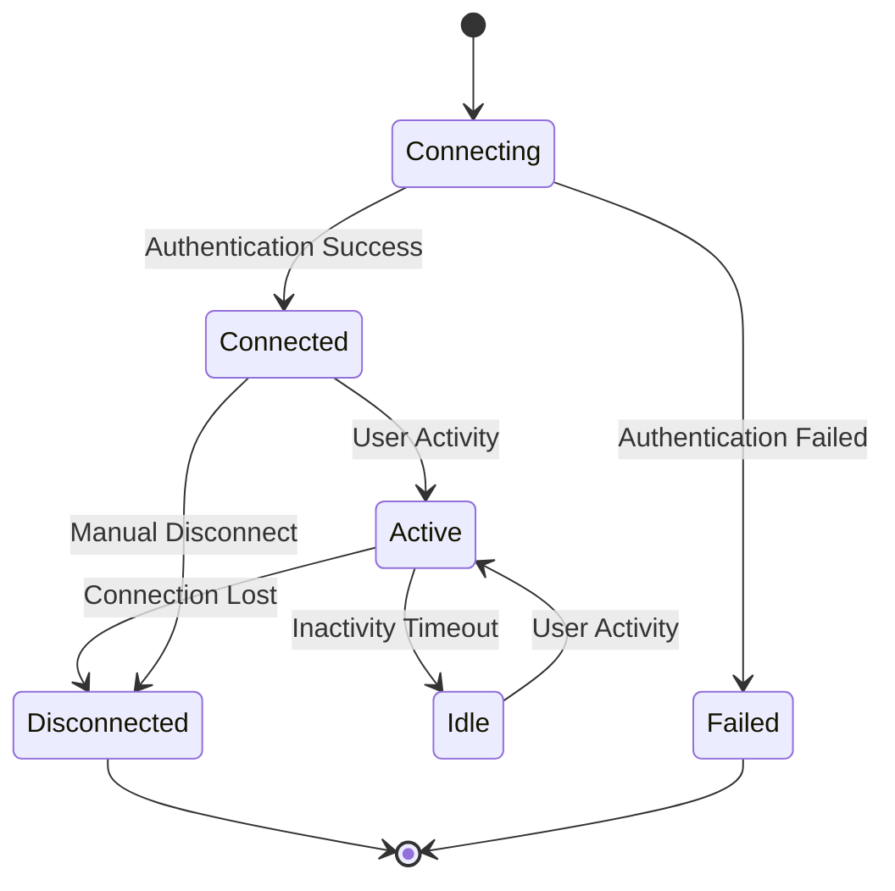
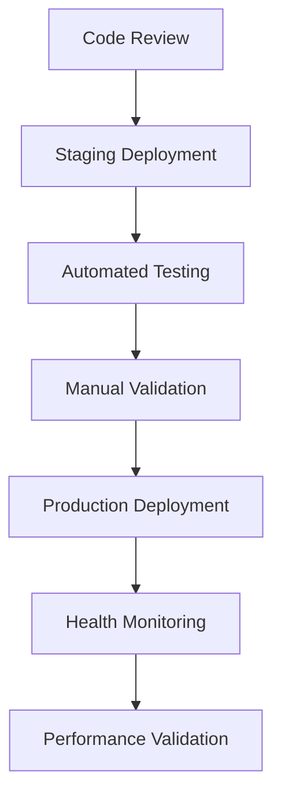

# Debug and Fix API Errors Design Document

## Overview

This document outlines the analysis and resolution strategy for critical API errors occurring in the deployed inventory control application. The errors affect core functionality including SignalR real-time notifications and dashboard statistics retrieval.

## Error Analysis

### Error Classification

| Component | Error Type | Severity | Impact |
|-----------|------------|----------|---------|
| SignalR NotificationHub | Concurrent Collections | Critical | Real-time notifications broken |
| Dashboard API | Entity Framework Translation | High | Dashboard statistics unavailable |
| Web Client | HTTP 500 Errors | High | User interface degraded |

### Root Cause Analysis

#### 1. SignalR Concurrent Collections Error

**Error Pattern:**
```
System.InvalidOperationException: Operations that change non-concurrent collections must have exclusive access. A concurrent update was performed on this collection and corrupted its state.
```

**Root Cause:** The `NotificationHub` class uses a static `Dictionary<string, string> _userConnections` which is not thread-safe for concurrent access in a multi-user environment.

**Technical Details:**
- Multiple users connecting simultaneously modify the static dictionary
- Dictionary operations (`_userConnections[Context.ConnectionId] = userId`) are not atomic
- Static collections shared across all hub instances create race conditions

#### 2. Dashboard Statistics Entity Framework Error

**Error Pattern:**
```
Cannot translate the '==' on an expression of entity type 'ProductOnHandView' because it is a keyless entity.
```

**Root Cause:** LINQ queries attempting to perform equality comparisons on `ProductOnHandView` which is configured as a keyless entity in Entity Framework.

**Technical Details:**
- `ProductOnHandView` is mapped as keyless using `entity.HasNoKey()`
- Entity Framework cannot translate comparison operations on keyless entities
- Join operations with keyless entities require specific handling patterns

## Architecture Design for Resolution

### 1. SignalR Connection Management Redesign

#### Current Architecture Issues


#### Proposed Solution Architecture


#### Connection Management Strategy

| Approach | Implementation | Benefits | Trade-offs |
|----------|----------------|----------|------------|
| ConcurrentDictionary | Replace static Dictionary with ConcurrentDictionary | Thread-safe, minimal changes | Memory-only, lost on restart |
| Database-Only | Use SignalRConnections table exclusively | Persistent, scalable | Database overhead for each operation |
| Hybrid Approach | ConcurrentDictionary + Database sync | Best performance + persistence | Complexity in synchronization |

**Recommended:** Hybrid approach with ConcurrentDictionary for performance and database for persistence.

### 2. Dashboard Query Optimization Design

#### Current Query Issues


#### Proposed Query Architecture


#### Query Optimization Patterns

| Pattern | Use Case | Implementation | Performance |
|---------|----------|----------------|-------------|
| Direct View Query | Simple aggregations | Query ProductOnHandView directly | High |
| Property Projection | Filtered comparisons | Select specific properties before comparison | Medium |
| Separate Queries | Complex joins | Query entities and views separately | Medium |
| Materialized Views | Frequent access | Database-level materialized views | Highest |

## Implementation Strategy

### Phase 1: Critical Error Resolution

#### 1.1 SignalR Connection Management Fix

**Thread-Safe Collection Implementation:**
- Replace static Dictionary with ConcurrentDictionary
- Implement atomic operations for connection management
- Add proper exception handling for concurrent operations

**Database Synchronization:**
- Maintain connection state in SignalRConnections table
- Implement cleanup for orphaned connections
- Add connection health monitoring

#### 1.2 Dashboard Query Restructuring

**Query Pattern Transformation:**
- Separate Product entity queries from view-based calculations
- Use property-based comparisons instead of entity equality
- Implement result composition pattern

**View Access Optimization:**
- Query ProductOnHandView directly for quantity calculations
- Use projected properties for comparison operations
- Implement caching for frequently accessed statistics

### Phase 2: Performance and Reliability Enhancements

#### 2.1 Connection Pool Management

**Connection Lifecycle:**


#### 2.2 Error Recovery Mechanisms

**Graceful Degradation Strategy:**
- Fallback mechanisms for SignalR failures
- Cached dashboard data during database issues
- Progressive retry with exponential backoff

### Phase 3: Monitoring and Observability

#### 3.1 Real-time Monitoring

**Key Metrics:**
- SignalR connection count and health
- Dashboard query performance metrics
- Error rates and patterns
- Resource utilization trends

#### 3.2 Alerting Strategy

**Alert Thresholds:**
- Connection errors exceeding 5% rate
- Dashboard query timeouts over 30 seconds
- Memory usage above 80% threshold
- Database connection pool exhaustion

## Testing Strategy

### Unit Testing

| Component | Test Scenarios | Validation Criteria |
|-----------|----------------|---------------------|
| NotificationHub | Concurrent connections | No race conditions, proper cleanup |
| DashboardController | Query execution | Correct results, no EF errors |
| Connection Management | Add/Remove operations | Thread-safe operations |

### Integration Testing

| Scenario | Test Approach | Success Criteria |
|----------|---------------|------------------|
| Multiple Users | Simulate 100+ concurrent connections | All connections stable |
| Dashboard Load | 50+ simultaneous dashboard requests | Response time < 5 seconds |
| Error Recovery | Inject failures and monitor recovery | Graceful degradation |

### Performance Testing

| Metric | Target | Measurement Method |
|--------|--------|-------------------|
| SignalR Latency | < 100ms | Connection establishment time |
| Dashboard Response | < 2 seconds | API response time |
| Memory Usage | < 1GB | Application memory monitoring |

## Deployment Strategy

### Staging Environment Testing

**Validation Checklist:**
- SignalR connection stability under load
- Dashboard functionality across all browsers
- Error logging and monitoring systems
- Database query performance metrics

### Production Rollout

**Deployment Approach:**


**Rollback Strategy:**
- Automated health checks post-deployment
- Immediate rollback triggers for error rate increases
- Database migration reversibility verification

## Risk Mitigation

### Technical Risks

| Risk | Impact | Probability | Mitigation Strategy |
|------|--------|-------------|-------------------|
| Data Loss | High | Low | Database backups, transaction safety |
| Performance Degradation | Medium | Medium | Load testing, monitoring alerts |
| New Concurrency Issues | Medium | Low | Comprehensive testing, code review |

### Operational Risks

| Risk | Impact | Probability | Mitigation Strategy |
|------|--------|-------------|-------------------|
| Deployment Failures | High | Low | Automated rollback, staging validation |
| User Experience Impact | Medium | Medium | Gradual rollout, feature flags |
| Extended Downtime | High | Low | Blue-green deployment, quick rollback |

## Success Criteria

### Functional Requirements

- SignalR connections remain stable under concurrent load
- Dashboard statistics load without errors
- Real-time notifications function correctly
- All existing functionality preserved

### Performance Requirements

- Dashboard response time under 3 seconds
- SignalR connection establishment under 1 second
- Zero thread safety exceptions
- Memory usage remains stable under load

### Reliability Requirements

- 99.9% uptime for critical API endpoints
- Graceful handling of concurrent user scenarios
- Proper error logging and monitoring
- Automated recovery from transient failures