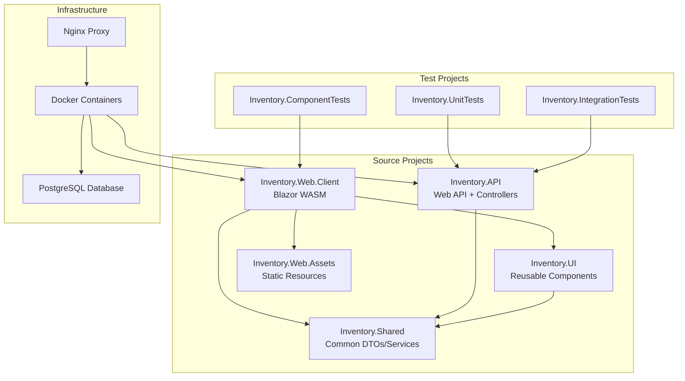
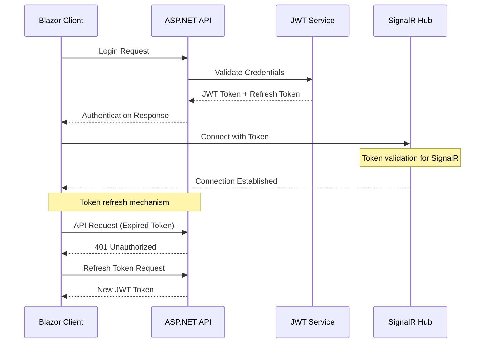
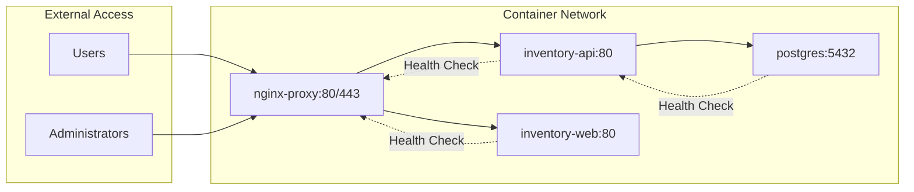
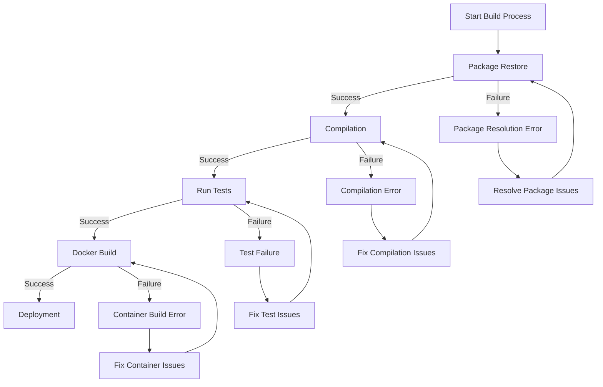
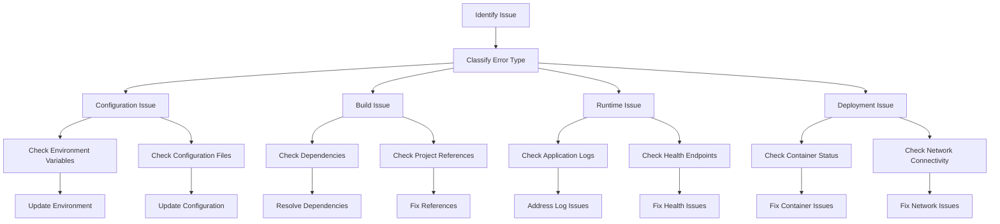
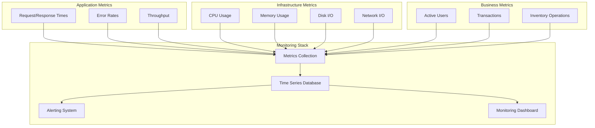
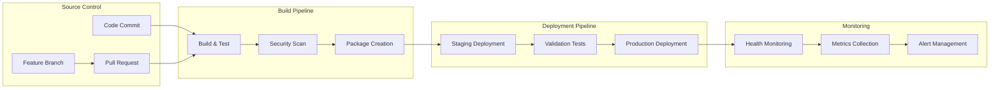
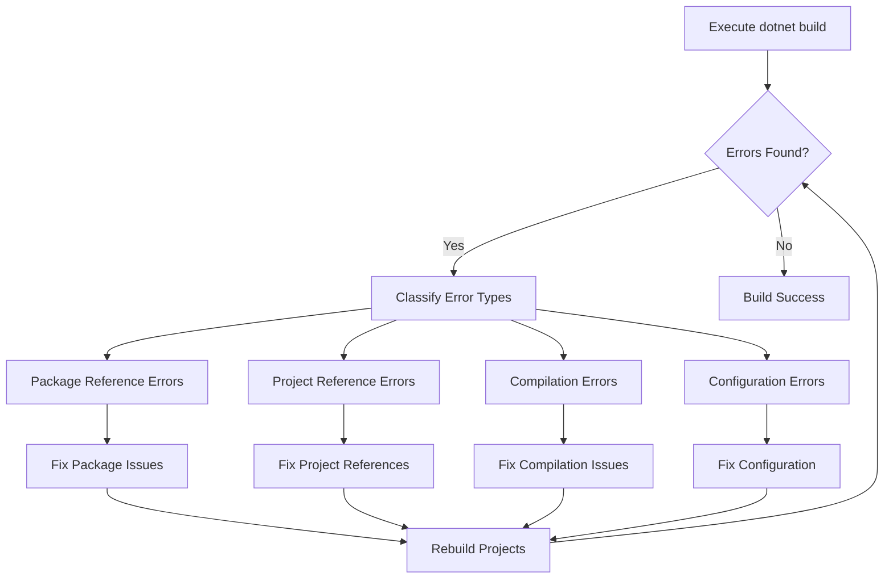

# InventoryCtrl_2 Project Debug and Improvement Design

## Overview

This design document outlines the strategic approach to debugging, error resolution, and systematic improvement of the InventoryCtrl_2 inventory management system. The analysis reveals a full-stack .NET 8.0 application with Blazor WebAssembly frontend, ASP.NET Core Web API backend, and PostgreSQL database, deployed via Docker containers with Nginx reverse proxy.

## Project Architecture Analysis

### Technology Stack Assessment

| Component | Technology | Status | Potential Issues |
|-----------|------------|--------|------------------|
| Backend API | ASP.NET Core 8.0 | ✓ Configured | JWT configuration, Database connections |
| Frontend | Blazor WebAssembly | ✓ Configured | SignalR connections, API communication |
| Database | PostgreSQL 15 | ✓ Configured | Connection strings, migrations |
| Authentication | JWT + Identity | ✓ Configured | Token validation, CORS issues |
| Real-time | SignalR | ✓ Configured | Hub connectivity, authentication |
| Deployment | Docker + Nginx | ✓ Configured | Container orchestration, SSL |
| Testing | xUnit + bUnit | ✓ Configured | Test execution, coverage |

### Project Structure Integrity



## Critical Issue Categories

### 1. Configuration Management Issues

**Problem Areas:**
- Environment variable dependencies without fallbacks
- Hardcoded configuration values in non-development environments
- Missing centralized package management

**Strategic Solutions:**

| Issue Type | Current State | Required Action | Priority |
|------------|---------------|-----------------|----------|
| Package Versions | Individual project references | Implement Directory.Packages.props | High |
| Environment Variables | Scattered across docker-compose | Centralize with .env validation | Critical |
| Configuration Validation | Runtime discovery | Build-time validation | Medium |
| Secret Management | Mix of configs and secrets | Separate secrets from config | High |

### 2. Authentication and Authorization Architecture

**Current Implementation Analysis:**
- JWT token configuration with environment dependencies
- SignalR authentication integration
- CORS policy configuration for multiple origins

**Design Improvements:**



### 3. Database and Migration Strategy

**Current State:**
- Entity Framework Core with PostgreSQL
- Migration files present but potential execution issues
- Connection string management through environment variables

**Migration Management Design:**

| Phase | Validation | Action | Rollback Strategy |
|-------|------------|--------|-------------------|
| Pre-Migration | Database connectivity | Connection validation | N/A |
| Schema Changes | Backup verification | Apply migrations | Restore from backup |
| Data Migration | Integrity constraints | Transform data | Reverse transformations |
| Post-Migration | Application compatibility | Smoke tests | Version rollback |

### 4. Container Orchestration Issues

**Docker Configuration Analysis:**
- Multi-stage builds for both API and Client
- Health check implementations
- Network configuration between services

**Container Dependencies:**



## Systematic Debugging Strategy

### Phase 1: Environment Validation

**Validation Checklist:**

| Component | Validation Method | Success Criteria | Failure Resolution |
|-----------|-------------------|------------------|-------------------|
| .NET SDK | `dotnet --version` | 8.0.414+ | Install/Update SDK |
| Docker | `docker --version` | Running daemon | Start Docker service |
| PostgreSQL | Connection test | Database accessible | Check connection strings |
| Environment Variables | Configuration validation | All required vars set | Update .env files |

### Phase 2: Build Validation

**Build Sequence Validation:**



### Phase 3: Runtime Validation

**Service Health Monitoring:**

| Service | Health Endpoint | Expected Response | Monitoring Interval |
|---------|----------------|-------------------|-------------------|
| API | `/api/health` | 200 OK + JSON status | 30 seconds |
| Database | Connection test | Successful query | 60 seconds |
| SignalR Hub | `/notificationHub` | WebSocket connection | 60 seconds |
| Static Files | `/` | Blazor app loads | 300 seconds |

## Error Resolution Framework

### Automated Resolution Strategies

**Error Classification and Response:**

| Error Category | Detection Method | Automated Resolution | Manual Intervention Required |
|----------------|------------------|---------------------|----------------------------|
| Missing Packages | Build failure | `dotnet restore` | Package conflict resolution |
| Configuration Missing | Runtime exception | Default value injection | Secret configuration |
| Database Unavailable | Health check failure | Connection retry | Infrastructure fix |
| Authentication Failure | 401 responses | Token refresh | Identity service check |
| SSL Certificate Issues | HTTPS failure | Certificate regeneration | Certificate installation |

### Manual Debugging Procedures

**Structured Debugging Approach:**



## Quality Assurance Strategy

### Testing Architecture Enhancement

**Test Coverage Requirements:**

| Test Type | Coverage Target | Current State | Required Actions |
|-----------|----------------|---------------|------------------|
| Unit Tests | 80%+ | Implemented | Increase coverage |
| Integration Tests | 70%+ | Implemented | API endpoint coverage |
| Component Tests | 60%+ | Implemented | UI component coverage |
| End-to-End Tests | 50%+ | Missing | Implement E2E tests |

### Performance Monitoring Design

**Metrics Collection Strategy:**



## Security Hardening Strategy

### Authentication Security Model

**Security Enhancement Areas:**

| Security Domain | Current Implementation | Security Risk | Mitigation Strategy |
|-----------------|----------------------|---------------|-------------------|
| JWT Token Management | Basic JWT with refresh | Token theft | Implement short-lived tokens + rotation |
| CORS Configuration | Environment-based origins | Origin spoofing | Strict origin validation |
| API Rate Limiting | Role-based limits | DoS attacks | Implement sliding window limits |
| Database Access | Connection string in env | Credential exposure | Use connection pooling + secrets |
| SSL/TLS Configuration | Basic HTTPS | Man-in-the-middle | Implement certificate pinning |

### Data Protection Framework

**Data Security Classifications:**

| Data Type | Sensitivity Level | Protection Method | Access Control |
|-----------|------------------|-------------------|----------------|
| User Credentials | Critical | Hashed + Salted | Admin only |
| JWT Tokens | High | Encrypted storage | User session only |
| Inventory Data | Medium | Access logging | Role-based |
| Audit Logs | High | Immutable storage | Admin + audit role |
| Configuration | Low-Medium | Environment separation | Deployment role |

## Deployment and DevOps Strategy

### Continuous Integration Enhancement

**CI/CD Pipeline Design:**



### Environment Management Strategy

**Environment Configuration Matrix:**

| Environment | Purpose | Configuration Source | Deployment Method | Monitoring Level |
|-------------|---------|---------------------|-------------------|------------------|
| Development | Local development | User secrets | Manual | Basic logging |
| Testing | Automated testing | Test configuration | CI/CD pipeline | Test results only |
| Staging | Pre-production validation | Environment variables | Automated deployment | Full monitoring |
| Production | Live system | Secure secrets | Blue-green deployment | Comprehensive monitoring |

## Implementation Roadmap

### Phase 1: Critical Issues (Week 1-2)

**Priority Actions:**

1. **Environment Configuration Validation**
   - Implement centralized configuration validation
   - Create environment-specific .env templates
   - Add configuration validation at startup

2. **Build System Stabilization**
   - Implement Directory.Packages.props for version management
   - Add build validation scripts
   - Fix any missing project references

3. **Database Connection Hardening**
   - Validate connection strings across environments
   - Implement connection retry logic
   - Add database health checks

### Phase 2: System Reliability (Week 3-4)

**Enhancement Actions:**

1. **Authentication System Hardening**
   - Implement token rotation mechanism
   - Add comprehensive CORS validation
   - Enhance SignalR authentication

2. **Container Orchestration Optimization**
   - Optimize Dockerfile configurations
   - Implement proper health checks
   - Add container monitoring

3. **Testing Infrastructure Enhancement**
   - Increase test coverage to target levels
   - Implement integration test automation
   - Add end-to-end testing framework

### Phase 3: Performance and Security (Week 5-6)

**Optimization Actions:**

1. **Performance Monitoring Implementation**
   - Deploy metrics collection system
   - Implement performance alerting
   - Add capacity planning tools

2. **Security Hardening**
   - Implement security scanning in CI/CD
   - Add vulnerability monitoring
   - Enhance audit logging

3. **Operational Excellence**
   - Deploy comprehensive monitoring
   - Implement automated alerting
   - Add operational runbooks

## Success Metrics

### Technical Health Indicators

| Metric | Current Target | Improved Target | Measurement Method |
|--------|----------------|-----------------|-------------------|
| Build Success Rate | 80%+ | 95%+ | CI/CD pipeline metrics |
| Test Coverage | 60%+ | 80%+ | Code coverage reports |
| Deployment Success | 70%+ | 95%+ | Deployment pipeline metrics |
| System Uptime | 95%+ | 99.5%+ | Health monitoring |
| Error Rate | <5% | <1% | Application telemetry |

### Operational Excellence Metrics

| Metric | Baseline | Target | Monitoring Frequency |
|--------|----------|--------|---------------------|
| Mean Time to Recovery | 4 hours | 30 minutes | Incident tracking |
| Deployment Frequency | Weekly | Daily | Pipeline metrics |
| Change Failure Rate | 15% | 5% | Deployment tracking |
| Lead Time for Changes | 1 week | 1 day | Development metrics |

This design provides a comprehensive framework for systematically debugging, improving, and maintaining the InventoryCtrl_2 system while establishing sustainable operational practices.

## Build Execution and Error Analysis

### Step 1: Project Structure Discovery

Following the sequential task execution approach, I will now execute the actual build process to identify specific compilation errors:

**Project Discovery Results:**
- No solution (.sln) file found in the workspace
- Multiple .csproj files identified in src/ directory
- Project dependencies: API → Shared, Web.Client, UI, Web.Assets
- Test projects: UnitTests, IntegrationTests, ComponentTests

**Build Order Dependencies (from memory):**
1. Inventory.Shared (base dependency)
2. Inventory.Web.Assets (static resources)
3. Inventory.UI (components)
4. Inventory.Web.Client (Blazor WASM)
5. Inventory.API (main API with dependencies on all above)

### Step 2: Initial Build Attempt

### Step 2: Build Execution Commands

**Command Sequence to Execute:**

1. **Initial workspace build attempt:**
   ```bash
   cd C:\rec\prg\repo\InventoryCtrl_2
   dotnet build
   ```

2. **If workspace build fails, try sequential project builds:**
   ```bash
   # Build projects in dependency order
   dotnet build src/Inventory.Shared/Inventory.Shared.csproj
   dotnet build src/Inventory.Web.Assets/Inventory.Web.Assets.csproj
   dotnet build src/Inventory.UI/Inventory.UI.csproj
   dotnet build src/Inventory.Web.Client/Inventory.Web.Client.csproj
   dotnet build src/Inventory.API/Inventory.API.csproj
   ```

3. **Package restore if needed:**
   ```bash
   dotnet restore
   dotnet build
   ```

**Expected Error Categories:**

Based on project analysis, anticipated error types include:

| Error Type | Likelihood | Typical Causes |
|------------|------------|----------------|
| Package Reference | High | Missing Directory.Packages.props, version conflicts |
| Project Reference | Medium | Cross-project dependency issues |
| Compilation | Medium | Missing using statements, namespace issues |
| Framework Target | Low | .NET 8.0 compatibility issues |

**Next Steps After Build Execution:**

1. Capture the complete build output
2. Categorize errors by type (compilation, package, reference)
3. Apply targeted fixes based on error classification
4. Iteratively rebuild until success

### Step 3: Error Classification Framework

**Error Resolution Priority Matrix:**



**To proceed with the actual debugging:**

1. Execute the build commands listed above
2. Provide the complete error output
3. I will analyze the errors and provide specific fixes
4. We'll iterate through the fix-and-build cycle until resolution