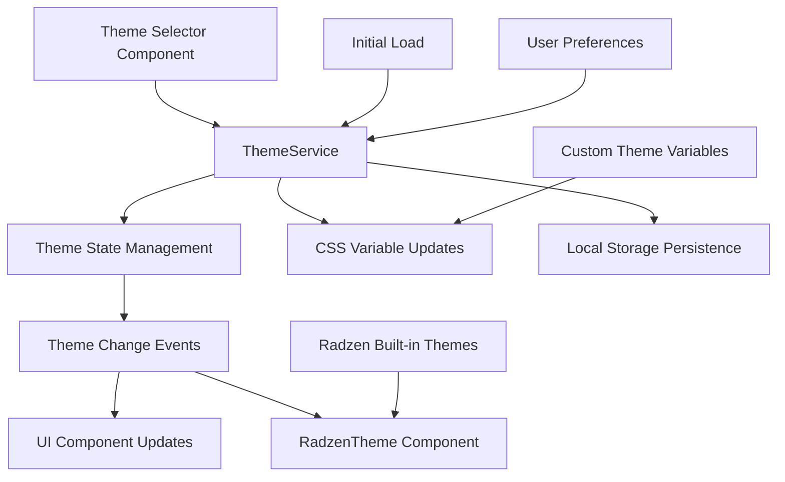
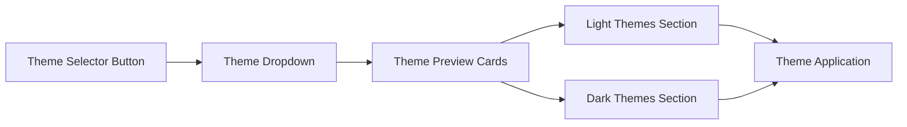

# Radzen UI Themes Integration Design

## Overview

This design outlines the integration of Radzen's comprehensive theming system into the InventoryCtrl_2 application. Radzen provides out-of-the-box theme support with multiple built-in themes, dynamic theme switching capabilities, and customization options through CSS variables and SCSS compilation.

The integration will completely remove the current custom theme implementation and replace it with Radzen's standardized theming system, providing users with professional-grade themes and the ability to switch between light and dark modes dynamically. All existing custom CSS files will be deleted to ensure clean implementation.

## Current State Analysis

The application currently implements:
- Custom CSS variable-based theming in `/css/themes/` directory
- Manual light/dark theme definitions
- Static theme loading through `RadzenTheme` component set to "material"
- Custom design system CSS files for layout and components

## Architecture

### Theme Management Strategy

The theme integration follows a service-oriented architecture with centralized theme state management and reactive UI updates.

### Component Integration Points

| Component | Integration Method | Purpose |
|-----------|-------------------|---------|
| ThemeService | Blazor Service | Centralized theme state and persistence |
| ThemeSelector | UI Component | User interface for theme selection |
| RadzenTheme | Radzen Component | Dynamic theme application |
| Layout Components | CSS Variables | Responsive theme adaptation |

## Theme Service Implementation

### Service Interface Definition

The theme service manages theme state, persistence, and notification of theme changes across the application.

| Method | Parameters | Return Type | Description |
|--------|------------|-------------|-------------|
| GetCurrentTheme | None | string | Returns active theme identifier |
| SetTheme | themeName: string | Task | Applies theme and persists selection |
| GetAvailableThemes | None | ThemeInfo[] | Returns list of available themes |
| OnThemeChanged | None | EventCallback<string> | Event for theme change notifications |
| InitializeTheme | None | Task | Loads persisted theme on startup |

### Theme Configuration Model

| Property | Type | Description |
|----------|------|-------------|
| Name | string | Theme identifier (e.g., "material", "standard") |
| DisplayName | string | User-friendly theme name |
| Category | ThemeCategory | Theme type (Light, Dark) |
| IsDefault | bool | Default theme selection indicator |

### Available Radzen Themes

| Theme Name | Category | Description |
|------------|----------|-------------|
| material | Light | Material Design 2 light theme |
| material-dark | Dark | Material Design 2 dark theme |
| standard | Light | Clean, minimal light theme |
| standard-dark | Dark | Clean, minimal dark theme |
| default | Light | Default Radzen light theme |
| dark | Dark | Default Radzen dark theme |
| humanistic | Light | Humanistic design approach |
| humanistic-dark | Dark | Humanistic dark variant |
| software | Light | Software-focused theme |
| software-dark | Dark | Software-focused dark variant |

## Theme Selection Interface

### Theme Selector Component Design

The theme selector provides an intuitive interface for users to preview and select themes.

### User Experience Flow

| Step | User Action | System Response |
|------|-------------|-----------------|
| 1 | Click theme selector | Display available themes with previews |
| 2 | Hover theme option | Show live preview of theme colors |
| 3 | Click theme selection | Apply theme and persist preference |
| 4 | Page reload | Automatically load saved theme |

## Detailed Implementation Steps

### Step 1: Preparation and Analysis

#### 1.1 Create Implementation Checklist
- [ ] Backup current CSS files for rollback purposes
- [ ] Document current custom styling dependencies
- [ ] Identify component-specific CSS that needs migration
- [ ] List all Blazor components using custom CSS classes

#### 1.2 Environment Setup
- [ ] Verify Radzen.Blazor package version compatibility
- [ ] Test current RadzenComponents service registration
- [ ] Confirm RadzenTheme component functionality
- [ ] Validate Blazor project structure for theme integration

### Step 2: Theme Service Infrastructure

#### 2.1 Create Theme Models and Enums

**File: `/Services/Models/ThemeModels.cs`**
- [ ] Define `ThemeCategory` enum (Light, Dark)
- [ ] Create `ThemeInfo` class with properties:
  - Name (string)
  - DisplayName (string) 
  - Category (ThemeCategory)
  - IsDefault (bool)
- [ ] Create `ThemeChangedEventArgs` class

#### 2.2 Create Theme Service Interface

**File: `/Services/Interfaces/IThemeService.cs`**
- [ ] Define `GetCurrentTheme()` method
- [ ] Define `SetThemeAsync(string themeName)` method
- [ ] Define `GetAvailableThemes()` method
- [ ] Define `InitializeThemeAsync()` method
- [ ] Define `OnThemeChanged` event callback

#### 2.3 Implement Theme Service

**File: `/Services/ThemeService.cs`**
- [ ] Implement theme state management with private fields
- [ ] Add LocalStorage injection for theme persistence
- [ ] Implement theme validation logic
- [ ] Add error handling for invalid theme names
- [ ] Implement theme change event notification
- [ ] Add logging for theme operations

#### 2.4 Configure Service Registration

**File: `Program.cs`**
- [ ] Register `IThemeService` as scoped service
- [ ] Add service to existing dependency injection setup
- [ ] Verify service registration order

### Step 3: Dynamic Theme Application

#### 3.1 Update App Component

**File: `App.razor`**
- [ ] Inject `IThemeService` into component
- [ ] Replace static `RadzenTheme` with dynamic binding
- [ ] Add theme initialization in `OnInitializedAsync`
- [ ] Implement theme change event subscription
- [ ] Add error boundary for theme loading failures

#### 3.2 Theme State Management

**State Management Tasks:**
- [ ] Initialize theme on application startup
- [ ] Handle theme persistence across browser sessions  
- [ ] Implement reactive theme updates without page reload
- [ ] Add fallback to default theme on load failure

### Step 4: Theme Selection UI Components

#### 4.1 Create Theme Selector Component

**File: `/Components/ThemeSelector.razor`**
- [ ] Create dropdown component for theme selection
- [ ] Add theme preview functionality with color swatches
- [ ] Implement responsive design for mobile/desktop
- [ ] Add accessibility attributes (ARIA labels, keyboard navigation)
- [ ] Include loading states and error handling

#### 4.2 Theme Selector Styling

**File: `/Components/ThemeSelector.razor.css`**
- [ ] Style dropdown container and trigger button
- [ ] Design theme preview cards with color samples
- [ ] Add hover and focus states
- [ ] Implement responsive breakpoints
- [ ] Ensure theme compatibility for selector itself

#### 4.3 Integrate Theme Selector into Layout

**File: `Layout/MainLayout.razor`**
- [ ] Add ThemeSelector component to top bar
- [ ] Position selector appropriately in navigation
- [ ] Ensure proper spacing and alignment
- [ ] Test theme selector responsiveness

### Step 5: Complete CSS Cleanup

#### 5.1 Delete Custom Theme Files

**Deletion Tasks:**
- [ ] Delete `/css/themes/light.css`
- [ ] Delete `/css/themes/dark.css`  
- [ ] Remove entire `/css/themes/` directory
- [ ] Delete `/css/design-system.css`
- [ ] Delete `/css/design-system-compact.css`
- [ ] Delete `/css/compact-ui.css`

#### 5.2 Delete Component CSS Files

**Component CSS Deletion:**
- [ ] Delete `/css/components/buttons-compact.css`
- [ ] Delete `/css/components/buttons.css`
- [ ] Delete `/css/components/cards-compact.css`
- [ ] Delete `/css/components/cards.css`
- [ ] Delete `/css/components/forms.css`
- [ ] Delete `/css/components/layout.css`
- [ ] Delete `/css/components/navigation.css`
- [ ] Delete `/css/components/notifications.css`
- [ ] Delete `/css/components/reference-data-widget.css`
- [ ] Remove entire `/css/components/` directory

#### 5.3 Clean Up App.css

**File: `/css/app.css`**
- [ ] Remove custom color variable definitions
- [ ] Remove custom button styling (`.btn-primary`, etc.)
- [ ] Remove custom form styling
- [ ] Keep only essential styles:
  - `.blazor-error-boundary` styles
  - `.validation-message` styles  
  - Focus outline styles for accessibility
  - Any non-theming utility classes

#### 5.4 Update CSS References

**Reference Cleanup:**
- [ ] Remove CSS file references from `index.html` or layout files
- [ ] Update any hardcoded CSS imports
- [ ] Remove CSS bundling configurations for deleted files
- [ ] Clean up any CSS preprocessor configurations

### Step 6: Component CSS Migration

#### 6.1 Update Layout Components

**File: `Layout/MainLayout.razor.css`**
- [ ] Replace custom CSS variables with Radzen equivalents
- [ ] Update color references to use `--rz-*` variables
- [ ] Test theme switching compatibility
- [ ] Ensure responsive behavior is maintained

**File: `Layout/NavMenu.razor.css`**
- [ ] Migrate navigation styling to Radzen variables
- [ ] Update hover and active states
- [ ] Ensure accessibility contrast ratios
- [ ] Test with all available themes

#### 6.2 Update Dashboard Components

**Dashboard Component Updates:**
- [ ] Update `StatsWidget.razor.css` with Radzen variables
- [ ] Migrate `LowStockAlert.razor.css` styling
- [ ] Update `RecentActivity.razor.css` colors
- [ ] Test all dashboard components with theme switching

#### 6.3 Verify Component Compatibility

**Compatibility Testing:**
- [ ] Test all UI components with light themes
- [ ] Test all UI components with dark themes
- [ ] Verify contrast ratios meet accessibility standards
- [ ] Check component spacing and sizing consistency

### Step 7: Advanced Features Implementation

#### 7.1 System Theme Detection

**Browser Integration:**
- [ ] Implement `prefers-color-scheme` media query detection
- [ ] Add automatic theme selection based on OS preference
- [ ] Create user preference override mechanism
- [ ] Add "Follow System" option to theme selector

#### 7.2 Theme Persistence Enhancement

**Storage Improvements:**
- [ ] Implement theme preference validation
- [ ] Add migration logic for old theme preferences
- [ ] Handle LocalStorage quota exceeded scenarios
- [ ] Add theme preference export/import functionality

#### 7.3 Accessibility Enhancements

**A11y Improvements:**
- [ ] Add screen reader announcements for theme changes
- [ ] Implement high contrast theme detection
- [ ] Add keyboard shortcuts for theme switching
- [ ] Ensure color-blind friendly theme options

### Step 8: Testing and Validation

#### 8.1 Unit Testing

**Test Coverage:**
- [ ] Create unit tests for ThemeService methods
- [ ] Test theme persistence functionality
- [ ] Test theme validation logic
- [ ] Test error handling scenarios

#### 8.2 Integration Testing

**Integration Tests:**
- [ ] Test theme switching across different pages
- [ ] Verify theme persistence after browser restart
- [ ] Test theme selector component interactions
- [ ] Validate Radzen component theme application

#### 8.3 Cross-Browser Testing

**Browser Compatibility:**
- [ ] Test in Chrome (latest and previous version)
- [ ] Test in Firefox (latest and previous version)
- [ ] Test in Safari (latest available)
- [ ] Test in Edge (latest version)
- [ ] Verify mobile browser compatibility

#### 8.4 Performance Testing

**Performance Validation:**
- [ ] Measure theme switching performance
- [ ] Test CSS loading times
- [ ] Verify no memory leaks in theme service
- [ ] Test with slow network connections

### Step 9: Documentation and Deployment

#### 9.1 Update Documentation

**Documentation Tasks:**
- [ ] Update README with new theming information
- [ ] Document available themes and their characteristics
- [ ] Create developer guide for theme-aware component development
- [ ] Document theme service API for future developers

#### 9.2 Deployment Preparation

**Deployment Checklist:**
- [ ] Verify all CSS files are properly deleted from repository
- [ ] Test build process with new theme system
- [ ] Validate production bundle size impact
- [ ] Prepare rollback plan documentation

#### 9.3 User Training Materials

**User Education:**
- [ ] Create user guide for theme selection
- [ ] Document accessibility benefits of new themes
- [ ] Prepare migration announcement for existing users
- [ ] Create FAQ for common theme-related questions

## CSS Variable Integration

### Radzen Theme Variables Mapping

| Custom Variable | Radzen Equivalent | Usage |
|----------------|-------------------|--------|
| --color-text-primary | --rz-text-color | Primary text content |
| --color-bg-primary | --rz-base-background-color | Main background |
| --color-bg-secondary | --rz-content-background-color | Content areas |
| --color-border-light | --rz-border-color | Component borders |

### Component CSS Updates

Existing component styles will be updated to reference Radzen's CSS variables for automatic theme adaptation:

- Layout components (MainLayout, NavMenu)
- Dashboard widgets (StatsWidget, LowStockAlert)
- Form components and cards
- Navigation and sidebar elements

## Testing Strategy

### Theme Switching Testing

| Test Scenario | Expected Behavior |
|---------------|-------------------|
| Select light theme | UI immediately updates to light colors |
| Select dark theme | UI immediately updates to dark colors |
| Page refresh | Previously selected theme persists |
| Mobile responsive | Theme selector adapts to screen size |
| System preference | Auto-detects OS theme preference |

### Browser Compatibility

| Browser | Theme Support | CSS Variables | Local Storage |
|---------|--------------|---------------|---------------|
| Chrome 88+ | Full | ✓ | ✓ |
| Firefox 85+ | Full | ✓ | ✓ |
| Safari 14+ | Full | ✓ | ✓ |
| Edge 88+ | Full | ✓ | ✓ |

## Performance Considerations

### Theme Loading Optimization

- Themes load asynchronously to prevent blocking UI rendering
- CSS variables update in single batch to minimize reflow
- Theme preferences cache in memory for fast switching
- Only free themes included in bundle

### Bundle Size Impact

| Asset | Size Impact | Mitigation |
|-------|-------------|------------|
| Radzen free themes | +150KB | Tree-shaking unused themes |
| Theme service | +15KB | Service is always needed |
| Theme selector | +10KB | Lazy load component |

## Security and Privacy

### Theme Preference Storage

- Theme preferences stored locally in browser
- No personal data transmitted to external services
- User preferences remain on client device
- No tracking or analytics for theme usage

## CSS Files to be Deleted

### Complete Removal of Custom CSS

All existing custom CSS files will be deleted during the integration to ensure clean implementation:

| File Path | Purpose | Action |
|-----------|---------|--------|
| `/css/themes/light.css` | Custom light theme variables | DELETE |
| `/css/themes/dark.css` | Custom dark theme variables | DELETE |
| `/css/design-system.css` | Custom design system | DELETE |
| `/css/design-system-compact.css` | Compact design system | DELETE |
| `/css/compact-ui.css` | Compact UI styles | DELETE |
| `/css/components/buttons-compact.css` | Custom button styles | DELETE |
| `/css/components/buttons.css` | Custom button styles | DELETE |
| `/css/components/cards-compact.css` | Custom card styles | DELETE |
| `/css/components/cards.css` | Custom card styles | DELETE |
| `/css/components/forms.css` | Custom form styles | DELETE |
| `/css/components/layout.css` | Custom layout styles | DELETE |
| `/css/components/navigation.css` | Custom navigation styles | DELETE |
| `/css/components/notifications.css` | Custom notification styles | DELETE |
| `/css/components/reference-data-widget.css` | Custom widget styles | DELETE |

### App.css Cleanup

The `app.css` file will be cleaned up to retain only essential application-specific styles that don't conflict with Radzen theming:

- Remove custom color definitions
- Remove custom component styling
- Keep only blazor-error-boundary and validation styles
- Remove custom button and form styling

## Migration Path

### Complete CSS Replacement Strategy

The integration follows a complete replacement approach rather than gradual migration:

### Backward Compatibility

- Complete removal of all custom CSS files
- Fresh implementation using only Radzen themes
- No fallback to custom CSS variables
- Clean slate approach for maintainability

### Rollback Strategy

| Component | Rollback Action |
|-----------|-----------------|
| ThemeService | Disable service, revert to static theme |
| RadzenTheme | Set fixed theme name in App.razor |
| CSS Variables | Restore custom theme CSS files |
| UI Components | Remove theme selector from layout |