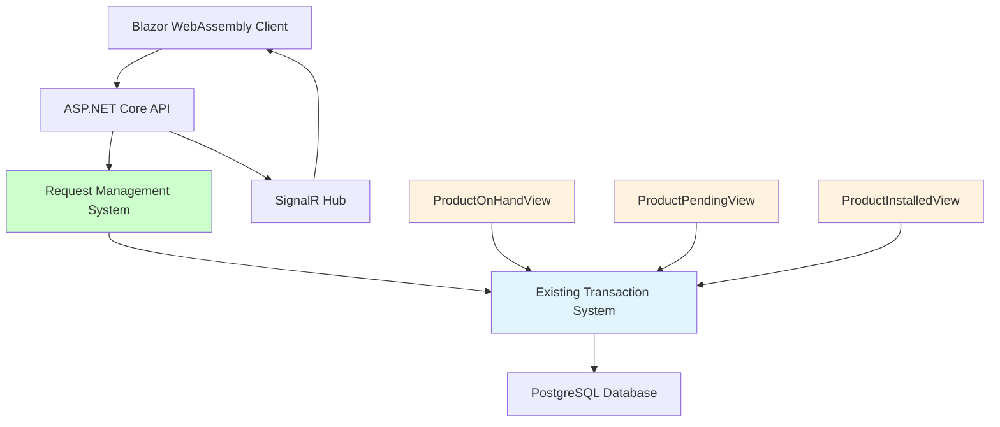

# Inventory Request System - Implementation Plan

## Overview

This document defines the complete implementation plan for the inventory request management system. Based on analysis of the current codebase, 60% of the system is already implemented. This plan focuses on completing the remaining critical components to achieve a production-ready system.

## Current System Status

### ✅ Already Implemented (60% Complete)

**Core Backend Infrastructure**:
- Request and RequestHistory models with full relationships
- RequestsController with comprehensive API endpoints
- RequestService with complete business logic
- Database migrations and entity configurations
- SignalR notification infrastructure

**Key Features Working**:
- Request creation and management
- Status workflow (Draft → Submitted → Approved → Completed)
- Request history tracking
- Integration with existing transaction system
- API endpoints for all request operations

### ❌ Missing Critical Components (40% Remaining)

**Data Consistency Issues**:
- Product.Quantity field creates data duplication risk
- Missing critical database performance indexes

**User Interface Gap**:
- No Blazor components for request management
- No user-facing request creation or management pages

**Security and Performance**:
- No role-based authorization policies
- Missing real-time notification integration
- No reporting and analytics interface

## Implementation Tasks

### Phase 1: Critical Foundation (Must Complete First)

#### Task 1.1: Resolve Data Consistency Issues
**Priority**: Critical  
**Timeline**: 2-3 days  
**Dependencies**: None

**Subtasks**:
1. **Remove Product.Quantity Field**
   - Remove `Quantity` property from Product model
   - Create computed property `CurrentQuantity` that queries ProductOnHandView
   - Update all references in controllers and services

2. **Create Database Migration**
   - Generate migration to drop `Quantity` column from Products table
   - Ensure no data loss during migration
   - Test migration on development database

3. **Update DTOs and Validators**
   - Remove quantity fields from ProductDto classes
   - Update product validators to use computed quantities
   - Ensure API responses use ProductOnHandView data

4. **Comprehensive Testing**
   - Test all product quantity operations
   - Verify inventory calculations are consistent
   - Validate transaction system integration

**Acceptance Criteria**:
- No Product.Quantity field exists in database or models
- All quantity operations use ProductOnHandView as single source of truth
- Zero inventory discrepancies after migration
- All existing tests pass

#### Task 1.2: Implement Critical Performance Indexes
**Priority**: High  
**Timeline**: 1 day  
**Dependencies**: None

**Subtasks**:
1. **Create Index Migration**
   - Generate migration for composite indexes
   - Include rollback procedures
   - Document expected performance improvements

2. **Implement Required Indexes**
   ```sql
   -- Critical performance indexes
   CREATE INDEX IX_InventoryTransaction_ProductId_Date 
       ON InventoryTransactions (ProductId, Date);
   
   CREATE INDEX IX_InventoryTransaction_Type_Date 
       ON InventoryTransactions (Type, Date);
   
   CREATE INDEX IX_InventoryTransaction_WarehouseId_Type 
       ON InventoryTransactions (WarehouseId, Type);
   
   CREATE INDEX IX_InventoryTransaction_UserId_Date 
       ON InventoryTransactions (UserId, Date);
   
   CREATE INDEX IX_InventoryTransaction_RequestId 
       ON InventoryTransactions (RequestId) WHERE RequestId IS NOT NULL;
   
   CREATE INDEX IX_AuditLog_EntityName_EntityId 
       ON AuditLogs (EntityName, EntityId);
   
   CREATE INDEX IX_AuditLog_UserId_Timestamp 
       ON AuditLogs (UserId, Timestamp);
   ```

3. **Performance Testing**
   - Run before/after performance tests
   - Document query performance improvements
   - Verify no negative impact on write operations

**Acceptance Criteria**:
- All critical indexes created successfully
- Query performance improved by 10-50x for common operations
- Database size increase acceptable (<5% growth)
- Write performance impact minimal (<10% degradation)

### Phase 2: User Interface Development

#### Task 2.1: Core Request Management Pages
**Priority**: High  
**Timeline**: 1 week  
**Dependencies**: Phase 1 completion

**Subtasks**:
1. **Request List Page** (`Pages/Requests/Index.razor`)
   - Display paginated list of requests
   - Implement filtering by status, date range, user
   - Add sorting by creation date, status, priority
   - Include search functionality
   - Show request summary information

2. **Request Creation Page** (`Pages/Requests/Create.razor`)
   - Form for creating new requests
   - Product selection with search and filtering
   - Quantity input with validation
   - Request metadata (title, description, priority)
   - Draft save functionality

3. **Request Details Page** (`Pages/Requests/Details.razor`)
   - Complete request information display
   - Transaction history timeline
   - Status change history
   - Edit capabilities based on permissions
   - Action buttons for status transitions

4. **Request Edit Page** (`Pages/Requests/Edit.razor`)
   - Modify request details (title, description)
   - Add/remove request items
   - Update quantities and notes
   - Status-dependent field restrictions

**Acceptance Criteria**:
- All pages render correctly with responsive design
- CRUD operations work for all request states
- Proper validation and error handling
- Integration with existing authentication system
- Navigation between pages functions properly

#### Task 2.2: Request Management Components
**Priority**: High  
**Timeline**: 3 days  
**Dependencies**: Task 2.1

**Subtasks**:
1. **RequestCard Component** (`Components/RequestCard.razor`)
   - Compact request display for lists
   - Status indicator with color coding
   - Key information (ID, title, date, status)
   - Action buttons for quick operations

2. **RequestStatusBadge Component** (`Components/RequestStatusBadge.razor`)
   - Visual status representation
   - Consistent styling across application
   - Tooltip with status description

3. **RequestTimeline Component** (`Components/RequestTimeline.razor`)
   - Visual timeline of request status changes
   - User information for each change
   - Timestamps and comments
   - Interactive timeline navigation

4. **ProductSelector Component** (`Components/ProductSelector.razor`)
   - Product search and selection interface
   - Category and manufacturer filtering
   - Quantity input with stock validation
   - Product details display

**Acceptance Criteria**:
- All components render correctly in different contexts
- Components are reusable across multiple pages
- Proper event handling and data binding
- Consistent styling with application theme
- Good performance with large datasets

### Phase 3: Security and Authorization

#### Task 3.1: Implement Role-Based Authorization
**Priority**: High  
**Timeline**: 3 days  
**Dependencies**: Phase 2 completion

**Subtasks**:
1. **Define Authorization Policies**
   ```csharp
   // Authorization matrix implementation
   services.AddAuthorization(options =>
   {
       options.AddPolicy("CreateRequest", policy => 
           policy.RequireRole("User", "Manager", "Admin"));
       options.AddPolicy("ApproveRequest", policy => 
           policy.RequireRole("Manager", "Admin"));
       options.AddPolicy("ViewAllRequests", policy => 
           policy.RequireRole("Manager", "Admin"));
   });
   ```

2. **Controller Authorization**
   - Add authorization attributes to controller actions
   - Implement request ownership validation
   - Create permission-based filtering

3. **UI Authorization**
   - Hide/show UI elements based on permissions
   - Implement role-based navigation
   - Add authorization checks in Blazor components

4. **Request Ownership Logic**
   - Users can only view/edit their own requests
   - Managers can view/edit all requests
   - Implement request assignment functionality

**Acceptance Criteria**:
- All API endpoints properly secured
- UI reflects user permissions correctly
- Unauthorized access attempts are blocked
- Role changes take effect immediately
- Audit trail captures authorization events

### Phase 4: Real-time Features and Analytics

#### Task 4.1: SignalR Request Notifications
**Priority**: Medium  
**Timeline**: 2 days  
**Dependencies**: Phase 3 completion

**Subtasks**:
1. **Request Notification Events**
   - Request created notifications
   - Status change notifications
   - Approval request alerts
   - Request completion notifications

2. **Hub Integration**
   - Extend existing NotificationHub
   - Add request-specific methods
   - Implement user group management
   - Add real-time request updates

3. **Client-Side Integration**
   - Subscribe to request notifications in UI
   - Update UI automatically on notifications
   - Show notification toasts for important events
   - Handle connection lifecycle properly

**Acceptance Criteria**:
- Real-time notifications work across all browsers
- Notifications are sent to correct users/roles
- UI updates immediately when requests change
- Notification preferences are respected
- Connection handling is robust

#### Task 4.2: Request Analytics and Reporting
**Priority**: Medium  
**Timeline**: 1 week  
**Dependencies**: Phase 3 completion

**Subtasks**:
1. **Analytics Dashboard** (`Pages/Reports/RequestAnalytics.razor`)
   - Request volume metrics over time
   - Average processing times by status
   - User productivity statistics
   - Request approval rates

2. **Performance Reports**
   - Request fulfillment timing analysis
   - Bottleneck identification
   - User efficiency metrics
   - Department-wise request statistics

3. **Export Functionality**
   - Export reports to Excel/PDF
   - Scheduled report generation
   - Email report delivery
   - Custom date range selections

**Acceptance Criteria**:
- Dashboard loads quickly with interactive charts
- All metrics calculate correctly
- Export functionality works reliably
- Reports provide actionable insights
- Data refreshes automatically

## Architecture Integration

### Current System Architecture



### Integration Points

**Request-Transaction Workflow**:
1. **Create Request** → Generate Pending transactions
2. **Approve Request** → Maintain Pending status
3. **Receive Items** → Convert Pending → Income transactions
4. **Install Items** → Create Install transactions
5. **Complete Request** → Mark as completed

**Data Flow Architecture**:
- Requests serve as metadata containers for grouped transactions
- ProductPendingView automatically shows all pending requests
- ProductOnHandView provides real-time inventory status
- ProductInstalledView tracks request fulfillment

## Testing Strategy

### Phase 1 Testing
**Data Consistency Tests**:
- Verify Product.Quantity removal doesn't break existing functionality
- Test inventory calculations match ProductOnHandView
- Validate transaction system integration

**Performance Tests**:
- Measure query performance before/after index implementation
- Load test with realistic data volumes
- Verify write performance impact is minimal

### Phase 2 Testing
**UI Component Tests**:
- Unit tests for all Blazor components
- Integration tests for page workflows
- End-to-end user journey testing

**Cross-browser Testing**:
- Test on Chrome, Firefox, Safari, Edge
- Mobile responsiveness validation
- Accessibility compliance testing

### Phase 3 Testing
**Security Tests**:
- Authorization policy validation
- Role-based access control testing
- SQL injection and XSS vulnerability testing

**Performance Tests**:
- SignalR connection load testing
- Real-time notification delivery testing
- Report generation performance testing

## Deployment Strategy

### Phase 1 Deployment
**Database Changes**:
1. Deploy index creation migration to staging
2. Monitor performance improvements
3. Deploy Product.Quantity removal migration
4. Validate data consistency
5. Deploy to production during maintenance window

### Phase 2 Deployment
**UI Components**:
1. Deploy new Blazor components to staging
2. User acceptance testing
3. Gradual rollout to production users
4. Monitor user adoption and feedback

### Phase 3 Deployment
**Security and Features**:
1. Deploy authorization changes to staging
2. Security penetration testing
3. Deploy SignalR enhancements
4. Deploy analytics features
5. Full production rollout

## Risk Mitigation

### High-Risk Areas

**Data Consistency Risk**:
- **Risk**: Product.Quantity removal could break existing features
- **Mitigation**: Comprehensive testing, gradual rollout, rollback plan
- **Monitoring**: Real-time inventory accuracy checks

**Performance Risk**:
- **Risk**: New indexes could impact write performance
- **Mitigation**: Performance testing, index optimization, monitoring
- **Monitoring**: Database performance metrics, query execution times

**Security Risk**:
- **Risk**: Authorization implementation could create security gaps
- **Mitigation**: Security review, penetration testing, gradual rollout
- **Monitoring**: Security audit logs, unauthorized access attempts

### Rollback Procedures

**Database Rollbacks**:
- Index rollback: Drop new indexes if performance issues occur
- Data migration rollback: Restore Product.Quantity field if needed
- Transaction integrity: Ensure no data loss during rollbacks

**Application Rollbacks**:
- Feature flags for new UI components
- API versioning for backward compatibility
- Configuration-based authorization switching

## Success Criteria

### Technical Metrics

**Performance Targets**:
- Query performance improvement: 10-50x faster for indexed operations
- Page load times: <2 seconds for request pages
- API response times: <200ms for standard operations
- SignalR notification delivery: <1 second

**Reliability Targets**:
- System uptime: 99.9% availability
- Data consistency: Zero inventory discrepancies
- Error rate: <1% of all operations
- Security incidents: Zero unauthorized access events

### Business Metrics

**User Adoption**:
- User registration: >80% of eligible users within 30 days
- Feature utilization: >60% of users create requests monthly
- User satisfaction: >4.5/5 rating in feedback surveys

**Process Efficiency**:
- Request processing time: <24 hours average
- Approval workflow: <4 hours for standard requests
- Request completion rate: >95% of approved requests
- User productivity: 20% reduction in manual inventory processes

### Quality Assurance

**Code Quality**:
- Test coverage: >80% for all new components
- Code review: 100% of changes reviewed
- Security review: All authentication/authorization changes
- Performance review: All database changes

**Documentation Quality**:
- API documentation: Complete for all endpoints
- User documentation: Step-by-step guides for all workflows
- Technical documentation: Architecture and deployment guides
- Training materials: User training videos and guides