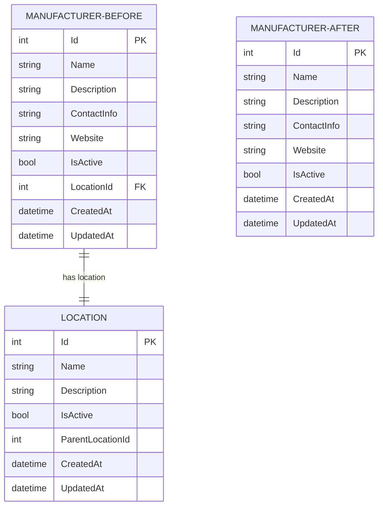
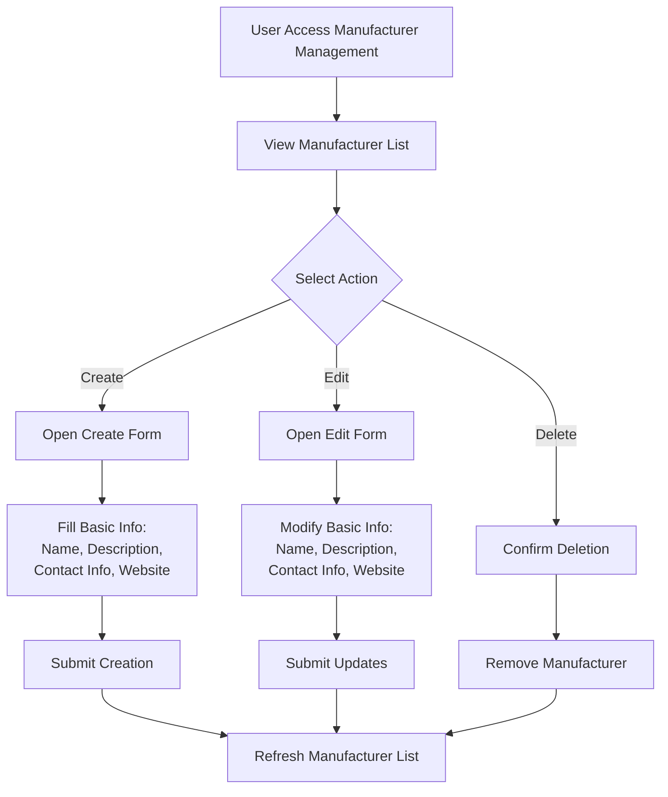

# Remove Location from Manufacturer - Design Document

## Overview

This design document outlines the systematic removal of the Location relationship from the Manufacturer entity across all layers of the inventory management system. The objective is to completely eliminate the LocationId foreign key property and all associated Location references from the Manufacturer model, DTOs, API endpoints, database schema, validation logic, and user interface components.

## Current Architecture State

Based on analysis of the codebase, the Location removal from Manufacturer has been largely completed. The system currently shows:

### Completed Components
- **Database Migration**: `RemoveManufacturerLocation` migration (20251007150310) has been created
- **Entity Model**: Manufacturer model no longer contains LocationId or Location navigation property
- **DTOs**: ManufacturerDto, CreateManufacturerDto, and UpdateManufacturerDto are clean of Location references
- **API Controller**: ManufacturerController operations handle manufacturers without Location dependency
- **Frontend UI**: ManufacturerManagementWidget.razor component operates without Location selection

### Remaining Cleanup Required
- **Test Files**: Several test files still reference the old LocationId property
- **Temporary Files**: Development artifacts contain outdated schema references

## Architecture Impact Analysis

### Database Layer Changes

The database schema modification involves removing the foreign key constraint and LocationId column from the Manufacturers table:

| Component | Change Type | Impact |
|-----------|------------|---------|
| Manufacturers Table | Column Removal | LocationId column eliminated |
| Foreign Key Constraint | Constraint Removal | FK_Manufacturers_Locations_LocationId removed |
| Entity Framework Model | Property Removal | LocationId and Location navigation removed |

### Data Model Transformation

### API Interface Simplification

The Manufacturer API endpoints have been streamlined to exclude Location-related operations:

| Endpoint | Method | Request Body | Response Changes |
|----------|--------|--------------|------------------|
| GET /api/manufacturer | GET | None | Removed LocationId, LocationName, LocationFullPath |
| GET /api/manufacturer/{id} | GET | None | Removed Location properties |
| POST /api/manufacturer | POST | CreateManufacturerDto | No LocationId validation required |
| PUT /api/manufacturer/{id} | PUT | UpdateManufacturerDto | Location properties excluded |
| DELETE /api/manufacturer/{id} | DELETE | None | No Location constraint checks |

### Frontend Interface Updates

The user interface has been simplified by removing Location selection components:

#### Form Structure Changes
- **Create Form**: Location dropdown selector removed
- **Edit Form**: Location field eliminated from edit interface
- **Data Grid**: Location column removed from manufacturer listings
- **Validation**: Location-related client-side validation removed

#### Workflow Simplification

## Data Migration Strategy

### Existing Data Handling

All existing LocationId values in the Manufacturers table are being permanently removed without preservation. This approach aligns with the business requirement to completely eliminate the Location relationship.

### Migration Execution Plan

| Phase | Action | Validation |
|-------|--------|------------|
| 1 | Execute RemoveManufacturerLocation migration | Verify column and constraint removal |
| 2 | Validate model updates | Confirm EF Core mappings |
| 3 | Test API endpoints | Ensure no Location references remain |
| 4 | Verify UI functionality | Confirm form operations work correctly |

## Business Logic Updates

### Manufacturer Operations

The core manufacturer business logic has been simplified:

#### Create Manufacturer Process
1. Validate required fields (Name, Description, ContactInfo, Website)
2. Check for duplicate manufacturer names
3. Create manufacturer entity with basic properties
4. Save to database without Location association

#### Update Manufacturer Process
1. Retrieve existing manufacturer by ID
2. Validate updated field values
3. Update basic manufacturer properties only
4. Save changes without Location modifications

#### Delete Manufacturer Process
1. Verify manufacturer exists
2. Check for product dependencies
3. Remove manufacturer if no dependencies exist
4. No Location constraint validation required

### Validation Rules

Updated validation requirements remove all Location-related constraints:

| Field | Validation Rules |
|-------|------------------|
| Name | Required, 2-100 characters, unique |
| Description | Optional, max 500 characters |
| ContactInfo | Optional, max 200 characters |
| Website | Optional, valid URL format, max 200 characters |
| IsActive | Boolean, defaults to true |

## Testing Strategy

### Updated Test Scenarios

The testing approach focuses on validating that Location references have been completely removed:

#### Unit Tests
- **Model Tests**: Verify Manufacturer entity excludes Location properties
- **DTO Tests**: Confirm DTOs operate without Location fields
- **Controller Tests**: Validate API operations function without Location dependency
- **Service Tests**: Ensure business logic operates correctly

#### Integration Tests
- **API Tests**: Verify endpoint responses exclude Location data
- **Database Tests**: Confirm migration removes Location references
- **End-to-End Tests**: Validate complete manufacturer workflows

#### Test Data Cleanup
- Remove LocationId references from test fixtures
- Update test manufacturer creation to exclude Location assignment
- Modify assertion logic to ignore Location properties

## Security and Authorization

The security model remains unchanged as Location removal does not impact:
- Role-based access control for manufacturer operations
- Authentication requirements for API endpoints
- Authorization policies for administrative functions

## Performance Considerations

### Database Performance Impact

Location removal provides performance benefits:
- **Reduced JOIN Operations**: Manufacturer queries no longer require Location table joins
- **Simplified Indexing**: LocationId foreign key index eliminated
- **Smaller Row Size**: Manufacturer table rows consume less storage space

### API Response Optimization

API responses are more efficient:
- **Reduced Payload Size**: Location data eliminated from manufacturer responses
- **Faster Serialization**: Fewer properties to serialize in JSON responses
- **Simplified Caching**: Manufacturer data caching no longer depends on Location changes

## Documentation Updates

### API Documentation
- Remove Location parameters from API endpoint documentation
- Update response schema examples to exclude Location properties
- Revise error response documentation for Location-related validations

### User Documentation
- Update user guides to reflect simplified manufacturer creation process
- Remove Location selection instructions from administrative procedures
- Revise manufacturer management workflows

## Rollback Considerations

Should rollback be required, the following approach would restore Location functionality:

### Rollback Strategy
1. **Database Rollback**: Revert RemoveManufacturerLocation migration
2. **Model Restoration**: Re-add LocationId property and Location navigation
3. **DTO Updates**: Restore Location properties in all DTOs
4. **API Modifications**: Re-implement Location handling in controllers
5. **UI Restoration**: Restore Location selection components
6. **Validation Reinstatement**: Re-add Location validation rules

### Rollback Complexity Assessment
- **High Complexity**: Requires coordinated changes across all system layers
- **Data Consistency Risk**: May require manual data reconciliation
- **Testing Requirement**: Full regression testing needed post-rollback

## Conclusion

The Location removal from Manufacturer represents a significant simplification of the system architecture. The implementation has been successfully completed across all major system components, with only minor test cleanup remaining. This change reduces system complexity, improves performance, and eliminates an unnecessary relationship that was not aligned with business requirements.

The simplified manufacturer management process provides a cleaner user experience while maintaining all essential functionality for manufacturer creation, modification, and deletion operations.