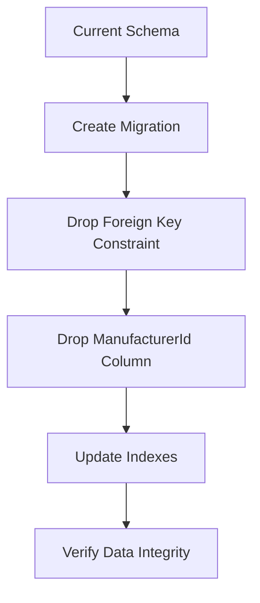
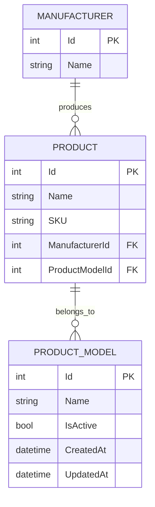

# Remove Manufacturer Field from ProductModel

## Overview

This design document outlines the removal of the Manufacturer field (ManufacturerId and navigation property) from the ProductModel entity in the Inventory Management System. This change will decouple ProductModel from Manufacturer, requiring updates across all application layers.

## Architecture Impact Analysis

### Current State
The ProductModel entity currently maintains a direct relationship with Manufacturer through:
- `ManufacturerId` foreign key property
- `Manufacturer` navigation property
- Database foreign key constraint
- DTO validation requiring ManufacturerId

### Target State
ProductModel will be simplified to contain only core model information without manufacturer association.

## Affected Components Matrix

| Component Layer | Files Affected | Change Type |
|-----------------|---------------|-------------|
| Database Schema | ProductModel table | Remove FK column |
| API Models | ProductModel.cs | Remove properties |
| Shared Models | ProductModel.cs | Remove properties |
| DTOs | ProductModelDto.cs, CreateProductModelDto.cs, UpdateProductModelDto.cs | Remove manufacturer fields |
| Controllers | ProductModelController.cs | Remove manufacturer validation |
| Client Services | WebProductModelApiService.cs | Remove manufacturer-based methods |
| Service Interfaces | IProductModelService.cs | Remove manufacturer methods |
| Shared Services | ProductModelApiService.cs | Remove manufacturer methods |
| Validators | ProductModel validators | Remove manufacturer validation |
| Migrations | New migration file | Drop constraint and column |
| Unit Tests | All ProductModel test classes | Update test data setup |
| Integration Tests | Controller integration tests | Update test scenarios |
| Component Tests | ProductModel component tests | Remove manufacturer assertions |

## Database Schema Changes

### Migration Strategy



### Schema Impact Table

| Change | Before | After |
|--------|--------|-------|
| ProductModel Table | Contains ManufacturerId FK | No manufacturer reference |
| Foreign Key | FK_ProductModels_Manufacturers | Removed |
| Index | IX_ProductModels_ManufacturerId | Removed |

## API Contract Changes

### ProductModel Endpoints Impact

| Endpoint | Current Behavior | New Behavior |
|----------|------------------|--------------|
| GET /api/productmodel | Returns ManufacturerId, ManufacturerName | Returns only model data |
| POST /api/productmodel | Requires ManufacturerId validation | No manufacturer validation |
| PUT /api/productmodel/{id} | Updates manufacturer association | Updates only model properties |

### Request/Response Schema Updates

#### ProductModelDto Changes
- Remove: `ManufacturerId` property
- Remove: `ManufacturerName` property
- Retain: `Id`, `Name`, `IsActive`, `CreatedAt`, `UpdatedAt`

#### CreateProductModelDto Changes
- Remove: `ManufacturerId` property and validation
- Remove: `[Range(1, int.MaxValue)]` validation for ManufacturerId
- Retain: `Name` validation

#### UpdateProductModelDto Changes
- Remove: `ManufacturerId` property and validation
- Retain: `Name`, `IsActive` properties

## Data Model Updates

### Entity Relationship Changes



### Navigation Property Updates

| Model | Current Navigation | Updated Navigation |
|-------|-------------------|-------------------|
| ProductModel | `Manufacturer` property | Removed |
| ProductModel | `Products` collection | Retained |
| Manufacturer | `Models` collection | Removed |
| Manufacturer | `Products` collection | Retained |

## Business Logic Impact

### Controller Layer Changes

#### ProductModelController Updates
- Remove manufacturer validation in Create action
- Remove manufacturer lookup in Create action
- Remove manufacturer name population in response DTOs
- Update error handling for manufacturer-related validations

### Client Service Layer Changes

#### WebProductModelApiService Updates
- Remove `GetProductModelsByManufacturerAsync` method
- Update service to handle ProductModel operations without manufacturer context
- Remove manufacturer-related API endpoint calls

#### IProductModelService Interface Updates
- Remove `GetProductModelsByManufacturerAsync` method signature
- Update interface contract to exclude manufacturer operations

#### ProductModelApiService Updates
- Remove manufacturer-based filtering methods
- Update shared service implementation
- Remove manufacturer-related logging

### Validation Changes

| Validation Rule | Action |
|----------------|--------|
| ManufacturerId Required | Remove |
| ManufacturerId Range Check | Remove |
| Manufacturer Existence Check | Remove |
| Name Length Validation | Retain |
| Name Required Validation | Retain |

## Testing Strategy Updates

### Unit Test Changes

#### Test Data Setup Modifications
- Remove manufacturer creation in ProductModel tests
- Update ProductModel factory methods
- Remove manufacturer-related assertions
- Update mock data to exclude manufacturer fields

#### Test Scenario Updates

| Test Category | Changes Required |
|---------------|------------------|
| ProductModel Creation | Remove manufacturer parameter |
| ProductModel Validation | Remove manufacturer validation tests |
| ProductModel Update | Remove manufacturer update scenarios |
| ProductModel Retrieval | Remove manufacturer data assertions |

### Integration Test Updates

#### Controller Test Changes
- Update POST /api/productmodel test requests
- Remove manufacturer validation test cases
- Update response assertion to exclude manufacturer data
- Modify test database seeding

### Component Test Updates
- Update ProductModel component rendering tests
- Remove manufacturer dropdown/selection tests
- Update form validation tests

## Migration Implementation Plan

### Step-by-Step Execution

1. **Database Migration**
   - Create new migration: `RemoveManufacturerFromProductModel`
   - Drop foreign key constraint
   - Drop ManufacturerId column
   - Remove related indexes

2. **Model Layer Updates**
   - Update API ProductModel entity
   - Update Shared ProductModel entity
   - Remove navigation properties

3. **DTO Layer Updates**
   - Update ProductModelDto
   - Update CreateProductModelDto
   - Update UpdateProductModelDto
   - Remove validation attributes

4. **Service Layer Updates**
   - Update WebProductModelApiService
   - Update IProductModelService interface
   - Update ProductModelApiService
   - Remove manufacturer-related methods

5. **Controller Updates**
   - Modify ProductModelController Create action
   - Modify ProductModelController Update action
   - Update response mapping

6. **Test Updates**
   - Update all unit tests
   - Update integration tests
   - Update component tests

## Client-Side Service Impact

### Web API Service Changes

| Service | Method to Remove | Impact |
|---------|------------------|--------|
| WebProductModelApiService | `GetProductModelsByManufacturerAsync` | Remove manufacturer-based filtering |
| IProductModelService | `GetProductModelsByManufacturerAsync` | Update interface contract |
| ProductModelApiService | `GetProductModelsByManufacturerAsync` | Remove shared service method |

### Service Method Signatures

#### Current Methods to Remove
```
Task<List<ProductModelDto>> GetProductModelsByManufacturerAsync(int manufacturerId)
```

#### Remaining Methods
- `GetAllProductModelsAsync()`
- `GetProductModelByIdAsync(int id)`
- `CreateProductModelAsync(CreateProductModelDto dto)`
- `UpdateProductModelAsync(int id, UpdateProductModelDto dto)`
- `DeleteProductModelAsync(int id)`

## Risk Assessment

### Data Safety Considerations

| Risk | Impact | Mitigation |
|------|--------|------------|
| Data Loss | Existing ManufacturerId references lost | Document migration, backup before changes |
| API Breaking Change | Client applications may fail | Version API or provide migration notice |
| Test Failures | Existing tests will break | Update all tests systematically |

### Rollback Strategy

If rollback is required:
1. Revert migration to restore ManufacturerId column
2. Restore foreign key constraint
3. Revert code changes in reverse order
4. Restore test implementations

## Post-Implementation Verification

### Validation Checklist

- [ ] ProductModel table no longer contains ManufacturerId
- [ ] Foreign key constraint removed
- [ ] API endpoints return data without manufacturer fields
- [ ] WebProductModelApiService updated (manufacturer methods removed)
- [ ] IProductModelService interface updated
- [ ] ProductModelApiService shared service updated
- [ ] All unit tests pass
- [ ] All integration tests pass
- [ ] Component tests pass
- [ ] No compiler errors or warnings
- [ ] Client-side services compile without manufacturer references

### Performance Considerations

- Database queries will be simplified (no manufacturer joins needed)
- API responses will be smaller (fewer fields)
- Reduced complexity in ProductModel operations

## Alternative Design Considerations

### Future Manufacturer Access

If manufacturer information is needed for products associated with ProductModel:
- Access via Product → Manufacturer relationship
- Implement aggregation queries when manufacturer data is required
- Consider caching strategies for frequently accessed manufacturer data

This design maintains data integrity while simplifying the ProductModel entity structure and reducing coupling between entities.