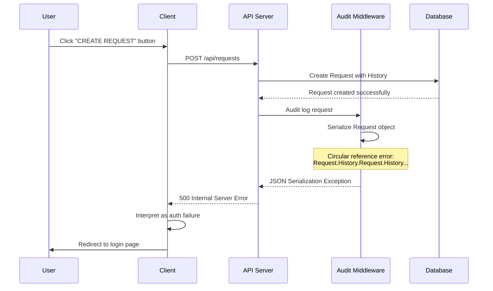
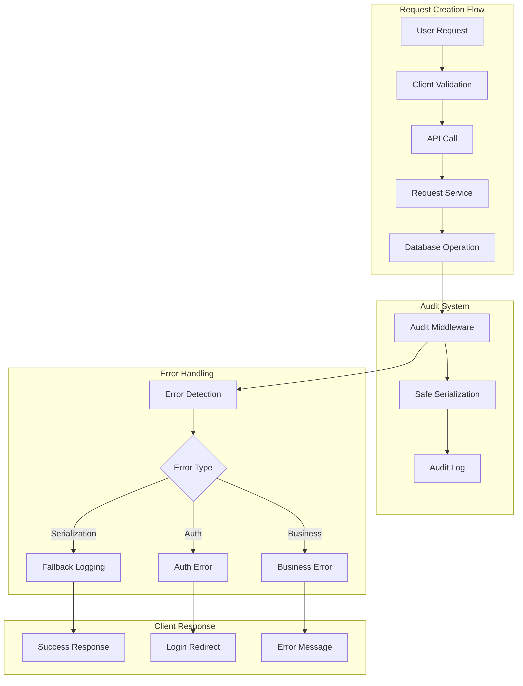
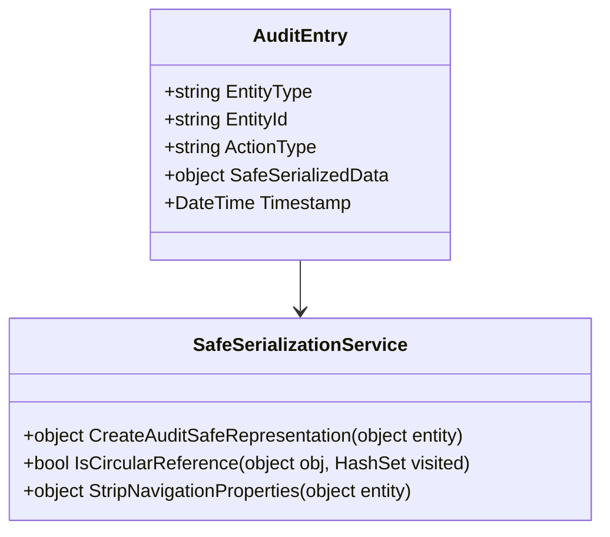

# Request Creation Redirect Issue Resolution Design

## Overview

This design addresses a critical issue in the inventory control system where users attempting to create requests are unexpectedly redirected to the authentication page despite being properly authenticated. The issue stems from a JSON serialization circular reference error in the audit middleware that causes request creation to fail with a 500 status code, which is then misinterpreted by the client as an authentication failure.

## Problem Analysis

### Issue Description
When users navigate to `/requests/create` and click "CREATE REQUEST", they are redirected to the login page despite having valid authentication tokens. The API logs show a successful authentication followed by a JSON serialization error due to circular references.

### Root Cause Analysis

1. **Primary Issue**: Circular Reference in Entity Models
   - `Request` entity contains collection of `RequestHistory`
   - `RequestHistory` entity has navigation property back to `Request`
   - This creates infinite loop during JSON serialization in audit middleware

2. **Secondary Issue**: Error Handling Chain Reaction
   - Circular reference causes 500 Internal Server Error
   - Client error handler interprets 500 as potential authentication issue
   - Token validation logic triggers unnecessary login redirect

3. **Contributing Factors**:
   - Audit middleware attempts to serialize entire request objects including navigation properties
   - Entity Framework navigation properties are eagerly loaded in some contexts
   - Client-side error handling has aggressive authentication failure detection

## Architecture Impact

### Affected Components

| Component | Impact Level | Description |
|-----------|-------------|-------------|
| Request Entity Models | High | Circular reference between Request and RequestHistory |
| Audit Middleware | High | JSON serialization failure during logging |
| Request API Controller | Medium | 500 errors on request creation |
| Client Error Handler | Medium | Misinterprets 500 as auth failure |
| Authentication Flow | Low | Unnecessary login redirects |

### Data Flow Analysis

## Solution Design

### Strategy Overview

The solution addresses the issue at multiple levels to ensure robust request creation while maintaining comprehensive audit logging capabilities.

### Technical Approach

#### 1. Entity Model Decoupling

**JSON Serialization Configuration**
- Configure JSON serializer to handle circular references using `ReferenceHandler.Preserve`
- Implement custom JSON converters for audit-specific serialization
- Add JsonIgnore attributes to break circular reference chains where appropriate

**Entity Relationship Optimization**
- Modify audit middleware to serialize only essential entity properties
- Create audit-specific DTOs that exclude navigation properties
- Implement selective property serialization for audit logs

#### 2. Audit Middleware Enhancement

**Intelligent Object Serialization Strategy**
- Detect Entity Framework entities and strip navigation properties
- Create audit-safe representations of complex objects
- Implement depth-limited serialization to prevent infinite loops

**Error Resilience Improvements**
- Add fallback serialization methods when primary serialization fails
- Implement graceful degradation for audit logging failures
- Ensure audit failures don't block primary business operations

#### 3. Client-Side Error Handling Refinement

**Error Classification System**
- Distinguish between authentication errors and general server errors
- Implement status-code-specific error handling strategies
- Add retry mechanisms for transient server errors

**Authentication State Management**
- Improve token validation logic to avoid false positives
- Implement more precise authentication failure detection
- Add user-friendly error messages for different failure scenarios

### Implementation Architecture

### Component Modifications

#### 1. Request and RequestHistory Models

**Circular Reference Resolution**
- Add JsonIgnore attributes to navigation properties used only for EF relationships
- Configure Entity Framework to lazy load navigation properties by default
- Implement specific loading patterns for audit-critical data

#### 2. Audit Middleware Enhancement

**Safe Serialization Implementation**
- Create audit-specific object transformation pipeline
- Implement maximum depth controls for object serialization
- Add exception handling for serialization failures

**Audit Data Structure**

#### 3. Request API Controller Updates

**Enhanced Error Handling**
- Add specific exception handling for request creation scenarios
- Implement proper HTTP status code mapping
- Add detailed error logging without circular reference issues

#### 4. Client Error Handler Improvements

**Status Code Response Strategy**

| Status Code | Client Action | User Experience |
|-------------|---------------|-----------------|
| 400 | Show validation errors | Form field highlighting |
| 401 | Check token validity | Conditional login redirect |
| 403 | Show permission error | Access denied message |
| 500 | Show generic error | Retry option with error details |

## Testing Strategy

### Unit Testing Requirements

**Model Serialization Tests**
- Verify circular reference resolution
- Test audit-safe serialization methods
- Validate JSON serializer configuration

**Middleware Testing**
- Test audit middleware with complex object graphs
- Verify fallback serialization mechanisms
- Validate error handling paths

**Client Error Handling Tests**
- Test status code interpretation logic
- Verify authentication state management
- Validate user experience for different error scenarios

### Integration Testing Scenarios

1. **Complete Request Creation Flow**
   - End-to-end request creation with audit logging
   - Verify no authentication redirects occur
   - Confirm audit logs are properly created

2. **Error Scenario Testing**
   - Simulate various server errors
   - Test client response to different status codes
   - Verify user remains on appropriate pages

3. **Authentication Edge Cases**
   - Test with expired tokens during request creation
   - Verify proper authentication error handling
   - Confirm appropriate login redirects only when necessary

## Deployment Considerations

### Migration Strategy

**Phase 1**: Backend Fixes
- Deploy audit middleware improvements
- Update entity serialization configuration
- Enhance API error handling

**Phase 2**: Client Updates
- Deploy refined error handling logic
- Update user experience for error scenarios
- Implement improved authentication state management

### Monitoring and Observability

**Key Metrics to Track**
- Request creation success rate
- Audit logging failure frequency
- False authentication redirects
- User experience improvement metrics

**Alert Thresholds**
- Request creation failure rate > 2%
- Audit serialization errors > 1% of total requests
- Authentication redirect anomalies

## Risk Assessment

### Technical Risks

| Risk | Probability | Impact | Mitigation |
|------|-------------|--------|------------|
| Audit data loss | Low | Medium | Fallback logging mechanisms |
| Performance degradation | Low | Low | Optimized serialization |
| Breaking changes | Medium | High | Thorough testing and gradual rollout |

### Business Impact

**Positive Outcomes**
- Restored request creation functionality
- Improved user experience
- Enhanced system reliability
- Better audit trail integrity

**Potential Concerns**
- Temporary audit data format changes
- Need for user retraining on error handling
- Possible performance impact during transition

## Success Criteria

### Technical Success Indicators
- Zero authentication redirects during valid request creation attempts
- 100% audit log creation success rate for request operations
- Sub-500ms response time for request creation API calls
- Zero circular reference serialization errors in logs

### User Experience Metrics
- Request creation completion rate improvement to >95%
- User satisfaction scores for request management workflow
- Reduction in support tickets related to authentication issues
- Improved task completion times for request creation flows