# UI Refactoring Design

## Overview

This document outlines a comprehensive UI refactoring strategy for the InventoryCtrl_2 Blazor WebAssembly application. The refactoring focuses on eliminating unjustified HTML and CSS, removing unused components, implementing multilingual interface support, and strategically evaluating the UI architecture according to best practices for Razor Components and Radzen UI framework.

## Current Architecture Assessment

### Multilingual Interface Current State Analysis

#### Identified Language Issues
- **Mixed Language Implementation**: Russian text hardcoded in components (MainLayout.razor, NavMenu.razor)
- **No Localization Framework**: Missing internationalization (i18n) infrastructure
- **Hardcoded Text**: User-facing strings embedded directly in components
- **Inconsistent Language Usage**: Mix of English and Russian throughout the application

#### Current Language Distribution
| Component | Language Issues | Impact |
|-----------|-----------------|--------|
| **MainLayout.razor** | "Переключить меню", "Привет" hardcoded | High - Core layout |
| **NavMenu.razor** | "Главная", "Каталог", "Склады", "Заявки" hardcoded | High - Navigation |
| **Home.razor** | "Привет", "Ключевые показатели" hardcoded | Medium - Dashboard |
| **Button Labels** | "Выйти", "Добавить товар" hardcoded | Medium - Actions |
| **Admin Sections** | "Администрирование", "Справочники" hardcoded | Medium - Admin UI |

## Current Architecture Assessment

### Component Distribution Analysis

The current UI architecture spans multiple projects with inconsistent component organization:

| Project | Components | Purpose | Issues Identified |
|---------|-----------|---------|-------------------|
| **Inventory.Web.Client** | Layout, Shared, SignalR, Theme | Core application shell | Mixed responsibilities, unclear separation |
| **Inventory.UI** | Business components, Pages | Domain-specific UI | Scattered organization, unused components |
| **Inventory.Web.Assets** | CSS, Static assets | Styling resources | Minimal CSS utilization |

### Identified Issues

#### Component Organization Problems
- **Dual Component Locations**: Components split between `Inventory.Web.Client/Components` and `Inventory.UI/Components` without clear separation criteria
- **Mixed Responsibilities**: Layout components mixed with business logic components
- **Inconsistent Naming**: Some components follow naming conventions while others don't
- **Language Inconsistency**: Mixed Russian/English text throughout the application

#### Unused Components Detection
- **UserGreeting.razor**: Empty component with no implementation (10 lines, no content)
- **Reports.razor**: Placeholder page with minimal content (0.1KB)
- **Warehouses.razor**: Placeholder page with minimal content (0.1KB)
- **Products.razor**: Minimal implementation, likely superseded by ProductList

#### Internationalization (i18n) Issues
- **No Localization Framework**: Missing Microsoft.Extensions.Localization infrastructure
- **Hardcoded Strings**: All user-facing text embedded in components
- **Mixed Languages**: Russian and English text inconsistently used
- **No Resource Files**: Missing .resx files for string resources
- **No Culture Configuration**: Missing culture and localization setup
- **No RTL Support**: No right-to-left language support consideration

#### CSS and Styling Issues
- **Redundant Styling**: Multiple CSS files with overlapping styles
- **Inline Styles**: Heavy use of inline styling instead of component-scoped CSS
- **Inconsistent Theme Integration**: Mixed usage of Radzen variables and custom CSS
- **No Localization-Aware Styling**: No support for different text lengths or RTL layouts

#### HTML Structure Problems
- **Excessive Nesting**: Deep component hierarchies without clear architectural benefit
- **Repeated Markup**: Similar HTML patterns across multiple components
- **Accessibility Gaps**: Missing ARIA labels and semantic markup
- **No Language Attributes**: Missing lang attributes for screen readers

## Architecture Redesign Strategy

### Internationalization Architecture


### Multilingual Architecture Strategy

#### Supported Languages Priority
| Language | Priority | Market Justification | Implementation Phase |
|----------|----------|---------------------|----------------------|
| **English** | Primary | International standard, technical documentation | Phase 1 |
| **Russian** | Secondary | Current user base, existing content | Phase 1 |
| **German** | Tertiary | European market expansion | Phase 2 |
| **Spanish** | Future | Global market consideration | Phase 3 |

#### Resource File Structure
```
src/Inventory.Shared/Resources/
├── SharedResources.resx              # English (default)
├── SharedResources.ru.resx           # Russian
├── SharedResources.de.resx           # German
├── Components/
│   ├── Navigation.resx               # Navigation-specific
│   ├── Navigation.ru.resx
│   ├── Dashboard.resx               # Dashboard-specific
│   ├── Dashboard.ru.resx
│   ├── Forms.resx                   # Form-specific
│   └── Forms.ru.resx
└── Validation/
    ├── ValidationMessages.resx      # Validation messages
    └── ValidationMessages.ru.resx
```

### Component Hierarchy Restructuring


### Component Consolidation Plan

#### Phase 1: Remove Unused Components
- **Delete UserGreeting.razor**: Empty component serving no purpose
- **Consolidate Reports.razor and Warehouses.razor**: Merge into proper implementation or remove
- **Remove Products.razor**: Replace with ProductList implementation
- **Clean up empty Admin pages**: Remove placeholder components

#### Phase 2: Reorganize Component Structure
- **Create Feature-Based Folders**: Group components by business domain
- **Establish Component Hierarchy**: Clear parent-child relationships
- **Standardize Component Contracts**: Consistent parameter and event patterns

#### Phase 3: Optimize Component Implementation
- **Eliminate Redundant Markup**: Consolidate similar HTML patterns
- **Implement Component Composition**: Reduce code duplication through reusable components
- **Standardize Styling Approach**: Consistent use of Radzen themes and component-scoped CSS

## Technical Implementation Plan

### CSS Architecture Modernization

#### Current CSS Issues
- **app.css**: Contains mostly Blazor defaults with minimal customization
- **MainLayout.razor.css**: Well-structured but could be optimized
- **Home.razor.css**: Good component-scoped styling example
- **Inline Styles**: Extensive use in components like RealTimeNotificationComponent

#### Proposed CSS Structure


#### CSS Optimization Strategies
- **Variable Consolidation**: Use Radzen CSS custom properties consistently
- **Remove Inline Styles**: Convert inline styles to component-scoped CSS
- **Utility-First Approach**: Create reusable utility classes for common patterns
- **Performance Optimization**: Eliminate unused CSS rules and optimize selectors

### Component Pattern Standardization

#### Radzen Integration Best Practices
- **RadzenCard Usage**: Consistent card implementation across components
- **RadzenStack Layouts**: Replace custom flex layouts with RadzenStack
- **RadzenButton Patterns**: Standardize button variations and styles
- **RadzenDataGrid Configuration**: Optimize grid implementations for performance

#### Component Lifecycle Optimization
- **OnInitializedAsync Patterns**: Consistent data loading strategies
- **StateHasChanged Usage**: Optimize re-rendering performance
- **Parameter Validation**: Implement consistent parameter validation
- **Event Handling**: Standardize event callback patterns

### Accessibility and Semantic HTML

#### Current Accessibility Issues
- **Missing ARIA Labels**: Many interactive elements lack proper labels
- **Semantic HTML**: Overuse of div elements instead of semantic tags
- **Focus Management**: Inconsistent focus handling in modals and forms
- **Color Contrast**: Some custom colors may not meet WCAG standards

#### Proposed Improvements
- **Semantic Structure**: Use proper HTML5 semantic elements
- **ARIA Implementation**: Add comprehensive ARIA labels and roles
- **Keyboard Navigation**: Implement consistent keyboard navigation patterns
- **Screen Reader Support**: Ensure proper screen reader compatibility

## Detailed Implementation Phases

### Phase 1: Component Cleanup and Internationalization Setup (Week 1)

#### Step 1.1: Internationalization Infrastructure Setup (Days 1-2)
- **1.1.1 Install Localization Packages**
  - Add Microsoft.Extensions.Localization package
  - Add Microsoft.AspNetCore.Localization package
  - Configure dependency injection for localization services

- **1.1.2 Configure Localization in Program.cs**
  - Register IStringLocalizer services
  - Configure supported cultures (en-US, ru-RU)
  - Set default culture and fallback behavior
  - Add localization middleware configuration

- **1.1.3 Create Resource File Structure**
  - Create SharedResources.resx (English defaults)
  - Create SharedResources.ru.resx (Russian translations)
  - Create component-specific resource files
  - Organize validation message resources

- **1.1.4 Extract Hardcoded Strings Analysis**
  - Scan all .razor files for hardcoded text
  - Create translation keys mapping
  - Document current Russian text for translation
  - Identify context-specific translations needed

#### Step 1.2: Component Inventory and Analysis (Days 2-3)
- **1.2.1 Create Component Mapping**
  - List all .razor files in both Inventory.UI and Inventory.Web.Client
  - Document component dependencies using grep/search tools
  - Create component usage matrix (which components use which)
  - Identify circular dependencies
  - Mark components with hardcoded text for i18n refactoring

- **1.2.2 Unused Component Detection**
  - Run static analysis to find components never imported
  - Check for components with minimal/empty implementations
  - Verify UserGreeting.razor usage across application
  - Document Reports.razor and Warehouses.razor current state

- **1.2.3 Multilingual Content Audit**
  - Extract all Russian text from components
  - Create translation keys for each text element
  - Identify pluralization requirements
  - Document date/number formatting needs

#### Step 1.3: Create Localization Base Infrastructure (Days 3-4)
- **1.3.1 Implement LocalizedComponentBase**
  - Create base class with IStringLocalizer injection
  - Add culture change notification handling
  - Implement localized date/number formatting helpers
  - Add validation message localization support

- **1.3.2 Create Culture Management Service**
  - Implement culture switching functionality
  - Add browser locale detection
  - Create culture persistence (localStorage)
  - Add culture change event broadcasting

- **1.3.3 Resource File Population**
  - Populate SharedResources.resx with English defaults
  - Translate existing Russian text to resource keys
  - Create component-specific resource entries
  - Add validation message translations

#### Step 1.4: Safe Component Removal (Day 4-5)
- **1.4.1 Remove Empty Components**
  - Delete UserGreeting.razor (confirmed empty)
  - Remove any @using references to deleted components
  - Update _Imports.razor files if needed
  - Clean up navigation references

- **1.4.2 Consolidate Placeholder Components**
  - Replace Reports.razor placeholder with proper implementation or remove
  - Replace Warehouses.razor placeholder with proper implementation or remove
  - Update navigation menu to reflect removed/consolidated components
  - Update resource files to remove unused text keys

- **1.4.3 Verify Application Integrity**
  - Run full application build
  - Test all navigation paths
  - Verify no broken component references
  - Run existing unit tests
  - Test culture switching functionality

### Phase 2: Architecture Restructuring with Localization Integration (Weeks 2-3)

#### Step 2.1: Folder Structure Reorganization with i18n Support (Days 6-8)
- **2.1.1 Create New Folder Structure with Localization**
  ```
  src/Inventory.UI/
  ├── Components/
  │   ├── Layout/          # MainLayout, NavMenu (localized)
  │   ├── Dashboard/       # Dashboard-specific components (localized)
  │   ├── Products/        # Product management components (localized)
  │   ├── Requests/        # Request management components (localized)
  │   ├── Admin/           # Administrative components (localized)
  │   ├── Shared/          # Reusable cross-feature components
  │   ├── Forms/           # Form-specific components (localized)
  │   └── Localization/    # Localization-specific components
  ├── Resources/           # Resource files for localization
  ```

- **2.1.2 Create Localization Components**
  - Implement CultureSelector component
  - Create LocalizedText component for dynamic text
  - Implement LocalizedValidation component
  - Create DateTimeLocalizer component

- **2.1.3 Move and Localize Components**
  - Move layout components to Layout folder with localization
  - Group and localize dashboard components
  - Consolidate and localize product-related components
  - Group and localize request-related components

#### Step 2.2: Component Localization Implementation (Days 9-12)
- **2.2.1 Localize Core Layout Components**
  - Convert MainLayout.razor hardcoded text to resource keys
  - Implement NavMenu.razor localization
  - Add language selector to top navigation
  - Update breadcrumb localization

- **2.2.2 Localize Dashboard Components**
  - Convert Home.razor dashboard text to resources
  - Localize StatsWidget labels and descriptions
  - Implement RecentActivity localization
  - Localize LowStockAlert messages

- **2.2.3 Localize Form and Validation Components**
  - Convert all form labels to resource keys
  - Implement localized validation messages
  - Add culture-specific date/number formatting
  - Localize button text and actions

#### Step 2.3: Component Interface Standardization with i18n (Days 13-15)
- **2.3.1 Localization-Aware Parameter Patterns**
  - Define standard parameter naming conventions:
    - `Data` for main data objects
    - `OnChanged` for event callbacks
    - `IsLoading` for loading states
    - `CssClass` for additional styling
    - `CultureInfo` for culture-specific rendering

- **2.3.2 Localized Event Callback Standardization**
  - Implement consistent EventCallback patterns with localization
  - Standardize async event handling with culture context
  - Add proper error handling with localized messages
  - Implement culture-aware data validation

- **2.3.3 Multilingual Component Base Classes**
  - Enhance ComponentBase classes with localization support
  - Implement IDisposable patterns for culture change subscriptions
  - Add standard lifecycle methods with culture awareness
  - Create localized logging and error reporting

#### Step 2.4: Advanced Localization Features (Day 15)
- **2.4.1 Implement Dynamic Content Localization**
  - Create content management for dynamic translations
  - Implement real-time language switching
  - Add support for context-sensitive translations
  - Implement pluralization rules for different languages

- **2.4.2 Cultural Formatting Implementation**
  - Implement culture-specific date formatting
  - Add culture-aware number and currency formatting
  - Implement localized sorting and filtering
  - Add timezone-aware datetime handling

### Phase 3: CSS Modernization and Multilingual Design System (Week 4)

#### Step 3.1: CSS Audit and Multilingual Design Considerations (Days 16-17)
- **3.1.1 Inline Style Inventory with Language Impact**
  - Scan all .razor files for inline style attributes
  - Document inline styles usage patterns
  - Identify styles that should be moved to CSS classes
  - Assess text length variations between languages (Russian vs English)
  - Plan for RTL language support in future phases

- **3.1.2 CSS File Analysis for Internationalization**
  - Analyze app.css for unused rules
  - Review component-specific CSS files
  - Identify duplicate CSS rules across files
  - Check for text-length dependent layouts
  - Identify elements that need culture-specific styling

#### Step 3.2: Multilingual Design System Implementation (Days 18-19)
- **3.2.1 Language-Aware Color System**
  - Define primary, secondary, and accent color variables
  - Create semantic color tokens (success, warning, danger, info)
  - Implement consistent color usage across components
  - Add culture-specific color preferences (if needed)

- **3.2.2 Internationalization-Ready Typography System**
  - Define typography scale using Radzen text styles
  - Create responsive text sizing for different languages
  - Account for text expansion/contraction between languages
  - Implement fallback fonts for different character sets
  - Add support for different text directions (LTR/RTL preparation)

- **3.2.3 Adaptive Spacing System**
  - Define consistent spacing scale
  - Use Radzen gap and padding systems
  - Remove arbitrary spacing values
  - Account for text length variations in layout spacing
  - Implement flexible layouts for dynamic content

#### Step 3.3: CSS Performance Optimization with Localization (Days 20-22)
- **3.3.1 Convert Inline Styles to Localization-Aware CSS**
  - Move inline styles to component-scoped CSS
  - Create utility classes for common patterns
  - Ensure proper CSS encapsulation
  - Add CSS custom properties for dynamic content
  - Implement culture-specific CSS overrides

- **3.3.2 Multilingual CSS Bundle Optimization**
  - Remove unused CSS rules
  - Combine related CSS files
  - Optimize CSS selectors for performance
  - Implement CSS minification
  - Add culture-specific CSS loading strategies

- **3.3.3 Language Selector and Theme Integration**
  - Create responsive language selector component
  - Integrate language selection with theme system
  - Implement smooth transitions for language changes
  - Add visual feedback for language switching
  - Ensure consistent styling across all languages

### Phase 4: Performance, Accessibility and Multilingual Enhancement (Week 5)

#### Step 4.1: Performance Optimization with Localization (Days 23-24)
- **4.1.1 Component Rendering Optimization**
  - Implement ShouldRender optimization where applicable
  - Add virtualization to large data lists (ProductList, RequestList)
  - Implement lazy loading for heavy components
  - Optimize culture change performance
  - Add resource caching for localization strings

- **4.1.2 Localization Performance Optimization**
  - Implement resource preloading for active culture
  - Add intelligent caching for translation resources
  - Optimize culture switching performance
  - Implement lazy loading for non-active language resources
  - Add compression for resource files

- **4.1.3 State Management with Culture Context**
  - Minimize StateHasChanged calls during culture changes
  - Implement proper component lifecycle management
  - Add caching for frequently accessed localized data
  - Optimize culture-specific data formatting

#### Step 4.2: Multilingual Accessibility Implementation (Days 25-26)
- **4.2.1 Semantic HTML Enhancement with Language Support**
  - Replace div elements with semantic HTML5 elements
  - Add proper heading hierarchy with language attributes
  - Implement landmark roles with localized labels
  - Add lang attributes for screen reader support
  - Implement proper text direction support

- **4.2.2 ARIA Implementation for Multilingual Content**
  - Add ARIA labels with localized text
  - Implement ARIA live regions for dynamic content
  - Add proper ARIA roles and properties
  - Include language announcements for screen readers
  - Implement culture-aware ARIA descriptions

- **4.2.3 Keyboard Navigation with Localization**
  - Implement proper tab order
  - Add keyboard shortcuts for common actions
  - Ensure focus visibility
  - Add localized keyboard shortcut descriptions
  - Implement culture-specific navigation patterns

#### Step 4.3: Cross-Browser and Multilingual Testing (Days 26-27)
- **4.3.1 Browser Compatibility Testing**
  - Test in Chrome, Firefox, Safari, Edge
  - Verify CSS compatibility across languages
  - Test JavaScript functionality with different locales
  - Verify font rendering for different character sets
  - Test locale-specific date/number formatting

- **4.3.2 Multilingual Responsiveness Testing**
  - Test on various screen sizes with different languages
  - Verify touch interactions work with localized content
  - Optimize mobile navigation for different text lengths
  - Test text overflow handling for longer translations
  - Verify layout stability across language switches

- **4.3.3 Localization Quality Assurance**
  - Test all translation keys have corresponding values
  - Verify cultural formatting (dates, numbers, currency)
  - Test language switching functionality
  - Verify fallback behavior for missing translations
  - Test pseudo-localization for UI robustness

## Visual Reference Examples

### Multilingual Design System References

#### Blazor Localization Best Practices
- **Microsoft Blazor Localization Guide**: https://docs.microsoft.com/en-us/aspnet/core/blazor/globalization-localization
- **Radzen Globalization Support**: https://blazor.radzen.com/docs/guides/globalization/
- **Culture-Specific Components**: https://blazor.radzen.com/docs/guides/localization-components/

#### Internationalization Reference Examples
- **Radzen Multi-Language Demo**: https://blazor.radzen.com/localization-demo
- **Language Selector Implementation**: https://blazor.radzen.com/dropdown-localization
- **Date/Number Formatting**: https://blazor.radzen.com/calendar-localization

#### Multilingual UI Pattern Examples

##### Language Selector Component Design

```mermaid
graph TB
    A["Language Selector Component<br/>https://blazor.radzen.com/dropdown"] --> B[Current Language Display]
    A --> C[Language Options Dropdown]
    A --> D[Cultural Flags/Icons]
    
    B --> E["Language Label"]
    B --> F["Current Locale Flag"]
    
    C --> G["English - EN"]
    C --> H["Русский - RU"]
    C --> I["Deutsch - DE"]
    
    D --> J["Flag Icons"]
    D --> K["Cultural Indicators"]
```


##### Responsive Text Layout for Multiple Languages
- **Challenge**: Russian text is typically 15-20% longer than English
- **Solution**: Flexible layouts using RadzenStack and percentage-based widths
- **Reference**: https://blazor.radzen.com/layout-responsive

#### Translation Resource Management

##### Resource File Structure Example
```
SharedResources.resx:
- Navigation.Home = "Home"
- Navigation.Catalog = "Catalog"
- Navigation.Warehouses = "Warehouses"
- Navigation.Requests = "Requests"
- Navigation.Reports = "Reports"
- Navigation.Administration = "Administration"
- Action.Logout = "Logout"
- Greeting.Hello = "Hello, {0}!"

SharedResources.ru.resx:
- Navigation.Home = "Главная"
- Navigation.Catalog = "Каталог"
- Navigation.Warehouses = "Склады"
- Navigation.Requests = "Заявки"
- Navigation.Reports = "Отчеты"
- Navigation.Administration = "Администрирование"
- Action.Logout = "Выйти"
- Greeting.Hello = "Привет, {0}!"
```

### Localization Architecture Examples

#### Culture Management Service Implementation
- **Reference**: Microsoft Globalization Examples
- **Features**:
  - Automatic browser locale detection
  - User preference persistence
  - Real-time culture switching
  - Fallback culture handling

#### Component Localization Patterns
- **LocalizedComponentBase**: Base class with IStringLocalizer injection
- **CultureSelector**: Dropdown component for language switching
- **LocalizedValidation**: Culture-aware form validation
- **DateTimeLocalizer**: Culture-specific date/time formatting

### Expected Multilingual Transformation

#### Before: Hardcoded Russian Text
```
// Current MainLayout.razor - BEFORE
<RadzenButton AriaLabel="Переключить меню" />
<span>Привет, @userContext.User.Identity?.Name!</span>
```

#### After: Localized Implementation
```
// Refactored MainLayout.razor - AFTER
<RadzenButton AriaLabel="@Localizer["Navigation.ToggleMenu"]" />
<span>@Localizer["Greeting.Hello", userContext.User.Identity?.Name]</span>
```

#### Before: Hardcoded Navigation
```
// Current NavMenu.razor - BEFORE
private readonly NavLinkItem[] mainLinks = {
    new("Главная", "home", "/"),
    new("Каталог", "inventory_2", "products"),
    new("Склады", "warehouse", "warehouses")
};
```

#### After: Localized Navigation
```
// Refactored NavMenu.razor - AFTER
private NavLinkItem[] GetLocalizedMainLinks() => new[] {
    new(Localizer["Navigation.Home"], "home", "/"),
    new(Localizer["Navigation.Catalog"], "inventory_2", "products"),
    new(Localizer["Navigation.Warehouses"], "warehouse", "warehouses")
};
```

### Component Architecture Examples

#### Layout Structure Reference


#### Dashboard Component Structure
- **Reference**: Radzen Dashboard Template
- **URL**: https://blazor.radzen.com/dashboard
- **Key Features**:
  - Card-based layout
  - Responsive grid system
  - Interactive charts
  - Real-time data updates

#### Data Grid Implementation
- **Reference**: Radzen DataGrid Advanced Features
- **URL**: https://blazor.radzen.com/datagrid-advanced
- **Features to Implement**:
  - Virtualization for large datasets
  - Custom filtering
  - Sorting and grouping
  - Export capabilities

### CSS Architecture Reference

#### Design Token System
```css
:root {
  /* Color Tokens */
  --primary-color: var(--rz-primary);
  --secondary-color: var(--rz-secondary);
  --success-color: var(--rz-success);
  --warning-color: var(--rz-warning);
  --danger-color: var(--rz-danger);
  
  /* Spacing Tokens */
  --spacing-xs: 0.25rem;
  --spacing-sm: 0.5rem;
  --spacing-md: 1rem;
  --spacing-lg: 1.5rem;
  --spacing-xl: 2rem;
  
  /* Typography Tokens */
  --font-size-sm: 0.875rem;
  --font-size-base: 1rem;
  --font-size-lg: 1.125rem;
  --font-size-xl: 1.25rem;
}
```

### Accessibility Reference Standards
- **WCAG 2.1 Guidelines**: https://www.w3.org/WAI/WCAG21/quickref/
- **Blazor Accessibility Guide**: https://docs.microsoft.com/en-us/aspnet/core/blazor/accessibility
- **Radzen Accessibility Features**: https://blazor.radzen.com/accessibility

### Performance Optimization References
- **Blazor Performance Best Practices**: https://docs.microsoft.com/en-us/aspnet/core/blazor/performance
- **Radzen Performance Tips**: https://blazor.radzen.com/docs/guides/performance/
- **Component Virtualization**: https://docs.microsoft.com/en-us/aspnet/core/blazor/components/virtualization

## Expected Visual Transformation Examples

### Before vs After Component Transformations

#### MainLayout Component Transformation
**Current Issues:**
- Excessive div nesting (8+ levels deep)
- Mixed Russian/English text
- Inline styling mixed with CSS classes
- Inconsistent Radzen component usage

**Target Design Reference:**
- **Example**: https://blazor.radzen.com/layout
- **Key Improvements**:
  - Semantic HTML structure
  - Consistent Radzen theming
  - Proper responsive breakpoints
  - Clean component composition

#### Dashboard Page Transformation
**Current State:**
- Mixed inline styles and CSS classes
- Hardcoded column sizes
- Inconsistent card layouts
- Manual responsive handling

**Target Design Reference:**
- **Example**: https://blazor.radzen.com/dashboard
- **Visual Improvements**:
  - Unified card design system
  - Responsive grid using RadzenRow/RadzenColumn
  - Consistent spacing and typography
  - Professional color scheme

#### Data Grid Transformation
**Current ProductSelector Issues:**
- 341 lines of mixed concerns
- Inline CSS styles
- Custom table implementation
- Manual loading states

**Target Design Reference:**
- **Example**: https://blazor.radzen.com/datagrid-advanced
- **Expected Improvements**:
  - RadzenDataGrid with built-in features
  - Virtualization for performance
  - Consistent loading indicators
  - Professional styling

### Design System Implementation Preview

#### Color System Standardization


#### Typography Hierarchy
**Reference**: https://blazor.radzen.com/typography
- Replace inconsistent text sizing with RadzenText components
- Implement proper heading hierarchy (H1-H6)
- Standardize body text and caption styles
- Consistent color usage for text hierarchy

#### Spacing System
**Reference**: https://blazor.radzen.com/layout
- Replace arbitrary padding/margin values
- Use RadzenStack for consistent spacing
- Implement responsive spacing tokens
- Grid system optimization

### Component Architecture Examples

#### Form Component Best Practices
**Reference**: https://blazor.radzen.com/form
**Current LoginForm Issues:**
- Manual form validation
- Custom error display
- Inconsistent input styling

**Target Implementation:**
- RadzenTemplateForm for validation
- RadzenFormField for consistent layout
- Built-in validation styling
- Proper accessibility attributes

#### Navigation Improvement
**Reference**: https://blazor.radzen.com/panelmenu
**Current NavMenu Issues:**
- Custom sidebar implementation
- Manual responsive handling
- Mixed language text

**Target Design:**
- RadzenPanelMenu for consistent navigation
- Built-in responsive behavior
- Icon and text consistency
- Proper ARIA navigation support

### Performance Optimization Examples

#### Virtual Scrolling Implementation
**Reference**: https://blazor.radzen.com/datagrid-virtualization
- Replace current ProductList with virtualized RadzenDataGrid
- Implement lazy loading for large datasets
- Reduce memory footprint for large product catalogs

#### Component Lazy Loading
**Reference**: https://docs.microsoft.com/en-us/aspnet/core/blazor/components/lazy-loading
- Implement lazy loading for admin components
- Reduce initial bundle size
- Improve application startup time

## Implementation Checklist by Component

### Layout Components with Internationalization

#### MainLayout.razor Multilingual Refactoring Checklist
- [ ] **1.1** Remove excessive div nesting (target: max 4 levels)
- [ ] **1.2** Replace inline styles with CSS classes
- [ ] **1.3** Extract hardcoded Russian text: "Переключить меню", "Привет"
- [ ] **1.4** Implement IStringLocalizer injection
- [ ] **1.5** Add lang attributes for screen readers
- [ ] **1.6** Implement proper semantic HTML structure
- [ ] **1.7** Add ARIA landmarks with localized labels
- [ ] **1.8** Optimize sidebar toggle performance
- [ ] **1.9** Standardize Radzen component usage
- [ ] **1.10** Implement responsive breakpoints for different text lengths
- [ ] **1.11** Add keyboard navigation support
- [ ] **1.12** Integrate culture selector in top navigation

#### NavMenu.razor Localization Checklist
- [ ] **2.1** Extract all hardcoded navigation text to resources
- [ ] **2.2** Convert to dynamic navigation item generation
- [ ] **2.3** Implement LocalizedNavLink component
- [ ] **2.4** Add proper ARIA navigation roles with localized labels
- [ ] **2.5** Optimize logout functionality with localized messages
- [ ] **2.6** Add keyboard shortcuts with localized descriptions
- [ ] **2.7** Implement proper focus management
- [ ] **2.8** Handle text length variations in navigation items
- [ ] **2.9** Add culture-aware admin section visibility

### Dashboard Components with Localization

#### StatsWidget.razor Enhancement Checklist
- [ ] **3.1** Standardize card layout using RadzenCard
- [ ] **3.2** Extract label text to resource files
- [ ] **3.3** Implement culture-specific number formatting
- [ ] **3.4** Add localized accessibility labels
- [ ] **3.5** Implement responsive text sizing for different languages
- [ ] **3.6** Add hover and focus states with localized tooltips
- [ ] **3.7** Optimize color system usage
- [ ] **3.8** Handle text overflow for longer translations

#### Home.razor Dashboard Localization Checklist
- [ ] **4.1** Extract all hardcoded dashboard text: "Ключевые показатели", "Быстрые действия"
- [ ] **4.2** Implement localized greeting with user name formatting
- [ ] **4.3** Replace hardcoded column sizes with responsive grid
- [ ] **4.4** Localize all stats widget labels and descriptions
- [ ] **4.5** Implement culture-specific data formatting
- [ ] **4.6** Add localized loading states and error messages
- [ ] **4.7** Optimize quick actions layout for different text lengths
- [ ] **4.8** Add keyboard navigation for actions with localized shortcuts
- [ ] **4.9** Implement culture-aware date/time display

### Form Components with Multilingual Support

#### ProductSelector.razor Localization Checklist
- [ ] **5.1** Replace custom table with localized RadzenDataGrid
- [ ] **5.2** Extract all form labels and button text to resources
- [ ] **5.3** Implement culture-specific search functionality
- [ ] **5.4** Add localized validation messages
- [ ] **5.5** Implement culture-aware data sorting
- [ ] **5.6** Add accessibility improvements with localized ARIA labels
- [ ] **5.7** Implement proper loading states with localized text
- [ ] **5.8** Add error handling with localized user feedback
- [ ] **5.9** Handle placeholder text localization
- [ ] **5.10** Implement culture-specific date/number formatting in grid

#### LoginForm and RegisterForm Localization Checklist
- [ ] **6.1** Extract all form labels to resource files
- [ ] **6.2** Implement localized validation messages
- [ ] **6.3** Add culture-specific input formatting
- [ ] **6.4** Localize button text and actions
- [ ] **6.5** Implement localized error handling
- [ ] **6.6** Add culture-aware form validation rules
- [ ] **6.7** Implement responsive layout for different text lengths

### Shared Components with Internationalization

#### RealTimeNotificationComponent.razor Localization Checklist
- [ ] **7.1** Remove inline styles (currently 15+ inline style attributes)
- [ ] **7.2** Extract all notification text to resource files
- [ ] **7.3** Implement culture-specific notification formatting
- [ ] **7.4** Add localized ARIA live regions
- [ ] **7.5** Implement consistent notification styling
- [ ] **7.6** Add localized notification action handling
- [ ] **7.7** Optimize performance for high-frequency updates
- [ ] **7.8** Handle connection status messages in multiple languages
- [ ] **7.9** Implement culture-aware timestamp formatting

### New Localization Components

#### CultureSelector.razor Implementation Checklist
- [ ] **8.1** Design responsive language selector dropdown
- [ ] **8.2** Implement culture flag/icon display
- [ ] **8.3** Add smooth transition animations
- [ ] **8.4** Integrate with browser locale detection
- [ ] **8.5** Implement user preference persistence
- [ ] **8.6** Add keyboard navigation support
- [ ] **8.7** Implement accessibility features
- [ ] **8.8** Add visual feedback for language changes

#### LocalizedComponentBase Implementation Checklist
- [ ] **9.1** Create base class with IStringLocalizer injection
- [ ] **9.2** Implement culture change event handling
- [ ] **9.3** Add localized logging and error reporting
- [ ] **9.4** Implement culture-specific data formatting helpers
- [ ] **9.5** Add validation message localization support
- [ ] **9.6** Implement proper disposal patterns
- [ ] **9.7** Add performance optimization for culture switching

## Testing and Validation Framework

### Multilingual Component Testing Checklist
- [ ] **Unit Tests**: Each refactored component has corresponding unit tests with localization scenarios
- [ ] **Integration Tests**: Component interactions work correctly across different cultures
- [ ] **Localization Tests**: All translation keys have corresponding values in resource files
- [ ] **Visual Regression Tests**: UI appearance matches design expectations in all supported languages
- [ ] **Accessibility Tests**: Components meet WCAG 2.1 AA standards in all languages
- [ ] **Performance Tests**: Components meet performance benchmarks during culture switching
- [ ] **Pseudo-localization Tests**: UI robustness testing with extended character sets

### Culture-Specific Testing Matrix
| Test Type | English (en-US) | Russian (ru-RU) | German (de-DE) | Status |
|-----------|-----------------|-----------------|----------------|--------|
| **Text Rendering** | ✅ | ✅ | 🗓️ | Target |
| **Layout Stability** | ✅ | ✅ | 🗓️ | Target |
| **Date Formatting** | ✅ | ✅ | 🗓️ | Target |
| **Number Formatting** | ✅ | ✅ | 🗓️ | Target |
| **Navigation Flow** | ✅ | ✅ | 🗓️ | Target |
| **Form Validation** | ✅ | ✅ | 🗓️ | Target |
| **Error Handling** | ✅ | ✅ | 🗓️ | Target |

### Browser Compatibility Matrix with Localization
| Browser | Version | English | Russian | German | Mobile | Status |
|---------|---------|---------|---------|--------|---------|---------|
| Chrome | 90+ | ✅ | ✅ | 🗓️ | ✅ | Target |
| Firefox | 88+ | ✅ | ✅ | 🗓️ | ✅ | Target |
| Safari | 14+ | ✅ | ✅ | 🗓️ | ✅ | Target |
| Edge | 90+ | ✅ | ✅ | 🗓️ | ✅ | Target |

### Performance Benchmarks with Internationalization
| Metric | Current | Target | Improvement | Notes |
|--------|---------|--------|--------------|---------|
| Bundle Size | ~2.5MB | ~2.8MB | Acceptable increase | Includes localization resources |
| First Paint | ~2.1s | ~1.8s | 15% improvement | Optimized resource loading |
| Culture Switch | N/A | <200ms | New feature | Smooth language transition |
| Component Render | ~45ms | ~35ms | 22% improvement | Localization-optimized |
| Resource Loading | N/A | <100ms | New feature | Cached translations |
| CSS File Size | ~250KB | ~180KB | 28% reduction | Multilingual design system |

### Localization Quality Assurance

#### Translation Completeness Checklist
- [ ] **Resource Key Coverage**: All components have corresponding translation keys
- [ ] **Fallback Testing**: Missing translations fall back to default language gracefully
- [ ] **Context Accuracy**: Translations maintain proper context and meaning
- [ ] **Pluralization Rules**: Proper handling of singular/plural forms
- [ ] **Cultural Adaptation**: Dates, numbers, and formats follow cultural conventions

#### Text Length Validation
- [ ] **Short Text Expansion**: UI handles 20% text expansion (Russian)
- [ ] **Long Text Truncation**: Proper ellipsis handling for overflow text
- [ ] **Layout Flexibility**: Components adapt to varying text lengths
- [ ] **Responsive Breakpoints**: Text scaling works across screen sizes

#### Cultural Testing Scenarios
- [ ] **Date Format Testing**: DD/MM/YYYY vs MM/DD/YYYY vs YYYY-MM-DD
- [ ] **Number Format Testing**: 1,000.00 vs 1.000,00 vs 1 000,00
- [ ] **Currency Display**: USD vs RUB vs EUR formatting
- [ ] **Time Zone Handling**: UTC vs local time display

## Quality Gates and Delivery Milestones

### Week 1 Delivery (Component Cleanup + i18n Setup)
**Quality Gates:**
- [ ] Zero build errors after component removal
- [ ] All navigation paths functional
- [ ] No broken component references
- [ ] Existing functionality preserved
- [ ] **Localization infrastructure configured**
- [ ] **Resource files created with baseline translations**
- [ ] **IStringLocalizer services registered and functional**
- [ ] **Culture switching mechanism implemented**
- [ ] **At least 3 core components localized (MainLayout, NavMenu, Home)**

### Week 2-3 Delivery (Architecture Restructuring + Full Localization)
**Quality Gates:**
- [ ] New folder structure implemented
- [ ] All components follow standardized interfaces
- [ ] Component composition reduces code duplication by 60%
- [ ] Documentation updated for new structure
- [ ] **All hardcoded text extracted to resource files**
- [ ] **Complete Russian and English language support**
- [ ] **Culture-specific formatting implemented**
- [ ] **Language selector component functional**
- [ ] **Localization base classes implemented and used**

### Week 4 Delivery (CSS Modernization + Multilingual Design)
**Quality Gates:**
- [ ] Zero inline styles in components
- [ ] Design system tokens implemented
- [ ] CSS bundle size impact minimized (target: <15% increase)
- [ ] Consistent Radzen theme usage
- [ ] **Responsive layouts work with both languages**
- [ ] **Text length variations handled gracefully**
- [ ] **Culture-specific styling implemented**
- [ ] **Language switching preserves theme state**

### Week 5 Delivery (Performance, Accessibility + i18n Quality)
**Quality Gates:**
- [ ] WCAG 2.1 AA compliance achieved in all languages
- [ ] Performance benchmarks met including culture switching
- [ ] Cross-browser compatibility verified for all supported languages
- [ ] Mobile responsiveness optimized for different text lengths
- [ ] **All translation keys have corresponding values**
- [ ] **Fallback behavior working correctly**
- [ ] **Cultural formatting (dates/numbers) working**
- [ ] **Pseudo-localization testing completed**
- [ ] **Language switching performance <200ms**

## Advanced Internationalization Features (Future Phases)

### Phase 5: Advanced Localization Features (Optional - Week 6)

#### Step 5.1: Right-to-Left (RTL) Language Preparation
- **5.1.1 RTL CSS Framework Setup**
  - Implement CSS logical properties (margin-inline, padding-block)
  - Create RTL-aware layout components
  - Add direction detection and CSS class switching
  - Test layout mirroring for Arabic/Hebrew support

#### Step 5.2: Dynamic Content Localization
- **5.2.1 Content Management Integration**
  - Implement dynamic translation loading
  - Add translation management interface for admins
  - Create translation versioning system
  - Implement real-time translation updates

#### Step 5.3: Advanced Cultural Features
- **5.3.1 Regional Preferences**
  - Implement region-specific number formatting
  - Add calendar system support (Gregorian, Julian)
  - Implement currency auto-detection
  - Add timezone-aware datetime handling

### Localization Maintenance Strategy

#### Translation Management Workflow


#### Resource File Maintenance
- **Automated Key Detection**: Scripts to find hardcoded text
- **Translation Validation**: Automated checks for missing translations
- **Resource Optimization**: Remove unused translation keys
- **Version Control**: Track translation changes with git

### Global Expansion Readiness

#### Additional Language Support Roadmap
| Language | Market Priority | Technical Complexity | Estimated Effort |
|----------|----------------|---------------------|------------------|
| **German (de-DE)** | High | Low | 1 week |
| **French (fr-FR)** | Medium | Low | 1 week |
| **Spanish (es-ES)** | Medium | Low | 1 week |
| **Chinese (zh-CN)** | Low | High | 3 weeks (fonts, input methods) |
| **Arabic (ar-SA)** | Low | Very High | 4 weeks (RTL, complex scripts) |

#### Technical Considerations for Future Languages
- **Font Support**: Ensure proper font fallbacks for different character sets
- **Input Methods**: Support for IME (Input Method Editors) for Asian languages
- **Text Direction**: RTL layout support for Arabic, Hebrew
- **Cultural Adaptations**: Local conventions for dates, addresses, phone numbers
- **Legal Compliance**: GDPR, data protection laws by region

## Success Metrics and Validation

### Performance Metrics
- **Bundle Size Reduction**: Target 20% reduction in JavaScript bundle size
- **Render Performance**: Improve component render times by 30%
- **CSS Optimization**: Reduce CSS file size by 40%
- **Component Count**: Reduce total component count by 25%

### Code Quality Metrics
- **Code Duplication**: Eliminate 80% of identified code duplication
- **CSS Consolidation**: Reduce number of CSS files by 50%
- **Component Complexity**: Reduce average component size by 30%
- **Accessibility Score**: Achieve WCAG AA compliance score of 95%+

### Maintenance Benefits
- **Component Reusability**: Increase component reuse by 60%
- **Development Velocity**: Reduce new feature development time by 25%
- **Bug Reduction**: Decrease UI-related bugs by 40%
- **Documentation**: Achieve 100% component documentation coverage

## Risk Mitigation Strategies

### Technical Risks
- **Breaking Changes**: Comprehensive testing suite to catch regressions
- **Performance Degradation**: Continuous performance monitoring during refactoring
- **Design Inconsistencies**: Design system documentation and style guide
- **Accessibility Regressions**: Automated accessibility testing integration

### Project Risks
- **Timeline Overruns**: Phased approach allows for iterative delivery
- **Resource Constraints**: Prioritized backlog focusing on high-impact changes
- **User Experience Impact**: Staged rollout with user feedback integration
- **Knowledge Transfer**: Comprehensive documentation of architectural decisions

## Conclusion

This comprehensive UI refactoring will transform the InventoryCtrl_2 application into a modern, maintainable, and performant Blazor WebAssembly application. The systematic approach ensures minimal disruption while delivering significant improvements in code quality, performance, and user experience.

The refactoring addresses critical issues including unused components, architectural inconsistencies, CSS redundancy, and accessibility gaps. Through careful planning and phased implementation, the application will achieve better maintainability, improved performance, and enhanced user experience while adhering to Blazor and Radzen best practices.