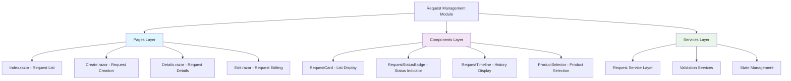
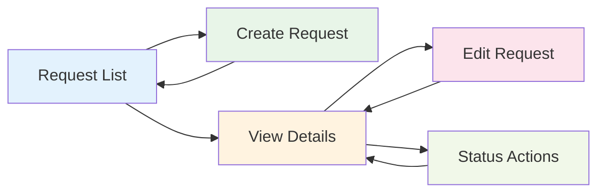

# User Interface Development Design

## Overview

This design document outlines the development of core request management user interface components for the Inventory Control System. The system is built using Blazor WebAssembly with Radzen UI components, following a component-based architecture with clear separation between presentation, business logic, and data access layers.

The design focuses on creating intuitive, responsive, and performant user interfaces for managing inventory requests throughout their lifecycle, from creation to completion. All components will integrate seamlessly with the existing authentication system and maintain consistency with the current application design patterns.

## Technology Stack & Dependencies

The user interface layer leverages the following core technologies:

| Technology | Purpose | Current Version |
|------------|---------|----------------|
| Blazor WebAssembly | Client-side web framework | .NET 8.0 |
| Radzen Blazor | UI component library | Latest stable |
| Blazored LocalStorage | Client-side storage | Latest stable |
| ASP.NET Core Authentication | Security layer | .NET 8.0 |
| SignalR Client | Real-time notifications | .NET 8.0 |

### Existing Infrastructure Integration

The new request management interfaces will build upon established patterns:
- Authentication via CustomAuthenticationStateProvider
- HTTP communication through intercepted HttpClient with JWT token management
- Consistent styling using Radzen Material theme
- Navigation through existing MainLayout and NavMenu components
- Error handling via centralized error management services

## Component Architecture

### Component Hierarchy Structure

The request management system follows a hierarchical component structure that promotes reusability and maintainability:



### Component Definitions and Responsibilities

#### Page Components
- **Request List Page**: Primary interface for browsing, filtering, and searching requests
- **Request Creation Page**: Form-based interface for creating new inventory requests
- **Request Details Page**: Comprehensive view of request information with action capabilities
- **Request Edit Page**: Modification interface with state-dependent field restrictions

#### Reusable Components
- **RequestCard**: Compact display component for list views with quick action buttons
- **RequestStatusBadge**: Visual status representation with consistent styling
- **RequestTimeline**: Interactive timeline showing request progression and history
- **ProductSelector**: Advanced product selection interface with search and validation

### Props and State Management Strategy

Component communication follows established patterns using EventCallback and cascading parameters:

| Pattern | Usage | Example |
|---------|-------|---------|
| Property Binding | Parent-to-child data flow | `<RequestCard Request="@selectedRequest" />` |
| Event Callbacks | Child-to-parent communication | `OnStatusChange.InvokeAsync(newStatus)` |
| Cascading Values | Cross-component state | Authentication context, theme settings |
| Local State | Component-specific data | Form validation, loading indicators |

### Lifecycle Management

Components implement appropriate lifecycle methods for optimal performance:
- **OnInitializedAsync**: Initial data loading and service initialization
- **OnParametersSetAsync**: Reactive updates when parameters change
- **OnAfterRenderAsync**: DOM manipulation and JavaScript interop
- **Dispose**: Cleanup of event subscriptions and resources

## Routing & Navigation

### Route Structure

The request management module introduces the following routing structure:

| Route | Component | Purpose | Authorization |
|-------|-----------|---------|---------------|
| `/requests` | Index.razor | Request list and overview | Authenticated users |
| `/requests/create` | Create.razor | New request creation | Authenticated users |
| `/requests/{id}` | Details.razor | Request details view | Request visibility permissions |
| `/requests/{id}/edit` | Edit.razor | Request modification | Edit permissions |

### Navigation Flow



### Navigation Guards and Authorization

Navigation protection ensures appropriate access control:
- Route-level authorization using `[Authorize]` attributes
- Component-level permission checks for sensitive operations
- Automatic redirection to login for unauthenticated access
- Return URL preservation for seamless user experience

## Styling Strategy

### Design System Consistency

The request management interfaces maintain visual consistency through:

#### Color Palette and Status Indicators
| Status | Color | Usage |
|--------|-------|-------|
| Draft | Gray (#757575) | Unpublished requests |
| Submitted | Blue (#2196F3) | Pending approval |
| Approved | Green (#4CAF50) | Authorized requests |
| In Progress | Orange (#FF9800) | Active processing |
| Completed | Green (#388E3C) | Finished requests |
| Cancelled/Rejected | Red (#F44336) | Terminated requests |

#### Typography and Spacing
- Consistent use of Radzen TextStyle classes
- Standardized spacing using Radzen Gap and AlignItems
- Responsive typography scaling for different screen sizes
- Proper contrast ratios for accessibility compliance

#### Component Styling Patterns
- Card-based layouts for content organization
- Consistent button styling with appropriate variants
- Form field alignment and validation styling
- Loading state indicators and skeleton screens

### Responsive Design Considerations

Components adapt to various screen sizes using:
- Flexible grid layouts with Radzen Stack components
- Responsive breakpoints for mobile, tablet, and desktop
- Touch-friendly interface elements for mobile devices
- Optimized navigation patterns for different form factors

## State Management Architecture

### Local Component State

Each component manages its internal state using appropriate Blazor patterns:

#### Form State Management
- Validation state tracking using EditContext
- Draft saving capabilities for long forms
- Optimistic UI updates with rollback on errors
- Progress indicators for multi-step processes

#### Data Loading States
- Loading indicators during API calls
- Error state handling with user-friendly messages
- Empty state displays for no-data scenarios
- Pagination state for large datasets

### Cross-Component Communication

State sharing between components utilizes:

#### Service-Based State Management
- Centralized request data caching
- Event-driven state updates
- Subscription patterns for real-time updates
- State persistence across navigation

#### Event Broadcasting
- SignalR integration for real-time status updates
- Custom event aggregation for component communication
- Notification system for user feedback
- State synchronization across browser tabs

## API Integration Layer

### Request Service Architecture

The API integration follows established patterns with enhanced request-specific functionality:

#### Service Interface Definition
```
Request Operations:
- GetRequestsAsync(filtering, pagination, sorting parameters)
- GetRequestDetailsAsync(requestId)
- CreateRequestAsync(createRequestDto)
- UpdateRequestAsync(requestId, updateRequestDto)
- DeleteRequestAsync(requestId)
- ChangeStatusAsync(requestId, newStatus, comment)
- AddRequestItemAsync(requestId, requestItemDto)
- RemoveRequestItemAsync(requestId, itemId)
```

#### Error Handling Strategy
- Centralized error processing through existing error handling services
- User-friendly error message translation
- Retry mechanisms for transient failures
- Offline capability detection and messaging

#### Caching and Performance
- Request list caching with configurable expiration
- Optimistic updates for immediate user feedback
- Background refresh for stale data
- Efficient pagination with virtual scrolling

### Data Transfer Objects Integration

The UI layer utilizes existing DTOs with potential extensions:

#### Core DTOs
- **RequestDto**: Basic request information for list views
- **RequestDetailsDto**: Comprehensive request data for detail views
- **TransactionRow**: Transaction history display
- **HistoryRow**: Status change tracking

#### Validation Integration
- Client-side validation using existing validator patterns
- Server-side validation error display
- Real-time validation feedback
- Form submission state management

## Testing Strategy

### Component Testing Approach

Testing follows a comprehensive strategy ensuring reliability and maintainability:

#### Unit Testing
- Component rendering tests using bUnit framework
- Event handler verification
- Parameter binding validation
- State management testing

#### Integration Testing
- API service integration verification
- Authentication flow testing
- Navigation behavior validation
- Error handling scenario testing

#### User Experience Testing
- Responsive design verification across devices
- Accessibility compliance testing
- Performance benchmarking
- Cross-browser compatibility validation

### Test Data Management
- Mock data generation for consistent testing
- Test database seeding for integration tests
- Automated visual regression testing
- Load testing for performance validation

## Security and Authorization

### Access Control Integration

Security measures build upon existing authentication infrastructure:

#### Route Protection
- Authentication requirement for all request management routes
- Role-based access control for administrative functions
- Permission-based feature toggling
- Secure token handling and refresh

#### Data Protection
- Input sanitization and validation
- XSS prevention through proper data binding
- CSRF protection via existing security middleware
- Secure communication through HTTPS enforcement

#### Audit Trail
- User action logging for all request operations
- Change tracking for audit compliance
- Security event monitoring
- Data access logging for compliance

## Performance Optimization

### Loading and Rendering Optimization

Performance considerations ensure responsive user experience:

#### Lazy Loading
- Component lazy loading for improved initial page load
- Image and asset lazy loading
- Progressive data loading for large datasets
- Route-based code splitting

#### Virtualization
- Virtual scrolling for large request lists
- Pagination with infinite scroll option
- Efficient DOM updates through Blazor optimization
- Memory-efficient data handling

#### Caching Strategy
- Browser caching for static assets
- Application-level data caching
- CDN integration for global asset delivery
- Service worker implementation for offline support

### Real-time Updates

SignalR integration provides live updates:
- Request status change notifications
- Real-time collaboration indicators
- Live inventory level updates
- System-wide announcement delivery

## Accessibility and Usability

### Accessibility Compliance

Components follow WCAG 2.1 guidelines:

#### Keyboard Navigation
- Full keyboard accessibility for all interactive elements
- Logical tab order throughout interfaces
- Keyboard shortcuts for frequent actions
- Focus management and visual indicators

#### Screen Reader Support
- Proper ARIA labels and descriptions
- Semantic HTML structure
- Alternative text for visual elements
- Status announcements for dynamic content

#### Visual Accessibility
- High contrast mode support
- Scalable text and interface elements
- Color-blind friendly design choices
- Reduced motion preferences respect

### Usability Enhancements
- Intuitive navigation patterns
- Consistent interaction behaviors
- Helpful error messages and guidance
- Progressive disclosure for complex workflows

## Implementation Phases

### Phase 1: Core Infrastructure (Days 1-2)
- Request service layer implementation
- Base component structure creation
- Authentication integration setup
- Basic routing configuration

### Phase 2: List and Detail Views (Days 3-5)
- Request list page with filtering and pagination
- Request details page with full information display
- RequestCard and RequestStatusBadge components
- Basic CRUD operations implementation

### Phase 3: Creation and Editing (Days 6-8)
- Request creation form with validation
- Request editing capabilities
- ProductSelector component development
- Draft saving functionality

### Phase 4: Advanced Features (Days 9-11)
- RequestTimeline component implementation
- Real-time status updates via SignalR
- Advanced filtering and search capabilities
- Performance optimization and testing

### Phase 5: Polish and Testing (Days 12-14)
- Comprehensive testing implementation
- Accessibility compliance verification
- Performance optimization finalization
- Documentation and deployment preparation