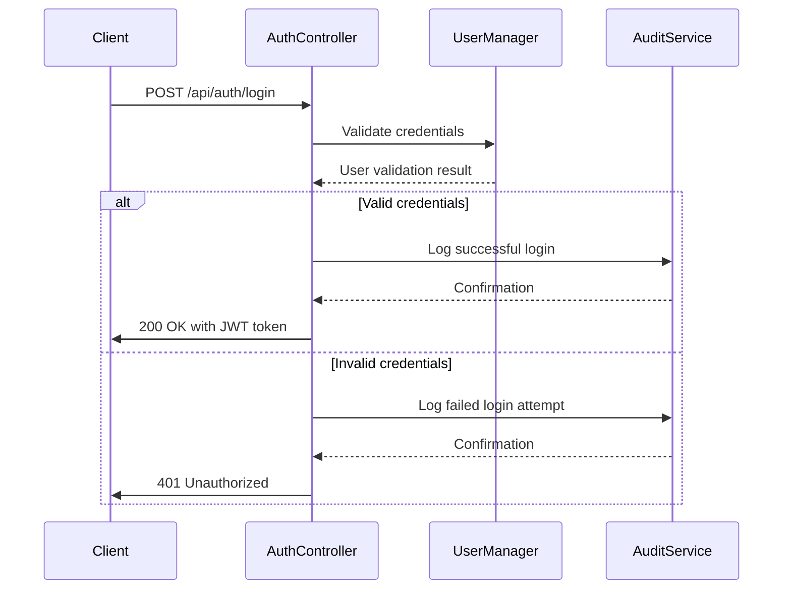
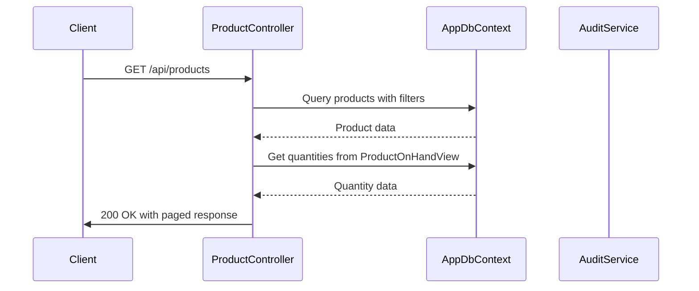
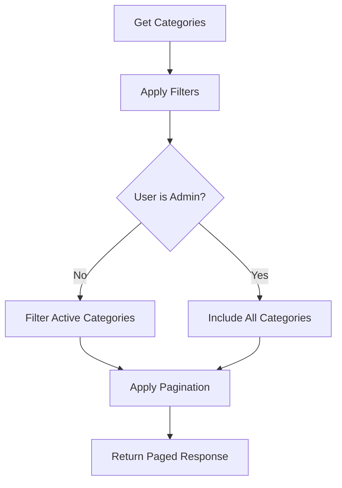

<docs>
# API Endpoints Documentation

<cite>
**Referenced Files in This Document**   
- [ApiEndpoints.cs](file://src/Inventory.Shared/Constants/ApiEndpoints.cs)
- [AuthController.cs](file://src/Inventory.API/Controllers/AuthController.cs)
- [ProductController.cs](file://src/Inventory.API/Controllers/ProductController.cs)
- [CategoryController.cs](file://src/Inventory.API/Controllers/CategoryController.cs)
- [ManufacturerController.cs](file://src/Inventory.API/Controllers/ManufacturerController.cs)
- [WarehouseController.cs](file://src/Inventory.API/Controllers/WarehouseController.cs)
- [TransactionController.cs](file://src/Inventory.API/Controllers/TransactionController.cs)
- [DashboardController.cs](file://src/Inventory.API/Controllers/DashboardController.cs)
- [RequestsController.cs](file://src/Inventory.API/Controllers/RequestsController.cs)
- [AppDbContext.cs](file://src/Inventory.API/Models/AppDbContext.cs)
- [AuditService.cs](file://src/Inventory.API/Services/AuditService.cs)
</cite>

## Table of Contents
1. [Introduction](#introduction)
2. [Authentication Endpoints](#authentication-endpoints)
3. [Product Endpoints](#product-endpoints)
4. [Category Endpoints](#category-endpoints)
5. [Manufacturer Endpoints](#manufacturer-endpoints)
6. [Warehouse Endpoints](#warehouse-endpoints)
7. [Transaction Endpoints](#transaction-endpoints)
8. [Dashboard Endpoints](#dashboard-endpoints)
9. [Request Endpoints](#request-endpoints)
10. [Audit Endpoints](#audit-endpoints)
11. [Integration Patterns](#integration-patterns)
12. [Troubleshooting Guide](#troubleshooting-guide)

## Introduction
The Inventory Control System provides a comprehensive RESTful API for managing inventory operations, including product management, transactions, requests, and analytics. The API follows a consistent pattern with standardized response formats, authentication, and error handling. All endpoints are secured with JWT authentication, and most operations are logged for audit purposes.

The API is organized around key entities such as Products, Categories, Manufacturers, Warehouses, and Transactions. Each controller follows a consistent pattern of GET, POST, PUT, and DELETE operations with appropriate authorization and validation. The system uses a base URL of `/api` with all endpoints prefixed accordingly.

**Section sources**
- [ApiEndpoints.cs](file://src/Inventory.Shared/Constants/ApiEndpoints.cs)

## Authentication Endpoints
The authentication system provides standard JWT-based authentication with token refresh capabilities. All authentication endpoints are accessible without authentication and are rate-limited to prevent abuse.

**Diagram sources**
- [AuthController.cs](file://src/Inventory.API/Controllers/AuthController.cs#L32-L132)

### Login
Authenticates a user and returns a JWT token.

- **Endpoint**: `POST /api/auth/login`
- **Request Body**: `{ "username": "string", "password": "string" }`
- **Response**: JWT token, refresh token, user information, and expiration
- **Status Codes**: 
  - 200: Login successful
  - 400: Invalid request data
  - 401: Invalid credentials

The login process includes detailed audit logging with IP address, user agent, and timestamps. Failed login attempts are also logged for security monitoring.

**Section sources**
- [AuthController.cs](file://src/Inventory.API/Controllers/AuthController.cs#L32-L132)

### Refresh
Refreshes an expired JWT token using a refresh token.

- **Endpoint**: `POST /api/auth/refresh`
- **Request Body**: `{ "username": "string", "refreshToken": "string" }`
- **Response**: New JWT token and refresh token
- **Status Codes**:
  - 200: Token refreshed successfully
  - 400: Invalid request data
  - 401: Invalid or expired refresh token

The refresh process validates the refresh token against the user's stored token and generates a new access token with updated expiration.

**Section sources**
- [AuthController.cs](file://src/Inventory.API/Controllers/AuthController.cs#L134-L188)

### Logout
Logs out the current user by revoking their refresh token.

- **Endpoint**: `POST /api/auth/logout`
- **Authentication**: Required
- **Response**: Confirmation message
- **Status Codes**:
  - 200: Logout successful
  - 401: Unauthorized

The logout process revokes the user's refresh token, preventing future token refresh operations.

**Section sources**
- [AuthController.cs](file://src/Inventory.API/Controllers/AuthController.cs#L190-L214)

### Register
Registers a new user account.

- **Endpoint**: `POST /api/auth/register`
- **Request Body**: `{ "username": "string", "email": "string", "password": "string" }`
- **Response**: Registration confirmation
- **Status Codes**:
  - 201: User created successfully
  - 400: Invalid request data or username/email already exists

User registration includes validation for unique usernames and email addresses, with automatic role assignment.

**Section sources**
- [AuthController.cs](file://src/Inventory.API/Controllers/AuthController.cs#L216-L298)

## Product Endpoints
The product management system provides comprehensive CRUD operations for products with detailed filtering, pagination, and stock management capabilities.

**Diagram sources**
- [ProductController.cs](file://src/Inventory.API/Controllers/ProductController.cs#L19-L138)

### Get Products
Retrieves a paginated list of products with optional filtering.

- **Endpoint**: `GET /api/products`
- **Query Parameters**:
  - `page`: Page number (default: 1)
  - `pageSize`: Items per page (default: 10)
  - `search`: Text search on name, SKU, or description
  - `categoryId`: Filter by category ID
  - `manufacturerId`: Filter by manufacturer ID
  - `isActive`: Filter by active status
- **Response**: Paged list of product DTOs with quantities
- **Status Codes**:
  - 200: Products retrieved successfully
  - 500: Failed to retrieve products

The endpoint applies role-based filtering, showing only active products to non-admin users by default. Product quantities are retrieved from the `ProductOnHandView` database view.

**Section sources**
- [ProductController.cs](file://src/Inventory.API/Controllers/ProductController.cs#L19-L138)

### Get Product
Retrieves a specific product by ID.

- **Endpoint**: `GET /api/products/{id}`
- **Path Parameter**: `id` - Product ID
- **Response**: Product DTO with current quantity
- **Status Codes**:
  - 200: Product retrieved successfully
  - 404: Product not found
  - 500: Failed to retrieve product

**Section sources**
- [ProductController.cs](file://src/Inventory.API/Controllers/ProductController.cs#L140-L198)

### Create Product
Creates a new product.

- **Endpoint**: `POST /api/products`
- **Authentication**: Admin role required for inactive products
- **Request Body**: Product creation DTO
- **Response**: Created product DTO
- **Status Codes**:
  - 201: Product created successfully
  - 400: Invalid model state or SKU already exists
  - 403: Insufficient permissions
  - 500: Failed to create product

The creation process includes SKU uniqueness validation and audit logging of the creation event with all product details.

**Section sources**
- [ProductController.cs](file://src/Inventory.API/Controllers/ProductController.cs#L200-L318)

### Update Product
Updates an existing product.

- **Endpoint**: `PUT /api/products/{id}`
- **Authentication**: Admin role required to modify IsActive status
- **Path Parameter**: `id` - Product ID
- **Request Body**: Product update DTO
- **Response**: Updated product DTO
- **Status Codes**:
  - 200: Product updated successfully
  - 400: Invalid model state
  - 403: Insufficient permissions
  - 404: Product not found
  - 500: Failed to update product

The update process logs both old and new values for audit trail purposes.

**Section sources**
- [ProductController.cs](file://src/Inventory.API/Controllers/ProductController.cs#L320-L448)

### Delete Product
Soft deletes a product by setting its IsActive flag to false.

- **Endpoint**: `DELETE /api/products/{id}`
- **Authentication**: Admin role required
- **Path Parameter**: `id` - Product ID
- **Response**: Deletion confirmation
- **Status Codes**:
  - 200: Product deleted successfully
  - 404: Product not found
  - 500: Failed to delete product

**Section sources**
- [ProductController.cs](file://src/Inventory.API/Controllers/ProductController.cs#L450-L518)

### Adjust Stock
Adjusts the stock quantity for a product through a transaction.

- **Endpoint**: `POST /api/products/{id}/stock/adjust`
- **Path Parameter**: `id` - Product ID
- **Request Body**: `{ "quantity": number, "warehouseId": number, "description": "string" }`
- **Response**: Adjustment confirmation with old and new quantities
- **Status Codes**:
  - 200: Stock adjusted successfully
  - 400: Invalid model state
  - 404: Product not found
  - 500: Failed to adjust stock

The adjustment creates a new inventory transaction rather than directly modifying the product quantity, maintaining an audit trail of all stock changes.

**Section sources**
- [ProductController.cs](file://src/Inventory.API/Controllers/ProductController.cs#L520-L608)

## Category Endpoints
The category system supports hierarchical organization of products with parent-child relationships and soft deletion.

**Diagram sources**
- [CategoryController.cs](file://src/Inventory.API/Controllers/CategoryController.cs#L15-L104)

### Get Categories
Retrieves a paginated list of categories with filtering options.

- **Endpoint**: `GET /api/Category`
- **Query Parameters**:
  - `page`: Page number (default: 1)
  - `pageSize`: Items per page (default: 10)
  - `search`: Text search on name or description
  - `parentId`: Filter by parent category ID
  - `isActive`: Filter by active status
- **Response**: Paged list of category DTOs
- **Status Codes**:
  - 200: Categories retrieved successfully
  - 500: Failed to retrieve categories

Non-admin users only see active categories by default.

**Section sources**
- [CategoryController.cs](file://src/Inventory.API/Controllers/CategoryController.cs#L15-L104)

### Get Category
Retrieves a specific category by ID.

- **Endpoint**: `GET /api/Category/{id}`
- **Path Parameter**: `id` - Category ID
- **Response**: Category DTO
- **Status Codes**:
  - 200: Category retrieved successfully
  - 404: Category not found
  - 500: Failed to retrieve category

**Section sources**
- [CategoryController.cs](file://src/Inventory.API/Controllers/CategoryController.cs#L106-L144)

### Create Category
Creates a new category.

- **Endpoint**: `POST /api/Category`
- **Authentication**: Admin role required
- **Request Body**: Category creation DTO
- **Response**: Created category DTO
- **Status Codes**:
  - 201: Category created successfully
  - 400: Invalid model state or parent category not found
  - 403: Insufficient permissions
  - 500: Failed to create category

The creation process validates that the parent category exists and is active.

**Section sources**
- [CategoryController.cs](file://src/Inventory.API/Controllers/CategoryController.cs#L210-L260)

### Update Category
Updates an existing category.

- **Endpoint**: `PUT /api/Category/{id}`
- **Authentication**: Admin role required
- **Path Parameter**: `id` - Category ID
- **Request Body**: Category update DTO
- **Response**: Updated category DTO
- **Status Codes**:
  - 200: Category updated successfully
  - 400: Invalid model state or parent category not found
  - 403: Insufficient permissions
  - 404: Category not found
  - 500: Failed to update category

**Section sources**
- [CategoryController.cs](file://src/Inventory.API/Controllers/CategoryController.cs#L262-L310)

### Delete Category
Deletes a category if it has no subcategories or products.

- **Endpoint**: `DELETE /api/Category/{id}`
- **Authentication**: Admin role required
- **Path Parameter**: `id` - Category ID
- **Response**: Deletion confirmation
- **Status Codes**:
  - 200: Category deleted successfully
  - 400: Category has subcategories or products
  - 404: Category not found
  - 500: Failed to delete category

The deletion process checks for dependencies before allowing deletion.

**Section sources**
- [CategoryController.cs](file://src/Inventory.API/Controllers/CategoryController.cs#L312-L373)

## Manufacturer Endpoints
The manufacturer system manages supplier information with location associations and product relationships.

### Get Manufacturers
Retrieves a list of all manufacturers with location details.

- **Endpoint**: `GET /api/Manufacturer`
- **Response**: List of manufacturer DTOs with full location path
- **Status Codes**:
  - 200: Manufacturers retrieved successfully
  - 500: Failed to retrieve manufacturers

The endpoint includes the full hierarchical path of the manufacturer's location.

**Section sources**
- [ManufacturerController.cs](file://src/Inventory.API/Controllers/ManufacturerController.cs#L25-L75)

### Get Manufacturer
Retrieves a specific manufacturer by ID.

- **Endpoint**: `GET /api/Manufacturer/{id}`
- **Path Parameter**: `id` - Manufacturer ID
- **Response**: Manufacturer DTO with full location path
- **Status Codes**:
  - 200: Manufacturer retrieved successfully
  - 404: Manufacturer not found
  - 500: Failed to retrieve manufacturer

**Section sources**
- [ManufacturerController.cs](file://src/Inventory.API/Controllers/ManufacturerController.cs#L77-L115)

### Create Manufacturer
Creates a new manufacturer.

- **Endpoint**: `POST /api/Manufacturer`
- **Authentication**: Admin role required
- **Request Body**: Manufacturer creation DTO
- **Response**: Created manufacturer DTO
- **Status Codes**:
  - 201: Manufacturer created successfully
  - 400: Invalid model state, name already exists, or location not found
  - 403: Insufficient permissions
  - 500: Failed to create manufacturer

The creation process validates that the manufacturer name is unique and the location exists.

**Section sources**
- [ManufacturerController.cs](file://src/Inventory.API/Controllers/ManufacturerController.cs#L117-L178)

### Update Manufacturer
Updates an existing manufacturer.

- **Endpoint**: `PUT /api/Manufacturer/{id}`
- **Authentication**: Admin