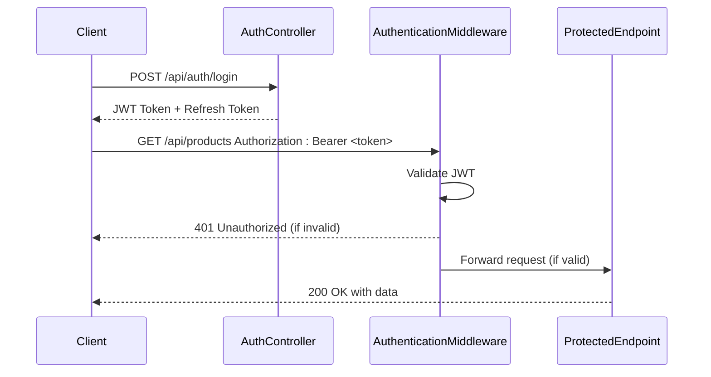
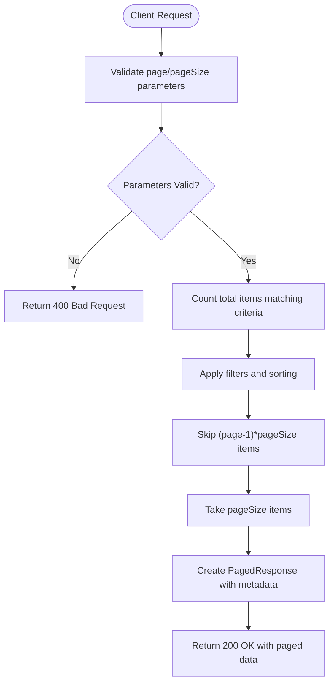
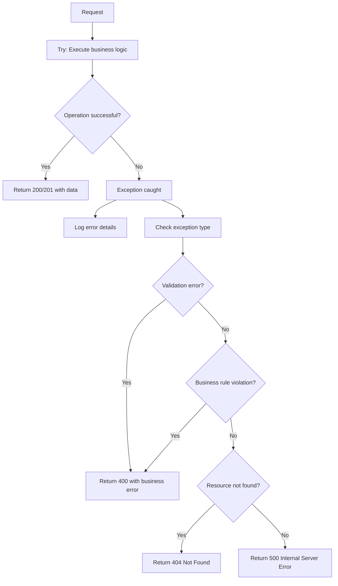
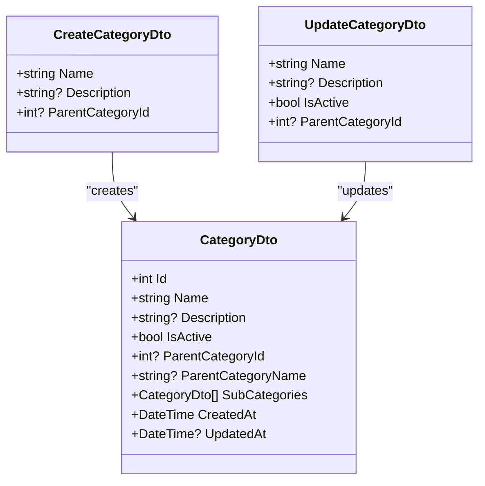
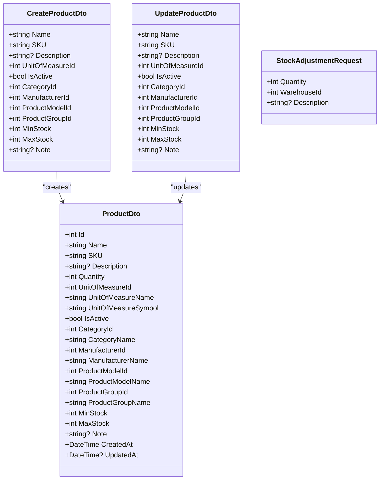
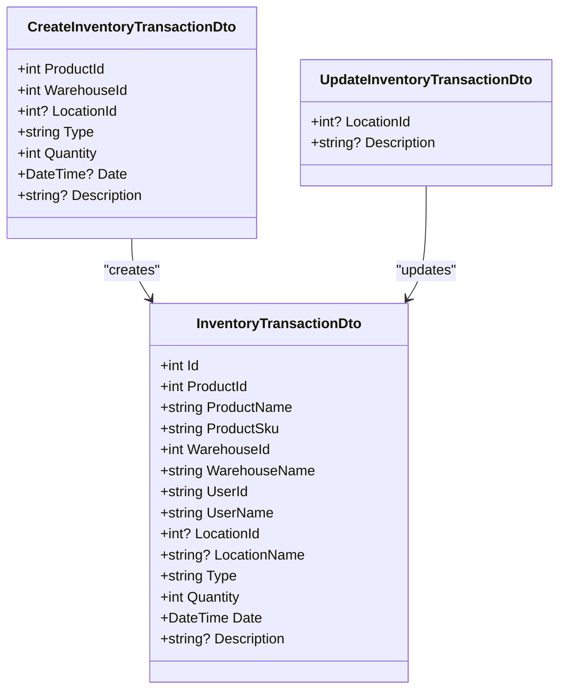

# API Endpoints

<cite>
**Referenced Files in This Document**   
- [ApiEndpoints.cs](file://src/Inventory.Shared/Constants/ApiEndpoints.cs)
- [CategoryController.cs](file://src/Inventory.API/Controllers/CategoryController.cs)
- [ProductController.cs](file://src/Inventory.API/Controllers/ProductController.cs)
- [TransactionController.cs](file://src/Inventory.API/Controllers/TransactionController.cs)
- [UserController.cs](file://src/Inventory.API/Controllers/UserController.cs)
- [AuthController.cs](file://src/Inventory.API/Controllers/AuthController.cs)
- [AuthenticationMiddleware.cs](file://src/Inventory.API/Middleware/AuthenticationMiddleware.cs)
- [CategoryDto.cs](file://src/Inventory.Shared/DTOs/CategoryDto.cs)
- [ProductDto.cs](file://src/Inventory.Shared/DTOs/ProductDto.cs)
- [TransactionDto.cs](file://src/Inventory.Shared/DTOs/TransactionDto.cs)
- [UserDto.cs](file://src/Inventory.Shared/DTOs/UserDto.cs)
- [AuthDto.cs](file://src/Inventory.Shared/DTOs/AuthDto.cs)
</cite>

## Table of Contents
1. [Introduction](#introduction)
2. [Authentication and Authorization](#authentication-and-authorization)
3. [Pagination Implementation](#pagination-implementation)
4. [Error Handling Patterns](#error-handling-patterns)
5. [Category Management](#category-management)
6. [Product Management](#product-management)
7. [Inventory Transactions](#inventory-transactions)
8. [User Management](#user-management)
9. [Authentication Endpoints](#authentication-endpoints)
10. [Swagger/OpenAPI Integration](#swaggeropenapi-integration)

## Introduction

The InventoryCtrl_2 backend provides a comprehensive RESTful API for managing inventory operations. This documentation details all available endpoints, their request/response schemas, authentication requirements, and usage patterns. The API follows standard REST conventions with JSON payloads and uses JWT-based authentication for secure access.

The API is organized around key entities: categories, products, transactions, and users. Each controller provides standard CRUD operations with additional specialized endpoints for specific business operations. All endpoints follow consistent response patterns with proper HTTP status codes and error handling.

**Section sources**
- [ApiEndpoints.cs](file://src/Inventory.Shared/Constants/ApiEndpoints.cs)

## Authentication and Authorization

The API uses JWT-based authentication with role-based authorization. All endpoints except authentication routes require a valid JWT token in the Authorization header with the format `Bearer <token>`.

Authentication is handled by the `AuthenticationMiddleware` which validates JWT tokens and extracts user claims. Public endpoints like login and registration are excluded from authentication requirements.

Role-based authorization is implemented using the `[Authorize(Roles = "RoleName")]` attribute. The system supports at least two roles:
- **Admin**: Full access to all operations including user management and creating inactive entities
- **User**: Standard access to inventory operations

Some endpoints have conditional authorization logic based on user roles. For example, only Admin users can create inactive products or categories, while regular users can only create active ones.



**Diagram sources**
- [AuthenticationMiddleware.cs](file://src/Inventory.API/Middleware/AuthenticationMiddleware.cs)
- [AuthController.cs](file://src/Inventory.API/Controllers/AuthController.cs)

**Section sources**
- [AuthenticationMiddleware.cs](file://src/Inventory.API/Middleware/AuthenticationMiddleware.cs)
- [AuthController.cs](file://src/Inventory.API/Controllers/AuthController.cs)

## Pagination Implementation

Several controllers including `CategoryController`, `ProductController`, `TransactionController`, and `UserController` implement pagination for list endpoints. The pagination system uses a consistent query parameter pattern and response structure across all paginated endpoints.

### Query Parameters

All paginated endpoints support the following query parameters:
- `page`: Page number (default: 1)
- `pageSize`: Number of items per page (default: 10)
- Additional filter parameters specific to the entity

### Response Structure

Paginated responses use the `PagedResponse<T>` and `PagedApiResponse<T>` classes which include:
- `Items`: Array of data objects
- `TotalCount`: Total number of items available (across all pages)
- `PageNumber`: Current page number
- `PageSize`: Number of items per page

For example, the `GET /api/products` endpoint returns a response with pagination metadata that allows clients to navigate through large datasets efficiently.



**Diagram sources**
- [CategoryController.cs](file://src/Inventory.API/Controllers/CategoryController.cs#L15-L104)
- [ProductController.cs](file://src/Inventory.API/Controllers/ProductController.cs#L19-L138)

**Section sources**
- [CategoryController.cs](file://src/Inventory.API/Controllers/CategoryController.cs#L15-L104)
- [ProductController.cs](file://src/Inventory.API/Controllers/ProductController.cs#L19-L138)

## Error Handling Patterns

The API implements a consistent error handling pattern across all controllers. Error responses follow a standardized format with appropriate HTTP status codes.

### Response Format

All error responses use the `ApiResponse<T>` or `PagedApiResponse<T>` classes with the following structure:
- `Success`: Boolean indicating success status
- `ErrorMessage`: Human-readable error message
- `Errors`: Array of validation errors (when applicable)
- `Data`: Response data (null for errors)

### Status Codes

The API uses standard HTTP status codes:
- **200 OK**: Successful GET, PUT, DELETE operations
- **201 Created**: Successful POST operations
- **400 Bad Request**: Validation errors or invalid request data
- **401 Unauthorized**: Missing or invalid authentication token
- **403 Forbidden**: Insufficient permissions for the operation
- **404 Not Found**: Requested resource not found
- **409 Conflict**: Business logic conflict (e.g., duplicate SKU)
- **500 Internal Server Error**: Unexpected server errors

Controllers catch exceptions and return appropriate error responses without exposing sensitive system information.



**Diagram sources**
- [CategoryController.cs](file://src/Inventory.API/Controllers/CategoryController.cs)
- [ProductController.cs](file://src/Inventory.API/Controllers/ProductController.cs)

**Section sources**
- [CategoryController.cs](file://src/Inventory.API/Controllers/CategoryController.cs)
- [ProductController.cs](file://src/Inventory.API/Controllers/ProductController.cs)

## Category Management

The `CategoryController` provides endpoints for managing product categories in a hierarchical structure. Categories can have parent-child relationships and are used to organize products.

### Base URL
`/api/Category`

### Endpoints

#### GET /api/Category
Retrieves a paginated list of categories with filtering options.

**Query Parameters:**
- `page`: Page number
- `pageSize`: Items per page
- `search`: Text search on name/description
- `parentId`: Filter by parent category
- `isActive`: Filter by active status

**Authentication:** All authenticated users  
**Authorization:** All roles  
**Response:** `PagedApiResponse<CategoryDto>`

#### GET /api/Category/{id}
Retrieves a specific category by ID.

**Authentication:** All authenticated users  
**Authorization:** All roles  
**Response:** `ApiResponse<CategoryDto>`

#### GET /api/Category/root
Retrieves all root categories (categories without parents).

**Authentication:** All authenticated users  
**Authorization:** All roles  
**Response:** `ApiResponse<List<CategoryDto>>`

#### GET /api/Category/{parentId}/sub
Retrieves all subcategories for a given parent category.

**Authentication:** All authenticated users  
**Authorization:** All roles  
**Response:** `ApiResponse<List<CategoryDto>>`

#### POST /api/Category
Creates a new category.

**Request Body:** `CreateCategoryDto`
```json
{
  "name": "Electronics",
  "description": "Electronic devices and components",
  "parentCategoryId": 5
}
```

**Authentication:** All authenticated users  
**Authorization:** Admin role required  
**Response:** `ApiResponse<CategoryDto>` with 201 Created status

#### PUT /api/Category/{id}
Updates an existing category.

**Request Body:** `UpdateCategoryDto`
```json
{
  "name": "Updated Electronics",
  "description": "Updated description",
  "isActive": true,
  "parentCategoryId": 5
}
```

**Authentication:** All authenticated users  
**Authorization:** Admin role required  
**Response:** `ApiResponse<CategoryDto>`

#### DELETE /api/Category/{id}
Deletes a category (soft delete).

**Authentication:** All authenticated users  
**Authorization:** Admin role required  
**Constraints:**
- Cannot delete categories with subcategories
- Cannot delete categories with products
- Performs soft delete by setting `isActive` to false

**Response:** `ApiResponse<object>` with success message



**Diagram sources**
- [CategoryDto.cs](file://src/Inventory.Shared/DTOs/CategoryDto.cs)
- [CategoryController.cs](file://src/Inventory.API/Controllers/CategoryController.cs)

**Section sources**
- [CategoryController.cs](file://src/Inventory.API/Controllers/CategoryController.cs)
- [CategoryDto.cs](file://src/Inventory.Shared/DTOs/CategoryDto.cs)

## Product Management

The `ProductController` manages product inventory with comprehensive CRUD operations and specialized endpoints for stock management.

### Base URL
`/api/products`

### Endpoints

#### GET /api/products
Retrieves a paginated list of products with filtering options.

**Query Parameters:**
- `page`: Page number
- `pageSize`: Items per page
- `search`: Text search on name/SKU/description
- `categoryId`: Filter by category
- `manufacturerId`: Filter by manufacturer
- `isActive`: Filter by active status

**Authentication:** All authenticated users  
**Authorization:** All roles  
**Response:** `PagedApiResponse<ProductDto>`

#### GET /api/products/{id}
Retrieves a specific product by ID.

**Authentication:** All authenticated users  
**Authorization:** All roles  
**Response:** `ApiResponse<ProductDto>`

#### GET /api/products/sku/{sku}
Retrieves a product by its SKU.

**Authentication:** All authenticated users  
**Authorization:** All roles  
**Response:** `ApiResponse<ProductDto>`

#### POST /api/products
Creates a new product.

**Request Body:** `CreateProductDto`
```json
{
  "name": "Laptop",
  "sku": "LT-001",
  "description": "High-performance laptop",
  "unitOfMeasureId": 1,
  "isActive": true,
  "categoryId": 10,
  "manufacturerId": 5,
  "productModelId": 3,
  "productGroupId": 2,
  "minStock": 5,
  "maxStock": 100,
  "note": "Important item"
}
```

**Authentication:** All authenticated users  
**Authorization:** 
- Admin: Can create active/inactive products
- Other roles: Can only create active products
- SKU must be unique

**Response:** `ApiResponse<ProductDto>` with 201 Created status

#### PUT /api/products/{id}
Updates an existing product.

**Request Body:** `UpdateProductDto` (same structure as CreateProductDto)

**Authentication:** All authenticated users  
**Authorization:** 
- Admin: Can modify all fields including IsActive
- Other roles: Cannot change IsActive status

**Response:** `ApiResponse<ProductDto>`

#### DELETE /api/products/{id}
Deletes a product (soft delete).

**Authentication:** All authenticated users  
**Authorization:** Admin role required  
**Behavior:** Soft delete by setting `isActive` to false  
**Response:** `ApiResponse<object>` with success message

#### POST /api/products/{id}/stock/adjust
Adjusts the stock quantity for a product.

**Request Body:** `StockAdjustmentRequest`
```json
{
  "quantity": -5,
  "warehouseId": 1,
  "description": "Adjustment for damaged items"
}
```

**Authentication:** All authenticated users  
**Authorization:** All roles  
**Behavior:** Creates a transaction record rather than directly modifying product quantity  
**Response:** `ApiResponse<object>` with old and new quantities



**Diagram sources**
- [ProductDto.cs](file://src/Inventory.Shared/DTOs/ProductDto.cs)
- [ProductController.cs](file://src/Inventory.API/Controllers/ProductController.cs)

**Section sources**
- [ProductController.cs](file://src/Inventory.API/Controllers/ProductController.cs)
- [ProductDto.cs](file://src/Inventory.Shared/DTOs/ProductDto.cs)

## Inventory Transactions

The `TransactionController` manages inventory movements and stock changes through transaction records.

### Base URL
`/api/transactions`

### Endpoints

#### GET /api/transactions
Retrieves a paginated list of transactions with filtering options.

**Query Parameters:**
- `page`: Page number
- `pageSize`: Items per page
- `productId`: Filter by product
- `warehouseId`: Filter by warehouse
- `type`: Filter by transaction type (Pending, Income, Outcome, Install)
- `startDate`: Filter by start date
- `endDate`: Filter by end date

**Authentication:** All authenticated users  
**Authorization:** All roles  
**Response:** `PagedApiResponse<InventoryTransactionDto>`

#### GET /api/transactions/{id}
Retrieves a specific transaction by ID.

**Authentication:** All authenticated users  
**Authorization:** All roles  
**Response:** `ApiResponse<InventoryTransactionDto>`

#### GET /api/transactions/product/{productId}
Retrieves all transactions for a specific product.

**Query Parameters:**
- `page`: Page number
- `pageSize`: Items per page

**Authentication:** All authenticated users  
**Authorization:** All roles  
**Response:** `PagedApiResponse<InventoryTransactionDto>`

#### POST /api/transactions
Creates a new inventory transaction.

**Request Body:** `CreateInventoryTransactionDto`
```json
{
  "productId": 1,
  "warehouseId": 1,
  "locationId": 5,
  "type": "Outcome",
  "quantity": 10,
  "date": "2025-01-15T10:00:00Z",
  "description": "Shipment to customer"
}
```

**Authentication:** All authenticated users  
**Authorization:** All roles  
**Validation:**
- Product and warehouse must exist
- Location must exist if specified
- For Outcome transactions: sufficient stock must be available (validated against ProductOnHand view)

**Response:** `ApiResponse<InventoryTransactionDto>` with 201 Created status



**Diagram sources**
- [TransactionDto.cs](file://src/Inventory.Shared/DTOs/TransactionDto.cs)
- [TransactionController.cs](file://src/Inventory.API/Controllers/TransactionController.cs)

**Section sources**
- [TransactionController.cs](file://src/Inventory.API/Controllers/TransactionController.cs)
- [TransactionDto.cs](file://src/Inventory.Shared/DTOs/TransactionDto.cs)

## User Management

The `UserController` provides administrative functions for user account management.

### Base URL
`/api/user`

### Endpoints

#### GET /api/user/info
Retrieves information about the currently authenticated user.

**Authentication:** All authenticated users  
**Authorization:** All roles  
**Response:** `ApiResponse<object>` with username, userId, and roles

#### GET /api/user
Retrieves a paginated list of users (admin only).

**Query Parameters:**
- `page`: Page number
- `pageSize`: Items per page
- `search`: Text search on username/email
- `role`: Filter by user role

**Authentication:** All authenticated users  
**Authorization:** Admin role required  
**Response:** `PagedApiResponse<UserDto>`

#### GET /api/user/{id}
Retrieves a specific user by ID.

**Authentication:** All authenticated users  
**Authorization:** Admin role required  
**Response:** `ApiResponse<UserDto>`

#### POST /api/user
Creates a new user account.

**Request Body:** `CreateUserDto`
```json
{
  "userName": "johndoe",
  "email": "john@example.com",
  "password": "securepassword123",
  "role": "User",
  "emailConfirmed": true
}
```

**Authentication:** All authenticated users  
**Authorization:** Admin role required  
**Validation:**
- Username must be unique
- Email must be unique
- Password must meet complexity requirements

**Response:** `ApiResponse<UserDto>` with 201 Created status

#### PUT /api/user/{id}
Updates an existing user account.

**Request Body