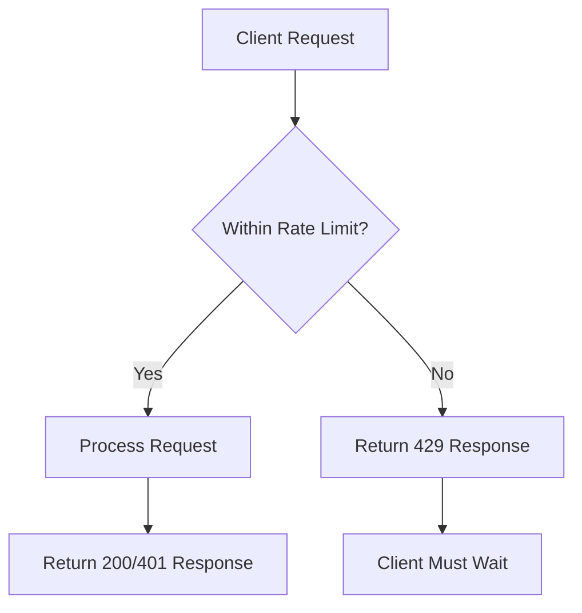
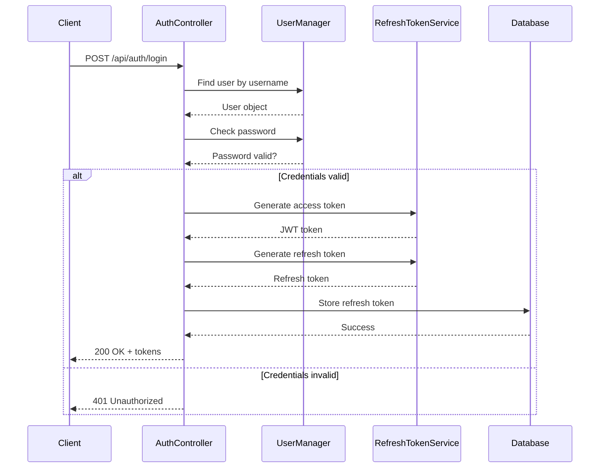

# Authentication API

<cite>
**Referenced Files in This Document**  
- [AuthController.cs](file://src/Inventory.API/Controllers/AuthController.cs)
- [AuthDto.cs](file://src/Inventory.Shared/DTOs/AuthDto.cs)
- [RefreshTokenService.cs](file://src/Inventory.API/Services/RefreshTokenService.cs)
- [appsettings.json](file://src/Inventory.API/appsettings.json)
- [Program.cs](file://src/Inventory.API/Program.cs)
- [AuthenticationMiddleware.cs](file://src/Inventory.API/Middleware/AuthenticationMiddleware.cs)
</cite>

## Table of Contents
1. [Introduction](#introduction)
2. [Authentication Endpoints](#authentication-endpoints)
3. [Request and Response Schemas](#request-and-response-schemas)
4. [JWT Token Management](#jwt-token-management)
5. [Rate Limiting Protection](#rate-limiting-protection)
6. [Authorization and Security](#authorization-and-security)
7. [Error Handling](#error-handling)
8. [Sequence Diagrams](#sequence-diagrams)

## Introduction

The Authentication API provides secure user authentication and authorization functionality for the Inventory Control system. This API handles user login, registration, token refresh, and logout operations using JWT (JSON Web Tokens) with refresh token rotation for enhanced security. The system implements rate limiting to protect against brute force attacks and provides comprehensive audit logging for all authentication events.

The authentication endpoints are designed to be stateless and scalable, following REST principles with clear request/response contracts. All endpoints return standardized API responses with consistent error handling and status codes.

**Section sources**
- [AuthController.cs](file://src/Inventory.API/Controllers/AuthController.cs#L17-L296)

## Authentication Endpoints

### POST /api/auth/login

Authenticates a user with username and password credentials and returns a JWT access token and refresh token.

**Request Parameters**
- **Method**: POST
- **Path**: `/api/auth/login`
- **Authentication**: None (AllowAnonymous)
- **Rate Limiting**: AuthPolicy (5 attempts per 15 minutes per IP)

**Request Body (LoginRequest)**
```json
{
  "username": "string",
  "password": "string"
}
```

**Response Codes**
- `200 OK`: Authentication successful
- `400 Bad Request`: Invalid request data
- `401 Unauthorized`: Invalid credentials
- `429 Too Many Requests`: Rate limit exceeded

**Section sources**
- [AuthController.cs](file://src/Inventory.API/Controllers/AuthController.cs#L32-L132)

### POST /api/auth/register

Registers a new user with username, email, and password.

**Request Parameters**
- **Method**: POST
- **Path**: `/api/auth/register`
- **Authentication**: None (AllowAnonymous)
- **Rate Limiting**: AuthPolicy (5 attempts per 15 minutes per IP)

**Request Body (RegisterRequest)**
```json
{
  "username": "string",
  "email": "string",
  "password": "string",
  "confirmPassword": "string"
}
```

**Response Codes**
- `201 Created`: User created successfully
- `400 Bad Request`: Invalid request data or user already exists
- `429 Too Many Requests`: Rate limit exceeded

**Section sources**
- [AuthController.cs](file://src/Inventory.API/Controllers/AuthController.cs#L221-L274)

### POST /api/auth/refresh

Refreshes an expired JWT access token using a valid refresh token.

**Request Parameters**
- **Method**: POST
- **Path**: `/api/auth/refresh`
- **Authentication**: None (rate limited)
- **Rate Limiting**: AuthPolicy (5 attempts per 15 minutes per IP)

**Request Body (RefreshRequest)**
```json
{
  "username": "string",
  "refreshToken": "string"
}
```

**Response Codes**
- `200 OK`: Token refreshed successfully
- `400 Bad Request`: Invalid request data
- `401 Unauthorized`: Invalid or expired refresh token
- `429 Too Many Requests`: Rate limit exceeded

**Section sources**
- [AuthController.cs](file://src/Inventory.API/Controllers/AuthController.cs#L142-L190)

### POST /api/auth/logout

Invalidates the user's refresh token, effectively logging them out.

**Request Parameters**
- **Method**: POST
- **Path**: `/api/auth/logout`
- **Authentication**: JWT Bearer Token (Authorize)
- **Rate Limiting**: None

**Response Codes**
- `200 OK`: Logout successful
- `401 Unauthorized`: Invalid or missing token

**Section sources**
- [AuthController.cs](file://src/Inventory.API/Controllers/AuthController.cs#L198-L212)

## Request and Response Schemas

### LoginRequest Schema

The LoginRequest DTO defines the structure for authentication requests.

**Properties**
- `Username` (string, required): User's username (3-50 characters, alphanumeric and underscore only)
- `Password` (string, required): User's password (6-100 characters)

**Validation Rules**
- Username must be 3-50 characters long
- Username can only contain letters, numbers, and underscores
- Password must be 6-100 characters long
- Both fields are required

**Section sources**
- [AuthDto.cs](file://src/Inventory.Shared/DTOs/AuthDto.cs#L4-L13)
- [LoginRequestValidator.cs](file://src/Inventory.API/Validators/LoginRequestValidator.cs#L10-L25)

### RegisterRequest Schema

The RegisterRequest DTO defines the structure for user registration.

**Properties**
- `Username` (string, required): Desired username
- `Email` (string, required): User's email address
- `Password` (string, required): Desired password
- `ConfirmPassword` (string, required): Password confirmation

**Validation Rules**
- Email must be in valid email format
- Password and ConfirmPassword must match
- Username and email must be unique in the system

**Section sources**
- [AuthDto.cs](file://src/Inventory.Shared/DTOs/AuthDto.cs#L15-L30)

### LoginResult Schema

The LoginResult DTO contains the response data for successful authentication.

**Properties**
- `Token` (string): JWT access token
- `RefreshToken` (string): Refresh token for token renewal
- `ExpiresAt` (datetime): Token expiration timestamp
- `Username` (string): User's username
- `Email` (string): User's email address
- `Role` (string): User's primary role
- `Roles` (array of strings): All roles assigned to the user

**Section sources**
- [AuthDto.cs](file://src/Inventory.Shared/DTOs/AuthDto.cs#L40-L49)

### ApiResponse Schema

All API endpoints return responses wrapped in the ApiResponse container.

**Properties**
- `Success` (boolean): Indicates if the request was successful
- `Data` (object): Response data (present on success)
- `ErrorMessage` (string): Error message (present on failure)
- `Errors` (array of strings): Validation errors (present on validation failure)
- `Timestamp` (datetime): Response timestamp
- `RequestId` (string): Unique request identifier
- `StatusCode` (integer): HTTP status code

**Section sources**
- [AuthDto.cs](file://src/Inventory.Shared/DTOs/AuthDto.cs#L68-L115)

## JWT Token Management

### Token Structure

JWT tokens are generated with the following claims:

**Standard Claims**
- `sub` (Subject): User ID
- `nameid` (Name Identifier): User ID
- `name` (Name): Username
- `jti` (JWT ID): Unique token identifier
- `email` (Email): User email address
- `exp` (Expiration): Token expiration time

**Custom Claims**
- `role` (Role): User role(s) for authorization
- Any additional user claims stored in the identity system

### Token Expiration

Token expiration is configurable through application settings:

- **Access Token**: Configurable via `Jwt:ExpireMinutes` in appsettings.json (default: 15 minutes)
- **Refresh Token**: Configurable via `Jwt:RefreshTokenExpireDays` in appsettings.json (default: 7 days)

When a token is refreshed, a new refresh token is issued (token rotation) to enhance security and invalidate previous refresh tokens.

### Refresh Token Rotation

The system implements refresh token rotation to prevent replay attacks:

1. When a refresh token is used, it is immediately invalidated
2. A new refresh token is issued with each successful refresh
3. The old refresh token cannot be used again, even if intercepted

This approach ensures that each refresh token can only be used once, significantly improving security.

**Section sources**
- [RefreshTokenService.cs](file://src/Inventory.API/Services/RefreshTokenService.cs#L13-L172)
- [appsettings.json](file://src/Inventory.API/appsettings.json#L5-L12)

## Rate Limiting Protection

The authentication endpoints are protected by rate limiting to prevent brute force attacks.

### AuthPolicy Configuration

The AuthPolicy applies a fixed window rate limiter:

- **Permit Limit**: 5 attempts per window
- **Window**: 15 minutes
- **Partition Key**: Client IP address
- **Queue Limit**: 2 pending requests
- **Rejection Status Code**: 429 Too Many Requests

This configuration allows 5 login attempts from the same IP address within a 15-minute window. Exceeding this limit results in a 429 response until the window resets.



**Diagram sources**
- [Program.cs](file://src/Inventory.API/Program.cs#L315-L350)

**Section sources**
- [Program.cs](file://src/Inventory.API/Program.cs#L315-L350)

## Authorization and Security

### Authentication Attributes

The API uses standard ASP.NET Core authorization attributes:

- `[AllowAnonymous]`: Allows access without authentication (login, register endpoints)
- `[Authorize]`: Requires valid JWT token (logout endpoint)
- `[EnableRateLimiting("AuthPolicy")]`: Applies rate limiting policy

### Authentication Flow

The authentication process follows this sequence:

1. Client sends credentials to `/api/auth/login`
2. Server validates credentials against the user database
3. On success, server generates JWT access token and refresh token
4. Refresh token is stored in the user record in the database
5. Client receives tokens and includes JWT in Authorization header for subsequent requests



**Diagram sources**
- [AuthController.cs](file://src/Inventory.API/Controllers/AuthController.cs#L32-L132)
- [RefreshTokenService.cs](file://src/Inventory.API/Services/RefreshTokenService.cs#L13-L172)

**Section sources**
- [AuthController.cs](file://src/Inventory.API/Controllers/AuthController.cs#L32-L132)
- [AuthenticationMiddleware.cs](file://src/Inventory.API/Middleware/AuthenticationMiddleware.cs#L45-L167)

### Role-Based Authorization

The system supports role-based authorization with the following roles:
- Admin
- Manager
- User

Roles are included in the JWT token as claims and can be used to restrict access to specific endpoints or functionality.

## Error Handling

### Common Error Scenarios

**Invalid Credentials**
- **Status**: 401 Unauthorized
- **Response**: `{"success": false, "errorMessage": "Invalid credentials"}`
- **Audit Log**: LOGIN_FAILED event with attempt details

**Account Locked**
- The system does not currently implement account locking after failed attempts, but logs all failed login attempts for monitoring
- Rate limiting prevents brute force attacks by limiting attempts per IP

**Expired Token**
- **Status**: 401 Unauthorized
- **Response**: `{"success": false, "errorMessage": "Unauthorized access. Please log in."}`
- **Client Action**: Use refresh token to obtain new access token

**Invalid Refresh Token**
- **Status**: 401 Unauthorized
- **Response**: `{"success": false, "errorMessage": "Invalid or expired refresh token"}`
- **Client Action**: Require user to log in again

### Audit Logging

All authentication events are logged with detailed information:

**Successful Login**
- Action: LOGIN_SUCCESS
- Details: Username, email, role, login time, IP address, user agent, token expiration

**Failed Login**
- Action: LOGIN_FAILED
- Details: Username, reason, attempt time, IP address, user agent

**Logout**
- Action: LOGOUT
- Details: Username, logout time, IP address

**Section sources**
- [AuthController.cs](file://src/Inventory.API/Controllers/AuthController.cs#L32-L132)
- [AuthController.cs](file://src/Inventory.API/Controllers/AuthController.cs#L142-L190)

## Sequence Diagrams

### Successful Authentication Flow

```mermaid
sequenceDiagram
    participant Client
    participant AuthController
    participant UserManager
    participant RefreshTokenService
    participant Database
    participant AuditService
    
    Client->>AuthController: POST /api/auth/login
    AuthController->>UserManager: Find user by username
    UserManager-->>AuthController: User object
    AuthController->>UserManager: Check password
    UserManager-->>AuthController: Password valid
    AuthController->>RefreshTokenService: Generate access token
    RefreshTokenService-->>AuthController: JWT token
    AuthController->>RefreshTokenService: Generate refresh token
    RefreshTokenService-->>AuthController: Refresh token
    AuthController