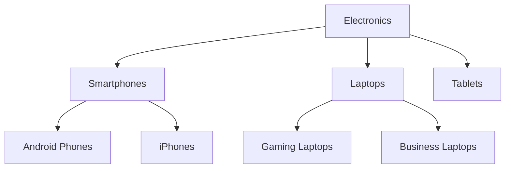
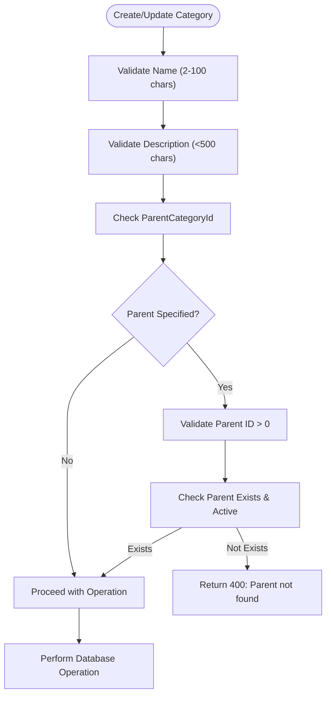
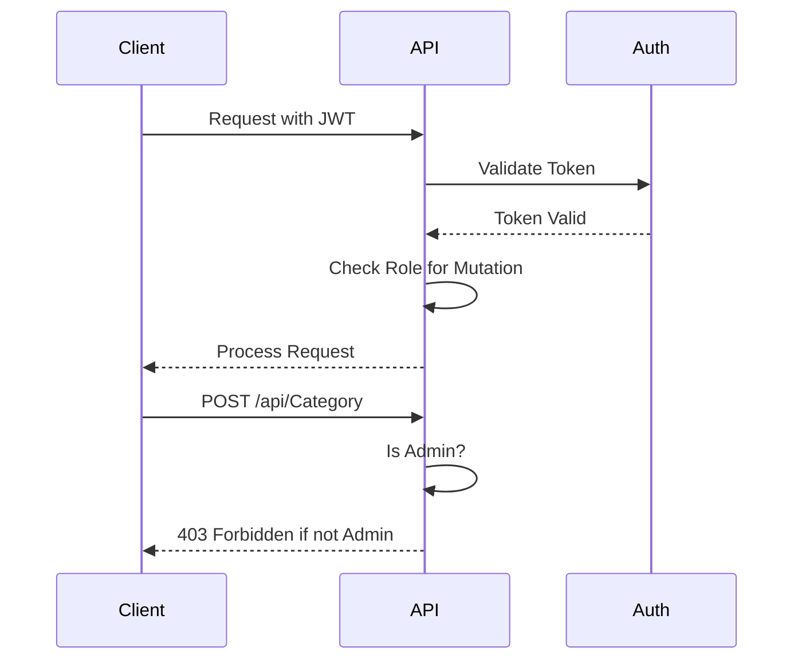
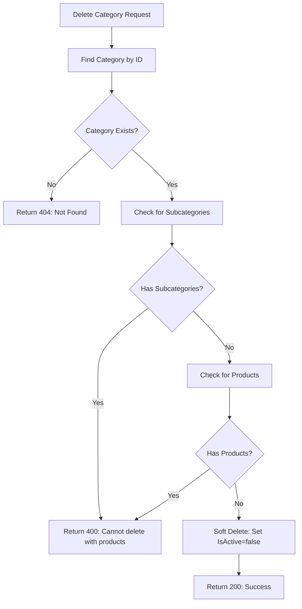

# Category API

<cite>
**Referenced Files in This Document**   
- [CategoryController.cs](file://src/Inventory.API/Controllers/CategoryController.cs)
- [CategoryDto.cs](file://src/Inventory.Shared/DTOs/CategoryDto.cs)
- [CreateCategoryDtoValidator.cs](file://src/Inventory.API/Validators/CreateCategoryDtoValidator.cs)
- [UpdateCategoryDtoValidator.cs](file://src/Inventory.API/Validators/UpdateCategoryDtoValidator.cs)
- [Category.cs](file://src/Inventory.API/Models/Category.cs)
</cite>

## Table of Contents
1. [Introduction](#introduction)
2. [Core Endpoints](#core-endpoints)
3. [Request/Response Schemas](#requestresponse-schemas)
4. [Hierarchical Structure](#hierarchical-structure)
5. [Validation Rules](#validation-rules)
6. [Authentication and Authorization](#authentication-and-authorization)
7. [Usage Examples](#usage-examples)
8. [Error Handling](#error-handling)
9. [Pagination](#pagination)

## Introduction
The Category API provides comprehensive CRUD operations for managing product categories in a hierarchical structure. The system supports nested categories through parent-child relationships using the `parentId` field. All endpoints are secured with JWT authentication and require specific role-based authorization. The API enables efficient retrieval of category trees, root categories, and subcategories with support for filtering, searching, and pagination.

**Section sources**
- [CategoryController.cs](file://src/Inventory.API/Controllers/CategoryController.cs#L10-L422)

## Core Endpoints

### POST /api/Category
Creates a new category. Requires Admin role. The request body must conform to `CreateCategoryDto` schema. Returns 201 Created with location header pointing to the created resource.

### GET /api/Category
Retrieves a paginated list of categories with optional filtering by search term, parent ID, and active status. Non-admin users only see active categories by default.

### GET /api/Category/root
Retrieves all root-level categories (categories without parents). Returns only active root categories.

### GET /api/Category/{parentId}/sub
Retrieves all direct subcategories of a specified parent category. Returns only active subcategories.

**Section sources**
- [CategoryController.cs](file://src/Inventory.API/Controllers/CategoryController.cs#L15-L104)
- [CategoryController.cs](file://src/Inventory.API/Controllers/CategoryController.cs#L138-L182)
- [CategoryController.cs](file://src/Inventory.API/Controllers/CategoryController.cs#L214-L282)

## Request/Response Schemas

### CreateCategoryDto
```json
{
  "name": "string (required, 2-100 characters)",
  "description": "string (optional, max 500 characters)",
  "parentCategoryId": "integer (optional, must reference existing active category)"
}
```

### UpdateCategoryDto
```json
{
  "name": "string (required, 2-100 characters)",
  "description": "string (optional, max 500 characters)",
  "isActive": "boolean (default: true)",
  "parentCategoryId": "integer (optional, must reference existing active category)"
}
```

### CategoryDto (Response)
```json
{
  "id": "integer",
  "name": "string",
  "description": "string",
  "isActive": "boolean",
  "parentCategoryId": "integer",
  "parentCategoryName": "string",
  "subCategories": "array of CategoryDto",
  "createdAt": "datetime",
  "updatedAt": "datetime"
}
```

**Section sources**
- [CategoryDto.cs](file://src/Inventory.Shared/DTOs/CategoryDto.cs#L17-L40)

## Hierarchical Structure

The category system implements a tree structure using parent-child relationships. Each category can have zero or one parent, and zero or more children. Root categories have `parentCategoryId` set to null.



**Diagram sources**
- [Category.cs](file://src/Inventory.API/Models/Category.cs#L9-L10)
- [CategoryDto.cs](file://src/Inventory.Shared/DTOs/CategoryDto.cs#L27)

## Validation Rules

### CreateCategoryDtoValidator
- Name: Required, 2-100 characters
- Description: Maximum 500 characters
- ParentCategoryId: Must be greater than 0 when specified
- Parent category must exist and be active

### UpdateCategoryDtoValidator
- Name: Required, 2-100 characters
- Description: Maximum 500 characters
- ParentCategoryId: Must be greater than 0 when specified
- Parent category must exist and be active



**Diagram sources**
- [CreateCategoryDtoValidator.cs](file://src/Inventory.API/Validators/CreateCategoryDtoValidator.cs#L8-L29)
- [UpdateCategoryDtoValidator.cs](file://src/Inventory.API/Validators/UpdateCategoryDtoValidator.cs#L8-L29)

## Authentication and Authorization

All Category API endpoints require JWT authentication. The `[Authorize]` attribute is applied at the controller level. Specific endpoints require role-based authorization:

- **Admin Role**: Required for POST, PUT, DELETE operations
- **Manager Role**: Not explicitly mentioned in code, but would have same permissions as Admin based on implementation
- **User Role**: Read-only access to active categories



**Section sources**
- [CategoryController.cs](file://src/Inventory.API/Controllers/CategoryController.cs#L214-L282)
- [CategoryController.cs](file://src/Inventory.API/Controllers/CategoryController.cs#L284-L354)

## Usage Examples

### Creating Nested Categories
```http
POST /api/Category HTTP/1.1
Content-Type: application/json
Authorization: Bearer <token>

{
  "name": "Electronics",
  "description": "Electronic devices"
}
```

```http
POST /api/Category HTTP/1.1
Content-Type: application/json
Authorization: Bearer <token>

{
  "name": "Smartphones",
  "description": "Mobile phones",
  "parentCategoryId": 1
}
```

### Retrieving Category Tree
```http
GET /api/Category?parentId=1 HTTP/1.1
Authorization: Bearer <token>
```

**Section sources**
- [CategoryController.cs](file://src/Inventory.API/Controllers/CategoryController.cs#L214-L282)
- [CategoryController.cs](file://src/Inventory.API/Controllers/CategoryController.cs#L15-L104)

## Error Handling

The API implements comprehensive error handling for various scenarios:

### Invalid Parent ID
When creating or updating a category with a non-existent parent ID:
```json
{
  "success": false,
  "errorMessage": "Parent category not found"
}
```

### Circular Reference Prevention
The system prevents circular references by validating that a category cannot be its own parent or ancestor. This is enforced through business logic that checks parent existence.

### Deletion Constraints
Categories cannot be deleted if they have:
- Active subcategories
- Associated products



**Section sources**
- [CategoryController.cs](file://src/Inventory.API/Controllers/CategoryController.cs#L356-L421)

## Pagination

The GET /api/Category endpoint supports pagination with the following parameters:

| Parameter | Type | Default | Description |
|---------|------|---------|-------------|
| page | integer | 1 | Page number (1-based) |
| pageSize | integer | 10 | Number of items per page |
| search | string | null | Search term for name/description |
| parentId | integer | null | Filter by parent category ID |
| isActive | boolean | null | Filter by active status |

The response includes metadata:
```json
{
  "success": true,
  "data": {
    "items": [...],
    "totalCount": 25,
    "pageNumber": 1,
    "pageSize": 10,
    "totalPages": 3
  }
}
```

**Section sources**
- [CategoryController.cs](file://src/Inventory.API/Controllers/CategoryController.cs#L15-L104)