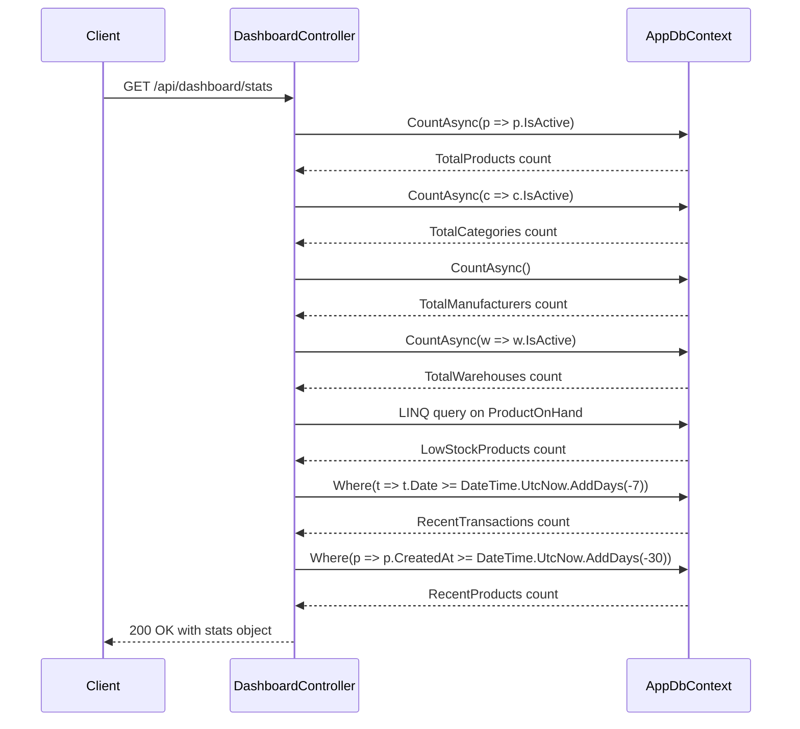
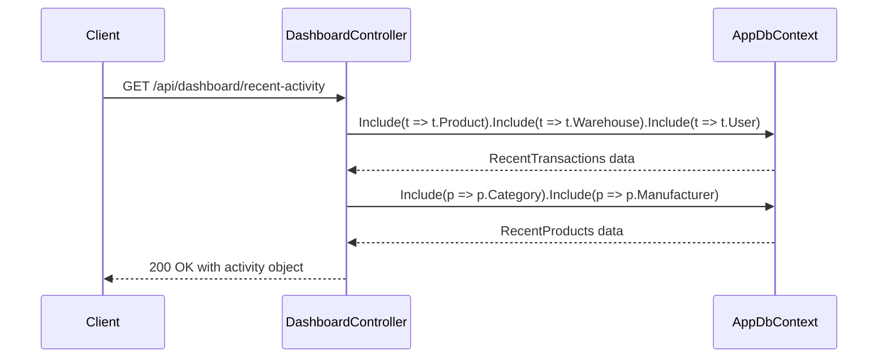
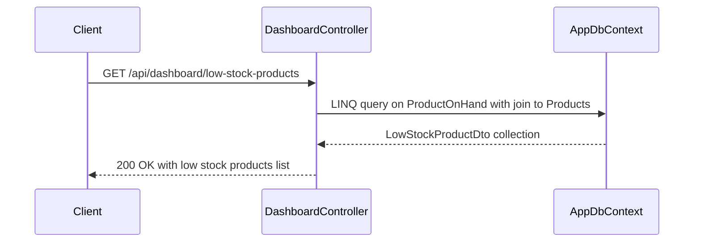
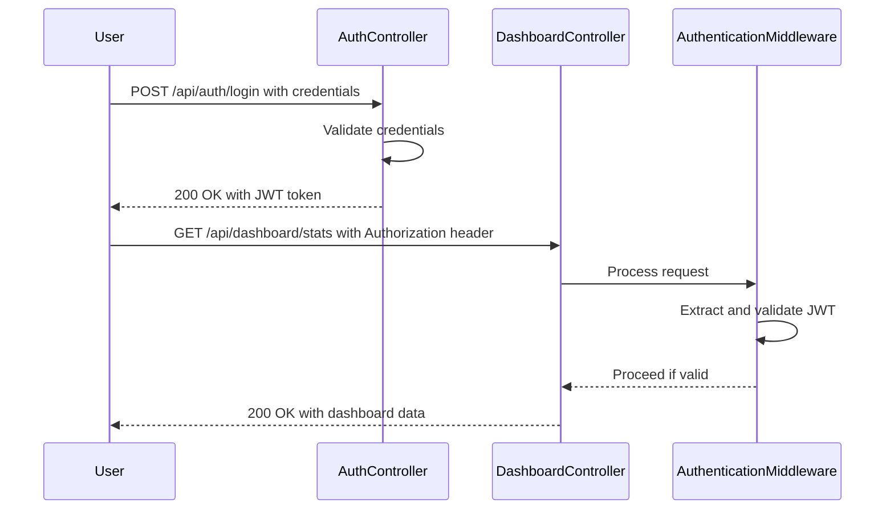
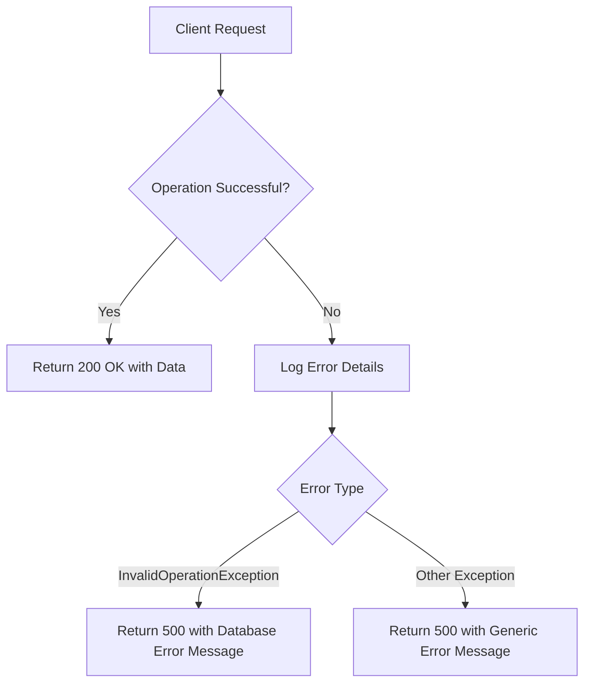
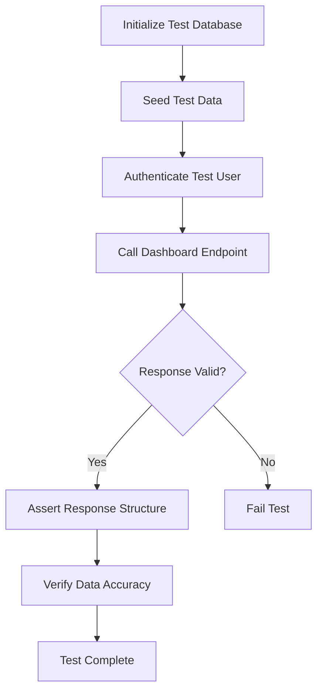

# Dashboard API

<cite>
**Referenced Files in This Document**  
- [DashboardController.cs](file://src/Inventory.API/Controllers/DashboardController.cs)
- [DashboardDto.cs](file://src/Inventory.Shared/DTOs/DashboardDto.cs)
- [ApiEndpoints.cs](file://src/Inventory.Shared/Constants/ApiEndpoints.cs)
- [AuthenticationMiddleware.cs](file://src/Inventory.API/Middleware/AuthenticationMiddleware.cs)
- [AuthController.cs](file://src/Inventory.API/Controllers/AuthController.cs)
- [DashboardControllerIntegrationTests.cs](file://test/Inventory.IntegrationTests/Controllers/DashboardControllerIntegrationTests.cs)
</cite>

## Table of Contents
1. [Introduction](#introduction)
2. [API Endpoints](#api-endpoints)
3. [Response Schema](#response-schema)
4. [Authentication and Authorization](#authentication-and-authorization)
5. [Caching and Performance](#caching-and-performance)
6. [Error Handling](#error-handling)
7. [UI Integration](#ui-integration)
8. [Testing](#testing)
9. [Conclusion](#conclusion)

## Introduction

The Dashboard API provides essential analytics and summary data for the inventory management system, offering real-time insights into key performance indicators. This API serves as the backbone for the system's dashboard functionality, delivering critical metrics that help administrators and managers monitor inventory health, track recent activities, and identify potential stock issues. The endpoints are designed to provide comprehensive overviews with optimized database queries that leverage Entity Framework's capabilities for efficient data retrieval.

The dashboard system focuses on three primary areas: overall system statistics, recent operational activities, and inventory health monitoring. Each endpoint is carefully designed to deliver relevant information with appropriate data filtering and aggregation, ensuring that users receive timely and actionable insights without overwhelming the system with excessive data transfers.

**Section sources**
- [DashboardController.cs](file://src/Inventory.API/Controllers/DashboardController.cs#L8-L226)

## API Endpoints

### GET /api/dashboard/stats

This endpoint retrieves comprehensive system statistics that serve as key performance indicators for the inventory management system. The response includes counts of active products, categories, manufacturers, and warehouses, along with inventory health metrics such as low-stock and out-of-stock product counts. The endpoint also provides recent activity metrics, including transactions from the past seven days and new products added in the last thirty days.

The implementation uses optimized Entity Framework queries with `CountAsync` operations to efficiently retrieve aggregate data without loading entire entity collections into memory. The query for low-stock products specifically joins the `ProductOnHand` view with the `Products` table to accurately determine items that have fallen below their minimum stock thresholds.

**Diagram sources**
- [DashboardController.cs](file://src/Inventory.API/Controllers/DashboardController.cs#L13-L88)

**Section sources**
- [DashboardController.cs](file://src/Inventory.API/Controllers/DashboardController.cs#L13-L88)

### GET /api/dashboard/recent-activity

This endpoint provides a detailed view of recent system activities, combining recent inventory transactions with newly added products. The response includes the ten most recent transactions from the past seven days, showing product details, transaction types, quantities, dates, and associated users and warehouses. Additionally, it returns the five most recently created products with their basic information and creation timestamps.

The implementation uses Entity Framework's `Include` method to eagerly load related entities (Product, Warehouse, User, Category, Manufacturer) in a single database query, minimizing round trips to the database. The `Take(10)` and `Take(5)` operations ensure that the response size remains manageable while providing sufficient context for recent activities.

**Diagram sources**
- [DashboardController.cs](file://src/Inventory.API/Controllers/DashboardController.cs#L90-L171)

**Section sources**
- [DashboardController.cs](file://src/Inventory.API/Controllers/DashboardController.cs#L90-L171)

### GET /api/dashboard/low-stock-products

This endpoint retrieves a detailed list of products that are currently below their minimum stock thresholds. The response includes comprehensive product information such as ID, name, SKU, current quantity, minimum and maximum stock levels, category, manufacturer, and unit of measure. The results are ordered by current quantity in ascending order, prioritizing the most critically low items.

The implementation uses a LINQ query that joins the `ProductOnHand` view with the `Products` table to accurately determine stock levels, ensuring data consistency across the inventory system. The query specifically filters for active products with current quantities less than or equal to their minimum stock thresholds, providing a precise view of inventory health issues.

**Diagram sources**
- [DashboardController.cs](file://src/Inventory.API/Controllers/DashboardController.cs#L173-L225)

**Section sources**
- [DashboardController.cs](file://src/Inventory.API/Controllers/DashboardController.cs#L173-L225)

## Response Schema

### Dashboard Statistics Response

The `/api/dashboard/stats` endpoint returns a JSON object containing key performance indicators for the inventory system. The response structure includes:

| Property | Type | Description |
|---------|------|-------------|
| TotalProducts | integer | Count of active products in the system |
| TotalCategories | integer | Count of active product categories |
| TotalManufacturers | integer | Total count of manufacturers |
| TotalWarehouses | integer | Count of active warehouses |
| LowStockProducts | integer | Number of products with quantity at or below minimum stock threshold |
| OutOfStockProducts | integer | Number of products with zero quantity |
| RecentTransactions | integer | Count of inventory transactions in the last 7 days |
| RecentProducts | integer | Count of products created in the last 30 days |

**Section sources**
- [DashboardDto.cs](file://src/Inventory.Shared/DTOs/DashboardDto.cs#L2-L12)

### Recent Activity Response

The `/api/dashboard/recent-activity` endpoint returns a JSON object containing recent system activities with two main collections:

| Property | Type | Description |
|---------|------|-------------|
| RecentTransactions | array | List of the 10 most recent inventory transactions |
| RecentProducts | array | List of the 5 most recently created products |

Each transaction includes: Id, ProductName, ProductSku, Type, Quantity, Date, UserName, WarehouseName, and Description. Each recent product includes: Id, Name, SKU, Quantity, CategoryName, ManufacturerName, and CreatedAt.

**Section sources**
- [DashboardDto.cs](file://src/Inventory.Shared/DTOs/DashboardDto.cs#L51-L55)

### Low Stock Products Response

The `/api/dashboard/low-stock-products` endpoint returns an array of `LowStockProductDto` objects, each containing detailed information about products below their minimum stock levels:

| Property | Type | Description |
|---------|------|-------------|
| Id | integer | Unique identifier of the product |
| Name | string | Product name |
| SKU | string | Stock Keeping Unit identifier |
| CurrentQuantity | integer | Current inventory quantity |
| MinStock | integer | Minimum stock threshold |
| MaxStock | integer | Maximum stock threshold |
| CategoryName | string | Name of the product category |
| ManufacturerName | string | Name of the manufacturer |
| UnitOfMeasureSymbol | string | Symbol of the unit of measure (e.g., "pcs", "kg") |

**Section sources**
- [DashboardDto.cs](file://src/Inventory.Shared/DTOs/DashboardDto.cs#L38-L49)

## Authentication and Authorization

### JWT Authentication

All dashboard endpoints require JWT (JSON Web Token) authentication, enforced by the `[Authorize]` attribute on the `DashboardController`. The authentication process is handled by the custom `AuthenticationMiddleware` which validates the JWT token present in the `Authorization` header with the format `Bearer <token>`. The middleware verifies the token's signature, expiration, issuer, and audience against the configuration settings in the application.

The authentication flow begins with users obtaining a JWT token through the `/api/auth/login` endpoint by providing valid credentials. This token must then be included in the `Authorization` header for all subsequent requests to protected endpoints, including all dashboard APIs.

**Diagram sources**
- [AuthController.cs](file://src/Inventory.API/Controllers/AuthController.cs#L45-L120)
- [AuthenticationMiddleware.cs](file://src/Inventory.API/Middleware/AuthenticationMiddleware.cs#L45-L120)

**Section sources**
- [AuthenticationMiddleware.cs](file://src/Inventory.API/Middleware/AuthenticationMiddleware.cs#L1-L167)
- [AuthController.cs](file://src/Inventory.API/Controllers/AuthController.cs#L45-L120)

### Role-Based Authorization

The dashboard endpoints support role-based authorization, allowing access to users with Admin, Manager, and User roles. The system implements a hierarchical role structure where higher-level roles inherit the permissions of lower-level roles. While all authorized users can access the dashboard data, the underlying authorization framework is designed to support future role-specific data filtering or access restrictions.

The role information is stored in the user entity and included in the JWT token upon successful authentication, allowing the authorization system to make access decisions based on the user's assigned role. This approach enables efficient authorization checks without requiring additional database queries during request processing.

**Section sources**
- [AuthController.cs](file://src/Inventory.API/Controllers/AuthController.cs#L45-L120)

## Caching and Performance

### Query Optimization

The dashboard endpoints implement several performance optimization techniques to ensure responsive data retrieval. The statistics endpoint uses `CountAsync` operations instead of retrieving entire entity collections, significantly reducing database load and network transfer. The low-stock products endpoint leverages a direct query on the `ProductOnHand` view, which is optimized for inventory quantity lookups, avoiding expensive joins or calculations during runtime.

For recent activity data, the implementation uses Entity Framework's `Include` method to eagerly load related entities in a single database query, preventing the N+1 query problem that could occur with lazy loading. The use of `Take(10)` and `Take(5)` operations ensures that result sets remain small and predictable, contributing to consistent response times regardless of data volume.

### Client-Side Caching Strategy

While the server-side implementation does not include explicit response caching, the client applications implement a resilient service layer that incorporates retry mechanisms and potential caching. The `DashboardApiService` in the shared services layer includes optional retry functionality through the `IRetryService`, which can be configured to handle transient failures and potentially cache responses to reduce server load during periods of high demand.

The client-side architecture is designed to support caching at the service level, allowing applications to implement caching strategies based on their specific requirements. This approach provides flexibility for different client types (web, mobile, desktop) to implement caching mechanisms appropriate to their usage patterns and performance requirements.

**Section sources**
- [DashboardController.cs](file://src/Inventory.API/Controllers/DashboardController.cs#L13-L225)
- [DashboardApiService.cs](file://src/Inventory.Shared/Services/DashboardApiService.cs#L1-L66)

## Error Handling

### Server-Side Error Responses

The dashboard endpoints implement comprehensive error handling to ensure reliable operation and meaningful feedback to clients. The controller methods are wrapped in try-catch blocks that handle both `InvalidOperationException` (typically database operation errors) and general `Exception` types. When errors occur, the endpoints return HTTP 500 status codes with a structured error response containing a success flag set to false and an appropriate error message.

The error handling includes detailed logging using the `ILogger` interface, capturing both the exception details and contextual information about the failed operation. This logging approach facilitates troubleshooting and monitoring of the API's health and performance.

**Diagram sources**
- [DashboardController.cs](file://src/Inventory.API/Controllers/DashboardController.cs#L13-L225)

**Section sources**
- [DashboardController.cs](file://src/Inventory.API/Controllers/DashboardController.cs#L13-L225)

### Client-Side Resilience

The client applications implement additional resilience through the `RetryService` which can be injected into the `DashboardApiService`. This service provides configurable retry policies for transient failures, enhancing the reliability of dashboard data retrieval in unstable network conditions. The retry mechanism is particularly valuable for dashboard data, which is typically consumed in real-time monitoring scenarios where temporary connectivity issues should not disrupt the user experience.

The error handling strategy follows a layered approach, with server-side validation and error handling complemented by client-side resilience patterns. This comprehensive approach ensures that the dashboard functionality remains available and responsive even under suboptimal conditions.

**Section sources**
- [DashboardApiService.cs](file://src/Inventory.Shared/Services/DashboardApiService.cs#L1-L66)

## UI Integration

### Component Integration

The dashboard data is integrated into the user interface through dedicated components in the `Inventory.UI` project. The `StatsWidget.razor`, `RecentActivity.razor`, and `LowStockAlert.razor` components consume the dashboard API endpoints to display key metrics, recent activities, and low-stock warnings respectively. These components are designed to provide an intuitive and responsive user experience, with visual indicators that highlight critical information.

The integration follows a service-oriented architecture, with the `WebDashboardApiService` providing a clean interface between the UI components and the underlying HTTP API. This abstraction layer allows for consistent error handling, retry logic, and potential caching across all dashboard-related functionality.

### Data Visualization

The UI components transform the raw API responses into visually engaging representations of the data. The statistics are typically displayed as summary cards with large, easily readable numbers and appropriate icons. Recent activities are presented in a timeline or list format, with color-coding to distinguish between different transaction types. Low-stock products are highlighted with warning indicators, often using color gradients to represent the severity of the stock shortage.

The integration approach emphasizes performance and responsiveness, with components designed to handle loading states, empty data scenarios, and error conditions gracefully. This ensures a smooth user experience even when data is being retrieved or when issues occur with the API.

**Section sources**
- [StatsWidget.razor.css](file://src/Inventory.UI/Components/Dashboard/StatsWidget.razor.css)
- [RecentActivity.razor.css](file://src/Inventory.UI/Components/Dashboard/RecentActivity.razor.css)
- [LowStockAlert.razor.css](file://src/Inventory.UI/Components/Dashboard/LowStockAlert.razor.css)

## Testing

### Integration Testing

The dashboard endpoints are thoroughly tested through integration tests in the `DashboardControllerIntegrationTests` class. These tests verify the end-to-end functionality of each endpoint, including proper authentication requirements, correct data retrieval, and appropriate error handling. The test suite includes scenarios for both successful operations with valid data and edge cases such as empty databases or unauthorized access attempts.

The integration tests validate that the endpoints return the expected HTTP status codes and response structures under various conditions. For example, the test `GetDashboardStats_WithoutAuthentication_ShouldReturnUnauthorized` confirms that the endpoint properly enforces authentication by returning a 401 status code when accessed without valid credentials.

**