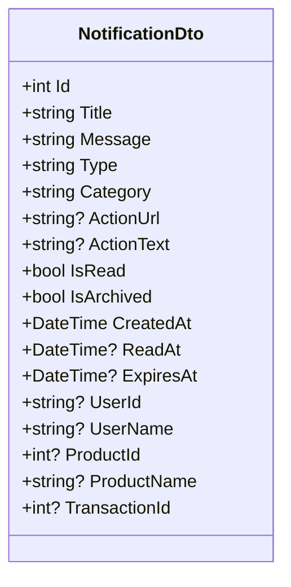
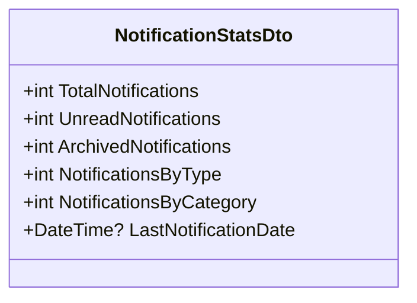
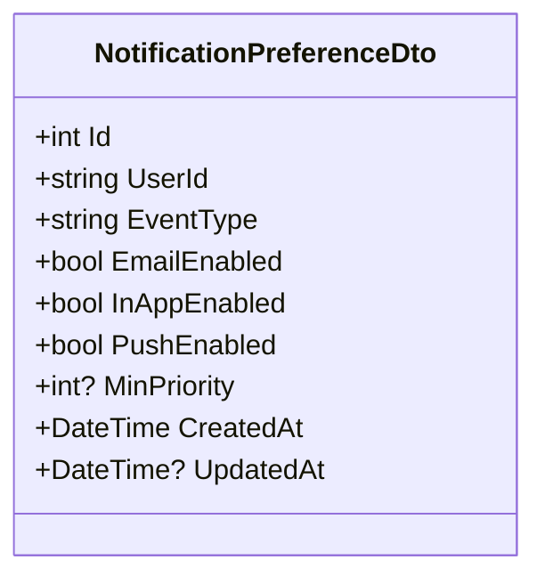
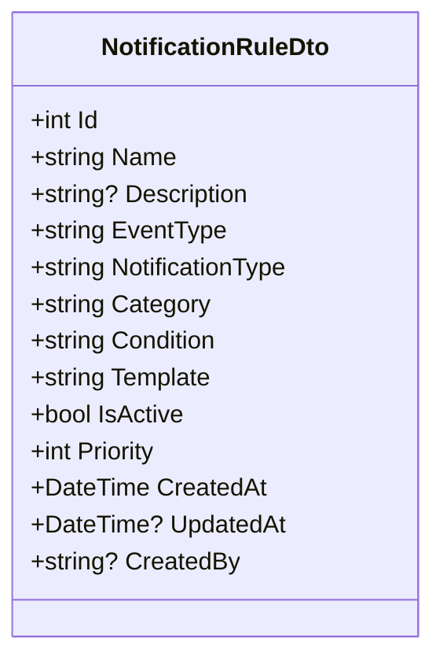
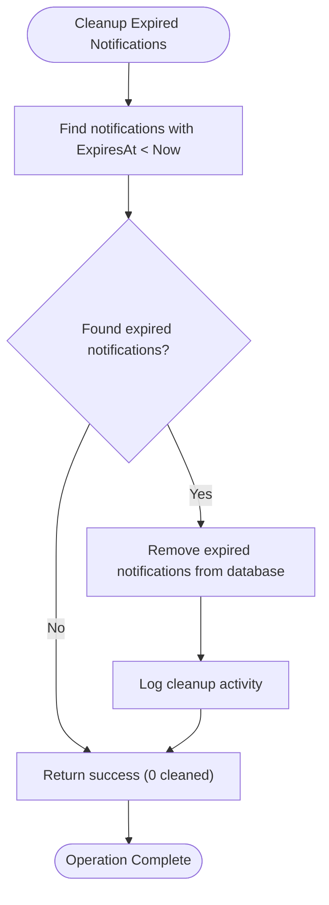
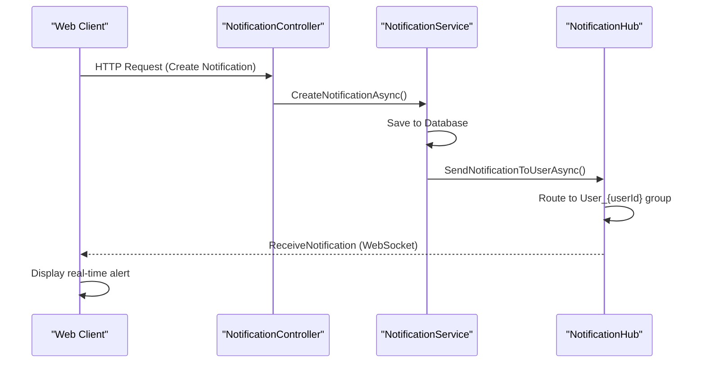

# Notification API

<cite>
**Referenced Files in This Document**   
- [NotificationController.cs](file://src/Inventory.API/Controllers/NotificationController.cs)
- [NotificationDto.cs](file://src/Inventory.Shared/DTOs/NotificationDto.cs)
- [NotificationService.cs](file://src/Inventory.API/Services/NotificationService.cs)
- [NotificationHub.cs](file://src/Inventory.API/Hubs/NotificationHub.cs)
- [NotificationRuleEngine.cs](file://src/Inventory.API/Services/NotificationRuleEngine.cs)
- [SignalRNotificationService.cs](file://src/Inventory.API/Services/SignalRNotificationService.cs)
- [Notification.cs](file://src/Inventory.Shared/Models/Notification.cs)
</cite>

## Table of Contents
1. [Introduction](#introduction)
2. [Authentication and Authorization](#authentication-and-authorization)
3. [Notification Endpoints](#notification-endpoints)
4. [Notification DTO Schema](#notification-dto-schema)
5. [Statistics Endpoint](#statistics-endpoint)
6. [Preferences Management](#preferences-management)
7. [Rules Engine Configuration](#rules-engine-configuration)
8. [Bulk Operations](#bulk-operations)
9. [Cleanup Endpoint](#cleanup-endpoint)
10. [Real-time Notifications with SignalR](#real-time-notifications-with-signalr)
11. [Examples](#examples)

## Introduction
The Notification API provides a comprehensive system for managing real-time notifications within the Inventory Control application. This API enables users to retrieve, manage, and respond to notifications related to inventory changes, system events, and transaction activities. The system supports both individual and bulk operations, with configurable user preferences and a rules engine for automated notification generation. Real-time updates are delivered through SignalR integration, ensuring users receive immediate alerts.

**Section sources**
- [NotificationController.cs](file://src/Inventory.API/Controllers/NotificationController.cs#L8-L541)

## Authentication and Authorization
All endpoints in the Notification API require JWT-based authentication. Users must include a valid JWT token in the Authorization header to access any notification functionality. The system validates the token and extracts the user ID from the `nameid` claim to ensure users can only access their own notifications.

Authorization is implemented through role-based access control:
- Regular users can access their own notifications and preferences
- Managers and Admins have additional access to notification rules and bulk operations
- Only Admins can perform cleanup operations

The `[Authorize]` attribute is applied globally to the controller, with specific endpoints requiring elevated roles using `[Authorize(Roles = "Admin,Manager")]`.

**Section sources**
- [NotificationController.cs](file://src/Inventory.API/Controllers/NotificationController.cs#L8-L20)

## Notification Endpoints
The API provides comprehensive CRUD operations for managing notifications.

### Retrieve Notifications
**GET /api/Notification**
Retrieves a paginated list of notifications for the authenticated user. Supports pagination with `page` and `pageSize` query parameters (default: page 1, pageSize 20).

**GET /api/Notification/{id}**
Retrieves a specific notification by ID. Returns 404 if the notification is not found or does not belong to the user.

### Update Notification Status
**PUT /api/Notification/{id}/read**
Marks a specific notification as read. The system updates the `IsRead` flag and sets the `ReadAt` timestamp.

**PUT /api/Notification/mark-all-read**
Marks all unread notifications for the user as read in a single operation.

**PUT /api/Notification/{id}/archive**
Archives a notification, removing it from the main view while preserving it in the system.

### Delete Notification
**DELETE /api/Notification/{id}**
Permanently deletes a notification. The user must be the owner of the notification.

**Section sources**
- [NotificationController.cs](file://src/Inventory.API/Controllers/NotificationController.cs#L22-L128)
- [NotificationService.cs](file://src/Inventory.API/Services/NotificationService.cs#L138-L176)

## Notification DTO Schema
The `NotificationDto` object represents the structure of notification data transferred between client and server.



**Diagram sources**
- [NotificationDto.cs](file://src/Inventory.Shared/DTOs/NotificationDto.cs#L4-L23)
- [Notification.cs](file://src/Inventory.Shared/Models/Notification.cs#L4-L45)

### Property Descriptions
- **Title**: Brief summary of the notification (required, max 200 characters)
- **Message**: Detailed content of the notification (required, max 1000 characters)
- **Type**: Visual classification (INFO, WARNING, ERROR, SUCCESS)
- **Category**: Functional grouping (STOCK, TRANSACTION, SYSTEM, SECURITY)
- **IsRead**: Indicates whether the user has viewed the notification
- **CreatedAt**: Timestamp when the notification was created (UTC)
- **ActionUrl**: Optional URL for user to navigate when interacting with the notification
- **ActionText**: Text for the action button (e.g., "View Details")
- **EntityLink**: References to related entities (Product, Transaction) through their respective IDs

## Statistics Endpoint
**GET /api/Notification/stats**
Returns statistical information about the user's notifications, including counts by status and temporal data.



**Diagram sources**
- [NotificationService.cs](file://src/Inventory.API/Services/NotificationService.cs#L291-L333)

The endpoint returns:
- Total number of notifications
- Count of unread notifications
- Count of archived notifications
- Last notification creation date
- Distribution metrics by type and category (calculated on client side from retrieved notifications)

This information is used to display notification badges and summary statistics in the user interface.

**Section sources**
- [NotificationController.cs](file://src/Inventory.API/Controllers/NotificationController.cs#L208-L232)
- [NotificationService.cs](file://src/Inventory.API/Services/NotificationService.cs#L291-L333)

## Preferences Management
Users can customize how they receive notifications through preference settings.

### Retrieve Preferences
**GET /api/Notification/preferences**
Returns all notification preferences for the authenticated user.

### Update Preferences
**PUT /api/Notification/preferences**
Updates notification preferences for a specific event type. Creates a new preference if it doesn't exist.



**Diagram sources**
- [NotificationDto.cs](file://src/Inventory.Shared/DTOs/NotificationDto.cs#L58-L71)
- [Notification.cs](file://src/Inventory.Shared/Models/Notification.cs#L109-L128)

### Delete Preferences
**DELETE /api/Notification/preferences/{eventType}**
Removes notification preferences for a specific event type, reverting to system defaults.

Preferences control whether notifications are delivered via email, in-app alerts, or push notifications, and can filter by minimum priority level.

**Section sources**
- [NotificationController.cs](file://src/Inventory.API/Controllers/NotificationController.cs#L234-L284)
- [NotificationService.cs](file://src/Inventory.API/Services/NotificationService.cs#L372-L427)

## Rules Engine Configuration
The notification rules engine allows administrators to define automated notification triggers.

### Retrieve Rules
**GET /api/Notification/rules**
Returns all notification rules (Admin and Manager only).

### Create Rule
**POST /api/Notification/rules**
Creates a new notification rule (Admin and Manager only).

### Update Rule
**PUT /api/Notification/rules/{id}**
Updates an existing notification rule (Admin and Manager only).

### Delete Rule
**DELETE /api/Notification/rules/{id}**
Deletes a notification rule (Admin and Manager only).

### Toggle Rule
**PUT /api/Notification/rules/{id}/toggle**
Enables or disables a rule without deleting it (Admin and Manager only).



**Diagram sources**
- [NotificationDto.cs](file://src/Inventory.Shared/DTOs/NotificationDto.cs#L84-L98)
- [Notification.cs](file://src/Inventory.Shared/Models/Notification.cs#L55-L83)

Rules consist of:
- **Condition**: JSON defining when the rule should trigger
- **Template**: Message template with placeholders (e.g., {{Product.Name}})
- **Priority**: Execution order (higher numbers execute first)

**Section sources**
- [NotificationController.cs](file://src/Inventory.API/Controllers/NotificationController.cs#L286-L378)
- [NotificationRuleEngine.cs](file://src/Inventory.API/Services/NotificationRuleEngine.cs#L10-L271)

## Bulk Operations
The API supports bulk operations for administrative tasks.

### Bulk Mark as Read
**POST /api/Notification/bulk/read**
Marks multiple notifications as read in a single request.

### Bulk Delete
**POST /api/Notification/bulk/delete**
Deletes multiple notifications in a single request.

### Bulk Send
**POST /api/Notification/bulk**
Sends the same notification to multiple users (Admin and Manager only).

These endpoints accept a list of notification IDs or user IDs and perform the operation atomically, returning appropriate success or error responses.

**Section sources**
- [NotificationController.cs](file://src/Inventory.API/Controllers/NotificationController.cs#L380-L409)

## Cleanup Endpoint
**POST /api/Notification/cleanup**
Removes expired notifications based on retention policies (Admin only).

The cleanup process:
1. Identifies notifications where `ExpiresAt` is in the past
2. Removes these notifications from the database
3. Returns the count of removed notifications

This endpoint helps maintain database performance and ensures users are not presented with outdated notifications.



**Diagram sources**
- [NotificationService.cs](file://src/Inventory.API/Services/NotificationService.cs#L909-L937)

**Section sources**
- [NotificationController.cs](file://src/Inventory.API/Controllers/NotificationController.cs#L411-L432)
- [NotificationService.cs](file://src/Inventory.API/Services/NotificationService.cs#L909-L937)

## Real-time Notifications with SignalR
The system integrates with SignalR for real-time push notifications through the `NotificationHub`.



**Diagram sources**
- [NotificationHub.cs](file://src/Inventory.API/Hubs/NotificationHub.cs#L10-L321)
- [SignalRNotificationService.cs](file://src/Inventory.API/Services/SignalRNotificationService.cs#L10-L191)

### Connection Management
- Clients connect to `NotificationHub` via WebSocket
- Connections are grouped by user (`User_{userId}`) and notification type (`Notifications_{type}`)
- Connection metadata (user agent, IP address) is stored in the database
- Inactive connections are cleaned up after 24 hours

### Real-time Features
- Immediate delivery of new notifications
- Connection status monitoring
- Group broadcasting for system-wide announcements
- Subscription management for specific notification types

The `SignalRNotificationService` acts as a bridge between the business logic and the real-time communication layer, ensuring notifications are delivered promptly to connected clients.

**Section sources**
- [NotificationHub.cs](file://src/Inventory.API/Hubs/NotificationHub.cs#L10-L321)
- [SignalRNotificationService.cs](file://src/Inventory.API/Services/SignalRNotificationService.cs#L10-L191)

## Examples
### Retrieving Unread Notifications
```http
GET /api/Notification?page=1&pageSize=10 HTTP/1.1
Authorization: Bearer <jwt_token>
```

Response:
```json
{
  "success": true,
  "data": [
    {
      "id": 123,
      "title": "Low Stock Alert: Widget A",
      "message": "Current stock level is below minimum threshold",
      "type": "WARNING",
      "category": "STOCK",
      "isRead": false,
      "createdAt": "2025-01-15T10:30:00Z",
      "actionUrl": "/products/456",
      "actionText": "View Product"
    }
  ]
}
```

### Updating Notification Preferences
```http
PUT /api/Notification/preferences HTTP/1.1
Authorization: Bearer <jwt_token>
Content-Type: application/json

{
  "eventType": "STOCK_LOW",
  "emailEnabled": true,
  "inAppEnabled": true,
  "pushEnabled": false,
  "minPriority": 2
}
```

### Marking Notification as Read
```http
PUT /api/Notification/123/read HTTP/1.1
Authorization: Bearer <jwt_token>
```

Response:
```json
{
  "success": true,
  "data": true
}
```

**Section sources**
- [NotificationController.cs](file://src/Inventory.API/Controllers/NotificationController.cs#L22-L128)
- [NotificationService.cs](file://src/Inventory.API/Services/NotificationService.cs#L138-L176)