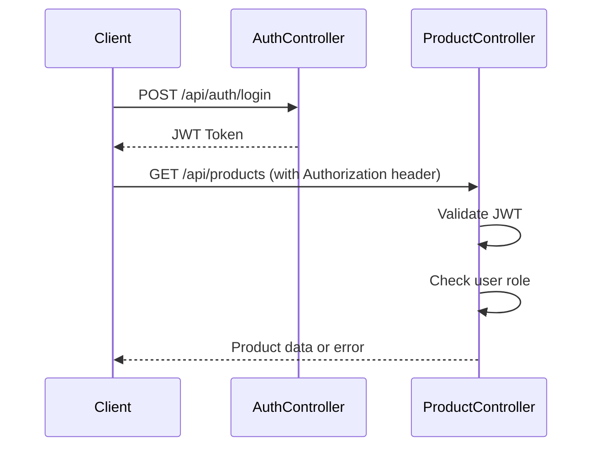
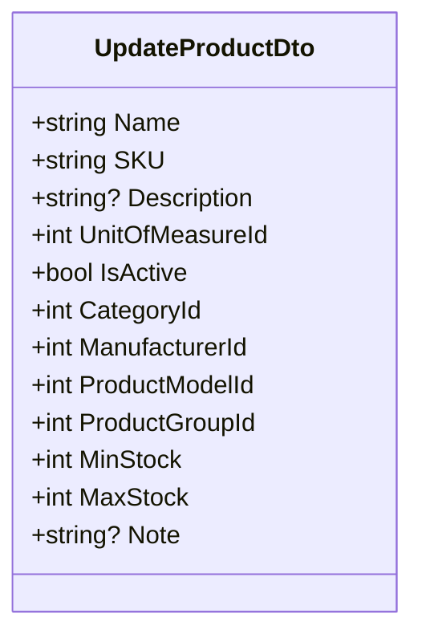
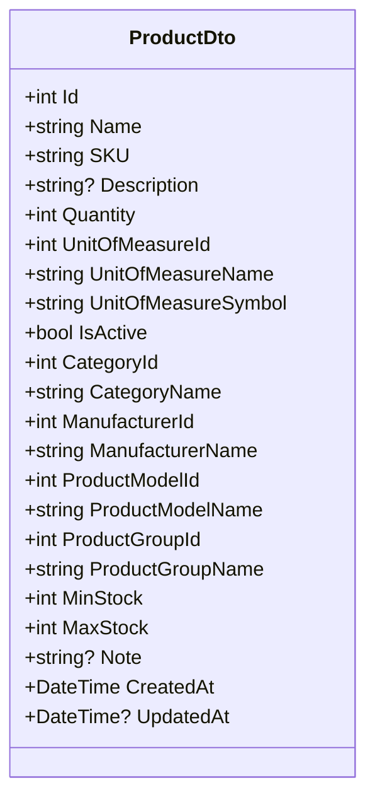
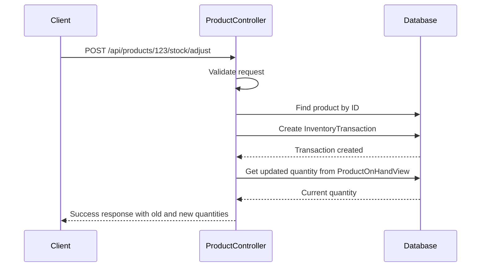
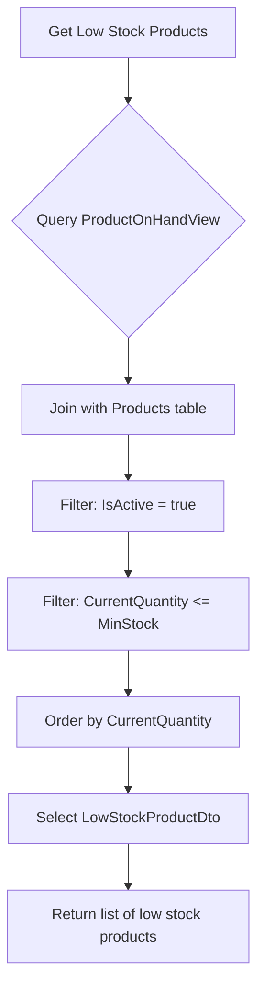
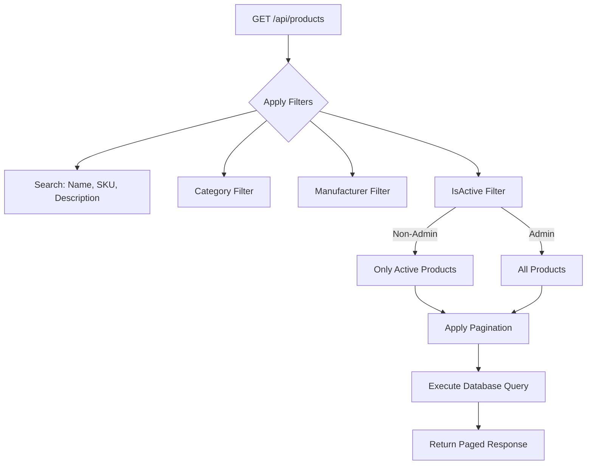

# Product API

<cite>
**Referenced Files in This Document**  
- [ProductController.cs](file://src/Inventory.API/Controllers/ProductController.cs)
- [ProductDto.cs](file://src/Inventory.Shared/DTOs/ProductDto.cs)
- [CreateProductDtoValidator.cs](file://src/Inventory.API/Validators/CreateProductDtoValidator.cs)
- [UpdateProductDtoValidator.cs](file://src/Inventory.API/Validators/UpdateProductDtoValidator.cs)
- [DashboardController.cs](file://src/Inventory.API/Controllers/DashboardController.cs)
- [ApiEndpoints.cs](file://src/Inventory.Shared/Constants/ApiEndpoints.cs)
</cite>

## Table of Contents
1. [Introduction](#introduction)
2. [Authentication and Authorization](#authentication-and-authorization)
3. [Product Endpoints](#product-endpoints)
4. [Request/Response Schemas](#requestresponse-schemas)
5. [Stock Adjustment](#stock-adjustment)
6. [Low-Stock Products](#low-stock-products)
7. [Pagination and Filtering](#pagination-and-filtering)
8. [Error Handling](#error-handling)
9. [API Usage Examples](#api-usage-examples)

## Introduction

The Product API provides comprehensive endpoints for managing product inventory within the InventoryCtrl_2 system. This API enables CRUD operations for products, stock adjustments, searching, filtering, and pagination. All endpoints follow RESTful principles and return standardized JSON responses with consistent error handling.

The API is designed to support inventory management workflows with features like soft deletion, audit logging, and role-based access control. Products are central to the inventory system and are linked to categories, manufacturers, product models, and units of measurement.

**Section sources**
- [ProductController.cs](file://src/Inventory.API/Controllers/ProductController.cs#L13-L719)

## Authentication and Authorization

All product endpoints require authentication via JWT (JSON Web Token). The API uses a role-based authorization system with two primary roles:

- **Admin**: Full access to all product operations, including creating inactive products and modifying the IsActive status
- **Manager/User**: Standard access to product operations, but restricted from creating inactive products or modifying IsActive status

The `[Authorize]` attribute is applied at the controller level, requiring valid authentication for all endpoints. The Delete endpoint has additional role restriction with `[Authorize(Roles = "Admin")]`, limiting deletion capability to administrators only.

JWT tokens are obtained through the authentication endpoint and must be included in the Authorization header as a Bearer token for all requests to the Product API.



**Diagram sources**
- [ProductController.cs](file://src/Inventory.API/Controllers/ProductController.cs#L13-L719)
- [AuthController.cs](file://src/Inventory.API/Controllers/AuthController.cs#L0-L143)

**Section sources**
- [ProductController.cs](file://src/Inventory.API/Controllers/ProductController.cs#L13-L719)

## Product Endpoints

The ProductController provides a comprehensive set of endpoints for product management with the base URL `/api/products`.

### GET Endpoints

| Endpoint | Description | Parameters | Access |
|--------|-----------|-----------|--------|
| `GET /api/products` | Retrieve paginated list of products with filtering | page, pageSize, search, categoryId, manufacturerId, isActive | Admin, Manager, User |
| `GET /api/products/{id}` | Retrieve specific product by ID | id (integer) | Admin, Manager, User |
| `GET /api/products/sku/{sku}` | Retrieve product by SKU | sku (string) | Admin, Manager, User |

### POST Endpoints

| Endpoint | Description | Request Body | Access |
|--------|-----------|-------------|--------|
| `POST /api/products` | Create a new product | CreateProductDto | Admin, Manager, User |

### PUT Endpoints

| Endpoint | Description | Request Body | Access |
|--------|-----------|-------------|--------|
| `PUT /api/products/{id}` | Update existing product | UpdateProductDto | Admin, Manager, User |

### DELETE Endpoints

| Endpoint | Description | Parameters | Access |
|--------|-----------|-----------|--------|
| `DELETE /api/products/{id}` | Soft delete product (set IsActive=false) | id (integer) | Admin only |

The API implements soft deletion rather than permanent deletion. When a product is deleted, its IsActive property is set to false, preserving audit trail and historical data while removing it from regular queries.

**Section sources**
- [ProductController.cs](file://src/Inventory.API/Controllers/ProductController.cs#L13-L719)

## Request/Response Schemas

The API uses Data Transfer Objects (DTOs) to define the structure of requests and responses, ensuring consistency and type safety.

### CreateProductDto

Used for creating new products. All fields are validated on the server side.


**Diagram sources**
- [ProductDto.cs](file://src/Inventory.Shared/DTOs/ProductDto.cs#L76-L119)

### UpdateProductDto

Used for updating existing products. Has the same structure as CreateProductDto but is used specifically for updates.



**Diagram sources**
- [ProductDto.cs](file://src/Inventory.Shared/DTOs/ProductDto.cs#L76-L119)

### ProductDto

The response DTO returned by GET endpoints, containing comprehensive product information with related entities.



**Diagram sources**
- [ProductDto.cs](file://src/Inventory.Shared/DTOs/ProductDto.cs#L4-L29)

### Validation Rules

Both CreateProductDto and UpdateProductDto are validated using FluentValidation with the following rules:

- **Name**: Required, 2-200 characters
- **SKU**: Required, 3-50 characters, uppercase letters, numbers, hyphens, and underscores only
- **Description**: Maximum 1000 characters
- **UnitOfMeasureId, CategoryId, ManufacturerId, ProductModelId, ProductGroupId**: Must be greater than 0
- **MinStock**: Must be 0 or greater
- **MaxStock**: Must be greater than 0
- **MaxStock must be greater than or equal to MinStock**
- **Note**: Maximum 500 characters

**Section sources**
- [ProductDto.cs](file://src/Inventory.Shared/DTOs/ProductDto.cs#L4-L138)
- [CreateProductDtoValidator.cs](file://src/Inventory.API/Validators/CreateProductDtoValidator.cs#L1-L63)
- [UpdateProductDtoValidator.cs](file://src/Inventory.API/Validators/UpdateProductDtoValidator.cs#L1-L63)

## Stock Adjustment

The stock adjustment endpoint allows for modifying product quantities through inventory transactions rather than direct quantity updates.

### Endpoint
`POST /api/products/{id}/stock/adjust`

### Request Structure
The endpoint uses a StockAdjustmentRequest model with the following properties:

- **Quantity**: The amount to adjust (positive for incoming stock, negative for outgoing)
- **WarehouseId**: The warehouse where the adjustment occurs
- **Description**: Optional description of the adjustment reason

### Implementation Details

The system uses a transaction-based approach to stock management:
1. The endpoint creates an InventoryTransaction record with the specified quantity and warehouse
2. The transaction type is automatically determined (Income for positive quantities, Outcome for negative)
3. The ProductOnHandView is updated through database triggers or background processes
4. The current quantity is derived from the ProductOnHandView rather than stored directly on the Product entity

This approach ensures data consistency and provides a complete audit trail of all stock movements.



**Diagram sources**
- [ProductController.cs](file://src/Inventory.API/Controllers/ProductController.cs#L621-L663)

**Section sources**
- [ProductController.cs](file://src/Inventory.API/Controllers/ProductController.cs#L621-L663)

## Low-Stock Products

The system provides functionality to identify products that are running low on stock based on their MinStock threshold.

### Endpoint
`GET /api/dashboard/low-stock-products`

### Filtering Logic

Products are considered "low stock" when their current quantity is less than or equal to their MinStock value. The endpoint queries the ProductOnHandView to get real-time stock levels and filters products accordingly.

The query joins the Product and ProductOnHandView tables to:
- Ensure only active products are included
- Compare current quantity against MinStock threshold
- Include relevant product details in the response

### Response Structure

The endpoint returns a list of LowStockProductDto objects containing:
- Product ID, Name, and SKU
- Current quantity and MinStock/MaxStock thresholds
- Category and manufacturer names
- Unit of measure symbol

This information helps users quickly identify which products need restocking and by how much.



**Diagram sources**
- [DashboardController.cs](file://src/Inventory.API/Controllers/DashboardController.cs#L187-L215)

**Section sources**
- [DashboardController.cs](file://src/Inventory.API/Controllers/DashboardController.cs#L187-L215)

## Pagination and Filtering

The GET /api/products endpoint supports comprehensive pagination and filtering capabilities to handle large product catalogs efficiently.

### Pagination Parameters

- **page**: Page number (default: 1)
- **pageSize**: Number of items per page (default: 10)

The response includes a PagedResponse wrapper with:
- Items: The current page of products
- TotalCount: Total number of matching products
- PageNumber: Current page number
- PageSize: Number of items per page
- TotalPages: Total number of pages

### Filtering Parameters

- **search**: Text search across Name, SKU, and Description fields
- **categoryId**: Filter by category ID
- **manufacturerId**: Filter by manufacturer ID
- **isActive**: Filter by active status

### Default Filtering Behavior

By default, non-admin users only see active products. Admin users see all products regardless of active status unless explicitly filtered. This ensures data integrity while providing appropriate visibility based on user role.

The filtering is implemented with efficient database queries using Entity Framework's LINQ provider, with indexes on commonly filtered fields for optimal performance.



**Section sources**
- [ProductController.cs](file://src/Inventory.API/Controllers/ProductController.cs#L13-L719)

## Error Handling

The API implements consistent error handling with standardized response formats for different error scenarios.

### Response Format

All responses follow the ApiResponse<T> pattern:

```json
{
  "success": true,
  "data": { /* response data */ },
  "errorMessage": null,
  "errors": []
}
```

For errors:
```json
{
  "success": false,
  "data": null,
  "errorMessage": "Descriptive error message",
  "errors": ["Validation error 1", "Validation error 2"]
}
```

### Error Types

| Status Code | Scenario | Response |
|-----------|---------|----------|
| 400 Bad Request | Validation failures, invalid request data | Success: false, ErrorMessage, Errors array |
| 401 Unauthorized | Missing or invalid JWT token | Success: false, ErrorMessage |
| 403 Forbidden | Insufficient permissions for operation | Success: false, ErrorMessage |
| 404 Not Found | Product not found by ID or SKU | Success: false, ErrorMessage |
| 500 Internal Server Error | Unexpected server errors | Success: false, ErrorMessage |

### Validation Error Handling

When validation fails (400), the response includes:
- Success: false
- ErrorMessage: "Invalid model state"
- Errors: Array of detailed validation messages from ModelState

This allows clients to display specific error messages for each invalid field.

**Section sources**
- [ProductController.cs](file://src/Inventory.API/Controllers/ProductController.cs#L13-L719)

## API Usage Examples

### Creating a Product

```http
POST /api/products
Content-Type: application/json
Authorization: Bearer <jwt_token>

{
  "name": "Dell XPS 13",
  "sku": "DELL-XPS13-PRO",
  "description": "High-performance laptop",
  "unitOfMeasureId": 1,
  "categoryId": 5,
  "manufacturerId": 3,
  "productModelId": 8,
  "productGroupId": 2,
  "minStock": 5,
  "maxStock": 50,
  "note": "Premium model"
}
```

**Success Response (201 Created):**
```json
{
  "success": true,
  "data": {
    "id": 123,
    "name": "Dell XPS 13",
    "sku": "DELL-XPS13-PRO",
    "description": "High-performance laptop",
    "quantity": 0,
    "unitOfMeasureId": 1,
    "unitOfMeasureName": "Each",
    "unitOfMeasureSymbol": "ea",
    "isActive": true,
    "categoryId": 5,
    "categoryName": "Laptops",
    "manufacturerId": 3,
    "manufacturerName": "Dell",
    "productModelId": 8,
    "productModelName": "XPS 13",
    "productGroupId": 2,
    "productGroupName": "Premium Laptops",
    "minStock": 5,
    "maxStock": 50,
    "note": "Premium model",
    "createdAt": "2025-01-15T10:30:00Z",
    "updatedAt": null
  }
}
```

### Updating a Product

```http
PUT /api/products/123
Content-Type: application/json
Authorization: Bearer <jwt_token>

{
  "name": "Dell XPS 13 (Updated)",
  "sku": "DELL-XPS13-PRO",
  "description": "High-performance laptop with updated specs",
  "unitOfMeasureId": 1,
  "categoryId": 5,
  "manufacturerId": 3,
  "productModelId": 8,
  "productGroupId": 2,
  "minStock": 10,
  "maxStock": 100,
  "note": "Updated premium model",
  "isActive": true
}
```

### Searching Products

```http
GET /api/products?page=1&pageSize=10&search=laptop&categoryId=5&isActive=true
Authorization: Bearer <jwt_token>
```

### Adjusting Stock

```http
POST /api/products/123/stock/adjust
Content-Type: application/json
Authorization: Bearer <jwt_token>

{
  "quantity": 25,
  "warehouseId": 1,
  "description": "Received shipment from supplier"
}
```

**Section sources**
- [ProductController.cs](file://src/Inventory.API/Controllers/ProductController.cs#L13-L719)
- [ApiEndpoints.cs](file://src/Inventory.Shared/Constants/ApiEndpoints.cs#L1-L101)