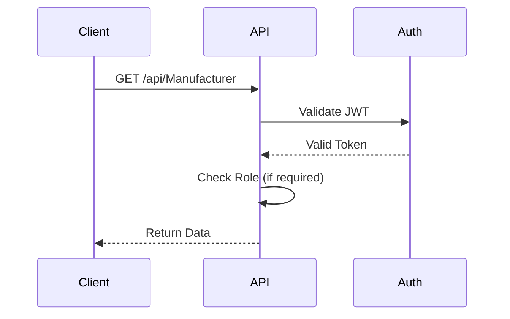
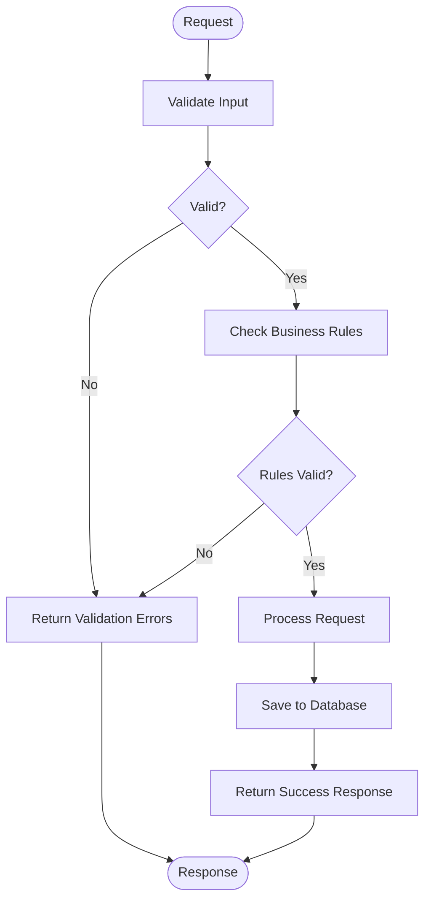

# Reference Data API

<cite>
**Referenced Files in This Document**   
- [ManufacturerController.cs](file://src/Inventory.API/Controllers/ManufacturerController.cs)
- [ProductGroupController.cs](file://src/Inventory.API/Controllers/ProductGroupController.cs)
- [ProductModelController.cs](file://src/Inventory.API/Controllers/ProductModelController.cs)
- [UnitOfMeasureController.cs](file://src/Inventory.API/Controllers/UnitOfMeasureController.cs)
- [WarehouseController.cs](file://src/Inventory.API/Controllers/WarehouseController.cs)
- [LocationController.cs](file://src/Inventory.API/Controllers/LocationController.cs)
- [Manufacturer.cs](file://src/Inventory.API/Models/Manufacturer.cs)
- [ProductGroup.cs](file://src/Inventory.API/Models/ProductGroup.cs)
- [ProductModel.cs](file://src/Inventory.API/Models/ProductModel.cs)
- [UnitOfMeasure.cs](file://src/Inventory.API/Models/UnitOfMeasure.cs)
- [Warehouse.cs](file://src/Inventory.API/Models/Warehouse.cs)
- [Location.cs](file://src/Inventory.API/Models/Location.cs)
- [ManufacturerDto.cs](file://src/Inventory.Shared/DTOs/ManufacturerDto.cs)
- [ProductGroupDto.cs](file://src/Inventory.Shared/DTOs/ProductGroupDto.cs)
- [ProductModelDto.cs](file://src/Inventory.Shared/DTOs/ProductModelDto.cs)
- [UnitOfMeasureDto.cs](file://src/Inventory.Shared/DTOs/UnitOfMeasureDto.cs)
- [WarehouseDto.cs](file://src/Inventory.Shared/DTOs/WarehouseDto.cs)
- [LocationDto.cs](file://src/Inventory.Shared/DTOs/LocationDto.cs)
- [AppDbContext.cs](file://src/Inventory.API/Models/AppDbContext.cs)
- [CreateManufacturerDtoValidator.cs](file://src/Inventory.API/Validators/CreateManufacturerDtoValidator.cs)
</cite>

## Table of Contents
1. [Introduction](#introduction)
2. [Authentication and Authorization](#authentication-and-authorization)
3. [Common Patterns](#common-patterns)
4. [Manufacturer Controller](#manufacturer-controller)
5. [Product Group Controller](#product-group-controller)
6. [Product Model Controller](#product-model-controller)
7. [Unit of Measure Controller](#unit-of-measure-controller)
8. [Warehouse Controller](#warehouse-controller)
9. [Location Controller](#location-controller)
10. [Error Handling](#error-handling)
11. [Examples](#examples)

## Introduction
The Reference Data API provides endpoints for managing master data entities in the inventory control system. These endpoints support CRUD operations for key reference entities including manufacturers, product groups, product models, units of measure, warehouses, and locations. The API follows RESTful principles and provides consistent response patterns, pagination, and validation across all endpoints.

**Section sources**
- [ManufacturerController.cs](file://src/Inventory.API/Controllers/ManufacturerController.cs#L9-L372)
- [ProductGroupController.cs](file://src/Inventory.API/Controllers/ProductGroupController.cs#L9-L315)

## Authentication and Authorization
All reference data endpoints require JWT authentication. Users must include a valid JWT token in the Authorization header of their requests. 

Authorization is role-based, with the following requirements:
- **Admin**: Required for all POST, PUT, and DELETE operations
- **Manager**: Can read all data but cannot modify reference data
- **User**: Can read active reference data

The API uses ASP.NET Core's built-in authorization system with role claims to enforce these restrictions.



**Diagram sources**
- [ManufacturerController.cs](file://src/Inventory.API/Controllers/ManufacturerController.cs#L9-L372)
- [ProductGroupController.cs](file://src/Inventory.API/Controllers/ProductGroupController.cs#L9-L315)

**Section sources**
- [ManufacturerController.cs](file://src/Inventory.API/Controllers/ManufacturerController.cs#L9-L372)
- [ProductGroupController.cs](file://src/Inventory.API/Controllers/ProductGroupController.cs#L9-L315)

## Common Patterns
The reference data controllers follow consistent patterns across all endpoints:

### CRUD Operations
All controllers implement standard CRUD operations:
- **GET**: Retrieve data (all or by ID)
- **POST**: Create new entity
- **PUT**: Update existing entity
- **DELETE**: Remove entity

### Response Structure
All endpoints return a consistent response format using `ApiResponse<T>` or `PagedApiResponse<T>`:
- **Success**: Boolean indicating operation success
- **Data**: The requested data or created/updated entity
- **ErrorMessage**: Description of error if operation failed
- **Errors**: List of validation errors

### Pagination
List endpoints support pagination with the following parameters:
- `page`: Page number (default: 1)
- `pageSize`: Number of items per page (default: 10)
- `search`: Filter by name/description
- `isActive`: Filter by active status

### Validation
All POST and PUT operations include validation:
- Model state validation
- Business rule validation (e.g., duplicate names)
- Foreign key validation (e.g., referenced locations)



**Diagram sources**
- [ManufacturerController.cs](file://src/Inventory.API/Controllers/ManufacturerController.cs#L9-L372)
- [ProductGroupController.cs](file://src/Inventory.API/Controllers/ProductGroupController.cs#L9-L315)

**Section sources**
- [ManufacturerController.cs](file://src/Inventory.API/Controllers/ManufacturerController.cs#L9-L372)
- [ProductGroupController.cs](file://src/Inventory.API/Controllers/ProductGroupController.cs#L9-L315)

## Manufacturer Controller
The ManufacturerController manages manufacturer entities with CRUD operations.

### Endpoints
- **GET /api/Manufacturer**: Get all manufacturers with location information
- **GET /api/Manufacturer/{id}**: Get specific manufacturer by ID
- **POST /api/Manufacturer**: Create new manufacturer (Admin only)
- **PUT /api/Manufacturer/{id}**: Update existing manufacturer (Admin only)
- **DELETE /api/Manufacturer/{id}**: Delete manufacturer (Admin only)

### Special Features
- Includes location hierarchy path (e.g., "Warehouse A > Section 1 > Shelf 3")
- Validates that manufacturer name is unique
- Checks that referenced location exists and is active
- Prevents deletion if manufacturer has associated products

**Section sources**
- [ManufacturerController.cs](file://src/Inventory.API/Controllers/ManufacturerController.cs#L9-L372)
- [Manufacturer.cs](file://src/Inventory.API/Models/Manufacturer.cs#L2-L19)
- [ManufacturerDto.cs](file://src/Inventory.Shared/DTOs/ManufacturerDto.cs#L4-L20)

## Product Group Controller
The ProductGroupController manages product group entities.

### Endpoints
- **GET /api/ProductGroup**: Get paginated list of product groups
- **GET /api/ProductGroup/all**: Get all product groups (for dropdowns)
- **GET /api/ProductGroup/{id}**: Get specific product group by ID
- **POST /api/ProductGroup**: Create new product group (Admin only)
- **PUT /api/ProductGroup/{id}**: Update existing product group (Admin only)
- **DELETE /api/ProductGroup/{id}**: Delete product group (Admin only)

### Special Features
- **GET /api/ProductGroup/all**: Returns all product groups without pagination, optimized for dropdown population
- Supports search filtering by name
- Prevents deletion if product group is used by products

**Section sources**
- [ProductGroupController.cs](file://src/Inventory.API/Controllers/ProductGroupController.cs#L9-L315)
- [ProductGroup.cs](file://src/Inventory.API/Models/ProductGroup.cs#L2-L10)
- [ProductGroupDto.cs](file://src/Inventory.Shared/DTOs/ProductGroupDto.cs#L4-L11)

## Product Model Controller
The ProductModelController manages product model entities.

### Endpoints
- **GET /api/ProductModel**: Get all product models
- **GET /api/ProductModel/manufacturer/{manufacturerId}**: Get models by manufacturer
- **GET /api/ProductModel/{id}**: Get specific product model by ID
- **POST /api/ProductModel**: Create new product model (Admin only)
- **PUT /api/ProductModel/{id}**: Update existing product model (Admin only)
- **DELETE /api/ProductModel/{id}**: Delete product model (Admin only)

### Special Features
- Includes manufacturer name in response
- Validates that referenced manufacturer exists
- Prevents deletion if model is used by products

**Section sources**
- [ProductModelController.cs](file://src/Inventory.API/Controllers/ProductModelController.cs#L9-L333)
- [ProductModel.cs](file://src/Inventory.API/Models/ProductModel.cs#L2-L12)
- [ProductModelDto.cs](file://src/Inventory.Shared/DTOs/ProductModelDto.cs#L4-L13)

## Unit of Measure Controller
The UnitOfMeasureController manages unit of measure entities.

### Endpoints
- **GET /api/UnitOfMeasure**: Get paginated list of units
- **GET /api/UnitOfMeasure/all**: Get all active units (for dropdowns)
- **GET /api/UnitOfMeasure/{id}**: Get specific unit by ID
- **POST /api/UnitOfMeasure**: Create new unit (Admin only)
- **PUT /api/UnitOfMeasure/{id}**: Update existing unit (Admin only)
- **DELETE /api/UnitOfMeasure/{id}**: Soft delete unit (Admin only)

### Special Features
- **GET /api/UnitOfMeasure/all**: Returns only active units for non-admin users
- Unique constraint on symbol field
- Soft delete (sets IsActive to false) instead of hard delete
- Prevents deletion if unit is used by products

**Section sources**
- [UnitOfMeasureController.cs](file://src/Inventory.API/Controllers/UnitOfMeasureController.cs#L10-L384)
- [UnitOfMeasure.cs](file://src/Inventory.API/Models/UnitOfMeasure.cs#L5-L27)
- [UnitOfMeasureDto.cs](file://src/Inventory.Shared/DTOs/UnitOfMeasureDto.cs#L4-L13)

## Location Controller
The LocationController manages hierarchical location entities.

### Endpoints
- **GET /api/Location**: Get paginated list of locations
- **GET /api/Location/all**: Get all active locations
- **GET /api/Location/root**: Get root locations (no parent)
- **GET /api/Location/parent/{parentId}**: Get locations by parent
- **GET /api/Location/{id}**: Get specific location by ID
- **POST /api/Location**: Create new location (Admin only)
- **PUT /api/Location/{id}**: Update existing location (Admin only)
- **DELETE /api/Location/{id}**: Delete location (Admin only)

### Hierarchical Structure
Locations support a hierarchical structure using parentId relationships:
- Root locations have null parentId
- Child locations reference parent via parentId
- Full path is calculated as "Parent > Child > Grandchild"
- Prevents circular references (location cannot be its own parent)

```mermaid
erDiagram
Location {
int id PK
string name
string description
bool isActive
int? parentId FK
datetime createdAt
datetime? updatedAt
}
Location ||--o{ Location : "parent-child"
```

**Diagram sources**
- [LocationController.cs](file://src/Inventory.API/Controllers/LocationController.cs#L10-L531)
- [Location.cs](file://src/Inventory.API/Models/Location.cs#L2-L14)

**Section sources**
- [LocationController.cs](file://src/Inventory.API/Controllers/LocationController.cs#L10-L531)
- [Location.cs](file://src/Inventory.API/Models/Location.cs#L2-L14)
- [LocationDto.cs](file://src/Inventory.Shared/DTOs/LocationDto.cs#L2-L12)

## Warehouse Controller
The WarehouseController manages warehouse entities.

### Endpoints
- **GET /api/Warehouse**: Get paginated list of warehouses
- **GET /api/Warehouse/{id}**: Get specific warehouse by ID
- **POST /api/Warehouse**: Create new warehouse (Admin only)
- **PUT /api/Warehouse/{id}**: Update existing warehouse (Admin only)
- **DELETE /api/Warehouse/{id}**: Soft delete warehouse (Admin only)

### Special Features
- Soft delete (sets IsActive to false) instead of hard delete
- Prevents deletion if warehouse has transactions
- Includes location name in response
- Validates that warehouse name is unique

**Section sources**
- [WarehouseController.cs](file://src/Inventory.API/Controllers/WarehouseController.cs#L10-L348)
- [Warehouse.cs](file://src/Inventory.API/Models/Warehouse.cs#L2-L14)
- [WarehouseDto.cs](file://src/Inventory.Shared/DTOs/WarehouseDto.cs#L4-L15)

## Error Handling
The API implements comprehensive error handling for reference data operations.

### Common Error Scenarios
- **Duplicate Names**: Returns 400 Bad Request when creating/updating with duplicate name
- **Referential Integrity**: Prevents deletion of entities with dependent records
- **Validation Errors**: Returns detailed validation errors for invalid input
- **Not Found**: Returns 404 Not Found for non-existent entities
- **Server Errors**: Returns 500 Internal Server Error for unexpected exceptions

### Error Response Format
```json
{
  "success": false,
  "errorMessage": "Descriptive error message",
  "errors": ["Validation error 1", "Validation error 2"]
}
```

**Section sources**
- [ManufacturerController.cs](file://src/Inventory.API/Controllers/ManufacturerController.cs#L9-L372)
- [ProductGroupController.cs](file://src/Inventory.API/Controllers/ProductGroupController.cs#L9-L315)
- [CreateManufacturerDtoValidator.cs](file://src/Inventory.API/Validators/CreateManufacturerDtoValidator.cs#L8-L42)

## Examples
### Creating a New Manufacturer
```http
POST /api/Manufacturer
Authorization: Bearer <jwt_token>
Content-Type: application/json

{
  "name": "Acme Manufacturing",
  "description": "Industrial equipment manufacturer",
  "contactInfo": "contact@acme.com",
  "website": "https://acme.com",
  "locationId": 5
}
```

**Section sources**
- [ManufacturerController.cs](file://src/Inventory.API/Controllers/ManufacturerController.cs#L132-L220)

### Retrieving All Units of Measure
```http
GET /api/UnitOfMeasure/all
Authorization: Bearer <jwt_token>
```

**Section sources**
- [UnitOfMeasureController.cs](file://src/Inventory.API/Controllers/UnitOfMeasureController.cs#L138-L181)

### Getting Root Locations
```http
GET /api/Location/root
Authorization: Bearer <jwt_token>
```

**Section sources**
- [LocationController.cs](file://src/Inventory.API/Controllers/LocationController.cs#L230-L267)