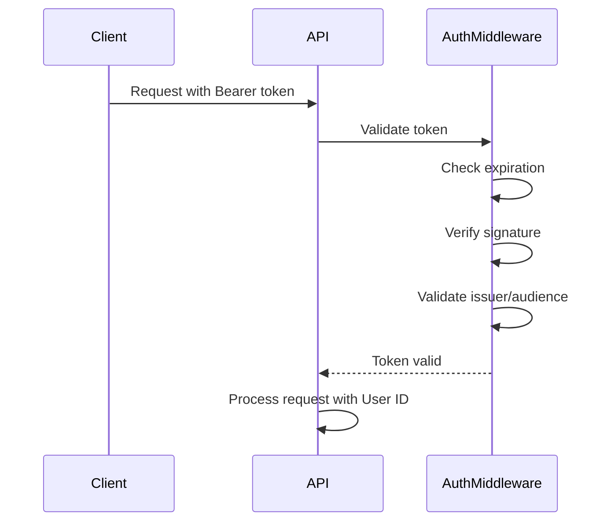
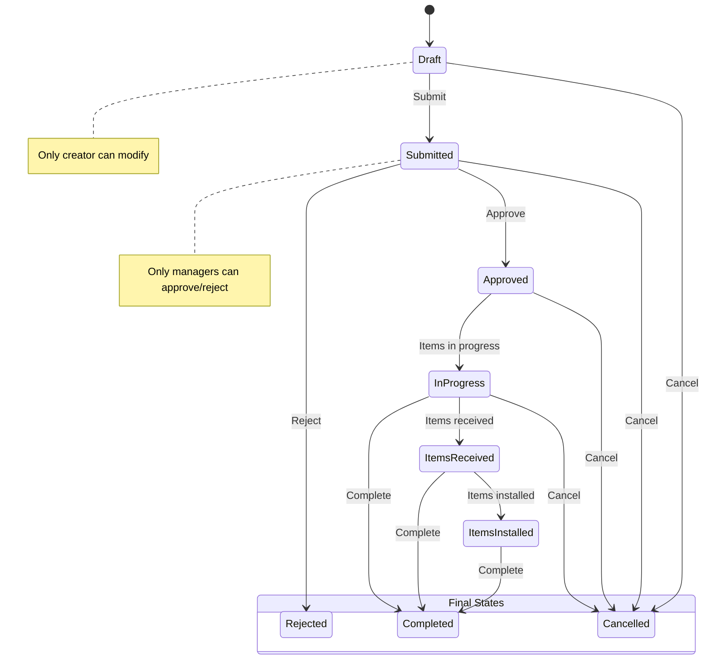
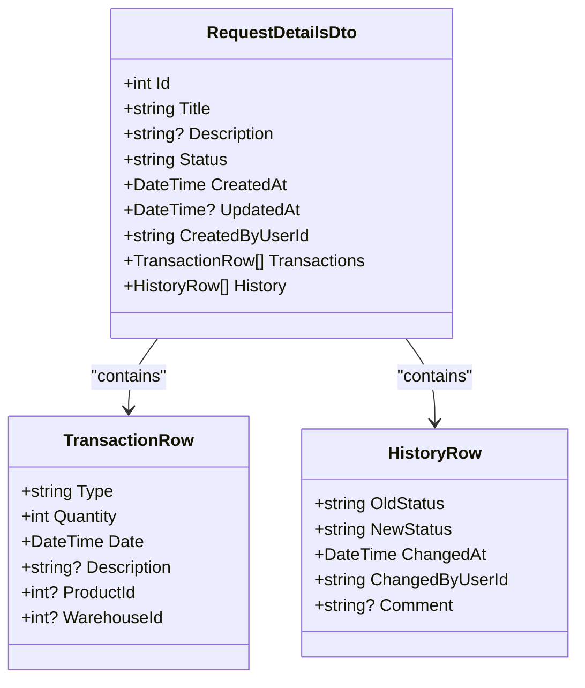
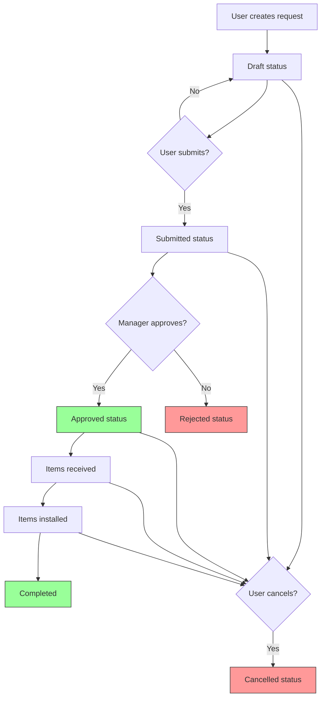

# Request API

<cite>
**Referenced Files in This Document**   
- [RequestsController.cs](file://src/Inventory.API/Controllers/RequestsController.cs)
- [RequestService.cs](file://src/Inventory.API/Services/RequestService.cs)
- [Request.cs](file://src/Inventory.API/Models/Request.cs)
- [RequestDtos.cs](file://src/Inventory.Shared/DTOs/RequestDtos.cs)
- [RequestHistory.cs](file://src/Inventory.API/Models/RequestHistory.cs)
- [InventoryTransaction.cs](file://src/Inventory.API/Models/InventoryTransaction.cs)
- [User.cs](file://src/Inventory.API/Models/User.cs)
</cite>

## Table of Contents
1. [Introduction](#introduction)
2. [Authentication and Authorization](#authentication-and-authorization)
3. [Request Lifecycle Management](#request-lifecycle-management)
4. [Endpoint Reference](#endpoint-reference)
5. [Request Details Response Schema](#request-details-response-schema)
6. [State Transition Workflow](#state-transition-workflow)
7. [Error Handling](#error-handling)
8. [Usage Examples](#usage-examples)

## Introduction

The Request API provides a comprehensive system for managing inventory requests throughout their complete lifecycle. This documentation details the endpoints for creating, retrieving, and progressing requests through various states from draft to completion. The API supports paginated retrieval of requests with filtering capabilities and provides detailed information about each request including its transaction history and status changes.

The request management system is designed to support a multi-stage approval workflow where users can create requests, submit them for approval, and track their progress through receiving, installation, and completion phases. Each request maintains a complete audit trail of status changes and associated inventory transactions.

**Section sources**
- [RequestsController.cs](file://src/Inventory.API/Controllers/RequestsController.cs#L9-L200)
- [RequestService.cs](file://src/Inventory.API/Services/RequestService.cs#L23-L191)

## Authentication and Authorization

All endpoints in the Request API require JWT authentication. Clients must include a valid JWT token in the Authorization header as a Bearer token for all requests. The authentication system validates tokens through the AuthenticationMiddleware, which checks the token's validity, expiration, and signature against the configured JWT settings.

Authorization rules are implemented based on user roles and request ownership:
- Regular users can create requests and modify their own requests only during the draft phase
- Managers (users with "Manager" role) can approve requests and progress them through subsequent stages
- Users can view any request, but can only modify requests they created while in draft status
- Once a request is submitted, only managers can approve or reject it

The system extracts the user ID from the JWT token's NameIdentifier claim and uses this to enforce ownership rules and record user actions in the audit trail.



**Diagram sources**
- [AuthenticationMiddleware.cs](file://src/Inventory.API/Middleware/AuthenticationMiddleware.cs#L38-L75)
- [Program.cs](file://src/Inventory.API/Program.cs#L130-L160)

**Section sources**
- [AuthenticationMiddleware.cs](file://src/Inventory.API/Middleware/AuthenticationMiddleware.cs#L136-L166)
- [AuthController.cs](file://src/Inventory.API/Controllers/AuthController.cs#L109-L143)

## Request Lifecycle Management

The request system implements a state machine that governs the progression of requests through their lifecycle. Each request begins in the Draft status and can transition through multiple states based on user actions and authorization rules. The state transitions are enforced by the RequestService, which validates that each transition is allowed based on the current status.

The complete lifecycle includes the following states:
- **Draft**: Initial state where users can edit the request
- **Submitted**: Request is pending manager approval
- **Approved**: Request has been approved and can proceed
- **InProgress**: Items are being processed
- **ItemsReceived**: All items have been received into inventory
- **ItemsInstalled**: Items have been installed or deployed
- **Completed**: Request is fully completed
- **Cancelled**: Request was cancelled by the creator
- **Rejected**: Request was rejected by a manager

Transitions between these states are governed by strict rules to prevent invalid state changes (e.g., approving an already completed request).



**Diagram sources**
- [Request.cs](file://src/Inventory.API/Models/Request.cs#L4-L15)
- [RequestService.cs](file://src/Inventory.API/Services/RequestService.cs#L123-L143)

**Section sources**
- [Request.cs](file://src/Inventory.API/Models/Request.cs#L17-L37)
- [RequestService.cs](file://src/Inventory.API/Services/RequestService.cs#L23-L191)

## Endpoint Reference

### GET /api/requests
Retrieves a paginated list of all requests sorted by creation date (newest first).

**Parameters**
- `page` (integer, optional): Page number (default: 1)
- `pageSize` (integer, optional): Number of items per page (default: 20)

**Response**
```json
{
  "total": 150,
  "page": 1,
  "pageSize": 20,
  "items": [
    {
      "id": 123,
      "title": "Server Rack Upgrade",
      "description": "Upgrade server racks in data center",
      "status": "Approved",
      "createdAt": "2025-09-28T10:30:00Z"
    }
  ]
}
```

### GET /api/requests/{id}
Retrieves detailed information about a specific request including transactions and history.

**Path Parameters**
- `id` (integer): Request identifier

**Response**
See [Request Details Response Schema](#request-details-response-schema) for complete structure.

### POST /api/requests
Creates a new request in Draft status.

**Request Body**
```json
{
  "title": "New Equipment Purchase",
  "description": "Purchase new laptops for development team"
}
```

**Response**
Returns the created request with 201 Created status.

### POST /api/requests/{id}/submit
Submits a draft request for approval.

**Path Parameters**
- `id` (integer): Request identifier

**Request Body**
```json
{
  "comment": "Ready for review"
}
```

### POST /api/requests/{id}/approve
Approves a submitted request.

**Path Parameters**
- `id` (integer): Request identifier

**Request Body**
```json
{
  "comment": "Approved for implementation"
}
```

### POST /api/requests/{id}/received
Marks that items for the request have been received.

**Path Parameters**
- `id` (integer): Request identifier

**Request Body**
```json
{
  "comment": "All items received and verified"
}
```

### POST /api/requests/{id}/installed
Marks that items have been installed.

**Path Parameters**
- `id` (integer): Request identifier

**Request Body**
```json
{
  "comment": "Installation completed"
}
```

### POST /api/requests/{id}/complete
Completes the request.

**Path Parameters**
- `id` (integer): Request identifier

**Request Body**
```json
{
  "comment": "Project completed successfully"
}
```

### POST /api/requests/{id}/cancel
Cancels a request.

**Path Parameters**
- `id` (integer): Request identifier

**Request Body**
```json
{
  "comment": "No longer needed"
}
```

### POST /api/requests/{id}/reject
Rejects a submitted request.

**Path Parameters**
- `id` (integer): Request identifier

**Request Body**
```json
{
  "comment": "Budget constraints"
}
```

**Section sources**
- [RequestsController.cs](file://src/Inventory.API/Controllers/RequestsController.cs#L9-L200)

## Request Details Response Schema

The GET /api/requests/{id} endpoint returns a RequestDetailsDto containing comprehensive information about the request, including its current state, associated transactions, and complete history of status changes.

### RequestDetailsDto
| Property | Type | Description |
|---------|------|-------------|
| Id | integer | Unique identifier of the request |
| Title | string | Title of the request |
| Description | string | Detailed description of the request |
| Status | string | Current status (e.g., "Approved", "Completed") |
| CreatedAt | datetime | Timestamp when request was created |
| UpdatedAt | datetime | Timestamp when request was last updated |
| CreatedByUserId | string | ID of the user who created the request |
| Transactions | array | Collection of associated inventory transactions |
| History | array | Collection of status change history entries |

### TransactionRow
Each transaction in the Transactions collection has the following structure:
| Property | Type | Description |
|---------|------|-------------|
| Type | string | Type of transaction (e.g., "Income", "Pending") |
| Quantity | integer | Number of items involved |
| Date | datetime | Timestamp of the transaction |
| Description | string | Description of the transaction |
| ProductId | integer | ID of the associated product |
| WarehouseId | integer | ID of the warehouse where transaction occurred |

### HistoryRow
Each entry in the History collection represents a status change:
| Property | Type | Description |
|---------|------|-------------|
| OldStatus | string | Previous status before change |
| NewStatus | string | New status after change |
| ChangedAt | datetime | Timestamp when status changed |
| ChangedByUserId | string | ID of the user who made the change |
| Comment | string | Optional comment explaining the change |



**Diagram sources**
- [RequestDtos.cs](file://src/Inventory.Shared/DTOs/RequestDtos.cs#L0-L42)
- [RequestsController.cs](file://src/Inventory.API/Controllers/RequestsController.cs#L50-L85)

**Section sources**
- [RequestDtos.cs](file://src/Inventory.Shared/DTOs/RequestDtos.cs#L0-L42)
- [RequestsController.cs](file://src/Inventory.API/Controllers/RequestsController.cs#L50-L85)

## State Transition Workflow

The request system implements a workflow engine that manages the progression of requests through their lifecycle. Each state transition endpoint validates the current status of the request and ensures that the transition is allowed according to business rules.

When a request status changes, the system automatically:
1. Updates the request status in the database
2. Records the change in the request history with timestamp, user, and comment
3. Sends a notification to the request creator about the status change
4. Updates the UpdatedAt timestamp on the request

For the "received" transition, the system also converts all pending inventory transactions to income transactions, effectively moving the items from pending approval to actual inventory.



**Diagram sources**
- [RequestService.cs](file://src/Inventory.API/Services/RequestService.cs#L23-L191)
- [Request.cs](file://src/Inventory.API/Models/Request.cs#L4-L15)

**Section sources**
- [RequestService.cs](file://src/Inventory.API/Services/RequestService.cs#L23-L191)

## Error Handling

The API implements comprehensive error handling to provide meaningful feedback for invalid operations.

### Common Error Responses

**400 Bad Request**
Returned when:
- Invalid request parameters
- Invalid state transition (e.g., approving a completed request)
- Validation failures

```json
{
  "success": false,
  "errorMessage": "Invalid status transition from Completed"
}
```

**401 Unauthorized**
Returned when:
- Missing or invalid JWT token
- Authentication failure

```json
{
  "success": false,
  "message": "Unauthorized access. Please log in.",
  "error": "UNAUTHORIZED"
}
```

**404 Not Found**
Returned when:
- Request ID does not exist

**409 Conflict**
Returned when:
- Attempting to create a request with invalid parameters
- Race conditions during state transitions

**500 Internal Server Error**
Returned when:
- Unexpected server errors
- Database connectivity issues

### Validation Rules

The system enforces the following validation rules:
- Only draft requests can be cancelled by the creator
- Only submitted requests can be approved or rejected
- Completed, cancelled, or rejected requests cannot be modified
- Users can only modify their own draft requests
- Managers can approve/reject any submitted request

**Section sources**
- [RequestsController.cs](file://src/Inventory.API/Controllers/RequestsController.cs#L130-L159)
- [RequestService.cs](file://src/Inventory.API/Services/RequestService.cs#L145-L155)

## Usage Examples

### Creating a New Request

```http
POST /api/requests HTTP/1.1
Authorization: Bearer <jwt_token>
Content-Type: application/json

{
  "title": "Office Equipment Upgrade",
  "description": "Replace outdated computers and monitors"
}
```

**Response:**
```http
HTTP/1.1 201 Created
Location: /api/requests/123

{
  "id": 123,
  "title": "Office Equipment Upgrade",
  "description": "Replace outdated computers and monitors",
  "status": "Draft",
  "createdAt": "2025-09-28T10:30:00Z",
  "createdByUserId": "user-123"
}
```

### Progressing a Request Through Approval Workflow

1. **Submit for Approval**
```http
POST /api/requests/123/submit HTTP/1.1
Authorization: Bearer <jwt_token>
Content-Type: application/json

{
  "comment": "Please review when convenient"}
```

2. **Manager Approves**
```http
POST /api/requests/123/approve HTTP/1.1
Authorization: Bearer <manager_jwt_token>
Content-Type: application/json

{
  "comment": "Approved - budget allocated"}
```

3. **Mark Items Received**
```http
POST /api/requests/123/received HTTP/1.1
Authorization: Bearer <jwt_token>
Content-Type: application/json

{
  "comment": "All equipment received and inspected"}
```

4. **Mark Items Installed**
```http
POST /api/requests/123/installed HTTP/1.1
Authorization: Bearer <jwt_token>
Content-Type: application/json

{
  "comment": "All computers configured and deployed"}
```

5. **Complete Request**
```http
POST /api/requests/123/complete HTTP/1.1
Authorization: Bearer <jwt_token>
Content-Type: application/json

{
  "comment": "Project completed successfully"}
```

**Section sources**
- [RequestsController.cs](file://src/Inventory.API/Controllers/RequestsController.cs#L9-L200)
- [RequestService.cs](file://src/Inventory.API/Services/RequestService.cs#L23-L191)