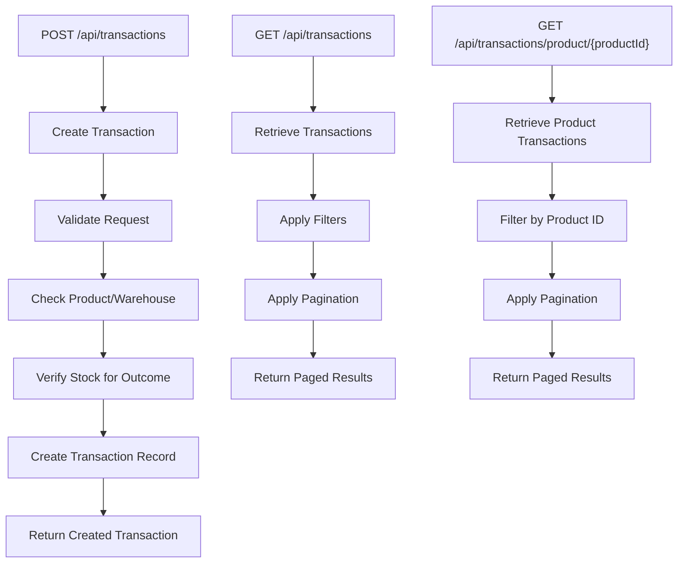
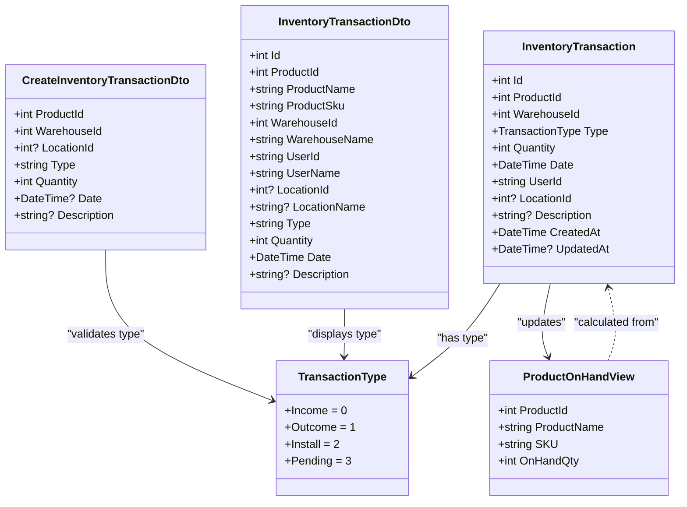
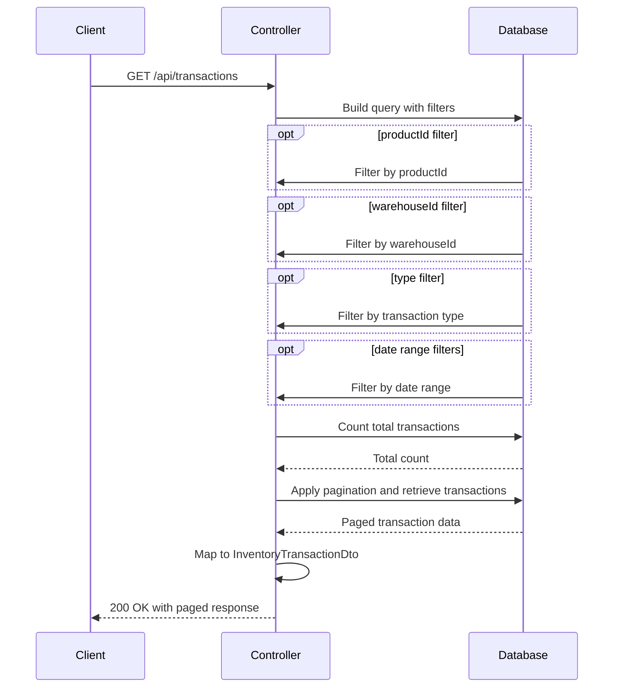

# Transaction API

<cite>
**Referenced Files in This Document**   
- [TransactionController.cs](file://src/Inventory.API/Controllers/TransactionController.cs)
- [TransactionDto.cs](file://src/Inventory.Shared/DTOs/TransactionDto.cs)
- [CreateTransactionDtoValidator.cs](file://src/Inventory.API/Validators/CreateTransactionDtoValidator.cs)
- [InventoryTransaction.cs](file://src/Inventory.API/Models/InventoryTransaction.cs)
- [ProductViews.cs](file://src/Inventory.API/Models/ProductViews.cs)
- [ApiEndpoints.cs](file://src/Inventory.Shared/Constants/ApiEndpoints.cs)
</cite>

## Table of Contents
1. [Introduction](#introduction)
2. [API Endpoints](#api-endpoints)
3. [Transaction DTO Schema](#transaction-dto-schema)
4. [Business Rules](#business-rules)
5. [Authentication and Authorization](#authentication-and-authorization)
6. [Request Examples](#request-examples)
7. [Pagination and Filtering](#pagination-and-filtering)
8. [Error Responses](#error-responses)
9. [Sequence Diagrams](#sequence-diagrams)

## Introduction

The Transaction API provides endpoints for managing inventory movements within the inventory control system. It enables users to create, retrieve, and track various types of inventory transactions including Income (restocking), Outcome (fulfillment), Install (deployment), and Pending (reserved) transactions. The system maintains accurate inventory levels by recording all movements and validating business rules before processing transactions.

**Section sources**
- [TransactionController.cs](file://src/Inventory.API/Controllers/TransactionController.cs#L9-L369)
- [ApiEndpoints.cs](file://src/Inventory.Shared/Constants/ApiEndpoints.cs#L64-L67)

## API Endpoints

The TransactionController exposes three primary endpoints for managing inventory transactions:

- **GET /api/transactions**: Retrieves a paginated list of transactions with optional filtering by product, warehouse, transaction type, and date range
- **GET /api/transactions/product/{productId}**: Retrieves all transactions for a specific product with pagination support
- **POST /api/transactions**: Creates a new inventory transaction after validating business rules and inventory availability

These endpoints follow RESTful conventions and return standardized response formats with success status, data payloads, and error information when applicable.



**Diagram sources**
- [TransactionController.cs](file://src/Inventory.API/Controllers/TransactionController.cs#L14-L368)
- [ApiEndpoints.cs](file://src/Inventory.Shared/Constants/ApiEndpoints.cs#L64-L67)

**Section sources**
- [TransactionController.cs](file://src/Inventory.API/Controllers/TransactionController.cs#L14-L368)

## Transaction DTO Schema

The API uses two primary data transfer objects for transaction operations:

### CreateInventoryTransactionDto (Request)
This DTO is used when creating new transactions and includes validation attributes:

- **ProductId** (int, required): The ID of the product being transacted
- **WarehouseId** (int, required): The ID of the warehouse where the transaction occurs
- **LocationId** (int, optional): The ID of the specific location within the warehouse
- **Type** (string, required): The transaction type (Income, Outcome, Install, or Pending)
- **Quantity** (int, required): The quantity of items transacted (must be positive)
- **Date** (DateTime, optional): The transaction date (defaults to current time if not provided)
- **Description** (string, optional): Additional details about the transaction (max 500 characters)

### InventoryTransactionDto (Response)
This DTO is returned when retrieving transactions and includes additional contextual information:

- **Id** (int): Unique transaction identifier
- **ProductId** (int): Product identifier
- **ProductName** (string): Product name for display
- **ProductSku** (string): Product SKU for identification
- **WarehouseId** (int): Warehouse identifier
- **WarehouseName** (string): Warehouse name for display
- **UserId** (string): ID of the user who created the transaction
- **UserName** (string): Name of the user who created the transaction
- **LocationId** (int): Location identifier (if applicable)
- **LocationName** (string): Location name for display (if applicable)
- **Type** (string): Transaction type as string
- **Quantity** (int): Transaction quantity
- **Date** (DateTime): Transaction date and time
- **Description** (string): Transaction description

**Section sources**
- [TransactionDto.cs](file://src/Inventory.Shared/DTOs/TransactionDto.cs#L1-L57)
- [InventoryTransaction.cs](file://src/Inventory.API/Models/InventoryTransaction.cs#L12-L38)

## Business Rules

The Transaction API enforces several business rules to maintain inventory integrity:

### Transaction Type Rules
The system supports four transaction types, each with specific business implications:

- **Income**: Increases inventory levels when goods are received (e.g., from suppliers)
- **Outcome**: Decreases inventory levels when goods are shipped or consumed
- **Install**: Records items being deployed to locations (e.g., equipment installation)
- **Pending**: Reserves inventory for future transactions (e.g., sales orders)

### Inventory Validation
The system implements strict validation to prevent inventory inconsistencies:

- All transaction quantities must be greater than zero
- For Outcome transactions, the system verifies sufficient stock is available by querying the ProductOnHandView
- Product and warehouse references are validated to ensure they exist in the system
- Location references are validated when specified
- Transaction dates cannot be in the future

The inventory level for a product is calculated as the sum of all Income transactions minus the sum of all Outcome transactions, rather than being stored as a direct quantity field.



**Diagram sources**
- [InventoryTransaction.cs](file://src/Inventory.API/Models/InventoryTransaction.cs#L4-L38)
- [TransactionDto.cs](file://src/Inventory.Shared/DTOs/TransactionDto.cs#L1-L57)
- [ProductViews.cs](file://src/Inventory.API/Models/ProductViews.cs#L12-L18)

**Section sources**
- [InventoryTransaction.cs](file://src/Inventory.API/Models/InventoryTransaction.cs#L4-L38)
- [ProductViews.cs](file://src/Inventory.API/Models/ProductViews.cs#L12-L18)
- [CreateTransactionDtoValidator.cs](file://src/Inventory.API/Validators/CreateTransactionDtoValidator.cs#L9-L40)

## Authentication and Authorization

All Transaction API endpoints require authentication via JWT (JSON Web Token). The `[Authorize]` attribute on the TransactionController ensures that only authenticated users can access these endpoints.

The system uses role-based authorization to control access to transaction operations:

- **Admin**: Full access to all transaction types and operations
- **Manager**: Access to create and view transactions, with approval requirements for certain transaction types
- **User**: Limited access to view transactions and create basic transaction types

Users must include a valid JWT in the Authorization header of their requests using the Bearer scheme. The API extracts the user ID from the token's claims to record which user created each transaction.

**Section sources**
- [TransactionController.cs](file://src/Inventory.API/Controllers/TransactionController.cs#L9-L11)
- [CreateTransactionDtoValidator.cs](file://src/Inventory.API/Validators/CreateTransactionDtoValidator.cs#L9-L40)

## Request Examples

### Creating an Income Transaction (Restock)

To restock inventory from a supplier shipment:

```http
POST /api/transactions HTTP/1.1
Content-Type: application/json
Authorization: Bearer <jwt-token>

{
  "productId": 1001,
  "warehouseId": 201,
  "locationId": 305,
  "type": "Income",
  "quantity": 50,
  "description": "Received shipment from Supplier X, PO#12345"
}
```

### Creating an Outcome Transaction (Fulfillment)

To fulfill a customer order:

```http
POST /api/transactions HTTP/1.1
Content-Type: application/json
Authorization: Bearer <jwt-token>

{
  "productId": 1001,
  "warehouseId": 201,
  "type": "Outcome",
  "quantity": 25,
  "description": "Fulfilled customer order #7890"
}
```

**Section sources**
- [TransactionController.cs](file://src/Inventory.API/Controllers/TransactionController.cs#L237-L368)
- [TransactionDto.cs](file://src/Inventory.Shared/DTOs/TransactionDto.cs#L28-L57)

## Pagination and Filtering

The GET endpoints support pagination and filtering to efficiently retrieve transaction data:

### Pagination Parameters
- **page** (int, default: 1): Page number to retrieve
- **pageSize** (int, default: 10): Number of transactions per page

### Filtering Parameters (GET /api/transactions)
- **productId** (int): Filter by specific product
- **warehouseId** (int): Filter by specific warehouse
- **type** (string): Filter by transaction type (Income, Outcome, Install, Pending)
- **startDate** (DateTime): Filter transactions from this date onward
- **endDate** (DateTime): Filter transactions up to this date

The API returns a standardized paged response format containing the transaction data, total count, current page, and page size, enabling clients to implement pagination controls.

**Section sources**
- [TransactionController.cs](file://src/Inventory.API/Controllers/TransactionController.cs#L14-L112)
- [TransactionController.cs](file://src/Inventory.API/Controllers/TransactionController.cs#L170-L235)

## Error Responses

The API returns specific error responses for various failure scenarios:

### Validation Errors (400 Bad Request)
```json
{
  "success": false,
  "errorMessage": "Insufficient stock for this transaction. Available: 10, Requested: 25",
  "errors": []
}
```

Common validation errors include:
- Invalid product or warehouse IDs
- Negative or zero quantities
- Invalid transaction types
- Future transaction dates
- Insufficient stock for Outcome transactions

### Not Found (404 Not Found)
```json
{
  "success": false,
  "errorMessage": "Transaction not found"
}
```

Returned when attempting to retrieve a transaction with a non-existent ID.

### Server Errors (500 Internal Server Error)
```json
{
  "success": false,
  "errorMessage": "Failed to retrieve transactions"
}
```

Indicates an internal server error during processing. Detailed error information is logged on the server but not exposed in the response for security reasons.

**Section sources**
- [TransactionController.cs](file://src/Inventory.API/Controllers/TransactionController.cs#L14-L368)

## Sequence Diagrams

### Transaction Creation Flow

```mermaid
sequenceDiagram
participant Client
participant Controller
participant Validator
participant Database
Client->>Controller : POST /api/transactions
Controller->>Validator : Validate request model
alt Invalid model
Validator-->>Controller : Return 400 with errors
Controller-->>Client : 400 Bad Request
deactivate Controller
end
Controller->>Database : Check Product existence
Database-->>Controller : Product found
Controller->>Database : Check Warehouse existence
Database-->>Controller : Warehouse found
opt Location specified
Controller->>Database : Check Location existence
Database-->>Controller : Location found
end
alt Transaction type is Outcome
Controller->>Database : Query ProductOnHandView
Database-->>Controller : Current quantity
alt Insufficient stock
Controller-->>Client : 400 with stock error
deactivate Controller
end
end
Controller->>Database : Create InventoryTransaction
Database-->>Controller : Transaction saved
Controller->>Database : Retrieve created transaction with related data
Database-->>Controller : Complete transaction data
Controller-->>Client : 201 Created with transaction
```

**Diagram sources**
- [TransactionController.cs](file://src/Inventory.API/Controllers/TransactionController.cs#L237-L368)
- [CreateTransactionDtoValidator.cs](file://src/Inventory.API/Validators/CreateTransactionDtoValidator.cs#L9-L40)
- [ProductViews.cs](file://src/Inventory.API/Models/ProductViews.cs#L12-L18)

### Transaction Retrieval Flow



**Diagram sources**
- [TransactionController.cs](file://src/Inventory.API/Controllers/TransactionController.cs#L14-L112)