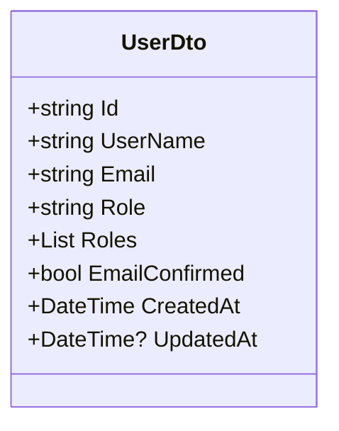
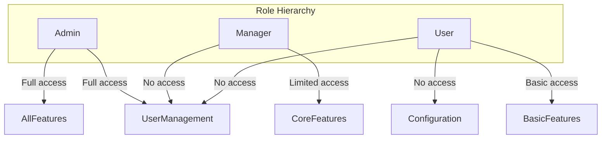
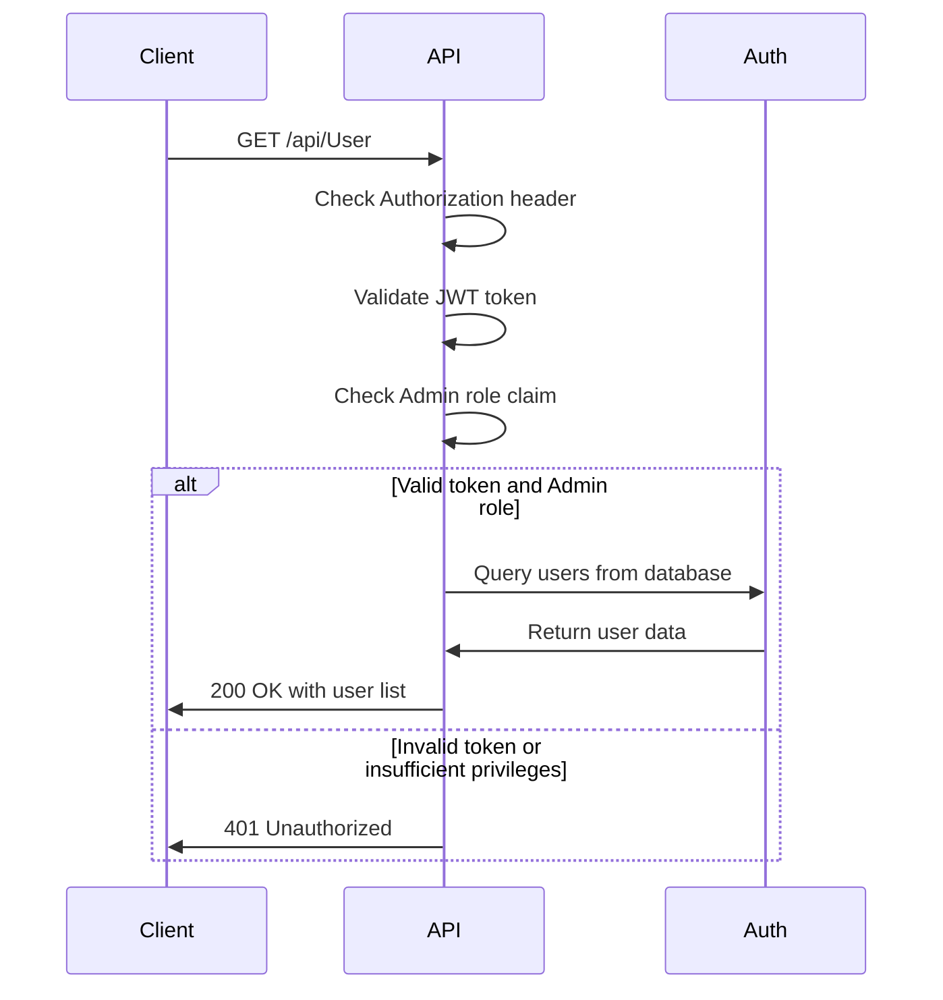
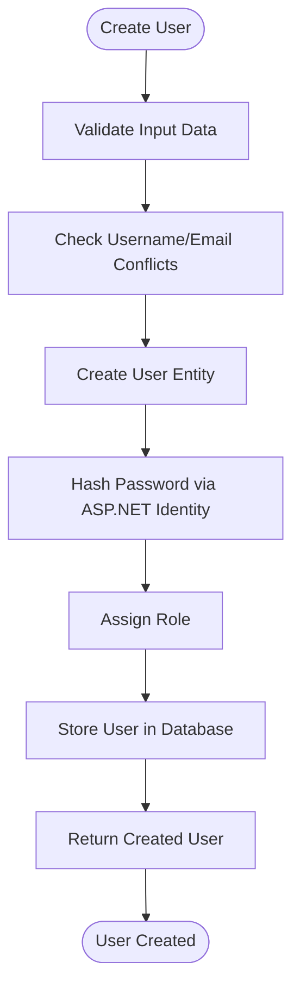
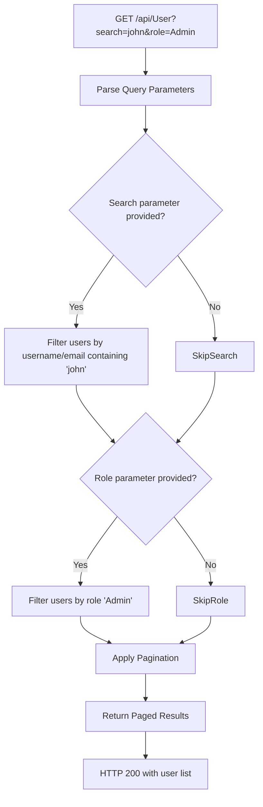
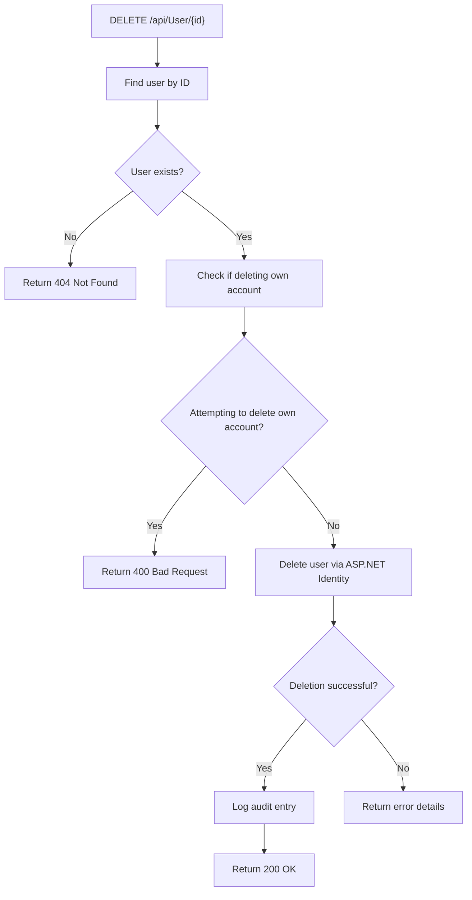

# User API

<cite>
**Referenced Files in This Document**   
- [UserController.cs](file://src/Inventory.API/Controllers/UserController.cs)
- [UserDto.cs](file://src/Inventory.Shared/DTOs/UserDto.cs)
- [User.cs](file://src/Inventory.API/Models/User.cs)
- [Program.cs](file://src/Inventory.API/Program.cs)
- [AuthenticationMiddleware.cs](file://src/Inventory.API/Middleware/AuthenticationMiddleware.cs)
</cite>

## Table of Contents
1. [Introduction](#introduction)
2. [User Management Endpoints](#user-management-endpoints)
3. [UserDto Schema](#userdto-schema)
4. [Role-Based Access Control](#role-based-access-control)
5. [Authentication and Authorization](#authentication-and-authorization)
6. [User Creation and Password Management](#user-creation-and-password-management)
7. [Search and Filtering](#search-and-filtering)
8. [Soft-Delete Implementation](#soft-delete-implementation)

## Introduction
The User API provides comprehensive user management functionality for the Inventory Control system. This documentation details the endpoints for creating, retrieving, updating, and deleting users, along with the data models, security requirements, and operational policies that govern user management operations. The API follows RESTful principles and is secured with JWT-based authentication and role-based authorization.

**Section sources**
- [UserController.cs](file://src/Inventory.API/Controllers/UserController.cs#L12-L534)

## User Management Endpoints
The UserController exposes several endpoints for managing user accounts within the system.

### GET /api/User
Retrieves a paginated list of users with optional filtering by search term or role. The endpoint requires Admin role authorization.

**Request Parameters**
- `page` (integer, default: 1): Page number for pagination
- `pageSize` (integer, default: 10): Number of users per page
- `search` (string, optional): Search term to filter users by username or email
- `role` (string, optional): Filter users by specific role

**Response**
Returns a paged response containing user data and pagination metadata.

### POST /api/User
Creates a new user account. Only users with Admin role can create new users.

**Request Body**
Requires a CreateUserDto object containing username, email, password, and role information.

**Response**
Returns the created user data with HTTP 201 Created status on success.

### PUT /api/User/{id}
Updates an existing user's information including username, email, role, and email confirmation status.

**Path Parameter**
- `id` (string): The unique identifier of the user to update

**Request Body**
Requires an UpdateUserDto object with the updated user information.

**Response**
Returns the updated user data on success.

### DELETE /api/User/{id}
Deletes a user account. The operation cannot be performed on the currently authenticated user.

**Path Parameter**
- `id` (string): The unique identifier of the user to delete

**Response**
Returns a success message on successful deletion.

**Section sources**
- [UserController.cs](file://src/Inventory.API/Controllers/UserController.cs#L46-L125)
- [UserController.cs](file://src/Inventory.API/Controllers/UserController.cs#L441-L533)
- [UserController.cs](file://src/Inventory.API/Controllers/UserController.cs#L174-L252)
- [UserController.cs](file://src/Inventory.API/Controllers/UserController.cs#L254-L309)

## UserDto Schema
The UserDto class defines the data transfer object used for user information across the API.

**Properties**
- `Id`: Unique identifier for the user
- `UserName`: User's login name
- `Email`: User's email address
- `Role`: Primary role assigned to the user
- `Roles`: Collection of roles assigned to the user
- `EmailConfirmed`: Boolean indicating whether the user's email has been confirmed
- `CreatedAt`: Timestamp when the user account was created
- `UpdatedAt`: Optional timestamp when the user account was last updated

**Diagram sources**
- [UserDto.cs](file://src/Inventory.Shared/DTOs/UserDto.cs#L4-L14)

## Role-Based Access Control
The system implements a role-based access control (RBAC) model with three primary roles: Admin, Manager, and User.

**Role Descriptions**
- **Admin**: Has full system access including user management, configuration, and all operational features
- **Manager**: Has access to core inventory management features but cannot manage users
- **User**: Has basic access to view and perform limited operations on inventory data

All user management endpoints require Admin role authorization, ensuring that only administrators can create, update, or delete user accounts.

**Section sources**
- [UserController.cs](file://src/Inventory.API/Controllers/UserController.cs#L12-L534)
- [Program.cs](file://src/Inventory.API/Program.cs#L130-L160)

## Authentication and Authorization
The User API requires JWT-based authentication for all endpoints except public authentication routes.

### Authentication Requirements
- All user management endpoints require a valid JWT token in the Authorization header
- The token must be in the format: `Bearer {token}`
- Public endpoints like login do not require authentication

### Authorization Requirements
- User management operations (CRUD) require Admin role
- Authorization is enforced using the `[Authorize(Roles = "Admin")]` attribute
- The system validates role claims from the JWT token

**Diagram sources**
- [AuthenticationMiddleware.cs](file://src/Inventory.API/Middleware/AuthenticationMiddleware.cs#L38-L75)
- [Program.cs](file://src/Inventory.API/Program.cs#L130-L160)

## User Creation and Password Management
The user creation process involves several security measures to ensure data integrity and password security.

### User Creation Process
When creating a new user:
1. Validate input data against defined constraints
2. Check for existing username and email conflicts
3. Create user entity with ASP.NET Identity
4. Hash the password using ASP.NET Identity's built-in password hashing
5. Assign the specified role to the user

### Password Policies
The system enforces the following password policies:
- Minimum length of 6 characters
- Must contain at least one digit
- Must contain at least one uppercase letter
- Must contain at least one lowercase letter

Password hashing is handled automatically by ASP.NET Identity, which uses secure hashing algorithms to store passwords in the database. The raw password is never stored, only its hashed representation.

**Section sources**
- [UserController.cs](file://src/Inventory.API/Controllers/UserController.cs#L441-L533)
- [Program.cs](file://src/Inventory.API/Program.cs#L130-L160)

## Search and Filtering
The GET /api/User endpoint supports search and filtering capabilities to help administrators locate specific users.

### Search Functionality
Users can be searched by:
- Username (partial match)
- Email address (partial match)

The search is case-insensitive and performs a contains operation on both username and email fields.

### Role Filtering
Users can be filtered by their role assignment. The endpoint accepts a role parameter and returns only users assigned to that specific role.

**Section sources**
- [UserController.cs](file://src/Inventory.API/Controllers/UserController.cs#L46-L125)

## Soft-Delete Implementation
The system implements soft-delete functionality for user accounts through the ASP.NET Identity framework.

### Deletion Process
When a user is deleted:
1. The user entity is removed from the system via userManager.DeleteAsync
2. The operation is permanent (not a traditional soft-delete with IsActive flag)
3. The user cannot authenticate or access the system after deletion

### Self-Deletion Prevention
The system prevents users from deleting their own accounts through a validation check that compares the target user ID with the currently authenticated user's ID.

### Audit Logging
All user management operations are logged for audit purposes, including:
- User creation
- User updates
- User deletions
- Password changes

The audit logs capture the user performing the action, the target user, timestamp, and action type.

**Section sources**
- [UserController.cs](file://src/Inventory.API/Controllers/UserController.cs#L254-L309)
- [User.cs](file://src/Inventory.API/Models/User.cs#L2-L11)