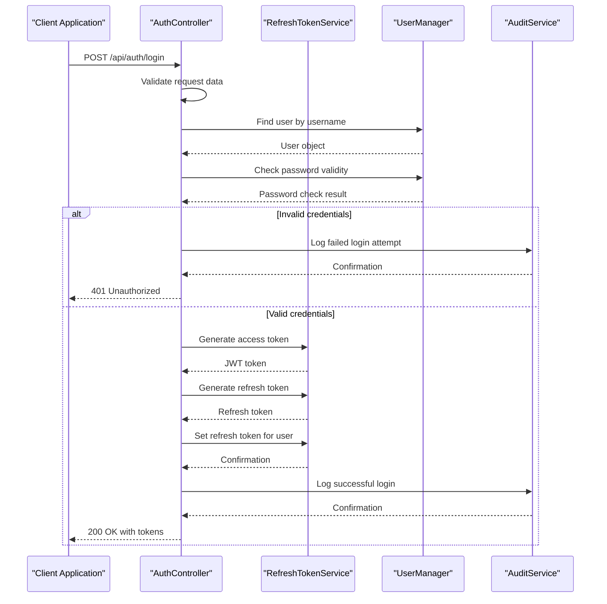
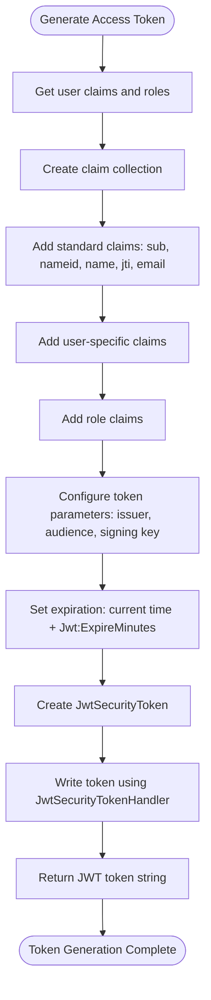
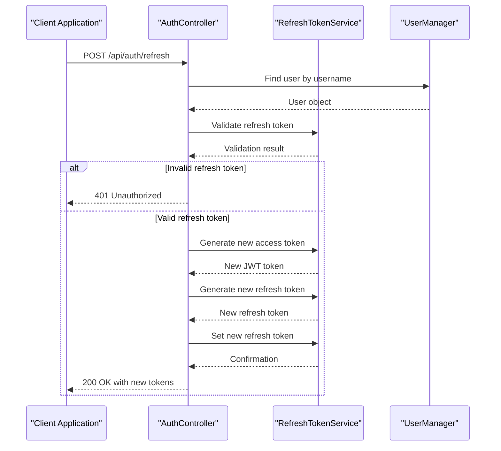
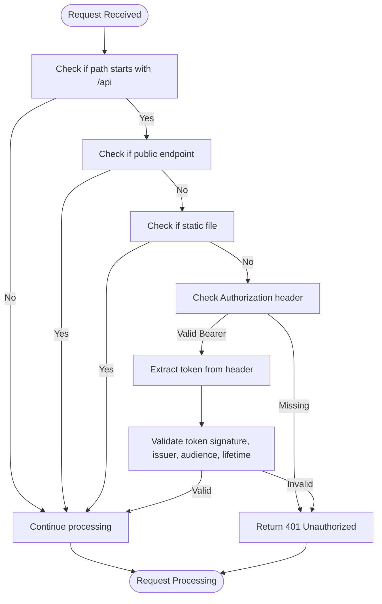
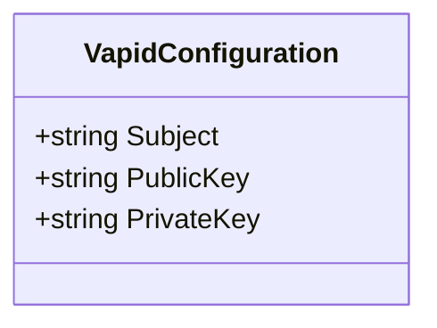

# Authentication Flow

<cite>
**Referenced Files in This Document**   
- [AuthController.cs](file://src/Inventory.API/Controllers/AuthController.cs)
- [AuthenticationMiddleware.cs](file://src/Inventory.API/Middleware/AuthenticationMiddleware.cs)
- [RefreshTokenService.cs](file://src/Inventory.API/Services/RefreshTokenService.cs)
- [VapidConfiguration.cs](file://src/Inventory.API/Configuration/VapidConfiguration.cs)
- [User.cs](file://src/Inventory.API/Models/User.cs)
- [Program.cs](file://src/Inventory.API/Program.cs)
</cite>

## Table of Contents
1. [Introduction](#introduction)
2. [Authentication Flow](#authentication-flow)
3. [Token Management](#token-management)
4. [Security Considerations](#security-considerations)
5. [Role-Based Authorization](#role-based-authorization)
6. [Error Handling](#error-handling)
7. [VAPID Configuration](#vapid-configuration)
8. [Conclusion](#conclusion)

## Introduction
The InventoryCtrl_2 system implements a comprehensive JWT-based authentication system that handles user authentication, token management, and authorization. This document details the complete authentication flow from user login to token validation and refresh, including the implementation of security features and role-based access control.

**Section sources**
- [AuthController.cs](file://src/Inventory.API/Controllers/AuthController.cs#L17-L296)
- [AuthenticationMiddleware.cs](file://src/Inventory.API/Middleware/AuthenticationMiddleware.cs#L7-L166)

## Authentication Flow



**Diagram sources**
- [AuthController.cs](file://src/Inventory.API/Controllers/AuthController.cs#L32-L132)
- [RefreshTokenService.cs](file://src/Inventory.API/Services/RefreshTokenService.cs#L141-L171)

The authentication process begins when a user submits their credentials to the AuthController's login endpoint. The system first validates that both username and password are provided. It then uses the UserManager to locate the user by username and verify the password. Upon successful authentication, the system generates both an access token and a refresh token using the RefreshTokenService. The refresh token is stored in the user record with an expiration date, while both tokens are returned to the client. The entire authentication process is logged via the AuditService for security monitoring.

**Section sources**
- [AuthController.cs](file://src/Inventory.API/Controllers/AuthController.cs#L32-L132)
- [RefreshTokenService.cs](file://src/Inventory.API/Services/RefreshTokenService.cs#L141-L171)

## Token Management

### Access Token Generation
The RefreshTokenService generates JWT access tokens containing user claims including user ID, username, email, and roles. The token includes standard JWT claims such as subject (sub), name identifier, and JWT ID (jti) for security purposes. The token's expiration is configured through the Jwt:ExpireMinutes setting, defaulting to 15 minutes if not specified.



**Diagram sources**
- [RefreshTokenService.cs](file://src/Inventory.API/Services/RefreshTokenService.cs#L141-L171)

### Refresh Token Mechanism
The refresh token mechanism allows users to obtain new access tokens without re-entering their credentials. When a client requests token refresh, the system validates the provided refresh token against the one stored in the user record, checking both the token value and expiration date. Upon successful validation, a new access token and refresh token are generated, with the new refresh token replacing the old one in the user record.



**Diagram sources**
- [AuthController.cs](file://src/Inventory.API/Controllers/AuthController.cs#L141-L164)
- [RefreshTokenService.cs](file://src/Inventory.API/Services/RefreshTokenService.cs#L59-L75)

### Token Expiration Policies
Access tokens expire after a configurable period (default 15 minutes) as specified in the Jwt:ExpireMinutes configuration setting. Refresh tokens have a longer lifespan controlled by the Jwt:RefreshTokenExpireDays setting, defaulting to 7 days. The system automatically cleans up expired refresh tokens through the CleanupExpiredTokensAsync method, which identifies and removes expired tokens from user records.

**Section sources**
- [RefreshTokenService.cs](file://src/Inventory.API/Services/RefreshTokenService.cs#L13-L172)
- [AuthController.cs](file://src/Inventory.API/Controllers/AuthController.cs#L32-L132)

## Security Considerations

### Token Validation
The AuthenticationMiddleware performs comprehensive token validation for secured API endpoints. It checks for the presence of a Bearer token in the Authorization header and validates the token's signature, issuer, audience, and expiration using the JWT configuration settings. The middleware also implements clock skew tolerance of 5 minutes to accommodate minor time differences between servers.



**Diagram sources**
- [AuthenticationMiddleware.cs](file://src/Inventory.API/Middleware/AuthenticationMiddleware.cs#L7-L166)

### Secure Transmission
All authentication endpoints require HTTPS in production environments, enforced by the UseHttpsRedirection middleware. The system protects against replay attacks by including a unique JWT ID (jti) claim in each access token, which could be used to implement token blacklisting if needed. Refresh tokens are stored securely in the database and are revoked upon user logout.

### Token Signing Key Management
The JWT signing key is configured through the Jwt:Key setting and is required in non-development environments. The system logs a warning if the key is not properly configured but continues operation in development mode. The key is used to create a SymmetricSecurityKey for signing tokens with the HmacSha256 algorithm.

**Section sources**
- [AuthenticationMiddleware.cs](file://src/Inventory.API/Middleware/AuthenticationMiddleware.cs#L7-L166)
- [Program.cs](file://src/Inventory.API/Program.cs#L346-L386)

## Role-Based Authorization

### Public vs. Secured Routes
The AuthenticationMiddleware distinguishes between public and secured routes. Public endpoints include /api/auth/login, /api/auth/register, /api/health, /health, /swagger, and /notificationHub, which do not require authentication. All other API endpoints require a valid JWT token for access.

### Role Enforcement
After successful authentication, role-based authorization is enforced through the [Authorize] attribute with role parameters on controller actions. The system extracts role information from the JWT token's claims and validates that the authenticated user has the required role to access specific endpoints. User roles are stored in the User entity and included in the JWT token during generation.

**Section sources**
- [AuthenticationMiddleware.cs](file://src/Inventory.API/Middleware/AuthenticationMiddleware.cs#L7-L166)
- [User.cs](file://src/Inventory.API/Models/User.cs#L2-L12)

## Error Handling

### Authentication Scenarios
The system handles various authentication scenarios with appropriate responses:

**Successful Authentication Example:**
```json
{
  "success": true,
  "data": {
    "token": "eyJhbGciOiJIUzI1NiIs...",
    "refreshToken": "a1b2c3d4e5f6g7h8...",
    "username": "john_doe",
    "email": "john@example.com",
    "role": "User",
    "roles": ["User"],
    "expiresAt": "2023-09-28T10:30:00Z"
  }
}
```

**Failed Authentication Examples:**
- Missing credentials: 400 Bad Request with "Username and password are required"
- Invalid credentials: 401 Unauthorized with "Invalid credentials"
- Missing or invalid token: 401 Unauthorized with "Unauthorized access. Please log in."

All authentication attempts, both successful and failed, are logged through the AuditService with detailed information including username, IP address, user agent, and timestamp.

**Section sources**
- [AuthController.cs](file://src/Inventory.API/Controllers/AuthController.cs#L32-L132)
- [AuthenticationMiddleware.cs](file://src/Inventory.API/Middleware/AuthenticationMiddleware.cs#L7-L166)

## VAPID Configuration

The VapidConfiguration class defines settings for Web Push notifications, including the subject (email address or URL), public key, and private key. These settings are used to authenticate push messages sent to web browsers. The VAPID (Voluntary Application Server Identification) keys enable the server to identify itself to push services and establish trust with client applications.



**Diagram sources**
- [VapidConfiguration.cs](file://src/Inventory.API/Configuration/VapidConfiguration.cs#L2-L7)

**Section sources**
- [VapidConfiguration.cs](file://src/Inventory.API/Configuration/VapidConfiguration.cs#L2-L7)

## Conclusion
The JWT-based authentication system in InventoryCtrl_2 provides a secure and scalable solution for user authentication and authorization. The system implements industry-standard security practices including token expiration, refresh token rotation, and comprehensive audit logging. The separation of concerns between the AuthController, RefreshTokenService, and AuthenticationMiddleware ensures maintainability and testability. The integration of role-based authorization and rate limiting further enhances the security posture of the application.