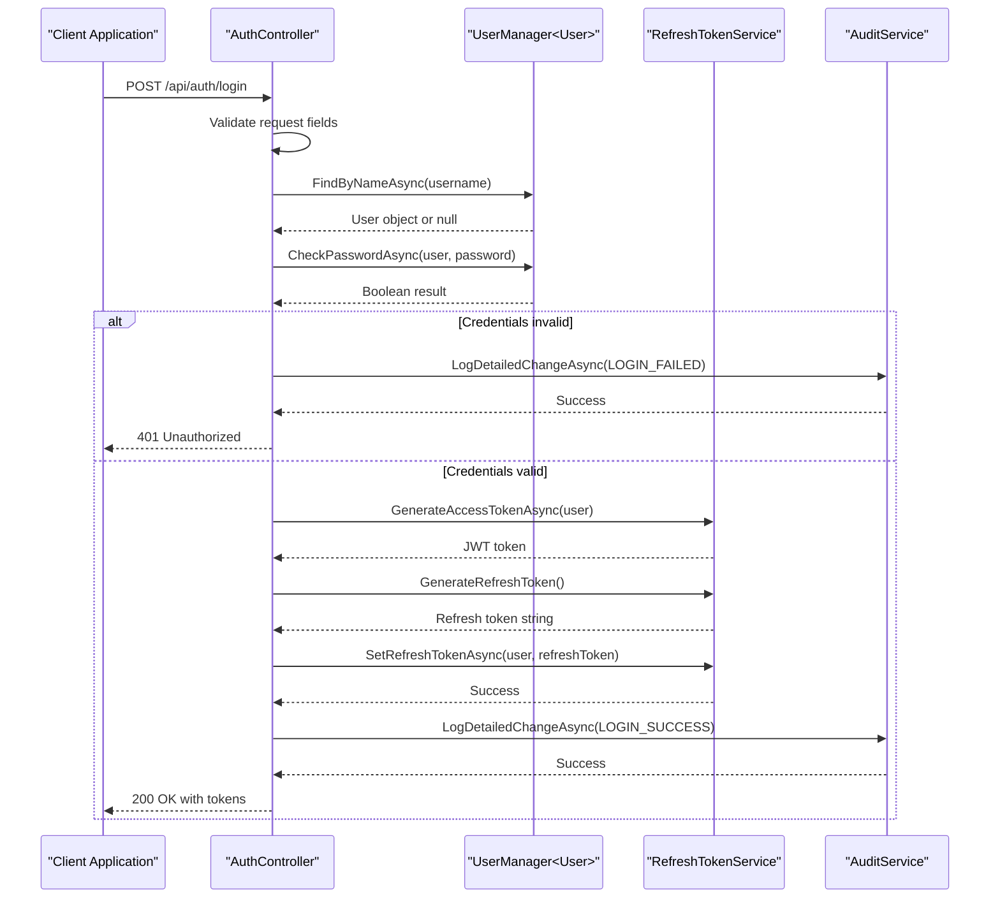
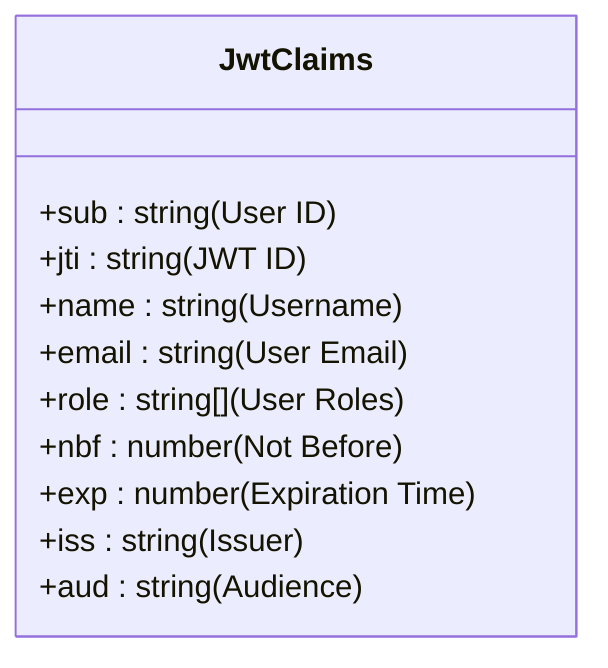

# JWT Authentication Flow

<cite>
**Referenced Files in This Document**  
- [AuthController.cs](file://src/Inventory.API/Controllers/AuthController.cs)
- [RefreshTokenService.cs](file://src/Inventory.API/Services/RefreshTokenService.cs)
- [appsettings.json](file://src/Inventory.API/appsettings.json)
- [AuditService.cs](file://src/Inventory.API/Services/AuditService.cs)
- [User.cs](file://src/Inventory.API/Models/User.cs)
- [AuthDto.cs](file://src/Inventory.Shared/DTOs/AuthDto.cs)
- [LoginRequestValidator.cs](file://src/Inventory.API/Validators/LoginRequestValidator.cs)
</cite>

## Table of Contents
1. [Introduction](#introduction)
2. [Authentication Flow Overview](#authentication-flow-overview)
3. [Login Process](#login-process)
4. [JWT Token Structure](#jwt-token-structure)
5. [Configuration Parameters](#configuration-parameters)
6. [Response Examples](#response-examples)
7. [Error Handling](#error-handling)
8. [Security Features](#security-features)
9. [Audit Logging](#audit-logging)
10. [Conclusion](#conclusion)

## Introduction

This document details the JWT authentication flow in the InventoryCtrl_2 application, focusing on the login process implemented in the AuthController. The system uses ASP.NET Identity for user management and authentication, with JWT tokens for stateless authentication. The authentication process includes credential validation, token generation, role-based claims, audit logging, and integration with rate limiting and Serilog for comprehensive security and monitoring.

**Section sources**
- [AuthController.cs](file://src/Inventory.API/Controllers/AuthController.cs#L17-L296)
- [RefreshTokenService.cs](file://src/Inventory.API/Services/RefreshTokenService.cs#L13-L172)

## Authentication Flow Overview

The JWT authentication flow in InventoryCtrl_2 follows a standard pattern with additional security and auditing features. When a user attempts to log in, the system validates credentials using ASP.NET Identity, generates a JWT access token and refresh token, and returns them to the client. The flow includes rate limiting, comprehensive logging, and proper error handling for various failure scenarios.



**Diagram sources**
- [AuthController.cs](file://src/Inventory.API/Controllers/AuthController.cs#L32-L132)
- [RefreshTokenService.cs](file://src/Inventory.API/Services/RefreshTokenService.cs#L141-L171)
- [AuditService.cs](file://src/Inventory.API/Services/AuditService.cs#L100-L150)

## Login Process

The login process begins with a POST request to the `/api/auth/login` endpoint in the AuthController. The process involves several steps to ensure secure authentication and proper user management.

### Request Validation

The login process first validates the incoming request to ensure all required fields are present and meet validation criteria. The LoginRequestValidator enforces rules such as:
- Username must be 3-50 characters long
- Username can only contain letters, numbers, and underscores
- Password must be 6-100 characters long

If validation fails, the system returns a 400 Bad Request response with appropriate error messages.

### Credential Validation

The system uses ASP.NET Identity's UserManager to validate user credentials. The process involves:
1. Finding the user by username using `FindByNameAsync`
2. Checking the password using `CheckPasswordAsync`

The system logs the outcome of both operations for debugging and security monitoring purposes.

### Token Generation

Upon successful authentication, the system generates both an access token and a refresh token:
- The access token is generated by the RefreshTokenService using `GenerateAccessTokenAsync`
- The refresh token is generated by the RefreshTokenService using `GenerateRefreshToken`
- The refresh token is stored in the user record with an expiration date

**Section sources**
- [AuthController.cs](file://src/Inventory.API/Controllers/AuthController.cs#L32-L132)
- [LoginRequestValidator.cs](file://src/Inventory.API/Validators/LoginRequestValidator.cs#L1-L31)
- [RefreshTokenService.cs](file://src/Inventory.API/Services/RefreshTokenService.cs#L20-L25)

## JWT Token Structure

The JWT access token generated by the system contains several standard and custom claims that provide information about the authenticated user.

### Claims Structure

The token includes the following claims:



**Diagram sources**
- [RefreshTokenService.cs](file://src/Inventory.API/Services/RefreshTokenService.cs#L141-L171)
- [User.cs](file://src/Inventory.API/Models/User.cs#L1-L12)

### Claim Details

The JWT token includes the following specific claims:

| Claim | Value | Description |
|-------|-------|-------------|
| `sub` | User.Id | Subject identifier (user's unique ID) |
| `jti` | Guid.NewGuid().ToString() | JWT ID for unique token identification |
| `name` | user.UserName | User's username |
| `email` | user.Email | User's email address |
| `role` | roles.Select(role => role) | Array of user roles |
| `nbf` | Current time | Not before timestamp |
| `exp` | Current time + expiration | Expiration timestamp |
| `iss` | Jwt:Issuer from config | Token issuer |
| `aud` | Jwt:Audience from config | Token audience |

The claims are assembled from multiple sources:
- User properties from the User entity
- Roles from ASP.NET Identity's role management
- Configuration values from appsettings.json

**Section sources**
- [RefreshTokenService.cs](file://src/Inventory.API/Services/RefreshTokenService.cs#L141-L171)

## Configuration Parameters

The JWT authentication system is configured through settings in the appsettings.json file, allowing for flexible configuration without code changes.

### JWT Configuration

The JWT configuration section in appsettings.json defines key parameters for token generation and validation:

```json
"Jwt": {
    "Key": "__SET_IN_ENV__",
    "Issuer": "InventoryServer",
    "Audience": "InventoryClient",
    "ExpireMinutes": 15,
    "RefreshTokenExpireDays": 7
}
```

### Parameter Details

| Parameter | Value | Description |
|---------|-------|-------------|
| Jwt:Key | `__SET_IN_ENV__` | Secret key for signing tokens (should be set in environment variables) |
| Jwt:Issuer | `InventoryServer` | Identifies the entity that issued the JWT |
| Jwt:Audience | `InventoryClient` | Identifies the recipients that the JWT is intended for |
| Jwt:ExpireMinutes | `15` | Token expiration time in minutes |
| Jwt:RefreshTokenExpireDays | `7` | Refresh token expiration time in days |

The system uses these configuration values when generating tokens, with fallback defaults if values are missing (e.g., 15 minutes for token expiration).

**Section sources**
- [appsettings.json](file://src/Inventory.API/appsettings.json#L5-L11)
- [RefreshTokenService.cs](file://src/Inventory.API/Services/RefreshTokenService.cs#L141-L171)

## Response Examples

The authentication system returns standardized responses for both successful and failed login attempts.

### Successful Login Response

When authentication succeeds, the system returns a 200 OK response with the following structure:

```json
{
  "success": true,
  "data": {
    "token": "eyJhbGciOiJIUzI1NiIsInR5cCI6IkpXVCJ9...",
    "refreshToken": "a1b2c3d4e5f6g7h8i9j0k1l2m3n4o5p6...",
    "username": "john_doe",
    "email": "john.doe@example.com",
    "role": "User",
    "roles": ["User"],
    "expiresAt": "2025-01-01T12:00:00Z"
  },
  "timestamp": "2025-01-01T11:45:00Z",
  "requestId": "abc123-def456-ghi789"
}
```

### Failed Login Response

When authentication fails due to invalid credentials, the system returns a 401 Unauthorized response:

```json
{
  "success": false,
  "errorMessage": "Invalid credentials",
  "errors": [],
  "timestamp": "2025-01-01T11:45:00Z",
  "requestId": "abc123-def456-ghi789",
  "statusCode": 401
}
```

### Missing Fields Response

When required fields are missing from the request, the system returns a 400 Bad Request response:

```json
{
  "success": false,
  "errorMessage": "Username and password are required",
  "errors": [],
  "timestamp": "2025-01-01T11:45:00Z",
  "requestId": "abc123-def456-ghi789",
  "statusCode": 400
}
```

**Section sources**
- [AuthDto.cs](file://src/Inventory.Shared/DTOs/AuthDto.cs#L4-L13)
- [AuthController.cs](file://src/Inventory.API/Controllers/AuthController.cs#L32-L132)

## Error Handling

The system implements comprehensive error handling for various authentication failure scenarios.

### Invalid Credentials

When a user provides incorrect username or password, the system:
1. Logs the failed attempt with detailed information
2. Returns a 401 Unauthorized response
3. Does not distinguish between invalid username and invalid password (security best practice)

### Missing Fields

When required fields (username or password) are missing or empty, the system:
1. Validates the request using FluentValidation
2. Returns a 400 Bad Request response with appropriate error message
3. Logs a warning with the attempted username (if provided)

### Rate Limiting

The authentication endpoint is protected by rate limiting using the "AuthPolicy" to prevent brute force attacks. The system limits the number of login attempts from a single IP address within a specified time window.

**Section sources**
- [AuthController.cs](file://src/Inventory.API/Controllers/AuthController.cs#L32-L132)
- [LoginRequestValidator.cs](file://src/Inventory.API/Validators/LoginRequestValidator.cs#L1-L31)

## Security Features

The authentication system incorporates several security features to protect against common attacks and ensure system integrity.

### Rate Limiting

The login endpoint is protected by rate limiting using the `[EnableRateLimiting("AuthPolicy")]` attribute. This prevents brute force attacks by limiting the number of login attempts from a single client within a specified time period.

### Refresh Token Management

The system uses refresh tokens to allow users to obtain new access tokens without re-entering credentials. Key security features include:
- Refresh tokens are stored in the database with the user record
- Refresh tokens have a configurable expiration (7 days by default)
- Refresh tokens are invalidated after use (one-time use)
- Users can have only one active refresh token at a time

### Secure Token Generation

Access tokens are generated using industry-standard practices:
- HMAC-SHA256 for signing
- Random JWT IDs (jti) to prevent replay attacks
- Short expiration times (15 minutes by default)
- Secure storage of the signing key in environment variables

**Section sources**
- [AuthController.cs](file://src/Inventory.API/Controllers/AuthController.cs#L17-L296)
- [RefreshTokenService.cs](file://src/Inventory.API/Services/RefreshTokenService.cs#L13-L172)

## Audit Logging

The system implements comprehensive audit logging for all authentication activities using the AuditService.

### Successful Login Logging

When a user successfully logs in, the system logs detailed information including:
- Username and email
- User role
- Login timestamp
- Client IP address
- User agent string
- Token expiration time
- Request ID for correlation

### Failed Login Logging

When a login attempt fails, the system logs:
- Attempted username
- Reason for failure ("Invalid credentials")
- Attempt timestamp
- Client IP address
- User agent string
- Request ID for correlation

### Log Structure

The audit logs are stored in the database with the following key fields:
- EntityName: "User"
- EntityId: User ID (or "Unknown" for failed attempts)
- Action: "LOGIN_SUCCESS" or "LOGIN_FAILED"
- ActionType: ActionType.Login
- EntityType: "User"
- UserId: ID of the user performing the action
- Username: Username of the user
- Severity: "INFO" for success, "WARNING" for failure
- IsSuccess: true for success, false for failure
- Changes: JSON containing detailed information about the login attempt
- IpAddress: Client IP address
- UserAgent: Client user agent string
- HttpMethod: "POST"
- Url: "/api/auth/login"
- StatusCode: 200 for success, 401 for failure

**Section sources**
- [AuthController.cs](file://src/Inventory.API/Controllers/AuthController.cs#L32-L132)
- [AuditService.cs](file://src/Inventory.API/Services/AuditService.cs#L100-L150)

## Conclusion

The JWT authentication flow in InventoryCtrl_2 provides a secure and robust mechanism for user authentication with comprehensive logging and error handling. The system leverages ASP.NET Identity for user management, generates JWT tokens with appropriate claims, and implements security features like rate limiting and refresh token management. The integration with audit logging ensures that all authentication activities are properly recorded for security monitoring and compliance purposes. The configuration-driven approach allows for flexible adjustment of token parameters without code changes, making the system adaptable to different security requirements.