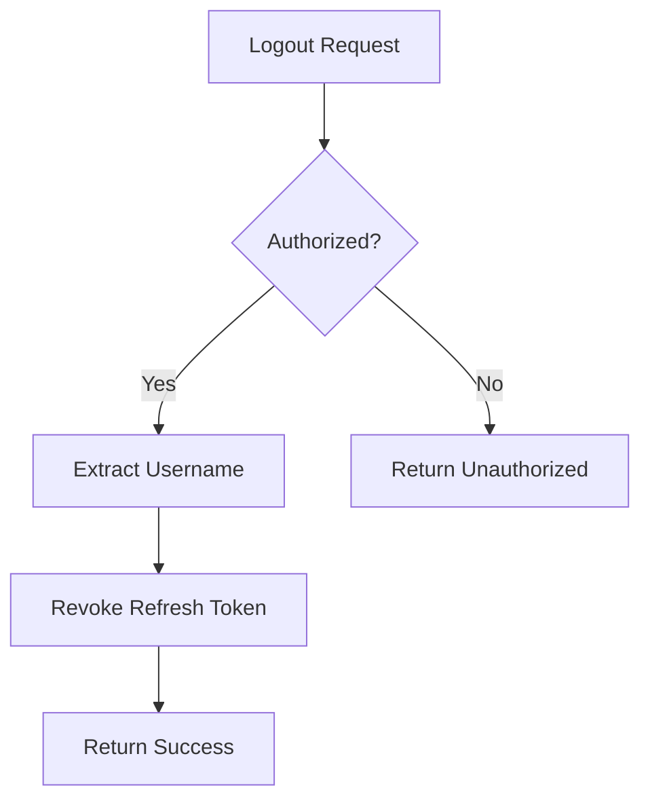
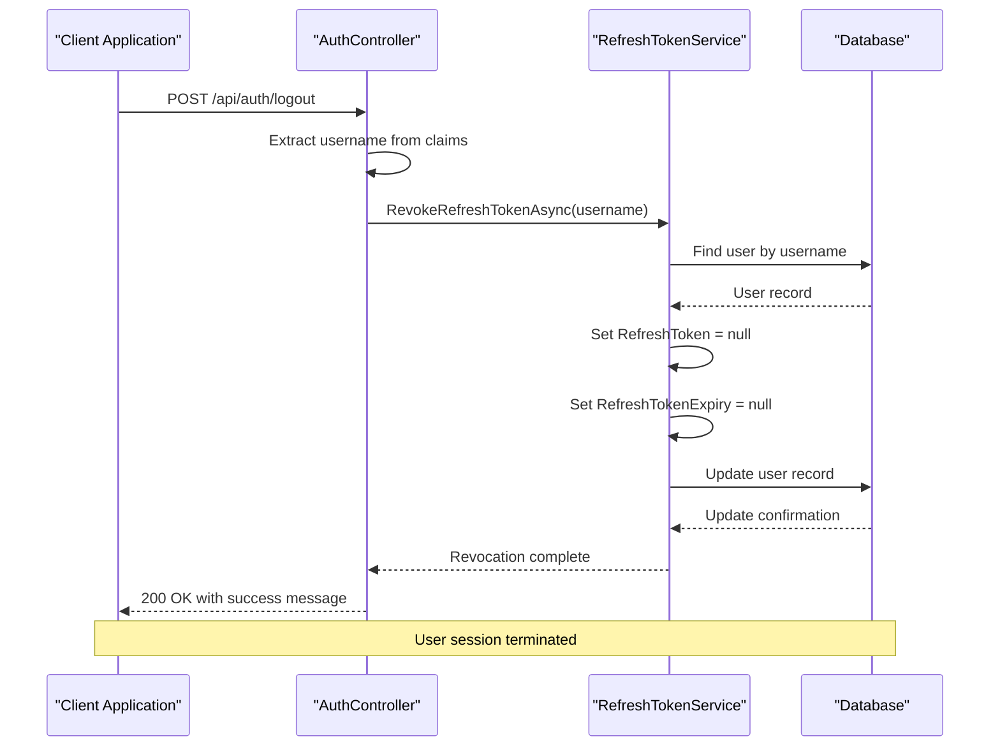

# Logout and Token Revocation

<cite>
**Referenced Files in This Document**   
- [AuthController.cs](file://src/Inventory.API/Controllers/AuthController.cs)
- [RefreshTokenService.cs](file://src/Inventory.API/Services/RefreshTokenService.cs)
- [User.cs](file://src/Inventory.API/Models/User.cs)
</cite>

## Table of Contents
1. [Logout and Token Revocation](#logout-and-token-revocation)
2. [Logout Endpoint Implementation](#logout-endpoint-implementation)
3. [Token Revocation Mechanism](#token-revocation-mechanism)
4. [Claims-Based Authentication](#claims-based-authentication)
5. [Security Implications](#security-implications)
6. [Session Management](#session-management)
7. [Response Examples](#response-examples)
8. [Access Token Strategy](#access-token-strategy)

## Logout Endpoint Implementation

The logout functionality in InventoryCtrl_2 is implemented through the AuthController's Logout endpoint, which provides a secure mechanism for users to terminate their sessions. The endpoint is designed with proper authorization requirements and follows RESTful principles for clean API design.



**Diagram sources**
- [AuthController.cs](file://src/Inventory.API/Controllers/AuthController.cs#L198-L212)

**Section sources**
- [AuthController.cs](file://src/Inventory.API/Controllers/AuthController.cs#L198-L212)

## Token Revocation Mechanism

The token revocation process is handled by the RefreshTokenService, which implements a database-based approach to invalidate user sessions. When a user logs out, the system revokes their refresh token by setting it to null in the database along with clearing the expiration timestamp.

The mechanism works as follows:
1. The RefreshTokenService receives the username from the AuthController
2. It locates the corresponding user record in the database
3. Both the refresh token and its expiration date are set to null
4. The updated user record is persisted to the database

This approach effectively prevents future token refresh attempts, as any subsequent refresh requests will fail validation due to the missing token value.



**Diagram sources**
- [AuthController.cs](file://src/Inventory.API/Controllers/AuthController.cs#L198-L212)
- [RefreshTokenService.cs](file://src/Inventory.API/Services/RefreshTokenService.cs#L134-L154)

**Section sources**
- [RefreshTokenService.cs](file://src/Inventory.API/Services/RefreshTokenService.cs#L134-L154)

## Claims-Based Authentication

The logout process leverages claims-based authentication to identify the current user. When an authorized user makes a logout request, the system extracts the username from the authentication claims present in the JWT token.

The User.Identity?.Name property accesses the claims principal associated with the current HTTP request, specifically retrieving the Name claim which contains the authenticated user's username. This approach ensures that users can only revoke their own refresh tokens, preventing unauthorized session termination of other users.

The claims-based approach provides several advantages:
- No need to pass username explicitly in the logout request
- Built-in security through token validation
- Consistent user identification across the application
- Protection against session hijacking

**Section sources**
- [AuthController.cs](file://src/Inventory.API/Controllers/AuthController.cs#L199-L200)

## Security Implications

The token revocation mechanism in InventoryCtrl_2 has significant security implications for the overall system integrity. By immediately invalidating refresh tokens upon logout, the system ensures that:

1. **Session Termination**: User sessions are definitively terminated, preventing unauthorized access even if the device is compromised after logout.

2. **Refresh Token Protection**: The primary attack vector for long-term unauthorized access (refresh token theft) is mitigated by immediate revocation.

3. **Database Consistency**: Token state is maintained in the database rather than relying solely on client-side token disposal, ensuring server-side control over authentication state.

4. **Audit Trail**: The logout operation is logged through the application's logging framework, providing an audit trail for security monitoring.

5. **Race Condition Prevention**: By updating both the refresh token and its expiration date atomically, the system prevents potential race conditions during concurrent requests.

The implementation follows security best practices by not requiring additional authentication parameters beyond the existing JWT, reducing the attack surface while maintaining security.

**Section sources**
- [AuthController.cs](file://src/Inventory.API/Controllers/AuthController.cs#L198-L212)
- [RefreshTokenService.cs](file://src/Inventory.API/Services/RefreshTokenService.cs#L134-L154)

## Session Management

The logout and token revocation mechanism is a critical component of the overall session management strategy in InventoryCtrl_2. The system implements a hybrid approach that combines short-lived access tokens with revocable refresh tokens.

When a user logs out:
- The refresh token is immediately revoked in the database
- Any active access tokens remain valid until their natural expiration
- Future refresh attempts are blocked due to the null refresh token

This approach balances security with performance considerations. The immediate revocation of refresh tokens ensures that new sessions cannot be established after logout, while allowing existing access tokens to expire naturally reduces database load and avoids the complexity of maintaining a token blacklist.

The User entity in the database serves as the authoritative source for refresh token state, with the RefreshToken and RefreshTokenExpiry properties providing the necessary fields for token management.

```mermaid
erDiagram
USER {
string Id PK
string UserName UK
string Email UK
string Role
datetime CreatedAt
datetime? UpdatedAt
string? RefreshToken
datetime? RefreshTokenExpiry
}
```

**Diagram sources**
- [User.cs](file://src/Inventory.API/Models/User.cs#L7-L8)

**Section sources**
- [User.cs](file://src/Inventory.API/Models/User.cs#L1-L12)

## Response Examples

The Logout endpoint returns standardized responses in accordance with the application's API response pattern. Upon successful logout, the endpoint returns a 200 OK status with a success response body.

**Successful Logout Response**
```json
{
  "success": true,
  "data": {
    "message": "Logged out successfully"
  },
  "error": null
}
```

The response structure uses the ApiResponse wrapper that is consistent across the application's API endpoints. This provides a uniform interface for client applications to handle responses.

In cases where the user is not authorized (missing or invalid JWT token), the endpoint returns a 401 Unauthorized status without a response body, as handled by the ASP.NET Core authentication middleware.

**Section sources**
- [AuthController.cs](file://src/Inventory.API/Controllers/AuthController.cs#L210-L212)

## Access Token Strategy

InventoryCtrl_2 employs a deliberate strategy regarding access token invalidation during logout. Unlike refresh tokens, access tokens are not explicitly invalidated in the database or through a blacklist mechanism.

This design decision is based on several factors:

1. **Short Expiration**: Access tokens have a short lifespan (15 minutes by default), making explicit invalidation less critical from a security perspective.

2. **Performance**: Avoiding database writes for every logout operation improves performance and scalability.

3. **Simplicity**: The system avoids the complexity of maintaining a token blacklist or revocation list.

4. **Stateless Authentication**: The JWT-based authentication remains largely stateless, with validation based on cryptographic signatures and expiration timestamps.

The security model relies on the fact that even if an access token remains technically valid after logout, its short lifespan limits the window of opportunity for misuse. Additionally, the revocation of the refresh token ensures that no new access tokens can be obtained after logout.

This approach represents a balanced trade-off between security, performance, and implementation complexity, aligning with common industry practices for JWT-based authentication systems.