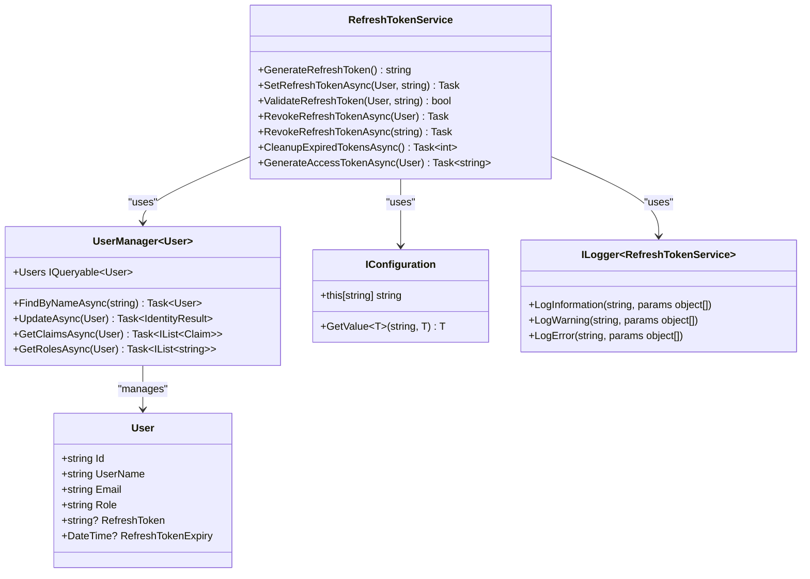
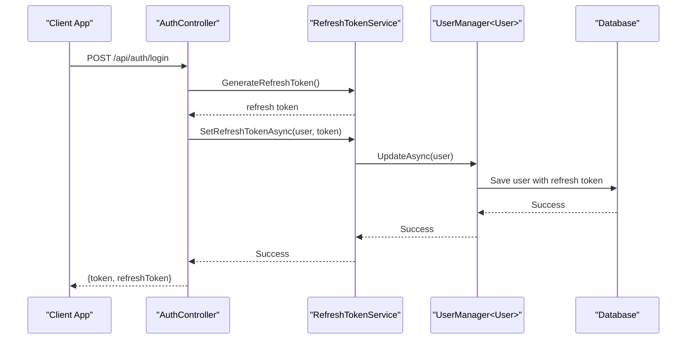
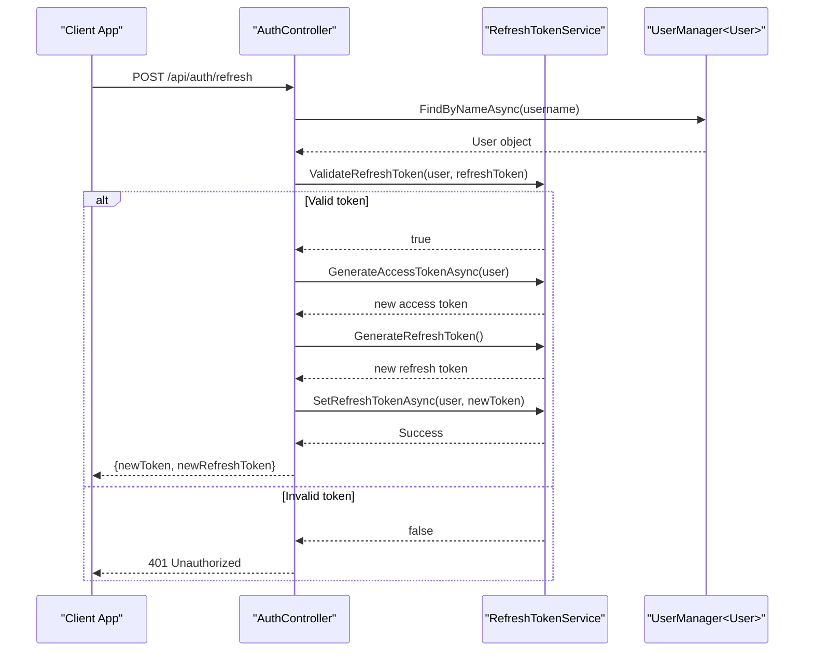
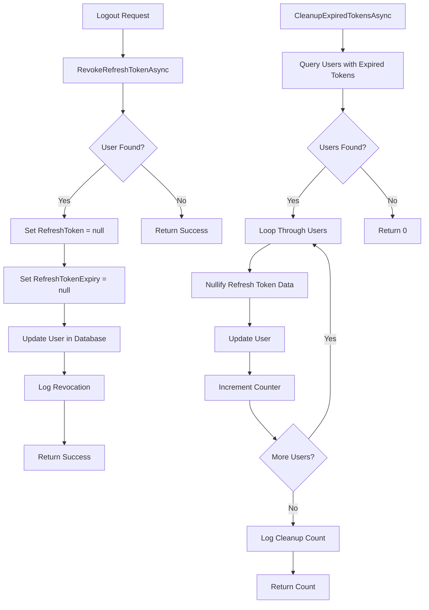
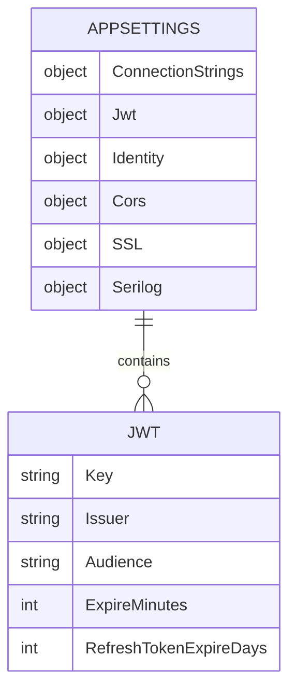

# Refresh Token Service

<cite>
**Referenced Files in This Document**   
- [RefreshTokenService.cs](file://src/Inventory.API/Services/RefreshTokenService.cs)
- [User.cs](file://src/Inventory.API/Models/User.cs)
- [appsettings.json](file://src/Inventory.API/appsettings.json)
- [AuthController.cs](file://src/Inventory.API/Controllers/AuthController.cs)
</cite>

## Table of Contents
1. [Introduction](#introduction)
2. [Core Components](#core-components)
3. [Architecture Overview](#architecture-overview)
4. [Detailed Component Analysis](#detailed-component-analysis)
5. [Security Considerations](#security-considerations)
6. [Configuration Parameters](#configuration-parameters)
7. [Logging and Auditability](#logging-and-auditability)
8. [Integration Points](#integration-points)

## Introduction

The RefreshTokenService class is a critical component in the InventoryCtrl_2 application's authentication system, responsible for managing the lifecycle of refresh tokens. This service enables secure token-based authentication by providing mechanisms for token generation, validation, persistence, and cleanup. The service integrates with ASP.NET Identity's UserManager<User> to store and retrieve token information from the database, ensuring that user sessions can be maintained securely across application restarts and token expirations.

**Section sources**
- [RefreshTokenService.cs](file://src/Inventory.API/Services/RefreshTokenService.cs#L13-L172)

## Core Components

The RefreshTokenService class implements a comprehensive refresh token management system with five primary methods: GenerateRefreshToken, SetRefreshTokenAsync, ValidateRefreshToken, RevokeRefreshTokenAsync, and CleanupExpiredTokensAsync. These methods work together to provide a secure and reliable token lifecycle management system. The service also includes a GenerateAccessTokenAsync method that creates JWT tokens for authenticated users.

The service depends on three key components: UserManager<User> for user data access and updates, IConfiguration for retrieving configuration settings, and ILogger<RefreshTokenService> for logging operations. These dependencies are injected through the constructor, following the dependency injection pattern.

**Section sources**
- [RefreshTokenService.cs](file://src/Inventory.API/Services/RefreshTokenService.cs#L13-L172)

## Architecture Overview

**Diagram sources**
- [RefreshTokenService.cs](file://src/Inventory.API/Services/RefreshTokenService.cs#L13-L172)
- [User.cs](file://src/Inventory.API/Models/User.cs#L1-L12)

## Detailed Component Analysis

### Refresh Token Generation and Management

The RefreshTokenService provides a complete implementation for managing refresh tokens throughout their lifecycle, from generation to cleanup.

#### Token Generation and Persistence

**Diagram sources**
- [RefreshTokenService.cs](file://src/Inventory.API/Services/RefreshTokenService.cs#L25-L45)
- [AuthController.cs](file://src/Inventory.API/Controllers/AuthController.cs#L50-L100)

#### Token Validation and Refresh Flow

**Diagram sources**
- [RefreshTokenService.cs](file://src/Inventory.API/Services/RefreshTokenService.cs#L75-L115)
- [AuthController.cs](file://src/Inventory.API/Controllers/AuthController.cs#L150-L200)

#### Token Revocation and Cleanup

**Diagram sources**
- [RefreshTokenService.cs](file://src/Inventory.API/Services/RefreshTokenService.cs#L117-L155)

### Method-Level Analysis

#### GenerateRefreshToken Method
The GenerateRefreshToken method creates cryptographically secure refresh tokens using the RandomNumberGenerator class. It generates 64 random bytes and converts them to a base64-encoded string, resulting in a 88-character token that provides sufficient entropy for security.

**Section sources**
- [RefreshTokenService.cs](file://src/Inventory.API/Services/RefreshTokenService.cs#L25-L32)

#### SetRefreshTokenAsync Method
This method persists refresh tokens to the database by updating the user entity with the token value and its expiration time. The expiration period is configurable through the Jwt:RefreshTokenExpireDays setting, with a default of 7 days. After updating the user, the method logs the operation for audit purposes.

**Section sources**
- [RefreshTokenService.cs](file://src/Inventory.API/Services/RefreshTokenService.cs#L35-L50)

#### ValidateRefreshToken Method
The validation process checks two critical conditions: token value equality and expiration status. The method compares the provided token with the stored token and verifies that the expiration time has not passed. Both checks include appropriate logging to track validation outcomes.

**Section sources**
- [RefreshTokenService.cs](file://src/Inventory.API/Services/RefreshTokenService.cs#L53-L72)

#### RevokeRefreshTokenAsync Methods
The service provides two overloads for token revocation: one that accepts a User object and another that accepts a username. Both methods nullify the refresh token and its expiration time in the user record, effectively invalidating the token. This is typically called during logout operations.

**Section sources**
- [RefreshTokenService.cs](file://src/Inventory.API/Services/RefreshTokenService.cs#L75-L105)

#### CleanupExpiredTokensAsync Method
This background maintenance method identifies and removes expired refresh tokens from all users. It queries the database for users with expired tokens and nullifies their token data. The method returns a count of cleaned tokens and logs the operation when cleanup occurs.

**Section sources**
- [RefreshTokenService.cs](file://src/Inventory.API/Services/RefreshTokenService.cs#L108-L155)

#### GenerateAccessTokenAsync Method
Although primarily a refresh token service, this method also generates JWT access tokens for users. It creates a token with standard claims (subject, name identifier, name, JWT ID, email) as well as user-specific claims and role information retrieved through UserManager methods.

**Section sources**
- [RefreshTokenService.cs](file://src/Inventory.API/Services/RefreshTokenService.cs#L158-L172)

## Security Considerations

The RefreshTokenService implements several security measures to protect against token leakage and unauthorized access. The use of RandomNumberGenerator ensures that refresh tokens are cryptographically secure and unpredictable. Base64 encoding is used for token representation, which is a standard practice for transmitting binary data in text-based protocols.

Tokens are stored securely in the database through the User entity's RefreshToken property, with the corresponding expiration time stored in RefreshTokenExpiry. This design prevents the use of expired tokens and limits the window of opportunity for token misuse.

The service protects against token leakage through comprehensive logging that records token operations without exposing token values in log messages. The validation process includes checks for both token value and expiration, preventing the use of compromised or outdated tokens.

**Section sources**
- [RefreshTokenService.cs](file://src/Inventory.API/Services/RefreshTokenService.cs#L25-L172)
- [User.cs](file://src/Inventory.API/Models/User.cs#L1-L12)

## Configuration Parameters

The service relies on configuration settings defined in the application's configuration files, particularly the Jwt:RefreshTokenExpireDays parameter that determines the lifespan of refresh tokens.

**Diagram sources**
- [appsettings.json](file://src/Inventory.API/appsettings.json#L1-L74)

The Jwt:RefreshTokenExpireDays setting defaults to 7 days if not explicitly configured. This value is retrieved using IConfiguration.GetValue<int> with a default parameter, ensuring the application remains functional even if the setting is missing.

**Section sources**
- [RefreshTokenService.cs](file://src/Inventory.API/Services/RefreshTokenService.cs#L37-L38)
- [appsettings.json](file://src/Inventory.API/appsettings.json#L6-L12)

## Logging and Auditability

The service implements comprehensive logging practices to ensure auditability of all token operations. Each significant operation is logged with appropriate severity levels:

- Informational logs for successful operations (token generation, validation, and cleanup)
- Warning logs for validation failures and expired tokens
- Structured logging with user identifiers and timestamps for traceability

The logging includes user identifiers in log messages (e.g., "Refresh token set for user {UserId}") which enables correlation with other audit logs in the system. This approach supports security investigations and operational monitoring.

**Section sources**
- [RefreshTokenService.cs](file://src/Inventory.API/Services/RefreshTokenService.cs#L48-L50)
- [RefreshTokenService.cs](file://src/Inventory.API/Services/RefreshTokenService.cs#L62-L64)
- [RefreshTokenService.cs](file://src/Inventory.API/Services/RefreshTokenService.cs#L98-L100)
- [RefreshTokenService.cs](file://src/Inventory.API/Services/RefreshTokenService.cs#L148-L150)

## Integration Points

The RefreshTokenService is integrated with the application's authentication flow through the AuthController, which uses the service to manage tokens during login, refresh, and logout operations. The service depends on ASP.NET Identity's UserManager<User> for user data access and persistence, leveraging its asynchronous methods for database operations.

The User entity has been extended with RefreshToken and RefreshTokenExpiry properties to support the token management functionality, demonstrating a clean integration between the service layer and data model.

**Section sources**
- [RefreshTokenService.cs](file://src/Inventory.API/Services/RefreshTokenService.cs#L13-L172)
- [AuthController.cs](file://src/Inventory.API/Controllers/AuthController.cs#L50-L250)
- [User.cs](file://src/Inventory.API/Models/User.cs#L1-L12)