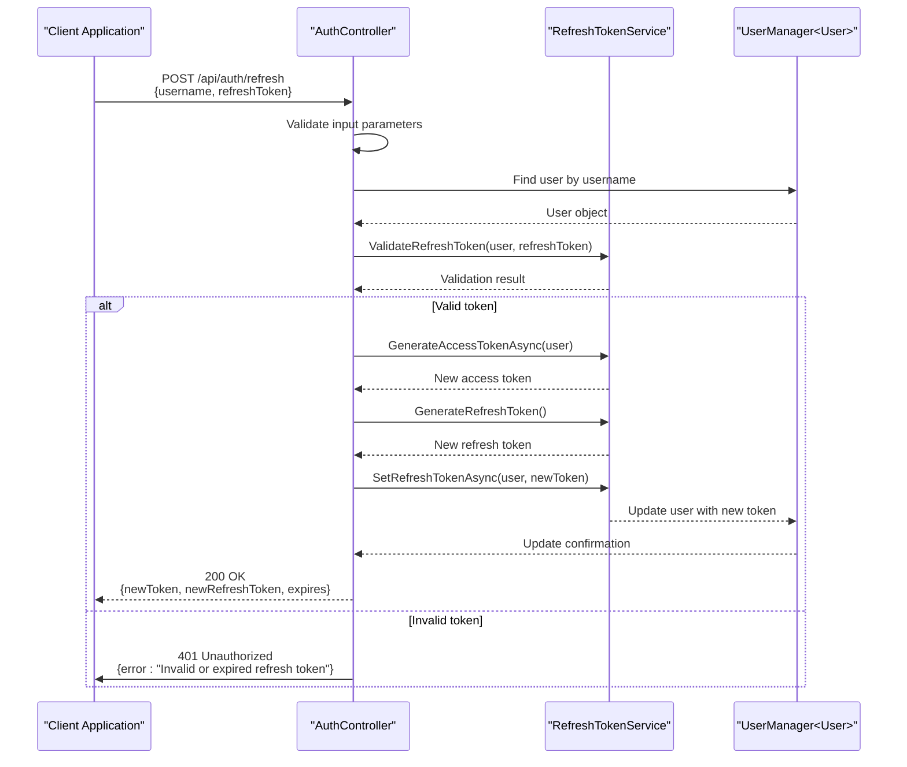
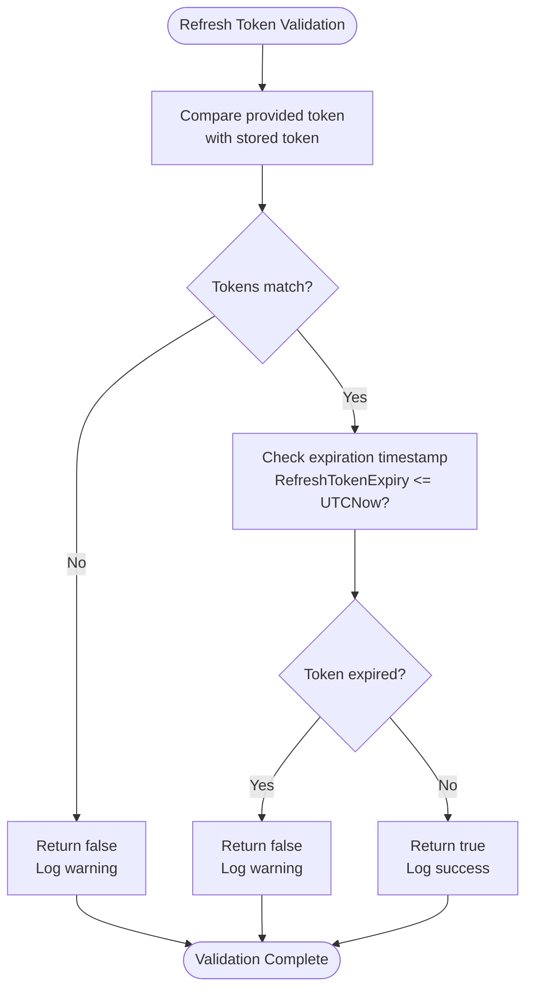
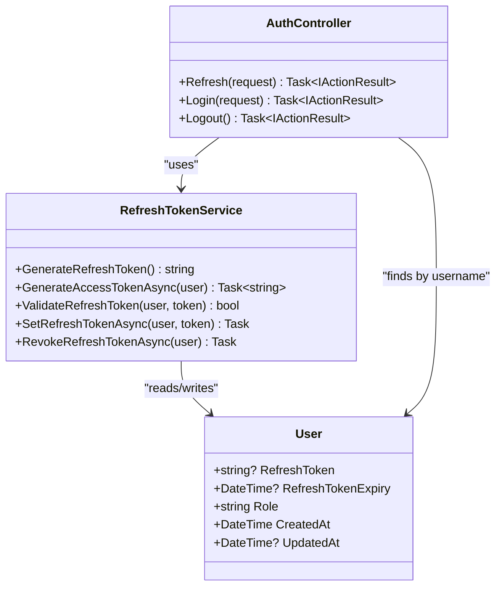
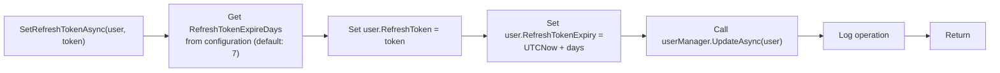
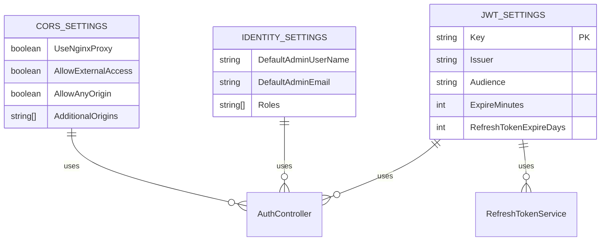
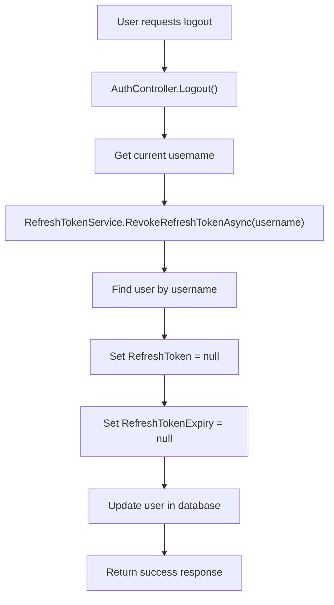

# Token Refresh Mechanism

<cite>
**Referenced Files in This Document**   
- [AuthController.cs](file://src/Inventory.API/Controllers/AuthController.cs)
- [RefreshTokenService.cs](file://src/Inventory.API/Services/RefreshTokenService.cs)
- [User.cs](file://src/Inventory.API/Models/User.cs)
- [appsettings.json](file://src/Inventory.API/appsettings.json)
</cite>

## Table of Contents
1. [Introduction](#introduction)
2. [Token Refresh Flow](#token-refresh-flow)
3. [Refresh Token Validation](#refresh-token-validation)
4. [Token Generation and Rotation](#token-generation-and-rotation)
5. [Database Token Update](#database-token-update)
6. [Configuration Settings](#configuration-settings)
7. [Response Examples](#response-examples)
8. [Security Considerations](#security-considerations)

## Introduction

The token refresh mechanism in the Inventory Control system provides a secure method for maintaining user sessions without requiring frequent re-authentication. This document details the implementation of the refresh token functionality, focusing on the interaction between the `AuthController` and `RefreshTokenService`. The system implements a rolling refresh token strategy where a new refresh token is issued with each refresh request, enhancing security by invalidating previous tokens and preventing replay attacks.

**Section sources**
- [AuthController.cs](file://src/Inventory.API/Controllers/AuthController.cs#L142-L190)
- [RefreshTokenService.cs](file://src/Inventory.API/Services/RefreshTokenService.cs#L13-L172)

## Token Refresh Flow

The token refresh process follows a secure sequence of operations to validate the existing refresh token and issue new access and refresh tokens. The flow begins when a client makes a POST request to the `/api/auth/refresh` endpoint with a valid username and refresh token.



**Diagram sources**
- [AuthController.cs](file://src/Inventory.API/Controllers/AuthController.cs#L142-L190)
- [RefreshTokenService.cs](file://src/Inventory.API/Services/RefreshTokenService.cs#L13-L172)

**Section sources**
- [AuthController.cs](file://src/Inventory.API/Controllers/AuthController.cs#L142-L190)

## Refresh Token Validation

The refresh token validation process ensures that only valid, unexpired tokens can be used to obtain new access tokens. The validation occurs in the `ValidateRefreshToken` method of the `RefreshTokenService`, which performs two critical checks.



The validation process first compares the provided refresh token with the one stored in the user's record. If they match, it then verifies that the token has not expired by checking the `RefreshTokenExpiry` timestamp against the current UTC time. Both conditions must pass for the token to be considered valid.

**Diagram sources**
- [RefreshTokenService.cs](file://src/Inventory.API/Services/RefreshTokenService.cs#L55-L73)

**Section sources**
- [RefreshTokenService.cs](file://src/Inventory.API/Services/RefreshTokenService.cs#L55-L73)

## Token Generation and Rotation

The system implements token rotation, a security best practice where a new refresh token is generated with each refresh request. This approach prevents replay attacks and limits the usefulness of intercepted tokens.



When a refresh request is validated, the system generates a new access token with a short expiration (15 minutes by default) and a new refresh token with a longer expiration (7 days by default). The old refresh token is immediately invalidated when the new one is stored.

**Diagram sources**
- [RefreshTokenService.cs](file://src/Inventory.API/Services/RefreshTokenService.cs#L13-L172)
- [AuthController.cs](file://src/Inventory.API/Controllers/AuthController.cs#L142-L190)
- [User.cs](file://src/Inventory.API/Models/User.cs#L7-L8)

**Section sources**
- [RefreshTokenService.cs](file://src/Inventory.API/Services/RefreshTokenService.cs#L13-L53)
- [RefreshTokenService.cs](file://src/Inventory.API/Services/RefreshTokenService.cs#L145-L172)

## Database Token Update

The refresh token update process securely stores the new token and its expiration timestamp in the database through the ASP.NET Identity framework. The `SetRefreshTokenAsync` method handles this operation, ensuring atomic updates to both the token value and expiration time.



The update operation is performed as a single transaction, ensuring that both the token and its expiration timestamp are updated together. This prevents race conditions and maintains data consistency. The method also logs the operation for audit purposes, recording the user ID and expiration time.

**Diagram sources**
- [RefreshTokenService.cs](file://src/Inventory.API/Services/RefreshTokenService.cs#L38-L53)

**Section sources**
- [RefreshTokenService.cs](file://src/Inventory.API/Services/RefreshTokenService.cs#L38-L53)

## Configuration Settings

The token refresh mechanism is configured through application settings that control token expiration and security parameters. These settings are defined in the `appsettings.json` file and can be overridden in environment-specific configuration files.



The key configuration parameters for the token refresh mechanism include:
- `Jwt:Key`: The secret key used to sign JWT tokens
- `Jwt:Issuer`: The token issuer identifier
- `Jwt:Audience`: The intended audience for the tokens
- `Jwt:ExpireMinutes`: Access token expiration in minutes (default: 15)
- `Jwt:RefreshTokenExpireDays`: Refresh token expiration in days (default: 7)

These settings can be customized in different environments (development, staging, production) to meet specific security requirements.

**Diagram sources**
- [appsettings.json](file://src/Inventory.API/appsettings.json#L10-L17)

**Section sources**
- [appsettings.json](file://src/Inventory.API/appsettings.json#L10-L17)
- [RefreshTokenService.cs](file://src/Inventory.API/Services/RefreshTokenService.cs#L40-L42)

## Response Examples

The token refresh endpoint returns standardized responses for both successful operations and error conditions. These responses follow the `ApiResponse<T>` pattern used throughout the API.

### Successful Refresh Response
```json
{
  "success": true,
  "data": {
    "token": "eyJhbGciOiJIUzI1NiIsInR5cCI6IkpXVCJ9.xJH...",
    "refreshToken": "YmFzZTY0ZW5jb2RlZHN0cmluZ2Zvcm5ld3JlZnJlc2h0b2tlbg==",
    "username": "johndoe",
    "email": "john.doe@company.com",
    "role": "User",
    "roles": ["User"],
    "expiresAt": "2025-09-28T12:30:45Z"
  },
  "message": null
}
```

### Error Responses

**Invalid or Expired Refresh Token:**
```json
{
  "success": false,
  "data": null,
  "message": "Invalid or expired refresh token"
}
```

**Missing Required Parameters:**
```json
{
  "success": false,
  "data": null,
  "message": "Username and refresh token are required"
}
```

**User Not Found:**
```json
{
  "success": false,
  "data": null,
  "message": "Invalid refresh token"
}
```

The client should handle these responses appropriately, prompting the user to re-authenticate when refresh token validation fails.

**Section sources**
- [AuthController.cs](file://src/Inventory.API/Controllers/AuthController.cs#L142-L190)

## Security Considerations

The token refresh implementation incorporates several security measures to protect against common threats and ensure the integrity of user sessions.

### Token Revocation on Logout

When a user logs out, the system immediately revokes their refresh token by clearing both the token value and expiration timestamp in the database. This is accomplished through the `RevokeRefreshTokenAsync` method, which sets both `RefreshToken` and `RefreshTokenExpiry` to null and updates the user record.



This immediate revocation ensures that even if a refresh token was intercepted, it cannot be used after the user has logged out.

**Diagram sources**
- [RefreshTokenService.cs](file://src/Inventory.API/Services/RefreshTokenService.cs#L75-L94)
- [AuthController.cs](file://src/Inventory.API/Controllers/AuthController.cs#L200-L215)

**Section sources**
- [RefreshTokenService.cs](file://src/Inventory.API/Services/RefreshTokenService.cs#L75-L94)
- [AuthController.cs](file://src/Inventory.API/Controllers/AuthController.cs#L200-L215)

### Protection Against Replay Attacks

The system implements rolling refresh tokens to prevent replay attacks. Each time a refresh token is used, it is immediately invalidated by replacing it with a new token. This means that if an attacker intercepts a refresh request, they cannot reuse the same token for subsequent requests.

Additionally, the system includes automatic cleanup of expired refresh tokens through the `CleanupExpiredTokensAsync` method. This background process periodically removes expired tokens from the database, reducing the attack surface and maintaining database cleanliness.

The combination of token rotation and immediate invalidation of used tokens ensures that each refresh token can only be used once, effectively preventing replay attacks and enhancing overall system security.

**Section sources**
- [RefreshTokenService.cs](file://src/Inventory.API/Services/RefreshTokenService.cs#L13-L172)