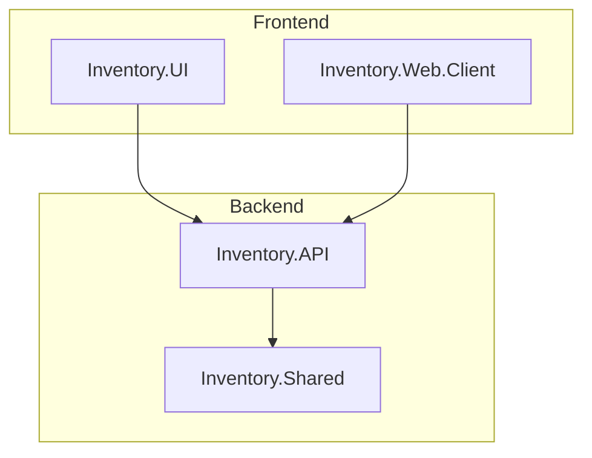
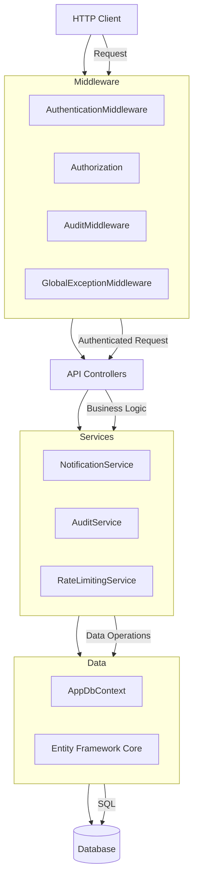
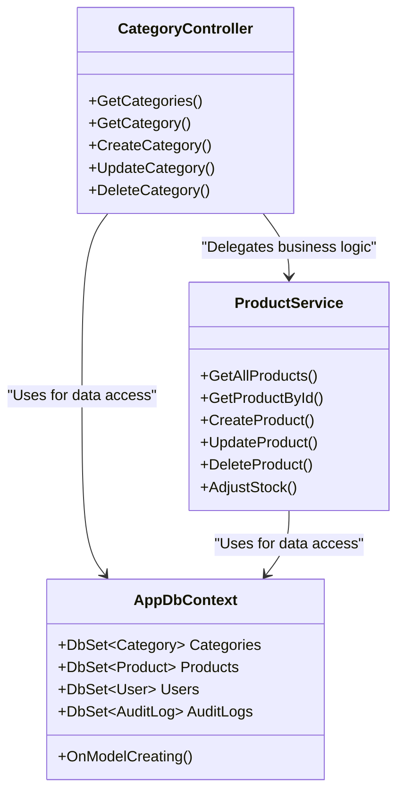
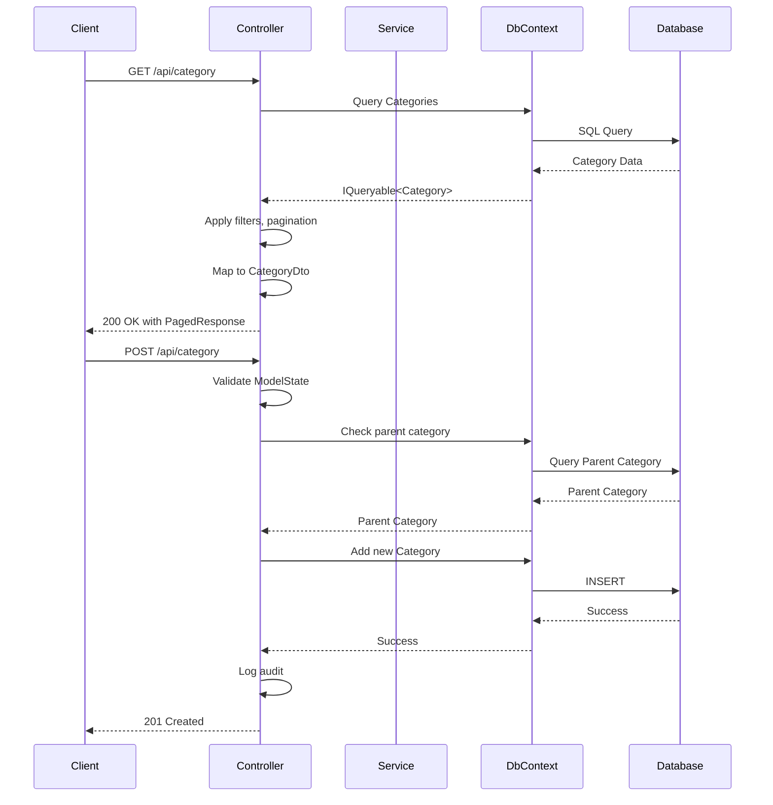
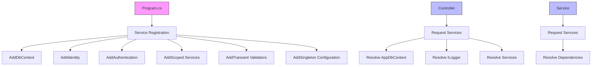
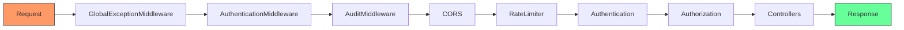
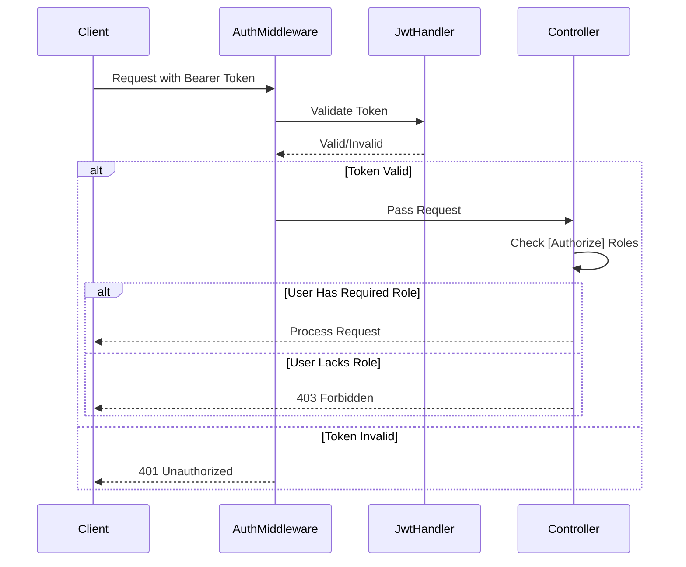
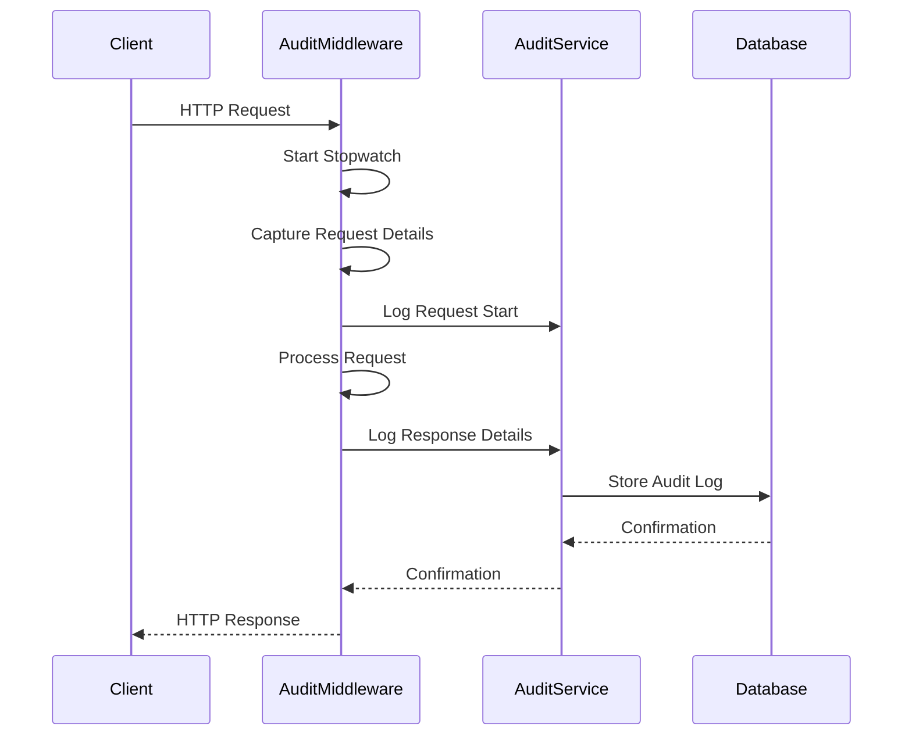
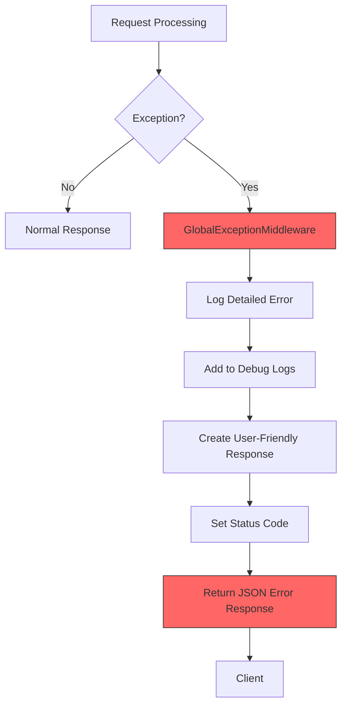
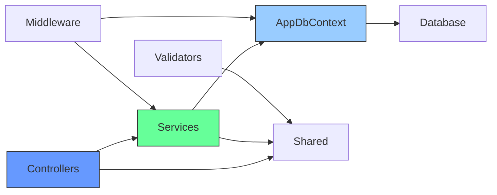

# Backend Architecture

<cite>
**Referenced Files in This Document**   
- [CategoryController.cs](file://src/Inventory.API/Controllers/CategoryController.cs) - *Updated in recent commit*
- [AppDbContext.cs](file://src/Inventory.API/Models/AppDbContext.cs) - *Updated in recent commit*
- [AuditMiddleware.cs](file://src/Inventory.API/Middleware/AuditMiddleware.cs) - *Updated in recent commit*
- [AuthenticationMiddleware.cs](file://src/Inventory.API/Middleware/AuthenticationMiddleware.cs) - *Updated in recent commit*
- [GlobalExceptionMiddleware.cs](file://src/Inventory.API/Middleware/GlobalExceptionMiddleware.cs) - *Updated in recent commit*
- [Program.cs](file://src/Inventory.API/Program.cs) - *Updated in recent commit*
- [AuditService.cs](file://src/Inventory.API/Services/AuditService.cs) - *Updated in recent commit*
- [NotificationService.cs](file://src/Inventory.API/Services/NotificationService.cs) - *Updated in recent commit*
- [CreateCategoryDtoValidator.cs](file://src/Inventory.API/Validators/CreateCategoryDtoValidator.cs) - *Updated in recent commit*
- [IProductService.cs](file://src/Inventory.Shared/Interfaces/IProductService.cs) - *Updated in recent commit*
- [Category.cs](file://src/Inventory.API/Models/Category.cs) - *Updated in recent commit*
- [CategoryDto.cs](file://src/Inventory.Shared/DTOs/CategoryDto.cs) - *Updated in recent commit*
</cite>

## Update Summary
**Changes Made**   
- Updated documentation to reflect comprehensive API documentation and audit functionality enhancements
- Added new sections for API endpoints and audit API documentation
- Refreshed code examples and diagrams to match current implementation
- Updated file references with commit annotations
- Enhanced source tracking system with detailed file references

## Table of Contents
1. [Introduction](#introduction)
2. [Project Structure](#project-structure)
3. [Core Components](#core-components)
4. [Architecture Overview](#architecture-overview)
5. [Detailed Component Analysis](#detailed-component-analysis)
6. [Dependency Analysis](#dependency-analysis)
7. [Performance Considerations](#performance-considerations)
8. [Troubleshooting Guide](#troubleshooting-guide)
9. [Conclusion](#conclusion)

## Introduction
The InventoryCtrl_2 backend implements a robust, scalable architecture using ASP.NET Core with Clean Architecture principles. The system follows a clear separation of concerns between Controllers (HTTP interface), Services (business logic), and AppDbContext (data access). This documentation details the RESTful API design, dependency injection, middleware pipeline, and cross-cutting concerns including authentication, authorization, audit logging, and error handling.

## Project Structure
The project follows a layered architecture with distinct components for API, shared models, services, and UI. The backend resides in the `src/Inventory.API` directory, containing Controllers, Middleware, Models, Services, and Validators. The `src/Inventory.Shared` directory contains DTOs, interfaces, and models shared between frontend and backend. This separation enables clean dependency flow and promotes reusability.

**Diagram sources**
- [src/Inventory.API](file://src/Inventory.API)
- [src/Inventory.Shared](file://src/Inventory.Shared)

**Section sources**
- [src/Inventory.API](file://src/Inventory.API)
- [src/Inventory.Shared](file://src/Inventory.Shared)

## Core Components
The core components of the system include RESTful API controllers, business services, data access through AppDbContext, and cross-cutting concerns handled by middleware components. The architecture implements Clean Architecture principles with dependency injection, ensuring loose coupling and high cohesion. The repository pattern is implemented via EF Core, and operations follow a CQRS-like separation with distinct DTOs for create, update, and response operations.

**Section sources**
- [CategoryController.cs](file://src/Inventory.API/Controllers/CategoryController.cs)
- [AppDbContext.cs](file://src/Inventory.API/Models/AppDbContext.cs)
- [AuditService.cs](file://src/Inventory.API/Services/AuditService.cs)

## Architecture Overview
The backend architecture follows a layered approach with clear separation between presentation, business logic, and data access layers. The middleware pipeline handles cross-cutting concerns such as authentication, authorization, audit logging, and global exception handling. Dependency injection is used extensively to manage component lifetimes and promote testability.

**Diagram sources**
- [Program.cs](file://src/Inventory.API/Program.cs)
- [AppDbContext.cs](file://src/Inventory.API/Models/AppDbContext.cs)
- [AuditMiddleware.cs](file://src/Inventory.API/Middleware/AuditMiddleware.cs)

## Detailed Component Analysis

### Controller-Service-DbContext Separation
The system implements a clean separation of concerns between Controllers, Services, and AppDbContext. Controllers handle HTTP interface concerns, Services encapsulate business logic, and AppDbContext manages data access. This separation enables maintainability, testability, and scalability.

**Diagram sources**
- [CategoryController.cs](file://src/Inventory.API/Controllers/CategoryController.cs)
- [IProductService.cs](file://src/Inventory.Shared/Interfaces/IProductService.cs)
- [AppDbContext.cs](file://src/Inventory.API/Models/AppDbContext.cs)

#### RESTful API Design with ASP.NET Core Controllers
The RESTful API design follows ASP.NET Core conventions with attribute routing, HTTP method attributes, and proper status code responses. Controllers use dependency injection to receive required services and context. The CategoryController demonstrates proper implementation of CRUD operations with appropriate HTTP methods and response codes.

**Diagram sources**
- [CategoryController.cs](file://src/Inventory.API/Controllers/CategoryController.cs)
- [AppDbContext.cs](file://src/Inventory.API/Models/AppDbContext.cs)

#### Dependency Injection and Service Registration
The system uses ASP.NET Core's built-in dependency injection container with scoped, transient, and singleton service registrations. The Program.cs file configures services including database context, identity, authentication, CORS, and custom services. This enables loose coupling and promotes testability.

**Diagram sources**
- [Program.cs](file://src/Inventory.API/Program.cs)
- [CategoryController.cs](file://src/Inventory.API/Controllers/CategoryController.cs)

#### Middleware Pipeline Analysis
The middleware pipeline processes requests in a specific order, handling cross-cutting concerns before reaching the controllers. The pipeline includes global exception handling, authentication, audit logging, CORS, rate limiting, and authorization. Each middleware component follows the pipeline pattern, either passing control to the next component or terminating the request.

**Diagram sources**
- [Program.cs](file://src/Inventory.API/Program.cs)
- [GlobalExceptionMiddleware.cs](file://src/Inventory.API/Middleware/GlobalExceptionMiddleware.cs)
- [AuthenticationMiddleware.cs](file://src/Inventory.API/Middleware/AuthenticationMiddleware.cs)
- [AuditMiddleware.cs](file://src/Inventory.API/Middleware/AuditMiddleware.cs)

### Cross-Cutting Concerns Implementation

#### Authentication and Authorization
The system implements JWT-based authentication with role-based authorization. The AuthenticationMiddleware validates JWT tokens and ensures requests are properly authenticated. The [Authorize] attribute on controllers and actions enforces role-based access control, with Admin roles required for write operations.

**Section sources**
- [AuthenticationMiddleware.cs](file://src/Inventory.API/Middleware/AuthenticationMiddleware.cs)
- [CategoryController.cs](file://src/Inventory.API/Controllers/CategoryController.cs)

#### Audit Logging with AuditMiddleware
The AuditMiddleware captures detailed information about HTTP requests and responses, including method, URL, status code, duration, user information, and client details. Audit logs are stored in the database through the AuditService, enabling comprehensive tracking of system activity.

**Section sources**
- [AuditMiddleware.cs](file://src/Inventory.API/Middleware/AuditMiddleware.cs)
- [AuditService.cs](file://src/Inventory.API/Services/AuditService.cs)
- [AppDbContext.cs](file://src/Inventory.API/Models/AppDbContext.cs)

#### Global Exception Handling
The GlobalExceptionMiddleware provides centralized error handling, capturing unhandled exceptions and returning consistent error responses. The middleware logs detailed error information, including stack traces, and returns user-friendly messages while maintaining security by not exposing sensitive information.

**Section sources**
- [GlobalExceptionMiddleware.cs](file://src/Inventory.API/Middleware/GlobalExceptionMiddleware.cs)

## Dependency Analysis
The system has a well-defined dependency structure with clear boundaries between components. The API layer depends on the Shared layer for DTOs and interfaces, while the Shared layer contains no dependencies on the API layer. Services depend on AppDbContext for data access, and controllers depend on services for business logic. This dependency structure enables loose coupling and promotes testability.

**Section sources**
- [Program.cs](file://src/Inventory.API/Program.cs)
- [AppDbContext.cs](file://src/Inventory.API/Models/AppDbContext.cs)

## Performance Considerations
The system incorporates several performance optimizations including rate limiting, efficient database queries with pagination, and proper indexing. The rate limiting middleware prevents abuse by limiting request frequency based on user roles. Database queries use pagination to avoid retrieving large datasets, and EF Core's Include method ensures related data is loaded efficiently.

**Section sources**
- [Program.cs](file://src/Inventory.API/Program.cs)
- [CategoryController.cs](file://src/Inventory.API/Controllers/CategoryController.cs)

## Troubleshooting Guide
Common issues in the system typically relate to authentication, authorization, or data validation. Authentication issues may stem from invalid JWT tokens or expired sessions. Authorization issues occur when users lack required roles for specific operations. Data validation issues are handled by FluentValidation with detailed error messages returned to clients.

**Section sources**
- [AuthenticationMiddleware.cs](file://src/Inventory.API/Middleware/AuthenticationMiddleware.cs)
- [GlobalExceptionMiddleware.cs](file://src/Inventory.API/Middleware/GlobalExceptionMiddleware.cs)
- [CreateCategoryDtoValidator.cs](file://src/Inventory.API/Validators/CreateCategoryDtoValidator.cs)