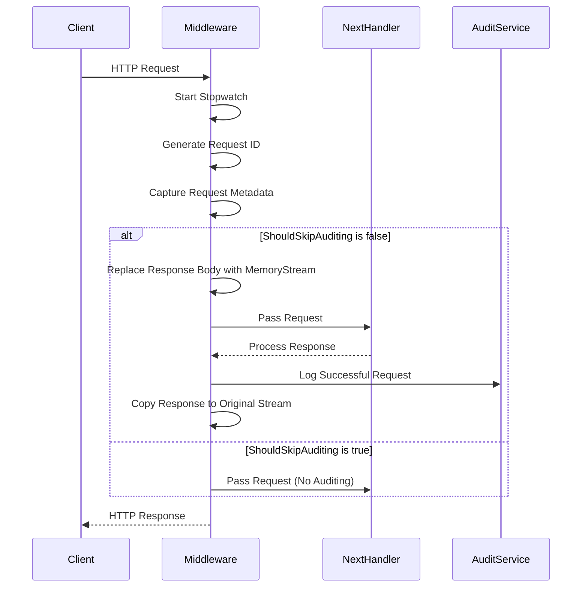
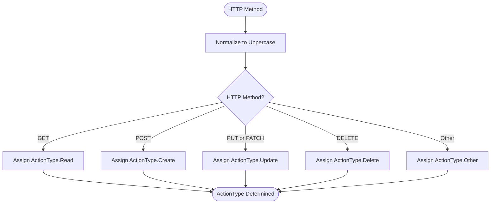

# Audit Middleware

<cite>
**Referenced Files in This Document**  
- [AuditMiddleware.cs](file://src/Inventory.API/Middleware/AuditMiddleware.cs)
- [AuditService.cs](file://src/Inventory.API/Services/AuditService.cs)
- [IAuditService.cs](file://src/Inventory.Shared/Interfaces/IAuditService.cs)
- [ActionType.cs](file://src/Inventory.API/Enums/ActionType.cs)
- [AuditLog.cs](file://src/Inventory.API/Models/AuditLog.cs)
</cite>

## Table of Contents
1. [Introduction](#introduction)
2. [Core Implementation](#core-implementation)
3. [Request and Response Interception](#request-and-response-interception)
4. [ActionType Determination Logic](#actiontype-determination-logic)
5. [Entity Type Extraction](#entity-type-extraction)
6. [Auditing Bypass Mechanism](#auditing-bypass-mechanism)
7. [Response Stream Interception](#response-stream-interception)
8. [Integration with AuditService](#integration-with-auditservice)
9. [Structured Logging and Error Handling](#structured-logging-and-error-handling)
10. [Performance Considerations](#performance-considerations)

## Introduction

The AuditMiddleware component provides comprehensive HTTP request auditing capabilities for the Inventory Control system. It automatically captures and logs detailed information about incoming HTTP requests, including metadata such as client IP address, user agent, execution time, and request context. The middleware integrates with the AuditService to persist audit entries with appropriate severity levels and success/failure status. This documentation details the implementation, functionality, and integration points of the AuditMiddleware, providing insights into its design and operational characteristics.

## Core Implementation

The AuditMiddleware is implemented as an ASP.NET Core middleware component that intercepts HTTP requests and responses in the processing pipeline. It captures comprehensive request details including HTTP method, URL, query parameters, headers, and client metadata. The middleware uses a Stopwatch to measure execution time and generates a unique request ID for tracing purposes. It integrates with the application's logging infrastructure to provide debug-level tracing of audited requests.

The middleware follows a structured execution flow that ensures audit entries are created for both successful and failed requests. It uses dependency injection to access the AuditService, which handles the persistence of audit logs to the database. The implementation includes comprehensive error handling to ensure that audit logging failures do not impact the primary request processing flow.

**Section sources**
- [AuditMiddleware.cs](file://src/Inventory.API/Middleware/AuditMiddleware.cs#L9-L211)

## Request and Response Interception

The AuditMiddleware intercepts both incoming requests and outgoing responses to capture comprehensive audit information. When a request enters the pipeline, the middleware captures essential details including:

- HTTP method and request URL
- Query string parameters
- Request headers (converted to dictionary format)
- Client IP address (extracted from X-Forwarded-For, X-Real-IP, or connection remote IP)
- User agent string
- Timestamp of request processing

For the response interception, the middleware temporarily replaces the response body stream with a MemoryStream to capture the response content without corrupting it. After the request has been processed by subsequent middleware and controllers, the captured response is copied back to the original response stream, ensuring the client receives the complete response.



**Diagram sources**
- [AuditMiddleware.cs](file://src/Inventory.API/Middleware/AuditMiddleware.cs#L9-L211)

**Section sources**
- [AuditMiddleware.cs](file://src/Inventory.API/Middleware/AuditMiddleware.cs#L9-L211)

## ActionType Determination Logic

The middleware determines the ActionType based on the HTTP method using a switch expression that maps standard HTTP methods to corresponding ActionType enum values. This mapping provides semantic meaning to the audit logs, making them more readable and analyzable.

The mapping logic is implemented in the `GetActionTypeFromHttpMethod` method:

- **GET** requests are mapped to `ActionType.Read`
- **POST** requests are mapped to `ActionType.Create`
- **PUT** and **PATCH** requests are mapped to `ActionType.Update`
- **DELETE** requests are mapped to `ActionType.Delete**
- All other HTTP methods are mapped to `ActionType.Other`

This approach ensures consistent categorization of HTTP operations across the application, enabling meaningful filtering and analysis of audit logs based on action type.



**Diagram sources**
- [AuditMiddleware.cs](file://src/Inventory.API/Middleware/AuditMiddleware.cs#L175-L185)
- [ActionType.cs](file://src/Inventory.API/Enums/ActionType.cs#L5-L61)

**Section sources**
- [AuditMiddleware.cs](file://src/Inventory.API/Middleware/AuditMiddleware.cs#L175-L185)
- [ActionType.cs](file://src/Inventory.API/Enums/ActionType.cs#L5-L61)

## Entity Type Extraction

The middleware extracts the entity type from the API route segments to provide context for the audited operation. This is implemented in the `GetEntityTypeFromPath` method, which analyzes the request path to determine the relevant entity type.

For API endpoints that follow the pattern `/api/{controller}/{action}`, the method extracts the controller name as the entity type. For example, a request to `/api/products/123` would result in an entity type of "PRODUCTS". The method handles various special cases:

- Swagger documentation endpoints are categorized as "Swagger"
- Health check endpoints are categorized as "Health"
- Static assets and other non-API paths are categorized as "HTTP"

This entity type information is stored in the audit log and enables filtering and analysis of audit entries by entity type, providing valuable insights into which parts of the system are being accessed.

**Section sources**
- [AuditMiddleware.cs](file://src/Inventory.API/Middleware/AuditMiddleware.cs#L187-L211)

## Auditing Bypass Mechanism

The middleware implements a bypass mechanism through the `ShouldSkipAuditing` method to avoid auditing certain types of requests that would generate excessive or unnecessary log entries. This optimization improves performance and reduces storage requirements for audit logs.

The method checks the request path against a predefined list of paths that should be excluded from auditing:

- `/swagger` - API documentation endpoints
- `/health` - Health check endpoints
- `/favicon.ico` - Browser favicon requests
- `/_blazor` - Blazor framework endpoints
- `/css`, `/js`, `/images`, `/lib` - Static asset directories

This selective auditing approach ensures that high-volume, non-critical requests do not overwhelm the audit logging system while still capturing all meaningful business operations. The implementation uses case-insensitive comparison and checks for path prefixes to ensure comprehensive coverage.

**Section sources**
- [AuditMiddleware.cs](file://src/Inventory.API/Middleware/AuditMiddleware.cs#L147-L162)

## Response Stream Interception

The middleware safely intercepts the response stream using a MemoryStream to capture the response content without corrupting it. This technique allows the middleware to access the response body for audit purposes while ensuring the original response flow is preserved.

The implementation follows these steps:

1. Store a reference to the original response body stream
2. Create a new MemoryStream and assign it to `context.Response.Body`
3. Allow the request to proceed through the pipeline
4. After response processing, seek to the beginning of the MemoryStream
5. Copy the captured response content to the original response stream
6. Restore the original response body stream in the finally block

The use of a using statement ensures proper disposal of the MemoryStream, and the finally block guarantees that the original response stream is always restored, even if an exception occurs during processing. This approach prevents stream corruption and ensures reliable response delivery to clients.

**Section sources**
- [AuditMiddleware.cs](file://src/Inventory.API/Middleware/AuditMiddleware.cs#L78-L80)

## Integration with AuditService

The AuditMiddleware integrates with the AuditService through dependency injection to persist audit entries. The middleware receives an instance of AuditService via the `InvokeAsync` method parameters, following ASP.NET Core's convention for resolving scoped services in middleware.

The integration uses the `LogDetailedChangeAsync` method of AuditService to create audit log entries with comprehensive metadata. For successful requests, the audit entry includes:

- Request method and URL
- Response status code and duration
- Client metadata (IP address, user agent)
- Request headers and query string
- Severity level based on response status (INFO for success, WARNING for client errors)

For failed requests, the audit entry includes exception details such as exception type, message, and stack trace, with a severity level of "ERROR". The AuditService handles database persistence, validation, and error handling for audit log creation.

```mermaid
classDiagram
    class AuditMiddleware {
        +RequestDelegate _next
        +ILogger<AuditMiddleware> _logger
        +InvokeAsync(HttpContext, AuditService)
        +ShouldSkipAuditing(PathString)
        +GetClientIpAddress(HttpContext)
        +GetActionTypeFromHttpMethod(string)
        +GetEntityTypeFromPath(PathString)
    }
    
    class AuditService {
        +LogDetailedChangeAsync(string, string, string, ActionType, string, object, string, string, string, bool, string)
        +LogEntityChangeAsync(string, string, string, ActionType, string, object, object, string, string, string, bool, string)
        +LogUserActionAsync(string, string, string, string, object, string, bool, string)
        +LogHttpRequestAsync(string, string, int, long, string, bool, string)
        +GetAuditLogsAsync(string, string, ActionType, string, string, DateTime, DateTime, string, string, int, int)
    }
    
    class AuditLog {
        +int Id
        +string EntityName
        +string EntityId
        +string Action
        +ActionType ActionType
        +string EntityType
        +string? Changes
        +string? RequestId
       