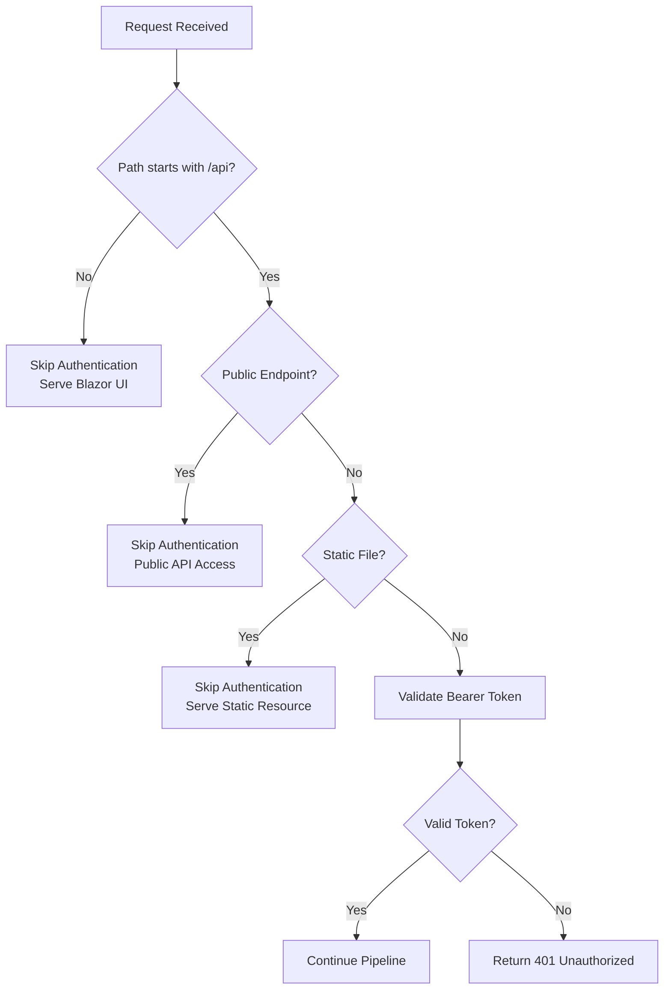
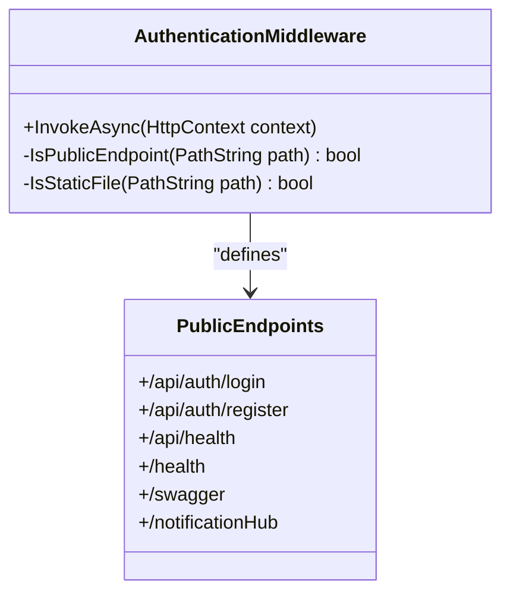
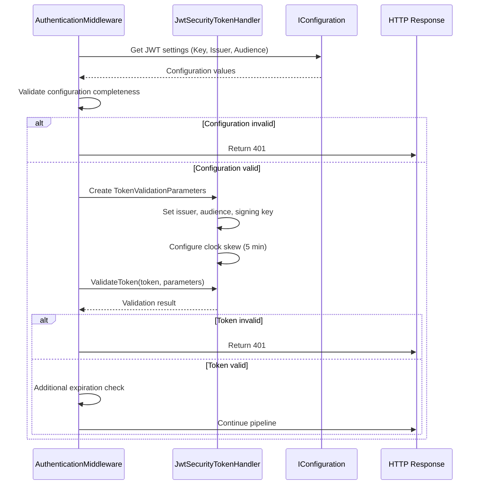
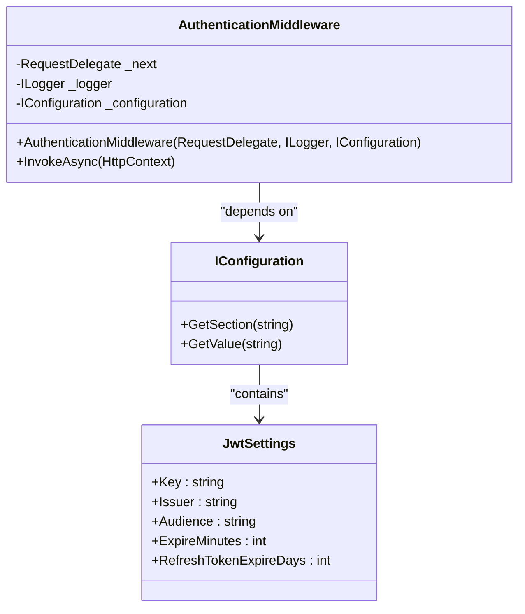
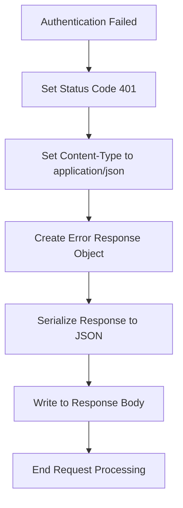

# Authentication Middleware

<cite>
**Referenced Files in This Document**   
- [AuthenticationMiddleware.cs](file://src/Inventory.API/Middleware/AuthenticationMiddleware.cs)
- [appsettings.json](file://src/Inventory.API/appsettings.json)
- [ApiEndpoints.cs](file://src/Inventory.Shared/Constants/ApiEndpoints.cs)
</cite>

## Table of Contents
1. [Introduction](#introduction)
2. [Request Flow and Route Classification](#request-flow-and-route-classification)
3. [Public Endpoint Configuration](#public-endpoint-configuration)
4. [Token Validation Process](#token-validation-process)
5. [Configuration and Dependency Injection](#configuration-and-dependency-injection)
6. [Unauthorized Response Handling](#unauthorized-response-handling)
7. [Security Considerations](#security-considerations)
8. [Extension Points for Authorization](#extension-points-for-authorization)

## Introduction

The AuthenticationMiddleware component serves as a critical security layer in the Inventory Control system, responsible for enforcing JWT-based authentication across API endpoints while allowing appropriate access to public resources and UI routes. This middleware operates at the ASP.NET Core pipeline level, intercepting HTTP requests before they reach controller actions, and making authorization decisions based on route patterns and token validity.

The middleware implements a selective authentication strategy that differentiates between API and non-API routes, public and private endpoints, and static resources. This approach ensures that the Blazor UI can be served without authentication requirements, while protecting all API endpoints that handle sensitive inventory data. The component leverages industry-standard JWT validation practices and integrates seamlessly with the application's configuration system.

**Section sources**
- [AuthenticationMiddleware.cs](file://src/Inventory.API/Middleware/AuthenticationMiddleware.cs#L7-L18)

## Request Flow and Route Classification

The middleware implements a hierarchical decision-making process to determine whether authentication should be enforced for each incoming request. The request flow follows a specific sequence of checks that efficiently filter requests without unnecessary processing.

**Diagram sources**
- [AuthenticationMiddleware.cs](file://src/Inventory.API/Middleware/AuthenticationMiddleware.cs#L25-L55)

The initial classification uses the `StartsWithSegments` method to identify API routes, which is more reliable than simple string matching as it properly handles path boundaries. Non-API routes, which typically serve the Blazor frontend application, bypass authentication entirely. This design allows the SPA (Single Page Application) to be loaded without requiring authentication, while ensuring all API calls from the frontend are properly secured.

For API routes, additional checks determine whether the endpoint should be publicly accessible. The middleware also excludes static files (CSS, JavaScript, images, fonts) from authentication requirements, which improves performance and ensures proper loading of frontend assets.

**Section sources**
- [AuthenticationMiddleware.cs](file://src/Inventory.API/Middleware/AuthenticationMiddleware.cs#L25-L55)

## Public Endpoint Configuration

The middleware defines a set of public endpoints that are accessible without authentication, implementing the principle of least privilege by explicitly specifying which endpoints should be public rather than relying on implicit rules.

**Diagram sources**
- [AuthenticationMiddleware.cs](file://src/Inventory.API/Middleware/AuthenticationMiddleware.cs#L75-L88)
- [ApiEndpoints.cs](file://src/Inventory.Shared/Constants/ApiEndpoints.cs#L10-L15)

The public endpoints include authentication endpoints (login and register), health checks, Swagger documentation, and the SignalR notification hub. Notably, the implementation references both `/api/health` and `/health` paths, providing flexibility in health check configuration. The use of `StartsWithSegments` ensures that only exact path matches or proper path prefixes are considered, preventing potential security bypasses through path traversal techniques.

The public endpoint list is currently hardcoded within the middleware, but could be extended to support configuration-driven definitions for greater flexibility in different deployment scenarios.

**Section sources**
- [AuthenticationMiddleware.cs](file://src/Inventory.API/Middleware/AuthenticationMiddleware.cs#L75-L88)
- [ApiEndpoints.cs](file://src/Inventory.Shared/Constants/ApiEndpoints.cs#L10-L15)

## Token Validation Process

The core security functionality of the middleware is implemented in the `ValidateToken` method, which performs comprehensive JWT validation using Microsoft's JwtSecurityTokenHandler and TokenValidationParameters classes.

**Diagram sources**
- [AuthenticationMiddleware.cs](file://src/Inventory.API/Middleware/AuthenticationMiddleware.cs#L130-L150)

The validation process includes multiple security checks:
- **Issuer validation**: Ensures the token was issued by the expected authority
- **Audience validation**: Confirms the token is intended for this application
- **Lifetime validation**: Checks that the token is not expired
- **Signature validation**: Verifies the token has not been tampered with
- **Clock skew allowance**: Permits a 5-minute time difference between systems

The implementation includes a redundant expiration check even though lifetime validation is enabled in the TokenValidationParameters, providing defense in depth. This secondary check manually inspects the "exp" claim in the JWT payload, ensuring that expired tokens are rejected even if the primary validation somehow fails.

**Section sources**
- [AuthenticationMiddleware.cs](file://src/Inventory.API/Middleware/AuthenticationMiddleware.cs#L130-L150)

## Configuration and Dependency Injection

The middleware integrates with ASP.NET Core's configuration system through dependency injection, receiving essential services in its constructor and accessing JWT configuration values from appsettings.json.

**Diagram sources**
- [AuthenticationMiddleware.cs](file://src/Inventory.API/Middleware/AuthenticationMiddleware.cs#L13-L18)
- [appsettings.json](file://src/Inventory.API/appsettings.json#L5-L10)

The constructor injects three essential dependencies: the next delegate in the middleware pipeline, a logger for diagnostic information, and the configuration service for accessing application settings. This follows ASP.NET Core best practices for middleware construction.

The JWT configuration is structured in appsettings.json with key security parameters including the signing key, issuer, and audience. The implementation includes validation to ensure these critical settings are properly configured, logging an error if any required values are missing. This defensive programming approach helps prevent security vulnerabilities due to misconfiguration.

**Section sources**
- [AuthenticationMiddleware.cs](file://src/Inventory.API/Middleware/AuthenticationMiddleware.cs#L13-L18)
- [appsettings.json](file://src/Inventory.API/appsettings.json#L5-L10)

## Unauthorized Response Handling

When authentication fails, the middleware provides a standardized response through the `HandleUnauthorized` method, ensuring consistent error reporting across the API.

**Diagram sources**
- [AuthenticationMiddleware.cs](file://src/Inventory.API/Middleware/AuthenticationMiddleware.cs#L152-L166)

The unauthorized response includes a structured JSON payload with three properties: success (false), a user-friendly message, and an error code (UNAUTHORIZED). This standardized format allows client applications to consistently handle authentication failures across different endpoints.

The response is deliberately minimal, avoiding the exposure of sensitive information that could aid attackers. The middleware catches exceptions during the authentication process and treats them as authentication failures, preventing stack traces or implementation details from being exposed to clients.

**Section sources**
- [AuthenticationMiddleware.cs](file://src/Inventory.API/Middleware/AuthenticationMiddleware.cs#L152-L166)

## Security Considerations

The authentication middleware implements several security best practices to protect against common attacks and vulnerabilities.

**Token Security**: The implementation validates all critical JWT claims (issuer, audience, signature, lifetime) and uses a configurable clock skew to accommodate minor time differences between systems. The signing key is stored in configuration rather than hardcoded, allowing for key rotation.

**Configuration Security**: Sensitive configuration values like the JWT signing key use placeholder values ("__SET_IN_ENV__") in the appsettings.json file, indicating that these values should be provided through environment variables or secret management systems in production.

**Error Handling**: The middleware logs authentication failures and exceptions for monitoring and troubleshooting, but returns generic error responses to clients to avoid information disclosure. This prevents attackers from using error messages to probe the system.

**Defense in Depth**: The redundant expiration check provides an additional layer of security beyond the built-in lifetime validation. The explicit definition of public endpoints follows the principle of least privilege.

**Potential Improvements**: The current implementation could be enhanced with additional security features such as token revocation checking, JWT ID (jti) validation to prevent replay attacks, and rate limiting for authentication attempts.

## Extension Points for Authorization

While the current middleware focuses on authentication (verifying identity), it provides natural extension points for adding authorization (verifying permissions) capabilities.

The middleware could be extended to support role-based or claim-based authorization by examining the claims in the validated token. After successful token validation, the middleware could check for specific roles or permissions before allowing the request to proceed.

Additional security features could include:
- Integration with a token revocation service to invalidate compromised tokens
- Support for multiple authentication schemes
- IP address or device fingerprint validation
- Rate limiting for authentication endpoints
- Enhanced logging and monitoring for suspicious authentication patterns

The modular design of the middleware, with separate methods for different concerns, makes it relatively straightforward to extend its functionality while maintaining separation of concerns and testability.