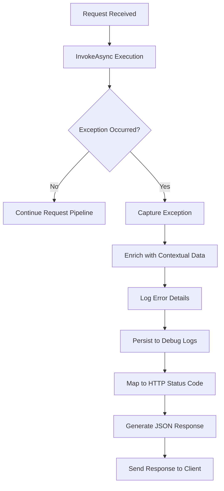
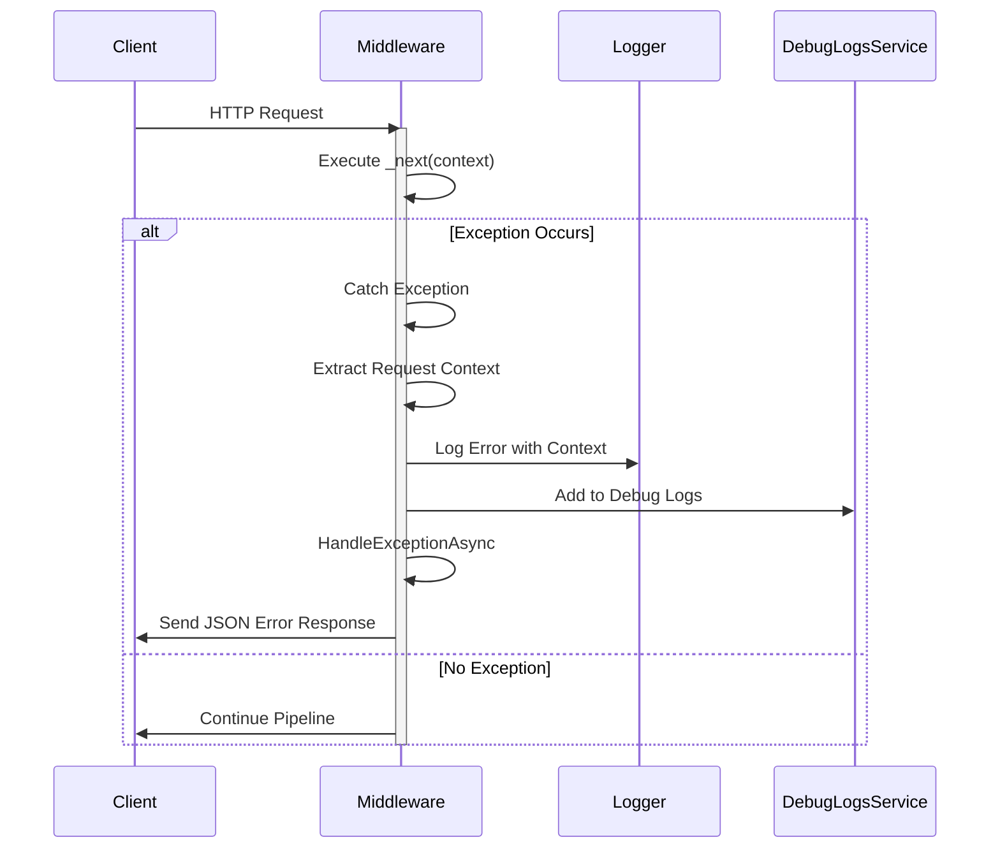
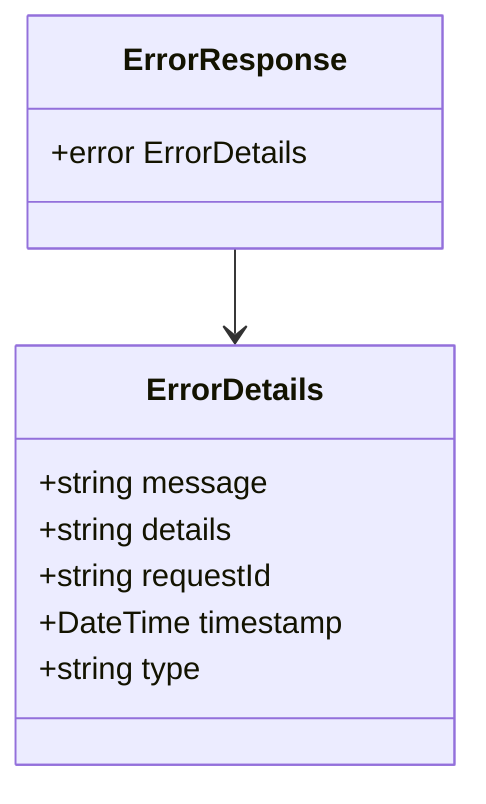
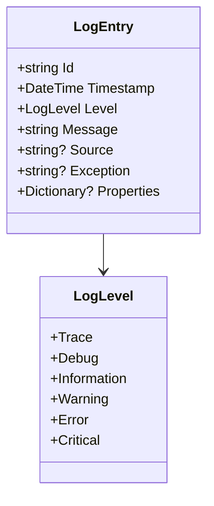
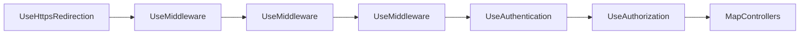

# Global Exception Middleware

<cite>
**Referenced Files in This Document**   
- [GlobalExceptionMiddleware.cs](file://src/Inventory.API/Middleware/GlobalExceptionMiddleware.cs)
- [DebugLogsService.cs](file://src/Inventory.Shared/Services/DebugLogsService.cs)
- [Program.cs](file://src/Inventory.API/Program.cs)
- [LogEntry.cs](file://src/Inventory.Shared/Services/DebugLogsService.cs)
- [LogLevel.cs](file://src/Inventory.Shared/Services/DebugLogsService.cs)
</cite>

## Table of Contents
1. [Introduction](#introduction)
2. [Core Functionality](#core-functionality)
3. [Exception Handling Flow](#exception-handling-flow)
4. [Error Response Structure](#error-response-structure)
5. [Contextual Data Collection](#contextual-data-collection)
6. [Debug Logging Integration](#debug-logging-integration)
7. [Performance and Reliability](#performance-and-reliability)
8. [Configuration and Registration](#configuration-and-registration)
9. [Conclusion](#conclusion)

## Introduction

The GlobalExceptionMiddleware component serves as a centralized error handler within the Inventory Control API, designed to intercept and manage unhandled exceptions that occur during HTTP request processing. This middleware ensures that all unexpected errors are properly captured, logged, and transformed into consistent, user-friendly responses before reaching the client. By implementing a global exception handling strategy, the system maintains reliability and provides meaningful feedback to API consumers while protecting sensitive internal information from exposure.

**Section sources**
- [GlobalExceptionMiddleware.cs](file://src/Inventory.API/Middleware/GlobalExceptionMiddleware.cs#L6-L158)

## Core Functionality

The GlobalExceptionMiddleware operates by wrapping the entire request pipeline with a try-catch block through its `InvokeAsync` method. When an exception occurs anywhere in the request processing chain, the middleware intercepts it, preventing the raw exception from propagating to the client. The component is initialized with a `RequestDelegate` representing the next middleware in the pipeline and an `ILogger` for diagnostic logging.

The core responsibility of this middleware is to provide a safety net for the application, ensuring that no unhandled exception results in an incomplete or malformed response. It achieves this by catching exceptions, enriching them with contextual information, mapping them to appropriate HTTP status codes, and generating standardized JSON error responses that maintain consistency across the API.

**Diagram sources**
- [GlobalExceptionMiddleware.cs](file://src/Inventory.API/Middleware/GlobalExceptionMiddleware.cs#L30-L100)

**Section sources**
- [GlobalExceptionMiddleware.cs](file://src/Inventory.API/Middleware/GlobalExceptionMiddleware.cs#L6-L158)

## Exception Handling Flow

The exception handling process begins in the `InvokeAsync` method, which executes the request delegate within a try-catch block. When an exception is caught, the middleware extracts critical contextual information including the request identifier, HTTP method, path, query string, client IP address, and user agent. The client IP is determined by checking the `X-Forwarded-For` and `X-Real-IP` headers, falling back to the direct connection IP if proxy headers are unavailable.

After capturing the context, the exception is logged at the Error level using the injected logger, with all contextual data included as structured log properties. This comprehensive logging approach enables effective troubleshooting and monitoring of application errors. The middleware then delegates to the `HandleExceptionAsync` method to generate the appropriate HTTP response.

**Diagram sources**
- [GlobalExceptionMiddleware.cs](file://src/Inventory.API/Middleware/GlobalExceptionMiddleware.cs#L50-L100)

**Section sources**
- [GlobalExceptionMiddleware.cs](file://src/Inventory.API/Middleware/GlobalExceptionMiddleware.cs#L30-L100)

## Error Response Structure

The `HandleExceptionAsync` method constructs standardized JSON error responses using `JsonSerializerOptions` with camelCase property naming to maintain consistency with the API's JSON formatting conventions. Each error response follows a consistent structure containing an error object with message, details, requestId, timestamp, and type properties.

The HTTP status code and error message are determined by the `GetErrorDetails` method, which uses pattern matching to map specific exception types to appropriate status codes and user-friendly messages. For example, `ArgumentException` and `ArgumentNullException` are mapped to 400 Bad Request, `UnauthorizedAccessException` to 401 Unauthorized, and `KeyNotFoundException` to 404 Not Found. This type-specific mapping ensures that clients receive meaningful status codes that accurately reflect the nature of the error.

**Diagram sources**
- [GlobalExceptionMiddleware.cs](file://src/Inventory.API/Middleware/GlobalExceptionMiddleware.cs#L102-L158)

**Section sources**
- [GlobalExceptionMiddleware.cs](file://src/Inventory.API/Middleware/GlobalExceptionMiddleware.cs#L102-L158)

## Contextual Data Collection

The middleware captures comprehensive contextual information to facilitate debugging and monitoring of errors. This includes the request trace identifier, HTTP method, path, query string, user agent, and client IP address. The client IP extraction logic prioritizes proxy headers (`X-Forwarded-For` and `X-Real-IP`) commonly used in load-balanced or reverse-proxy environments, ensuring accurate client identification even when the API is deployed behind infrastructure that modifies the direct connection.

This contextual data is included in both the structured logs and the debug logs, creating a complete picture of the request environment when an error occurs. The inclusion of the request ID allows correlation between application logs, debug logs, and any client-side logging, enabling end-to-end tracing of problematic requests.

**Section sources**
- [GlobalExceptionMiddleware.cs](file://src/Inventory.API/Middleware/GlobalExceptionMiddleware.cs#L55-L65)

## Debug Logging Integration

The middleware integrates with the `IDebugLogsService` to persist error details in debug logs when the service is available in the request services collection. This integration is implemented with defensive programming practices—the logging operation is wrapped in a try-catch block to ensure that failures in the debug logging system do not interfere with the primary error response functionality.

When an exception is caught, the middleware attempts to resolve `IDebugLogsService` from the request services and, if available, creates a `LogEntry` object containing the error details and contextual properties. The `LogEntry` includes the exception message, full exception stack trace, source identifier, and a dictionary of properties containing all relevant request context. This comprehensive logging approach provides developers with detailed information for troubleshooting while maintaining system reliability.

**Diagram sources**
- [DebugLogsService.cs](file://src/Inventory.Shared/Services/DebugLogsService.cs#L221-L240)
- [GlobalExceptionMiddleware.cs](file://src/Inventory.API/Middleware/GlobalExceptionMiddleware.cs#L75-L95)

**Section sources**
- [DebugLogsService.cs](file://src/Inventory.Shared/Services/DebugLogsService.cs#L5-L15)
- [GlobalExceptionMiddleware.cs](file://src/Inventory.API/Middleware/GlobalExceptionMiddleware.cs#L75-L95)

## Performance and Reliability

The GlobalExceptionMiddleware is designed with performance and reliability as primary considerations. The implementation avoids infinite loops by not re-throwing exceptions after handling them, ensuring that the error response is sent exactly once. In production environments, the middleware prevents information leakage by not exposing sensitive exception details in the response—while the full exception is logged for debugging purposes, the client receives only a generic, user-friendly message.

The middleware has minimal overhead during normal operation, as the try-catch block only incurs cost when an exception actually occurs. The defensive approach to debug logging ensures that failures in the logging system do not cascade into request failures. Additionally, the use of asynchronous methods throughout the implementation prevents blocking operations that could impact server throughput.

**Section sources**
- [GlobalExceptionMiddleware.cs](file://src/Inventory.API/Middleware/GlobalExceptionMiddleware.cs#L6-L158)

## Configuration and Registration

The GlobalExceptionMiddleware is registered in the application's startup configuration through the `UseMiddleware<GlobalExceptionMiddleware>()` method call in `Program.cs`. This registration occurs early in the middleware pipeline, after HTTPS redirection but before authentication and authorization, ensuring that it can catch exceptions from all subsequent middleware and request handlers.

The middleware is configured through dependency injection, receiving the `RequestDelegate` and `ILogger<GlobalExceptionMiddleware>` as constructor parameters. This design follows ASP.NET Core middleware conventions and allows for proper lifecycle management by the dependency injection container. The registration in the service collection also ensures that the middleware can access other services, such as `IDebugLogsService`, through the request services collection.

**Diagram sources**
- [Program.cs](file://src/Inventory.API/Program.cs#L345-L355)

**Section sources**
- [Program.cs](file://src/Inventory.API/Program.cs#L345-L355)

## Conclusion

The GlobalExceptionMiddleware provides a robust, centralized error handling solution that enhances the reliability and usability of the Inventory Control API. By intercepting unhandled exceptions, enriching them with contextual data, and transforming them into consistent JSON responses, the middleware ensures a professional and predictable API experience for clients. Its integration with the debug logging system provides valuable diagnostic information for developers while maintaining system stability through defensive programming practices. The middleware's design reflects best practices in exception handling, security, and performance, making it a critical component of the application's error management strategy.