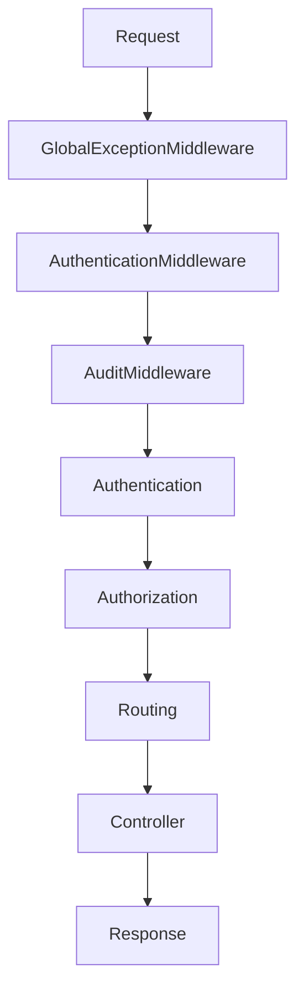
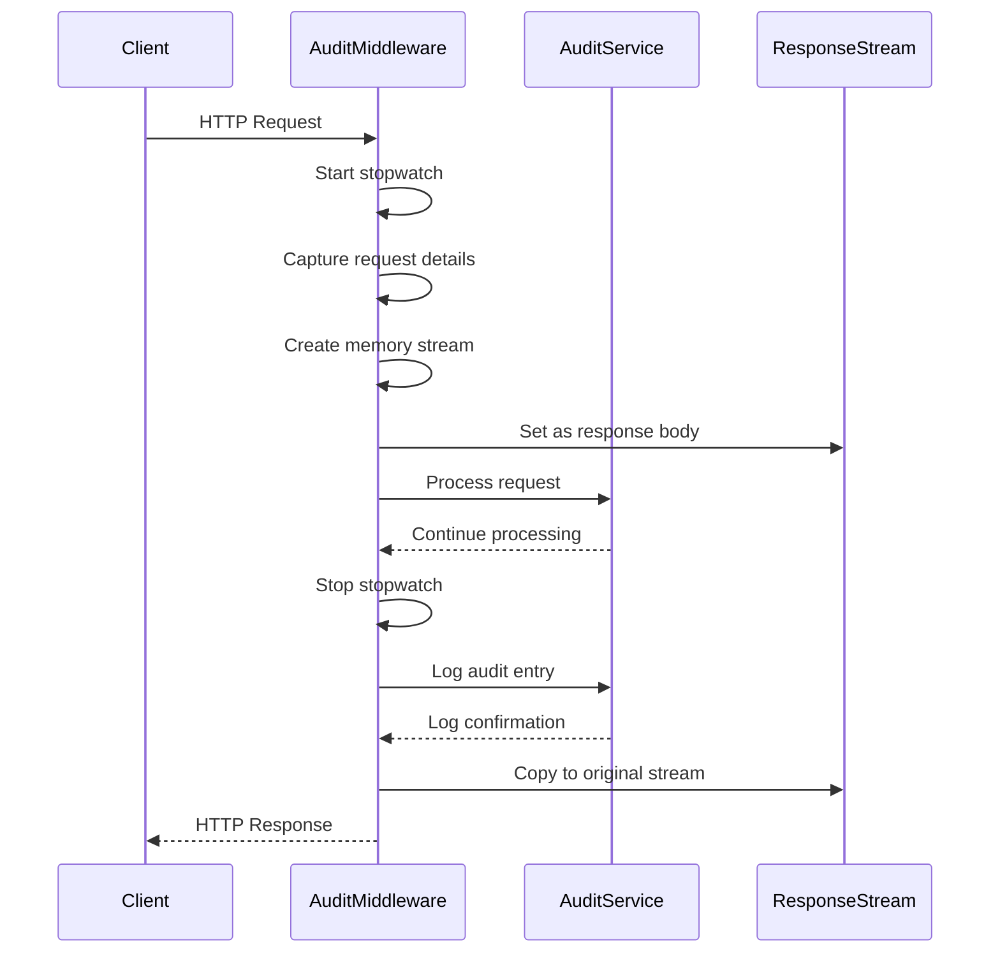
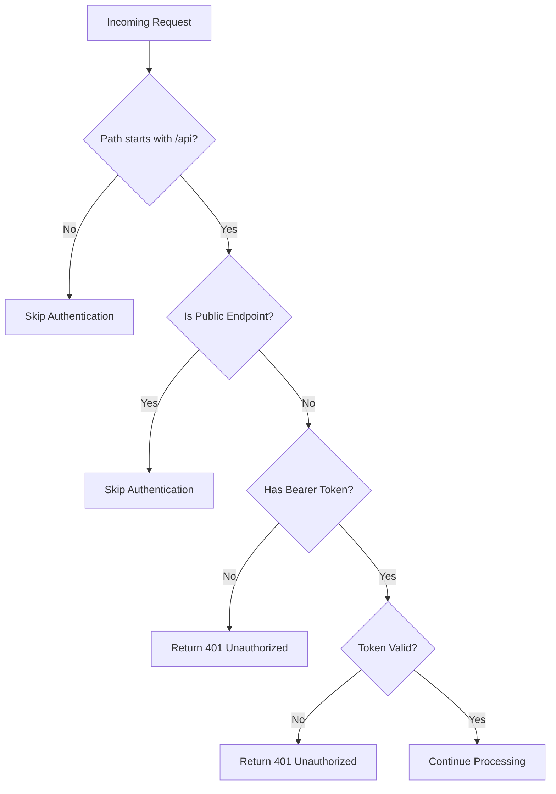
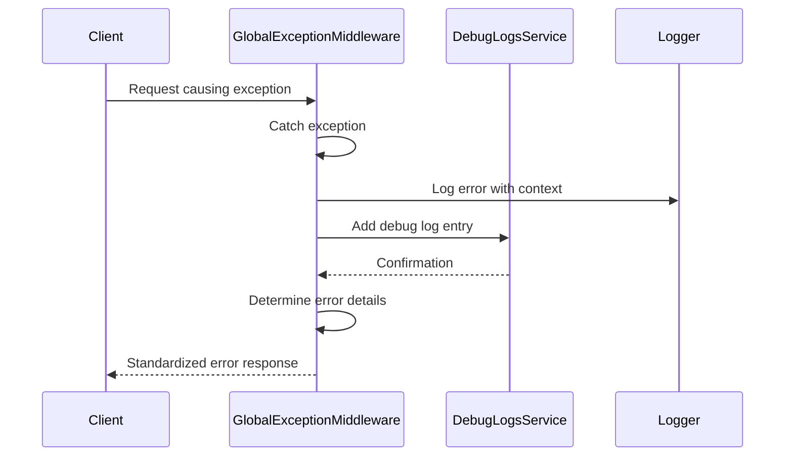
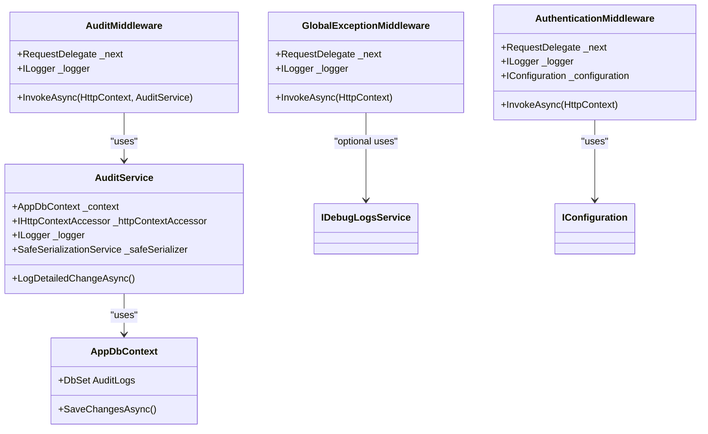

# Middleware Pipeline

<cite>
**Referenced Files in This Document**   
- [AuditMiddleware.cs](file://src/Inventory.API/Middleware/AuditMiddleware.cs)
- [AuthenticationMiddleware.cs](file://src/Inventory.API/Middleware/AuthenticationMiddleware.cs)
- [GlobalExceptionMiddleware.cs](file://src/Inventory.API/Middleware/GlobalExceptionMiddleware.cs)
- [Program.cs](file://src/Inventory.API/Program.cs)
- [AuditService.cs](file://src/Inventory.API/Services/AuditService.cs)
- [AuditLog.cs](file://src/Inventory.API/Models/AuditLog.cs)
- [ActionType.cs](file://src/Inventory.Shared/Enums/ActionType.cs)
- [ServiceCollectionExtensions.cs](file://src/Inventory.API/Extensions/ServiceCollectionExtensions.cs)
</cite>

## Table of Contents
1. [Introduction](#introduction)
2. [Middleware Execution Order](#middleware-execution-order)
3. [AuditMiddleware](#auditmiddleware)
4. [AuthenticationMiddleware](#authenticationmiddleware)
5. [GlobalExceptionMiddleware](#globalexceptionmiddleware)
6. [Dependency Injection and Service Access](#dependency-injection-and-service-access)
7. [Performance Implications and Best Practices](#performance-implications-and-best-practices)
8. [Extending the Middleware Pipeline](#extending-the-middleware-pipeline)
9. [Conclusion](#conclusion)

## Introduction

The ASP.NET Core middleware pipeline in InventoryCtrl_2 implements a robust architecture for handling HTTP requests through a series of specialized middleware components. This document details the execution order and functionality of three critical middleware components: AuthenticationMiddleware, AuditMiddleware, and GlobalExceptionMiddleware. These components work together to provide security, auditing, and error handling capabilities for the inventory management system.

The middleware pipeline follows the standard ASP.NET Core request processing model, where each middleware component has the opportunity to process requests before passing them to subsequent components in the pipeline. The configuration in Program.cs establishes the specific order in which these middleware components execute, which is crucial for proper system behavior.

**Section sources**
- [Program.cs](file://src/Inventory.API/Program.cs#L400-L415)

## Middleware Execution Order

The middleware components in InventoryCtrl_2 execute in a specific order that follows ASP.NET Core best practices for security and error handling. The execution sequence is established in the Program.cs file and follows the principle that error handling middleware should be registered first, followed by security middleware, and then other application middleware.



**Diagram sources**
- [Program.cs](file://src/Inventory.API/Program.cs#L403-L411)

The execution order is as follows:

1. **GlobalExceptionMiddleware**: Registered first to catch any unhandled exceptions that occur throughout the entire request processing pipeline.
2. **AuthenticationMiddleware**: Processes authentication after exception handling is established but before other middleware components that may require authenticated context.
3. **AuditMiddleware**: Captures audit information after authentication is complete but before the request reaches the application's business logic.
4. **Authentication**: Built-in ASP.NET Core authentication services.
5. **Authorization**: Built-in ASP.NET Core authorization services.
6. **Routing**: ASP.NET Core routing middleware.
7. **Controller**: Application controllers that handle the business logic.

This ordering ensures that exceptions are properly caught and handled regardless of where they occur in the pipeline, while also ensuring that authentication and auditing occur at appropriate points in the request processing lifecycle.

**Section sources**
- [Program.cs](file://src/Inventory.API/Program.cs#L403-L411)

## AuditMiddleware

The AuditMiddleware component is responsible for capturing detailed information about HTTP requests and responses, measuring execution time, and logging audit entries through the AuditService. This middleware provides comprehensive audit capabilities with enhanced context including IP address and user agent information.



**Diagram sources**
- [AuditMiddleware.cs](file://src/Inventory.API/Middleware/AuditMiddleware.cs#L25-L210)
- [AuditService.cs](file://src/Inventory.API/Services/AuditService.cs#L120-L150)

### Request and Response Capture

AuditMiddleware captures both request and response details by intercepting the HTTP context. When a request enters the middleware, it starts a stopwatch to measure execution time and captures essential request information including:

- HTTP method and URL
- User agent from request headers
- Client IP address (considering X-Forwarded-For and X-Real-IP headers)
- Query string parameters
- Request headers

To capture the response, the middleware temporarily replaces the response body with a MemoryStream, allowing it to capture the response content before it's sent to the client. After the request has been processed by subsequent middleware components, the middleware stops the stopwatch, logs the audit entry, and copies the response content from the MemoryStream back to the original response stream.

### Enhanced Context Collection

The middleware collects enhanced context information to provide comprehensive audit trails. The IP address is determined through a hierarchy of sources:

1. X-Forwarded-For header (for requests behind load balancers or proxies)
2. X-Real-IP header (alternative proxy header)
3. Connection.RemoteIpAddress (direct client IP)

User agent information is captured directly from the User-Agent header in the HTTP request, providing information about the client's browser and operating system.

### Action and Entity Type Determination

AuditMiddleware determines the action type based on the HTTP method using a switch expression:

- GET → ActionType.Read
- POST → ActionType.Create
- PUT/PATCH → ActionType.Update
- DELETE → ActionType.Delete
- Other methods → ActionType.Other

The entity type is determined from the request path by extracting the controller name from API endpoints (e.g., "/api/products" → "PRODUCTS"). Special paths like "/swagger" and "/health" are categorized appropriately.

### Audit Logging Process

The middleware uses dependency injection to access the AuditService, which handles the actual persistence of audit logs to the database. The LogDetailedChangeAsync method is called with comprehensive information about the request, including execution duration, status code, and contextual metadata.

Certain paths are excluded from auditing to reduce noise in the audit logs, including:
- /swagger
- /health
- /favicon.ico
- Static asset paths (/css, /js, /images, etc.)
- Blazor framework files (/blazor)

**Section sources**
- [AuditMiddleware.cs](file://src/Inventory.API/Middleware/AuditMiddleware.cs#L25-L210)

## AuthenticationMiddleware

The AuthenticationMiddleware component implements a flexible authentication strategy that bypasses authentication on non-API routes and public endpoints while enforcing JWT validation on secured routes. This approach provides a seamless user experience for the Blazor WebAssembly frontend while maintaining security for API endpoints.



**Diagram sources**
- [AuthenticationMiddleware.cs](file://src/Inventory.API/Middleware/AuthenticationMiddleware.cs#L25-L165)

### Authentication Bypass Logic

The middleware implements a multi-layered bypass strategy to accommodate different types of requests:

1. **Non-API Routes**: Requests that don't start with "/api" are assumed to be serving the Blazor WebAssembly frontend and are allowed to proceed without authentication.

2. **Public Endpoints**: Specific API endpoints that require no authentication are defined in a whitelist:
   - /api/auth/login
   - /api/auth/register
   - /api/health
   - /health
   - /swagger
   - /notificationHub

3. **Static Files**: Requests for static assets (CSS, JS, images, etc.) are bypassed to ensure proper frontend functionality.

### JWT Validation Process

For requests that require authentication, the middleware performs JWT validation using configuration settings from the appsettings.json file. The validation process includes:

1. **Token Extraction**: The JWT token is extracted from the Authorization header with the "Bearer" scheme.

2. **Configuration Retrieval**: JWT settings (Key, Issuer, Audience) are retrieved from configuration.

3. **Token Validation**: The JwtSecurityTokenHandler validates the token against the configured parameters, including:
   - Issuer validation
   - Audience validation
   - Lifetime validation (with 5-minute clock skew tolerance)
   - Issuer signing key validation

4. **Expiration Check**: Additional validation ensures the token hasn't expired by checking the "exp" claim.

### Error Handling and Unauthorized Response

When authentication fails, the middleware returns a standardized 401 Unauthorized response with a JSON payload containing:
- success: false
- message: "Unauthorized access. Please log in."
- error: "UNAUTHORIZED"

The middleware logs authentication failures at the warning level, providing visibility into potential security issues or misconfigured clients.

**Section sources**
- [AuthenticationMiddleware.cs](file://src/Inventory.API/Middleware/AuthenticationMiddleware.cs#L25-L165)

## GlobalExceptionMiddleware

The GlobalExceptionMiddleware component provides a centralized error handling strategy that captures unhandled exceptions, performs structured logging, categorizes exceptions, and returns standardized error responses to clients. This middleware serves as the last line of defense against unhandled exceptions in the application.



**Diagram sources**
- [GlobalExceptionMiddleware.cs](file://src/Inventory.API/Middleware/GlobalExceptionMiddleware.cs#L25-L155)

### Exception Categorization

The middleware categorizes exceptions into meaningful types to provide appropriate error responses:

- **ArgumentException/ArgumentNullException**: 400 Bad Request
- **UnauthorizedAccessException**: 401 Unauthorized
- **KeyNotFoundException**: 404 Not Found
- **InvalidOperationException**: 409 Conflict
- **TimeoutException**: 408 Request Timeout
- **HttpRequestException**: 502 Bad Gateway
- **NotImplementedException**: 501 Not Implemented
- **All other exceptions**: 500 Internal Server Error

Each category returns a user-friendly message while maintaining technical details for debugging purposes.

### Structured Logging

The middleware performs comprehensive structured logging that includes:
- Request ID (from TraceIdentifier)
- HTTP method and path
- Client IP address
- User agent
- Full exception details (message and stack trace)

Additionally, if a IDebugLogsService is available, the middleware adds detailed debug logs with properties including request query string and additional context.

### Standardized Error Responses

The middleware returns consistent JSON error responses with the following structure:
```json
{
  "error": {
    "message": "User-friendly error message",
    "details": "Technical details or exception message",
    "requestId": "Unique request identifier",
    "timestamp": "UTC timestamp",
    "type": "Exception type name"
  }
}
```

This standardized format allows clients to consistently handle errors regardless of where they occur in the application.

**Section sources**
- [GlobalExceptionMiddleware.cs](file://src/Inventory.API/Middleware/GlobalExceptionMiddleware.cs#L25-L155)

## Dependency Injection and Service Access

The middleware components in InventoryCtrl_2 leverage ASP.NET Core's dependency injection system to access required services. This design promotes loose coupling and testability while ensuring that middleware components have access to the functionality they need.



**Diagram sources**
- [AuditMiddleware.cs](file://src/Inventory.API/Middleware/AuditMiddleware.cs#L10-L18)
- [AuthenticationMiddleware.cs](file://src/Inventory.API/Middleware/AuthenticationMiddleware.cs#L10-L18)
- [GlobalExceptionMiddleware.cs](file://src/Inventory.API/Middleware/GlobalExceptionMiddleware.cs#L10-L15)
- [AuditService.cs](file://src/Inventory.API/Services/AuditService.cs#L10-L15)
- [ServiceCollectionExtensions.cs](file://src/Inventory.API/Extensions/ServiceCollectionExtensions.cs#L25-L30)

### Service Registration

Services are registered in the dependency injection container through extension methods in ServiceCollectionExtensions