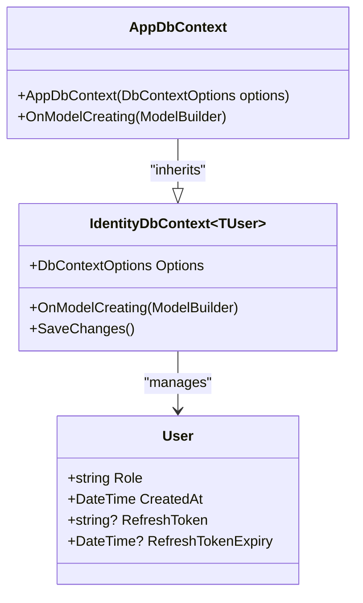
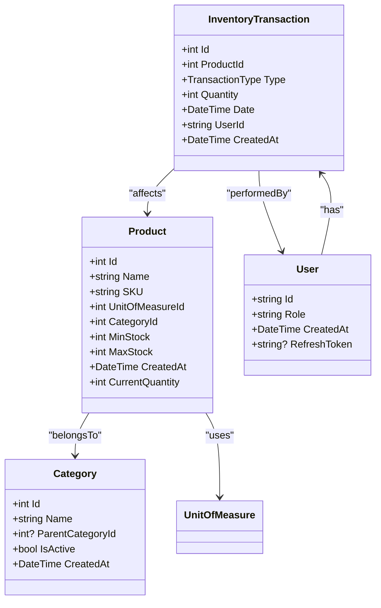
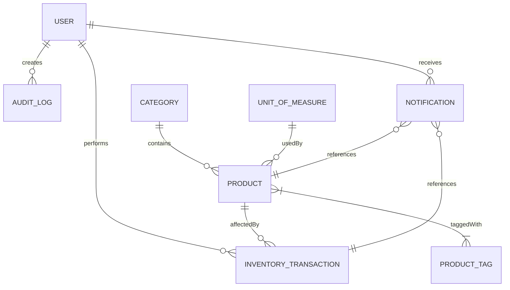
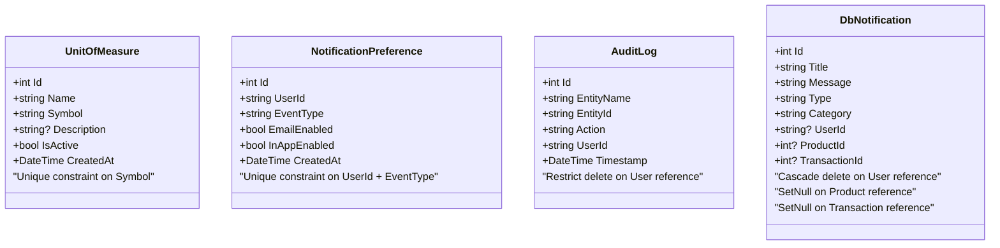
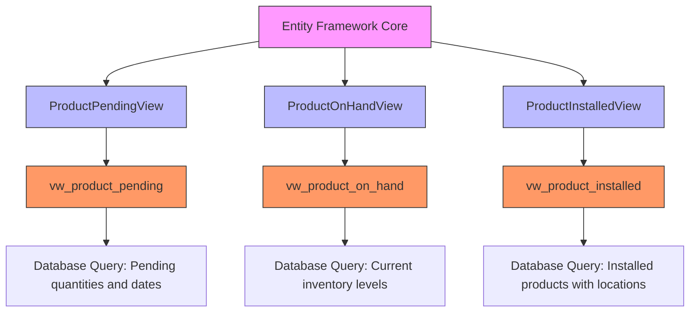

# AppDbContext Configuration

<cite>
**Referenced Files in This Document**   
- [AppDbContext.cs](file://src/Inventory.API/Models/AppDbContext.cs)
- [Product.cs](file://src/Inventory.API/Models/Product.cs)
- [Category.cs](file://src/Inventory.API/Models/Category.cs)
- [InventoryTransaction.cs](file://src/Inventory.API/Models/InventoryTransaction.cs)
- [User.cs](file://src/Inventory.API/Models/User.cs)
- [AuditLog.cs](file://src/Inventory.API/Models/AuditLog.cs)
- [UnitOfMeasure.cs](file://src/Inventory.API/Models/UnitOfMeasure.cs)
- [ProductTag.cs](file://src/Inventory.API/Models/ProductTag.cs)
- [Notification.cs](file://src/Inventory.Shared/Models/Notification.cs)
</cite>

## Table of Contents
1. [Introduction](#introduction)
2. [DbContext Inheritance and Initialization](#dbcontext-inheritance-and-initialization)
3. [Entity Configuration and Model Building](#entity-configuration-and-model-building)
4. [Core Domain Entity Mappings](#core-domain-entity-mappings)
5. [Relationship Configuration](#relationship-configuration)
6. [Index and Constraint Configuration](#index-and-constraint-configuration)
7. [Keyless Views and Database Views](#keyless-views-and-database-views)
8. [DbSet Registrations](#dbset-registrations)
9. [Best Practices for Extending AppDbContext](#best-practices-for-extending-appdbcontext)

## Introduction
The `AppDbContext` class serves as the central data access point for the InventoryCtrl_2 application, managing entity relationships, database schema configuration, and data persistence operations. This document provides comprehensive documentation of the `AppDbContext` configuration, focusing on its inheritance from `IdentityDbContext<User>`, the `OnModelCreating` method implementation, entity mappings, relationship configurations, constraint definitions, and integration with keyless views. The context is designed to support robust inventory management with audit logging, notification systems, and role-based access control.

## DbContext Inheritance and Initialization
The `AppDbContext` class inherits from `IdentityDbContext<User, IdentityRole, string>`, extending ASP.NET Core Identity to support custom user management with additional properties such as role, creation timestamp, and refresh token information. This inheritance provides built-in support for user authentication and authorization while allowing customization through the extended `User` entity.

The context is initialized through dependency injection using `DbContextOptions<AppDbContext>`, enabling configuration flexibility across different environments (development, staging, production). The constructor simply passes the options to the base class, following Entity Framework Core conventions.

**Diagram sources**
- [AppDbContext.cs](file://src/Inventory.API/Models/AppDbContext.cs#L9-L11)
- [User.cs](file://src/Inventory.API/Models/User.cs#L2-L11)

**Section sources**
- [AppDbContext.cs](file://src/Inventory.API/Models/AppDbContext.cs#L9-L11)
- [User.cs](file://src/Inventory.API/Models/User.cs#L2-L11)

## Entity Configuration and Model Building
The `OnModelCreating` method in `AppDbContext` is overridden to configure entity mappings, relationships, constraints, and database-specific settings. This method is called when the model for a context is created, allowing fine-grained control over the database schema.

Entity configurations are performed using the Fluent API, which provides a code-based approach to defining the data model. Each entity is configured within a lambda expression passed to `modelBuilder.Entity<T>()`, allowing for method chaining to define key properties, field constraints, default values, and relationships.

A critical aspect of the configuration is the call to `base.OnModelCreating(modelBuilder)` at the beginning of the method, which ensures that the base `IdentityDbContext` configurations are applied before custom configurations. This maintains compatibility with ASP.NET Core Identity while extending its functionality.

**Section sources**
- [AppDbContext.cs](file://src/Inventory.API/Models/AppDbContext.cs#L13-L179)

## Core Domain Entity Mappings
The `AppDbContext` configures several core domain entities that represent the fundamental business objects in the inventory management system. Each entity mapping defines primary keys, required fields, string length constraints, and default value expressions.

### Product Entity
The `Product` entity represents inventory items with properties including name, SKU, category, manufacturer, and stock thresholds. It includes navigation properties to related entities such as `Category`, `Manufacturer`, `UnitOfMeasure`, and `ProductTag`. The entity uses a computed `CurrentQuantity` property that derives its value from the `ProductOnHandView` rather than storing redundant data.

### Category Entity
The `Category` entity supports hierarchical classification of products with a self-referencing relationship through the `ParentCategory` and `SubCategories` properties. Categories can be active or inactive and include timestamps for creation and updates.

### InventoryTransaction Entity
The `InventoryTransaction` entity tracks all movements of inventory, including income, outcome, installation, and pending transactions. It includes references to the product, warehouse, user, and optional location and request. The entity uses JSON ignore attributes to prevent circular serialization issues.

### User Entity
The `User` entity extends `IdentityUser<string>` with additional properties specific to the application, including role, creation timestamp, refresh token, and navigation properties to transactions and product histories.

**Diagram sources**
- [Product.cs](file://src/Inventory.API/Models/Product.cs#L4-L35)
- [Category.cs](file://src/Inventory.API/Models/Category.cs#L2-L14)
- [InventoryTransaction.cs](file://src/Inventory.API/Models/InventoryTransaction.cs#L12-L38)
- [User.cs](file://src/Inventory.API/Models/User.cs#L2-L11)

**Section sources**
- [Product.cs](file://src/Inventory.API/Models/Product.cs#L4-L35)
- [Category.cs](file://src/Inventory.API/Models/Category.cs#L2-L14)
- [InventoryTransaction.cs](file://src/Inventory.API/Models/InventoryTransaction.cs#L12-L38)
- [User.cs](file://src/Inventory.API/Models/User.cs#L2-L11)

## Relationship Configuration
The `AppDbContext` establishes various relationship types between entities to represent the business domain accurately. These relationships are configured using the Fluent API to specify foreign key constraints, cascade behaviors, and multiplicity.

### One-to-Many Relationships
One-to-many relationships are configured using `HasOne().WithMany()` patterns. For example:
- `User` to `AuditLog`: Each user can have multiple audit logs, with `DeleteBehavior.Restrict` to prevent deletion of users with associated audit records
- `User` to `Notification`: Each user can receive multiple notifications, with `DeleteBehavior.Cascade` so notifications are removed when a user is deleted
- `Product` to `InventoryTransaction`: Each product can have multiple transactions, maintaining a complete history of inventory movements

### Many-to-Many Relationships
The many-to-many relationship between `Product` and `ProductTag` is configured using the `HasMany().WithMany()` method with a junction table named "ProductProductTags". This configuration creates a linking table in the database to manage the association between products and their tags without requiring an explicit entity class for the junction table.

### Optional References
Several relationships use optional references with specific delete behaviors:
- `Notification` to `Product`: Configured with `DeleteBehavior.SetNull`, allowing notifications to persist even if the referenced product is deleted
- `Notification` to `Transaction`: Also uses `DeleteBehavior.SetNull` to maintain notification history even after transaction deletion

**Diagram sources**
- [AppDbContext.cs](file://src/Inventory.API/Models/AppDbContext.cs#L13-L179)
- [AuditLog.cs](file://src/Inventory.API/Models/AuditLog.cs#L9-L253)
- [Notification.cs](file://src/Inventory.Shared/Models/Notification.cs#L5-L154)

**Section sources**
- [AppDbContext.cs](file://src/Inventory.API/Models/AppDbContext.cs#L13-L179)

## Index and Constraint Configuration
The `AppDbContext` configures several indexes and constraints to ensure data integrity, improve query performance, and enforce business rules.

### Unique Constraints
Unique constraints are defined using `HasIndex().IsUnique()` to prevent duplicate values in critical fields:
- `UnitOfMeasure.Symbol`: A unique index ensures that each unit of measure symbol (e.g., "pcs", "kg", "m") is distinct across the system
- `NotificationPreference`: A composite unique index on `UserId` and `EventType` prevents duplicate notification preferences for the same user and event type

### Key Constraints and Field Validations
Each entity configuration specifies primary keys using `HasKey()` and applies field constraints through `Property()` configurations:
- Required fields are marked with `IsRequired()`
- String length limits are enforced with `HasMaxLength()`
- Default values are set using `HasDefaultValueSql("CURRENT_TIMESTAMP")` for creation timestamps

The configuration also includes ReferentialAction settings that determine the behavior when related entities are deleted:
- `DeleteBehavior.Restrict`: Prevents deletion of entities with dependent records (used for `AuditLog` references to `User`)
- `DeleteBehavior.Cascade`: Automatically deletes dependent entities when the principal is deleted (used for `Notification` references to `User`)
- `DeleteBehavior.SetNull`: Sets foreign key values to null when the referenced entity is deleted (used for `Notification` references to `Product` and `Transaction`)

**Diagram sources**
- [AppDbContext.cs](file://src/Inventory.API/Models/AppDbContext.cs#L13-L179)
- [UnitOfMeasure.cs](file://src/Inventory.API/Models/UnitOfMeasure.cs#L5-L27)
- [Notification.cs](file://src/Inventory.Shared/Models/Notification.cs#L5-L154)

**Section sources**
- [AppDbContext.cs](file://src/Inventory.API/Models/AppDbContext.cs#L13-L179)

## Keyless Views and Database Views
The `AppDbContext` includes configurations for keyless entity types that map to database views, providing read-only access to complex queries and aggregated data.

Three key views are configured:
- `ProductPendingView`: Maps to the "vw_product_pending" view, showing products with pending transactions including pending quantity and date ranges
- `ProductOnHandView`: Maps to the "vw_product_on_hand" view, showing current inventory levels for each product
- `ProductInstalledView`: Maps to the "vw_product_installed" view, showing installed products with location information

These views are configured as keyless entities using `HasNoKey()` since they represent query results rather than physical tables with primary keys. The `ToView()` method specifies the database view name, and column mappings are defined using `HasColumnName()` to match the view's column names.

The use of keyless views allows the application to leverage database-level aggregations and calculations while maintaining a clean object-oriented interface in the application code. This approach improves performance by pushing complex queries to the database and reduces data transfer by only retrieving necessary aggregated information.

**Diagram sources**
- [AppDbContext.cs](file://src/Inventory.API/Models/AppDbContext.cs#L13-L179)
- [ProductViews.cs](file://src/Inventory.API/Models/ProductViews.cs)

**Section sources**
- [AppDbContext.cs](file://src/Inventory.API/Models/AppDbContext.cs#L13-L179)

## DbSet Registrations
The `AppDbContext` exposes `DbSet` properties for all entity types, providing strongly-typed access to database tables and views. Each `DbSet` is declared as a public property with null-forgiving operator (`= null!`) to satisfy C# nullable reference type requirements while allowing Entity Framework Core to manage the instance creation.

The context registers `DbSet` instances for:
- Core domain entities: `Product`, `Category`, `InventoryTransaction`, `Warehouse`, `Location`, `Manufacturer`, `ProductModel`, `ProductGroup`
- Supporting entities: `ProductTag`, `UnitOfMeasure`, `Request`, `RequestHistory`
- System entities: `AuditLog`, `DbNotification`, `NotificationRule`, `NotificationPreference`, `NotificationTemplate`
- Keyless views: `ProductPending`, `ProductOnHand`, `ProductInstalled`
- Infrastructure entities: `SignalRConnections`

This comprehensive registration enables LINQ queries against all entity types through the context instance, with Entity Framework Core translating these queries to SQL commands executed against the database.

**Section sources**
- [AppDbContext.cs](file://src/Inventory.API/Models/AppDbContext.cs#L181-L204)

## Best Practices for Extending AppDbContext
When extending the `AppDbContext` with new entities or modifying existing configurations, several best practices should be followed to maintain data integrity and application stability.

### Adding New Entities
To add a new entity:
1. Create the entity class with appropriate properties and navigation relationships
2. Add a `DbSet<TEntity>` property to `AppDbContext`
3. Configure the entity in `OnModelCreating` using the Fluent API
4. Create and apply a migration using Entity Framework Core tools

### Managing Migrations
Migrations should be created using the `Add-Migration` command with descriptive names that indicate the changes being made. Each migration should represent a single logical change to the schema. Before applying migrations to production environments, they should be reviewed and tested in staging environments.

### Ensuring Schema Consistency
To ensure schema consistency across environments:
- Use the same migration history in all environments
- Apply migrations programmatically during application startup in development, or through deployment scripts in production
- Regularly compare schema between environments using database comparison tools
- Document significant schema changes in the project's changelog

### Performance Considerations
When configuring entities:
- Add indexes to fields frequently used in WHERE, JOIN, or ORDER BY clauses
- Use appropriate ReferentialAction settings to balance data integrity with performance
- Consider using keyless entities for complex read-only queries instead of loading large amounts of data into memory
- Leverage database views for aggregated data to reduce query complexity and improve performance

**Section sources**
- [AppDbContext.cs](file://src/Inventory.API/Models/AppDbContext.cs#L9-L204)