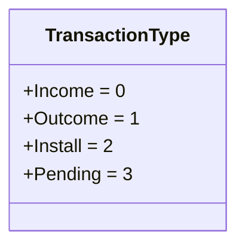
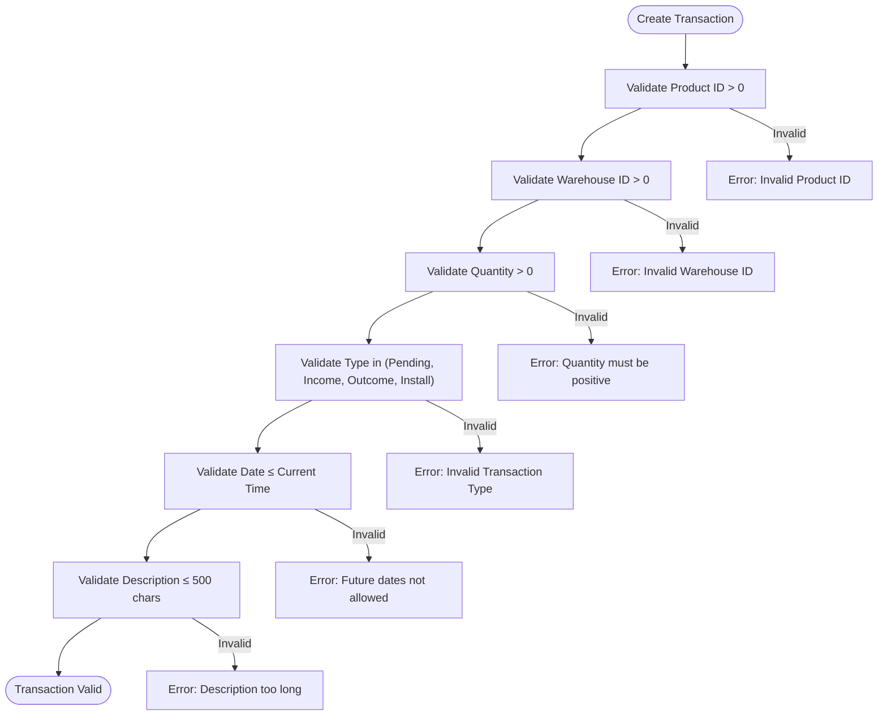
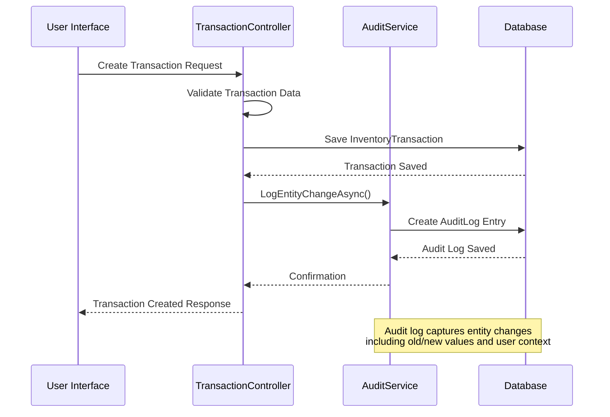
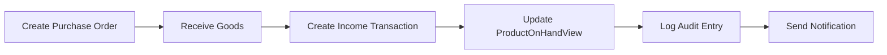
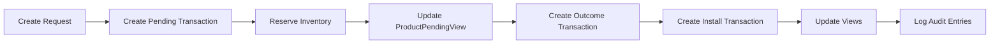
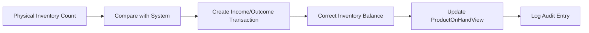
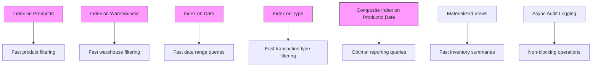

# Inventory Transaction Model

<cite>
**Referenced Files in This Document**   
- [InventoryTransaction.cs](file://src/Inventory.API/Models/InventoryTransaction.cs)
- [TransactionDto.cs](file://src/Inventory.Shared/DTOs/TransactionDto.cs)
- [CreateTransactionDtoValidator.cs](file://src/Inventory.API/Validators/CreateTransactionDtoValidator.cs)
- [ProductViews.cs](file://src/Inventory.API/Models/ProductViews.cs)
- [SqlViewInitializer.cs](file://src/Inventory.API/Models/SqlViewInitializer.cs)
- [TransactionController.cs](file://src/Inventory.API/Controllers/TransactionController.cs)
- [AuditLog.cs](file://src/Inventory.API/Models/AuditLog.cs)
</cite>

## Table of Contents
1. [Introduction](#introduction)
2. [Core Properties](#core-properties)
3. [Transaction Type Enum](#transaction-type-enum)
4. [Relationships](#relationships)
5. [Data Validation Rules](#data-validation-rules)
6. [Inventory Views](#inventory-views)
7. [Audit Logging](#audit-logging)
8. [Common Workflows](#common-workflows)
9. [Performance Considerations](#performance-considerations)
10. [Conclusion](#conclusion)

## Introduction
The InventoryTransaction entity in InventoryCtrl_2 serves as the central model for tracking all inventory movements and changes within the system. This document provides comprehensive documentation of the InventoryTransaction model, detailing its properties, relationships, business logic, and system interactions. The model captures critical inventory operations including income, outcome, installation, and pending transactions, forming the foundation for accurate inventory tracking and reporting.

**Section sources**
- [InventoryTransaction.cs](file://src/Inventory.API/Models/InventoryTransaction.cs#L12-L38)

## Core Properties
The InventoryTransaction entity contains essential fields for recording inventory movements:

- **Id**: Unique identifier for the transaction
- **ProductId**: Foreign key linking to the Product entity
- **WarehouseId**: Foreign key linking to the Warehouse entity where the transaction occurred
- **Type**: Enum value indicating the transaction type (Income, Outcome, Install, Pending)
- **Quantity**: Integer value representing the amount of product involved (must be positive)
- **Date**: DateTime indicating when the transaction occurred
- **UserId**: Identifier of the user who created the transaction
- **LocationId**: Optional foreign key to the Location entity where the product is stored
- **RequestId**: Optional foreign key to the Request entity for traceability
- **UnitPrice** and **TotalPrice**: Financial details of the transaction
- **Description**: Additional notes about the transaction
- **CreatedAt** and **UpdatedAt**: Audit timestamps for record management

**Section sources**
- [InventoryTransaction.cs](file://src/Inventory.API/Models/InventoryTransaction.cs#L12-L38)

## Transaction Type Enum
The TransactionType enum defines four distinct transaction categories with specific business implications:



**Diagram sources**
- [InventoryTransaction.cs](file://src/Inventory.API/Models/InventoryTransaction.cs#L4-L10)

Each transaction type has specific business logic:
- **Income**: Increases available stock in the warehouse
- **Outcome**: Decreases available stock; requires sufficient inventory balance
- **Install**: Removes items from general inventory for installation at a location
- **Pending**: Reserves items for future processing, reducing available stock but not yet installed

The system enforces valid transaction types through both application-level validation and database constraints.

**Section sources**
- [InventoryTransaction.cs](file://src/Inventory.API/Models/InventoryTransaction.cs#L4-L10)
- [CreateTransactionDtoValidator.cs](file://src/Inventory.API/Validators/CreateTransactionDtoValidator.cs#L20-L25)

## Relationships
The InventoryTransaction model establishes critical relationships with other entities in the system:

```mermaid
erDiagram
INVENTORY_TRANSACTION {
int Id PK
int ProductId FK
int WarehouseId FK
string UserId FK
int? LocationId FK
int? RequestId FK
TransactionType Type
int Quantity
datetime Date
}
PRODUCT {
int Id PK
string Name
string SKU
}
WAREHOUSE {
int Id PK
string Name
}
USER {
string Id PK
string UserName
}
LOCATION {
int Id PK
string Name
}
REQUEST {
int Id PK
string Status
}
INVENTORY_TRANSACTION ||--|{ PRODUCT : "many-to-one"
INVENTORY_TRANSACTION ||--|{ WAREHOUSE : "many-to-one"
INVENTORY_TRANSACTION ||--|{ USER : "created-by"
INVENTORY_TRANSACTION }o--|| LOCATION : "optional"
INVENTORY_TRANSACTION }o--|| REQUEST : "references"
```

**Diagram sources**
- [InventoryTransaction.cs](file://src/Inventory.API/Models/InventoryTransaction.cs#L12-L38)
- [AppDbContext.cs](file://src/Inventory.API/Models/AppDbContext.cs#L9-L204)

The model maintains many-to-one relationships with Product, Warehouse, and User entities, while having optional references to Location and Request entities. The navigation properties enable efficient data retrieval and relationship management.

**Section sources**
- [InventoryTransaction.cs](file://src/Inventory.API/Models/InventoryTransaction.cs#L12-L38)

## Data Validation Rules
The system enforces strict validation rules to ensure data integrity:



**Diagram sources**
- [CreateTransactionDtoValidator.cs](file://src/Inventory.API/Validators/CreateTransactionDtoValidator.cs#L12-L41)

Key validation rules include:
- ProductId must be greater than 0
- WarehouseId must be greater than 0
- Quantity must be greater than 0
- Transaction type must be one of: Pending, Income, Outcome, Install
- Transaction date cannot be in the future
- Description cannot exceed 500 characters
- LocationId must be greater than 0 if specified

These rules are enforced through FluentValidation in the CreateTransactionDtoValidator and UpdateTransactionDtoValidator classes.

**Section sources**
- [CreateTransactionDtoValidator.cs](file://src/Inventory.API/Validators/CreateTransactionDtoValidator.cs#L12-L41)
- [UpdateTransactionDtoValidator.cs](file://src/Inventory.API/Validators/UpdateTransactionDtoValidator.cs#L12-L23)

## Inventory Views
Inventory transactions directly impact several materialized views that provide real-time inventory status:

```mermaid
erDiagram
PRODUCT_ON_HAND_VIEW {
int ProductId PK
string ProductName
string SKU
int OnHandQty
}
PRODUCT_INSTALLED_VIEW {
int ProductId PK
string ProductName
string SKU
int? LocationId
string? LocationName
int InstalledQty
datetime? FirstInstallDate
datetime? LastInstallDate
}
PRODUCT_PENDING_VIEW {
int ProductId PK
string ProductName
string SKU
int PendingQty
datetime? FirstPendingDate
datetime? LastPendingDate
}
INVENTORY_TRANSACTION ||--o{ PRODUCT_ON_HAND_VIEW : "affects"
INVENTORY_TRANSACTION ||--o{ PRODUCT_INSTALLED_VIEW : "affects"
INVENTORY_TRANSACTION ||--o{ PRODUCT_PENDING_VIEW : "affects"
```

**Diagram sources**
- [ProductViews.cs](file://src/Inventory.API/Models/ProductViews.cs#L12-L30)
- [SqlViewInitializer.cs](file://src/Inventory.API/Models/SqlViewInitializer.cs#L0-L63)

The system maintains three key inventory views:
- **ProductOnHandView**: Calculates available inventory by summing income transactions and subtracting outcome and install transactions
- **ProductInstalledView**: Tracks items that have been installed at specific locations
- **ProductPendingView**: Monitors items reserved for pending requests

These views are updated automatically through database triggers and are used for real-time inventory reporting and validation.

**Section sources**
- [ProductViews.cs](file://src/Inventory.API/Models/ProductViews.cs#L12-L30)
- [SqlViewInitializer.cs](file://src/Inventory.API/Models/SqlViewInitializer.cs#L0-L63)

## Audit Logging
All inventory transactions trigger comprehensive audit logging to ensure traceability and security:



**Diagram sources**
- [TransactionController.cs](file://src/Inventory.API/Controllers/TransactionController.cs#L9-L369)
- [AuditService.cs](file://src/Inventory.API/Services/AuditService.cs#L12-L430)

Each transaction creates an audit log entry containing:
- Entity name and ID
- Action performed (CREATE)
- User ID and username
- Timestamp of the action
- IP address and user agent
- HTTP method and URL
- Detailed changes (when applicable)

The audit system ensures complete traceability of all inventory changes for compliance and troubleshooting purposes.

**Section sources**
- [TransactionController.cs](file://src/Inventory.API/Controllers/TransactionController.cs#L9-L369)
- [AuditLog.cs](file://src/Inventory.API/Models/AuditLog.cs#L0-L254)

## Common Workflows
The InventoryTransaction model supports several key business workflows:

### Purchase Receipt Workflow


### Fulfillment Workflow


### Inventory Adjustment Workflow


These workflows demonstrate how the InventoryTransaction model serves as the central mechanism for all inventory movements, ensuring data consistency and business rule enforcement.

**Section sources**
- [TransactionController.cs](file://src/Inventory.API/Controllers/TransactionController.cs#L9-L369)
- [RequestService.cs](file://src/Inventory.API/Services/RequestService.cs#L50-L97)

## Performance Considerations
The system implements several performance optimizations for efficient transaction processing and reporting:



**Diagram sources**
- [SqlViewInitializer.cs](file://src/Inventory.API/Models/SqlViewInitializer.cs#L0-L63)
- [20250928113056_AddCriticalPerformanceIndexes.Designer.cs](file://src/Inventory.API/Migrations/20250928113056_AddCriticalPerformanceIndexes.Designer.cs#L1-L100)

Key performance features include:
- Database indexes on ProductId, WarehouseId, Date, and Type columns
- Composite index on ProductId and Date for optimized reporting
- Materialized views for real-time inventory summaries
- Asynchronous audit logging to prevent blocking operations
- Efficient query patterns in the TransactionController

These optimizations ensure responsive performance even with large transaction volumes and complex reporting requirements.

**Section sources**
- [SqlViewInitializer.cs](file://src/Inventory.API/Models/SqlViewInitializer.cs#L0-L63)
- [20250928113056_AddCriticalPerformanceIndexes.Designer.cs](file://src/Inventory.API/Migrations/20250928113056_AddCriticalPerformanceIndexes.Designer.cs#L1-L100)

## Conclusion
The InventoryTransaction model in InventoryCtrl_2 provides a robust foundation for comprehensive inventory management. By capturing all inventory movements through a standardized transaction model, the system ensures data consistency, enables accurate reporting, and maintains complete audit trails. The model's design supports critical business operations including purchasing, fulfillment, and inventory adjustments while enforcing data integrity through comprehensive validation rules. Integration with materialized views and audit logging provides real-time inventory visibility and complete traceability, making it a central component of the inventory management system.