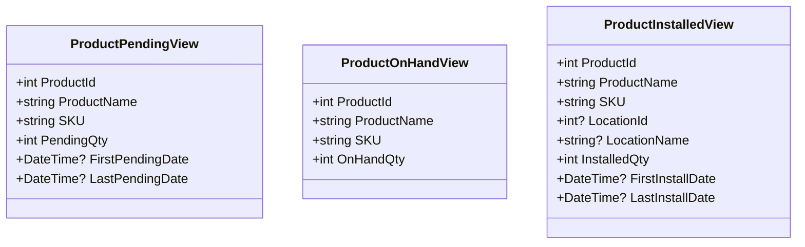
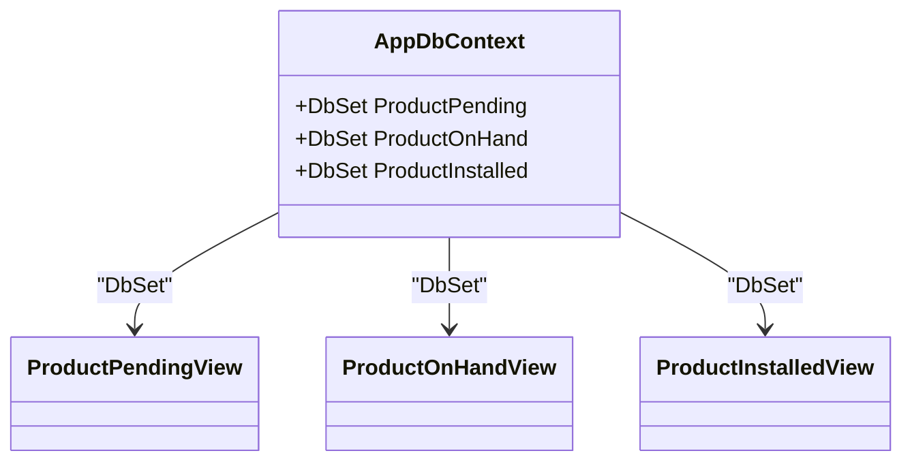
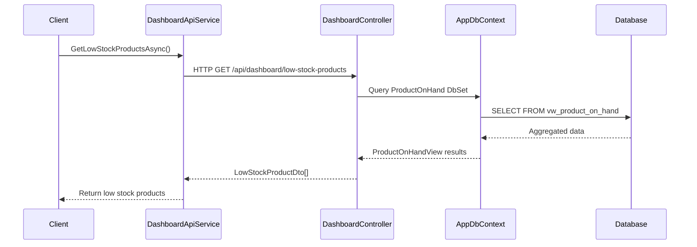

# Keyless Entity Views

<cite>
**Referenced Files in This Document**   
- [ProductViews.cs](file://src/Inventory.API/Models/ProductViews.cs)
- [AppDbContext.cs](file://src/Inventory.API/Models/AppDbContext.cs)
- [measure-before.sql](file://scripts/sql/measure-before.sql)
- [measure-after.sql](file://scripts/sql/measure-after.sql)
- [DashboardController.cs](file://src/Inventory.API/Controllers/DashboardController.cs)
- [DashboardApiService.cs](file://src/Inventory.Shared/Services/DashboardApiService.cs)
- [DashboardDto.cs](file://src/Inventory.Shared/DTOs/DashboardDto.cs)
</cite>

## Table of Contents
1. [Introduction](#introduction)
2. [Keyless Entity View Definitions](#keyless-entity-view-definitions)
3. [Entity Framework Core Configuration](#entity-framework-core-configuration)
4. [Database View Implementation](#database-view-implementation)
5. [Integration with Dashboard Components](#integration-with-dashboard-components)
6. [Performance Benefits and Materialization](#performance-benefits-and-materialization)
7. [Deployment Requirements](#deployment-requirements)
8. [Conclusion](#conclusion)

## Introduction
The InventoryCtrl_2 system leverages keyless entity views in Entity Framework Core to provide optimized, read-only access to aggregated inventory data. These views eliminate the need for client-side computation by pre-aggregating critical inventory metrics at the database level. This document details the three primary keyless entity views—`ProductPendingView`, `ProductOnHandView`, and `ProductInstalledView`—which support real-time dashboard reporting, low-stock alerts, and inventory analytics. The implementation uses SQL database views mapped via EF Core's `ToView()` configuration, enabling efficient querying through `DbSet` properties without requiring primary keys.

**Section sources**
- [ProductViews.cs](file://src/Inventory.API/Models/ProductViews.cs#L2-L30)

## Keyless Entity View Definitions
The system defines three keyless entity classes that represent materialized aggregations of inventory data:

- **ProductPendingView**: Captures products with pending transactions, including total pending quantity and date ranges of pending activity.
- **ProductOnHandView**: Represents current on-hand inventory quantities per product, essential for stock level monitoring.
- **ProductInstalledView**: Tracks installed product quantities by location, including installation timelines.

These classes are defined as C# models without primary keys, using standard properties mapped to underlying SQL view columns. They serve as data transfer objects between the database and application layers, optimized for read performance.

**Diagram sources**
- [ProductViews.cs](file://src/Inventory.API/Models/ProductViews.cs#L2-L30)

**Section sources**
- [ProductViews.cs](file://src/Inventory.API/Models/ProductViews.cs#L2-L30)

## Entity Framework Core Configuration
In `AppDbContext`, the keyless entity views are configured using EF Core's fluent API. Each view entity is designated as having no key via `HasNoKey()` and is mapped to its corresponding database view using `ToView()`. Column mappings are explicitly defined using `HasColumnName()` to ensure correct field-to-column alignment.

The `ProductPendingView` maps to `vw_product_pending`, `ProductOnHandView` to `vw_product_on_hand`, and `ProductInstalledView` to `vw_product_installed`. These configurations enable EF Core to generate correct SQL queries against the views while treating them as first-class entities within the context.

Additionally, `DbSet` properties are exposed for each view, allowing standard LINQ querying through `context.ProductPending`, `context.ProductOnHand`, and `context.ProductInstalled`.

**Diagram sources**
- [AppDbContext.cs](file://src/Inventory.API/Models/AppDbContext.cs#L199-L201)

**Section sources**
- [AppDbContext.cs](file://src/Inventory.API/Models/AppDbContext.cs#L150-L201)

## Database View Implementation
The SQL definitions for the underlying database views are maintained in `measure-before.sql` and `measure-after.sql`, which are used for performance profiling before and after index optimization. Although the full view definitions are not present in these files, they contain `EXPLAIN (ANALYZE)` queries that validate the performance of related access patterns.

The actual view definitions (e.g., `vw_product_pending`, `vw_product_on_hand`, `vw_product_installed`) are expected to be created during database migration and are composed of aggregations across `Products`, `InventoryTransactions`, and related tables. These views compute quantities such as pending orders, current stock levels, and installed assets by location, ensuring that complex joins and groupings are executed at the database level.

This approach minimizes data transfer and client-side processing, particularly for dashboard metrics that require frequent access to summarized inventory states.

**Section sources**
- [measure-before.sql](file://scripts/sql/measure-before.sql#L1-L63)
- [measure-after.sql](file://scripts/sql/measure-after.sql#L1-L60)

## Integration with Dashboard Components
The keyless entity views are integral to the `DashboardController` and `DashboardApiService`, where they enable efficient retrieval of real-time inventory metrics. The `DashboardController` uses `ProductOnHandView` to calculate low-stock and out-of-stock product counts by joining with the `Products` table and comparing `OnHandQty` against `MinStock`.

For example, the `GetLowStockProducts` endpoint queries `ProductOnHand` to identify items below their minimum stock threshold, populating `LowStockProductDto` with relevant details. Similarly, `GetDashboardStats` uses `ProductOnHand` to compute critical KPIs without loading full product records.

The `DashboardApiService` in the shared library provides asynchronous methods to consume these endpoints, supporting retry logic and error handling for resilient client-side access.

**Diagram sources**
- [DashboardController.cs](file://src/Inventory.API/Controllers/DashboardController.cs#L100-L140)
- [DashboardApiService.cs](file://src/Inventory.Shared/Services/DashboardApiService.cs#L30-L67)
- [DashboardDto.cs](file://src/Inventory.Shared/DTOs/DashboardDto.cs#L30-L56)

**Section sources**
- [DashboardController.cs](file://src/Inventory.API/Controllers/DashboardController.cs#L50-L140)
- [DashboardApiService.cs](file://src/Inventory.Shared/Services/DashboardApiService.cs#L30-L67)

## Performance Benefits and Materialization
Using keyless entity views provides significant performance advantages:

- **Reduced Client-Side Computation**: Aggregations are performed in the database, minimizing data transfer and processing load on the application server.
- **Optimized Query Plans**: Database views can leverage indexes and statistics for faster execution, especially when combined with proper indexing strategies.
- **Simplified Code**: LINQ queries against `DbSet` properties for views are as straightforward as those for regular entities, improving code readability and maintainability.

However, these views are not materialized by default unless explicitly configured as indexed views in the database. The system relies on runtime view execution, which is sufficient for the current workload but could benefit from materialization in high-read scenarios to further reduce latency.

**Section sources**
- [measure-before.sql](file://scripts/sql/measure-before.sql#L1-L63)
- [measure-after.sql](file://scripts/sql/measure-after.sql#L1-L60)

## Deployment Requirements
During deployment, the database views (`vw_product_pending`, `vw_product_on_hand`, `vw_product_installed`) must be created or updated as part of the database migration process. This is typically handled by EF Core migrations or separate SQL scripts executed during deployment.

The `SqlViewInitializer` class (not analyzed here) may be responsible for ensuring view consistency. Additionally, the deployment pipeline must ensure that the views are compatible with the current schema, particularly after changes to `Products`, `InventoryTransactions`, or `Locations` tables.

Performance profiling using `measure-before.sql` and `measure-after.sql` should be conducted post-deployment to validate query efficiency and index effectiveness.

**Section sources**
- [measure-before.sql](file://scripts/sql/measure-before.sql#L1-L63)
- [measure-after.sql](file://scripts/sql/measure-after.sql#L1-L60)

## Conclusion
The keyless entity views in InventoryCtrl_2 provide a powerful mechanism for delivering real-time, aggregated inventory data with minimal overhead. By leveraging EF Core's `HasNoKey()` and `ToView()` features, the system achieves efficient, type-safe access to complex inventory metrics through standard `DbSet` queries. These views are central to dashboard functionality, enabling fast responses for low-stock alerts, transaction history, and inventory reporting. Proper deployment and database-level view management are essential to maintain performance and correctness.