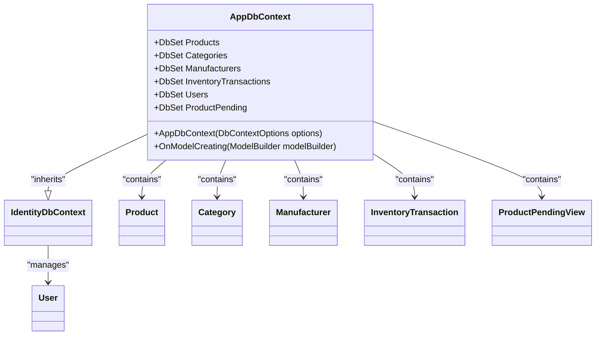
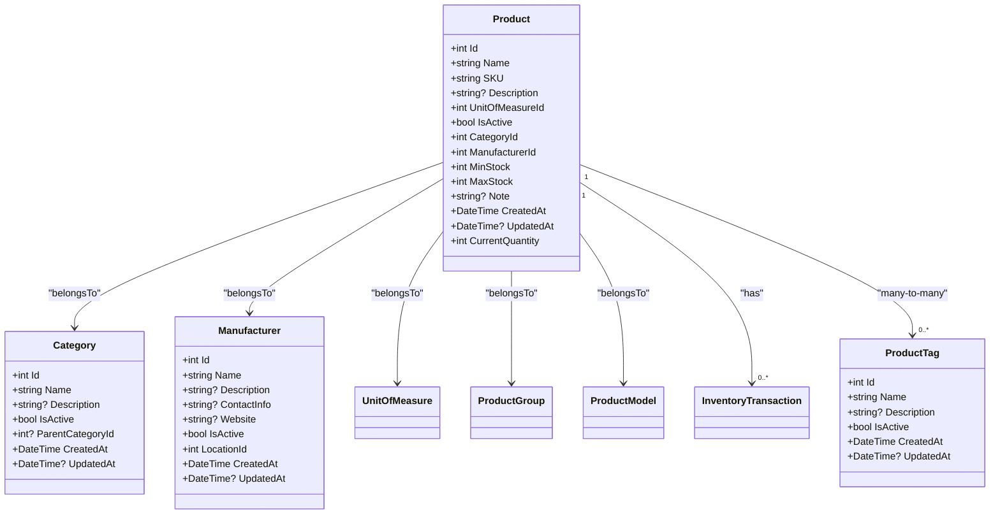
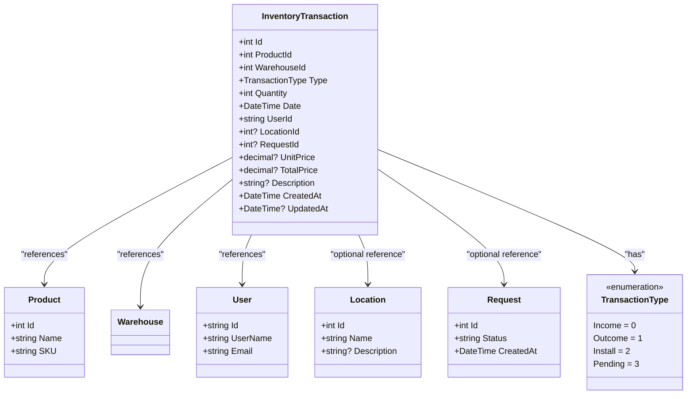
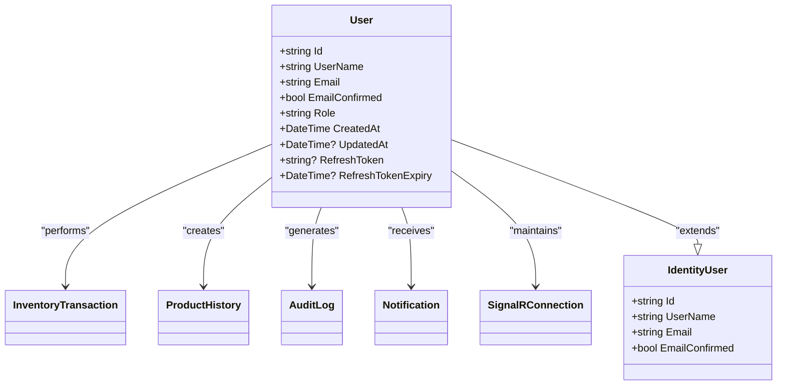
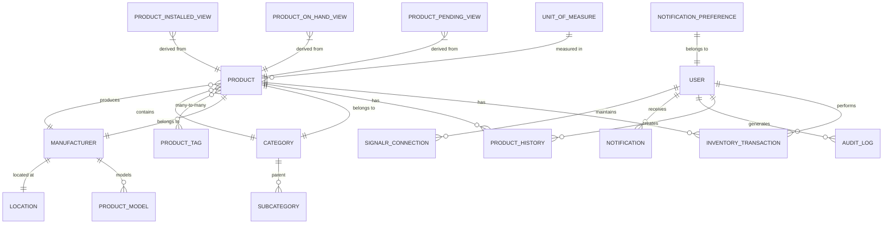

# ORM Models

<cite>
**Referenced Files in This Document**   
- [AppDbContext.cs](file://src/Inventory.API/Models/AppDbContext.cs)
- [Product.cs](file://src/Inventory.API/Models/Product.cs)
- [InventoryTransaction.cs](file://src/Inventory.API/Models/InventoryTransaction.cs)
- [User.cs](file://src/Inventory.API/Models/User.cs)
- [ProductViews.cs](file://src/Inventory.API/Models/ProductViews.cs)
- [Category.cs](file://src/Inventory.API/Models/Category.cs)
- [Manufacturer.cs](file://src/Inventory.API/Models/Manufacturer.cs)
</cite>

## Table of Contents
1. [Introduction](#introduction)
2. [AppDbContext Configuration](#appdbcontext-configuration)
3. [Product Entity and Relationships](#product-entity-and-relationships)
4. [InventoryTransaction Model](#inventorytransaction-model)
5. [User Model and Identity Integration](#user-model-and-identity-integration)
6. [Keyless Entities and Database Views](#keyless-entities-and-database-views)
7. [Data Validation and Constraints](#data-validation-and-constraints)
8. [Performance Optimization](#performance-optimization)
9. [Model Extension Guidelines](#model-extension-guidelines)
10. [Conclusion](#conclusion)

## Introduction
This document provides comprehensive documentation for the Entity Framework Core models in the InventoryCtrl_2 application. The system implements a robust inventory management solution with a well-structured domain model that supports product tracking, transaction management, user authentication, and audit capabilities. The data model is designed with scalability and data integrity in mind, leveraging Entity Framework Core's configuration capabilities to define entity mappings, relationships, constraints, and database views. This documentation details the core components of the ORM model, including the AppDbContext configuration, entity relationships, validation rules, and performance optimization strategies.

## AppDbContext Configuration

The AppDbContext serves as the central configuration point for the Entity Framework Core model, inheriting from IdentityDbContext to integrate user authentication and authorization capabilities. The context manages all entity sets and defines their configuration through the OnModelCreating method, which contains fluent API configurations for each entity type.



**Diagram sources**
- [AppDbContext.cs](file://src/Inventory.API/Models/AppDbContext.cs#L9-L204)

**Section sources**
- [AppDbContext.cs](file://src/Inventory.API/Models/AppDbContext.cs#L9-L204)

## Product Entity and Relationships

The Product entity represents inventory items within the system and establishes relationships with several other entities to support comprehensive inventory management. The product model includes essential attributes such as Name, SKU, and description, along with stock management properties like MinStock and MaxStock. Notably, the direct Quantity field has been removed to prevent data duplication, replaced by the CurrentQuantity computed property that derives its value from the ProductOnHandView.

The Product entity maintains relationships with Category, Manufacturer, and ProductTag entities through navigation properties. The many-to-many relationship between Product and ProductTag is configured using a junction table named "ProductProductTags", which is automatically created by Entity Framework. Each product belongs to exactly one category and manufacturer, establishing hierarchical organization of inventory items.



**Diagram sources**
- [Product.cs](file://src/Inventory.API/Models/Product.cs#L4-L35)
- [Category.cs](file://src/Inventory.API/Models/Category.cs#L2-L14)
- [Manufacturer.cs](file://src/Inventory.API/Models/Manufacturer.cs#L2-L19)
- [ProductViews.cs](file://src/Inventory.API/Models/ProductViews.cs#L2-L10)

**Section sources**
- [Product.cs](file://src/Inventory.API/Models/Product.cs#L4-L35)
- [Category.cs](file://src/Inventory.API/Models/Category.cs#L2-L14)
- [Manufacturer.cs](file://src/Inventory.API/Models/Manufacturer.cs#L2-L19)

## InventoryTransaction Model

The InventoryTransaction model tracks all movements and changes to inventory items, supporting four distinct transaction types: Income, Outcome, Install, and Pending. Each transaction records the product involved, quantity, date, user responsible, and optional location and request associations. The model includes financial tracking properties such as UnitPrice and TotalPrice to support inventory valuation.

Transactions are linked to products through the ProductId foreign key, establishing a many-to-one relationship where multiple transactions can reference a single product. Similarly, transactions are associated with users, allowing for audit trails of who performed each inventory action. The optional RequestId field enables linking transactions to specific inventory requests, providing traceability from request to fulfillment.



**Diagram sources**
- [InventoryTransaction.cs](file://src/Inventory.API/Models/InventoryTransaction.cs#L12-L38)

**Section sources**
- [InventoryTransaction.cs](file://src/Inventory.API/Models/InventoryTransaction.cs#L12-L38)

## User Model and Identity Integration

The User model extends the IdentityUser class from ASP.NET Core Identity, inheriting core authentication properties while adding application-specific fields. The model includes Role to support role-based access control, along with audit timestamps (CreatedAt and UpdatedAt) and refresh token management properties (RefreshToken and RefreshTokenExpiry) for secure authentication.

The User entity participates in several relationships within the system. It maintains a one-to-many relationship with InventoryTransaction, allowing tracking of all transactions performed by a user. Similarly, it has a one-to-many relationship with ProductHistory, supporting audit capabilities. The model is integrated with the Identity framework through the AppDbContext's inheritance from IdentityDbContext, enabling authentication, authorization, and user management features.



**Diagram sources**
- [User.cs](file://src/Inventory.API/Models/User.cs#L2-L11)

**Section sources**
- [User.cs](file://src/Inventory.API/Models/User.cs#L2-L11)

## Keyless Entities and Database Views

The system implements keyless entities to represent database views, providing efficient read-only access to aggregated data without the overhead of maintaining entity keys. The ProductPendingView, ProductOnHandView, and ProductInstalledView entities are configured as keyless and mapped to corresponding SQL views (vw_product_pending, vw_product_on_hand, and vw_product_installed).

These views enable efficient querying of inventory status without complex joins or calculations in the application layer. The ProductPendingView aggregates pending transactions to show products with outstanding installations, while ProductOnHandView provides current inventory levels. ProductInstalledView tracks installed products with their locations and installation dates. The properties in these entities are mapped to specific column names in the database views using the HasColumnName configuration.

```mermaid
classDiagram
class ProductPendingView {
+int ProductId
+string ProductName
+string SKU
+int PendingQty
+DateTime? FirstPendingDate
+DateTime? LastPendingDate
}
class ProductOnHandView {
+int ProductId
+string ProductName
+string SKU
+int OnHandQty
}
class ProductInstalledView {
+int ProductId
+string ProductName
+string SKU
+int? LocationId
+string? LocationName
+int InstalledQty
+DateTime? FirstInstallDate
+DateTime? LastInstallDate
}
ProductPendingView ..> "vw_product_pending" : "maps to"
ProductOnHandView ..> "vw_product_on_hand" : "maps to"
ProductInstalledView ..> "vw_product_installed" : "maps to"
class AppDbContext {
+DbSet<ProductPendingView> ProductPending
+DbSet<ProductOnHandView> ProductOnHand
+DbSet<ProductInstalledView> ProductInstalled
}
AppDbContext --> ProductPendingView : "exposes"
AppDbContext --> ProductOnHandView : "exposes"
AppDbContext --> ProductInstalledView : "exposes"
```

**Diagram sources**
- [ProductViews.cs](file://src/Inventory.API/Models/ProductViews.cs#L2-L33)
- [AppDbContext.cs](file://src/Inventory.API/Models/AppDbContext.cs#L150-L185)

**Section sources**
- [ProductViews.cs](file://src/Inventory.API/Models/ProductViews.cs#L2-L33)

## Data Validation and Constraints

The data model implements comprehensive validation rules and constraints to ensure data integrity and consistency. Required fields are enforced through the IsRequired method in entity configurations, while maximum length constraints prevent data overflow. The AppDbContext configuration includes several unique constraints, such as the unique index on UnitOfMeasure.Symbol and the composite unique index on NotificationPreference.UserId and EventType.

The system uses HasDefaultValueSql("CURRENT_TIMESTAMP") for timestamp fields like CreatedAt across multiple entities, ensuring consistent timestamp generation at the database level. Navigation properties are configured with appropriate delete behaviors: Restrict for AuditLog.User to prevent accidental user deletion, Cascade for Notification.User to automatically clean up notifications when a user is deleted, and SetNull for Notification.Product and Notification.Transaction to preserve notification history while allowing referenced entities to be removed.



**Diagram sources**
- [AppDbContext.cs](file://src/Inventory.API/Models/AppDbContext.cs#L20-L204)

## Performance Optimization

The data model includes several performance optimization strategies to ensure efficient querying and data access. Indexes are strategically applied to frequently queried fields, such as the unique index