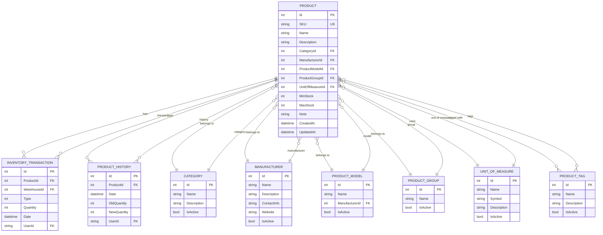
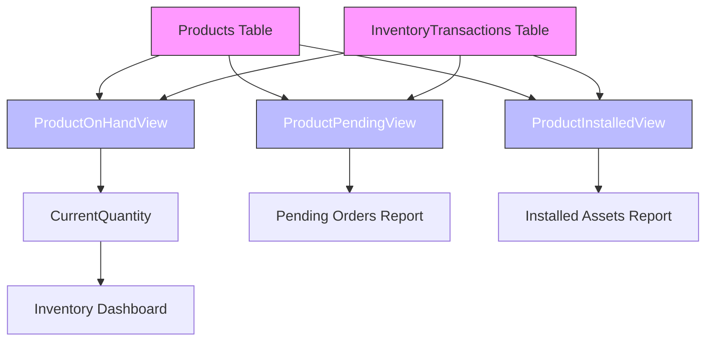

# Product Model

<cite>
**Referenced Files in This Document**  
- [Product.cs](file://src/Inventory.API/Models/Product.cs)
- [AppDbContext.cs](file://src/Inventory.API/Models/AppDbContext.cs)
- [ProductViews.cs](file://src/Inventory.API/Models/ProductViews.cs)
- [ProductDto.cs](file://src/Inventory.Shared/DTOs/ProductDto.cs)
- [apply-indexes.sql](file://scripts/sql/apply-indexes.sql)
- [20250928092414_InitialCreate.cs](file://src/Inventory.API/Migrations/20250928092414_InitialCreate.cs)
</cite>

## Table of Contents
1. [Introduction](#introduction)
2. [Core Properties](#core-properties)
3. [Entity Relationships](#entity-relationships)
4. [Data Validation Rules](#data-validation-rules)
5. [Computed and Shadow Properties](#computed-and-shadow-properties)
6. [Integration with Inventory Views](#integration-with-inventory-views)
7. [Common Queries and Performance](#common-queries-and-performance)
8. [Conclusion](#conclusion)

## Introduction

The Product entity in InventoryCtrl_2 serves as the central model for managing inventory items within the system. This comprehensive documentation details the structure, relationships, validation rules, and performance characteristics of the Product model. The entity captures essential product information including identification, categorization, manufacturing details, and inventory tracking parameters. It integrates with various system components through well-defined relationships and supports efficient inventory reporting through database views.

**Section sources**
- [Product.cs](file://src/Inventory.API/Models/Product.cs#L4-L35)

## Core Properties

The Product entity contains a comprehensive set of properties that define a product's identity, categorization, and inventory parameters. The core properties include:

- **Id**: Integer primary key that uniquely identifies each product
- **SKU**: String field serving as the Stock Keeping Unit identifier, required and unique across all products
- **Name**: String field representing the product name, required with length validation
- **Description**: Optional string field for detailed product information
- **CategoryId**: Integer foreign key linking to the Category entity
- **ManufacturerId**: Integer foreign key linking to the Manufacturer entity
- **ModelId**: Integer foreign key linking to the ProductModel entity
- **GroupId**: Integer foreign key linking to the ProductGroup entity
- **UnitOfMeasureId**: Integer foreign key linking to the UnitOfMeasure entity
- **Audit Fields**: CreatedAt (DateTime, required) and UpdatedAt (DateTime?, optional) for tracking record creation and modification

The entity also includes inventory management properties such as MinStock and MaxStock for defining stock level thresholds, and a Note field for additional information.

**Section sources**
- [Product.cs](file://src/Inventory.API/Models/Product.cs#L4-L35)
- [ProductDto.cs](file://src/Inventory.Shared/DTOs/ProductDto.cs#L29-L59)

## Entity Relationships

The Product entity establishes multiple relationships with other entities in the system, creating a comprehensive inventory management structure.



**Diagram sources**
- [Product.cs](file://src/Inventory.API/Models/Product.cs#L4-L35)
- [AppDbContext.cs](file://src/Inventory.API/Models/AppDbContext.cs#L50-L55)

### Many-to-One Relationships

The Product entity has several many-to-one relationships with reference data entities:

- **Category**: Each product belongs to one category, while a category can contain multiple products. This relationship supports hierarchical organization of inventory items.
- **Manufacturer**: Each product is associated with one manufacturer, enabling tracking of product origins and supplier information.
- **ProductModel**: Each product is linked to a specific model, allowing for organization of products by model variants within a manufacturer.
- **ProductGroup**: Products are grouped into logical collections, facilitating bulk operations and reporting.
- **UnitOfMeasure**: Each product uses one unit of measure (e.g., pieces, kilograms, liters), ensuring consistent inventory tracking.

### One-to-Many Relationships

The Product entity serves as the parent in several one-to-many relationships:

- **InventoryTransaction**: A product can have multiple inventory transactions (receipts, issues, adjustments), with each transaction recording changes to the product's inventory level.
- **ProductHistory**: Historical records of quantity changes are maintained for each product, providing an audit trail of inventory movements.

### Many-to-Many Relationship

The Product entity participates in a many-to-many relationship with ProductTag through the ProductProductTags join table:

- **ProductTag**: Products can be associated with multiple tags, and each tag can be applied to multiple products. This flexible tagging system enables custom categorization beyond the hierarchical category structure.

**Section sources**
- [Product.cs](file://src/Inventory.API/Models/Product.cs#L4-L35)
- [AppDbContext.cs](file://src/Inventory.API/Models/AppDbContext.cs#L50-L55)

## Data Validation Rules

The Product entity enforces comprehensive data validation rules to ensure data integrity and consistency across the system.

### Required Fields and String Length Limits

The following validation rules are enforced on product properties:

- **Name**: Required, with a minimum length of 2 characters and maximum of 200 characters
- **SKU**: Required, with a minimum length of 2 characters and maximum of 50 characters
- **Description**: Optional, with a maximum length of 1000 characters
- **Note**: Optional, with a maximum length of 500 characters

### Uniqueness Constraints

The SKU field has a unique constraint to prevent duplicate product identifiers within the system. This ensures that each product can be uniquely identified by its SKU, which is critical for inventory tracking and prevents data entry errors.

### Numeric Range Validation

The entity enforces appropriate ranges for numeric properties:

- **MinStock**: Must be 0 or greater, allowing for products that don't require minimum stock levels
- **MaxStock**: Must be greater than 0, ensuring that maximum stock levels are meaningful
- All foreign key fields (CategoryId, ManufacturerId, etc.) must be greater than 0, ensuring valid references to related entities

### Business Rule Validation

Additional business rules are enforced:

- **MaxStock must be greater than or equal to MinStock**: This prevents illogical inventory configurations where the maximum stock level is lower than the minimum
- **IsActive status**: Products can be deactivated without deletion, preserving historical data while preventing new transactions

**Section sources**
- [ProductDto.cs](file://src/Inventory.Shared/DTOs/ProductDto.cs#L29-L59)
- [CreateProductDtoValidator.cs](file://src/Inventory.API/Validators/CreateProductDtoValidator.cs#L36-L62)
- [UpdateProductDtoValidator.cs](file://src/Inventory.API/Validators/UpdateProductDtoValidator.cs#L37-L63)

## Computed and Shadow Properties

The Product entity includes computed properties that enhance functionality without storing redundant data.

### CurrentQuantity Computed Property

The Product entity features a `CurrentQuantity` computed property that is marked with the `[NotMapped]` attribute:

```csharp
[NotMapped]
public int CurrentQuantity { get; set; }
```

This property is populated from the `ProductOnHandView` database view rather than being stored directly in the Products table. This design decision prevents data duplication and ensures consistency between the product record and its current inventory level. The actual quantity on hand is calculated from inventory transactions, providing an accurate and up-to-date view of available stock.

### Shadow Properties

While not explicitly defined in the Product class, the entity framework configuration in `AppDbContext` establishes shadow properties through relationships. For example, the many-to-many relationship between Product and ProductTag is managed through the `ProductProductTags` join table, which is configured in the model builder without requiring explicit entity properties.

**Section sources**
- [Product.cs](file://src/Inventory.API/Models/Product.cs#L30-L32)
- [AppDbContext.cs](file://src/Inventory.API/Models/AppDbContext.cs#L50-L55)

## Integration with Inventory Views

The Product entity integrates with database views to provide efficient inventory reporting and real-time stock information.

### ProductOnHandView

The `ProductOnHandView` provides the current quantity of each product in inventory by aggregating inventory transactions. This view is mapped to the `ProductOnHandView` entity in the `AppDbContext`:

```csharp
modelBuilder.Entity<ProductOnHandView>(entity =>
{
    entity.HasNoKey();
    entity.ToView("vw_product_on_hand");
    entity.Property(e => e.ProductId).HasColumnName("product_id");
    entity.Property(e => e.ProductName).HasColumnName("product_name");
    entity.Property(e => e.SKU).HasColumnName("sku");
    entity.Property(e => e.OnHandQty).HasColumnName("on_hand_qty");
});
```

The `CurrentQuantity` property on the Product entity is populated from this view, ensuring that inventory levels are always accurate and consistent with transaction history.

### Other Inventory Views

The system includes additional views that enhance product reporting:

- **ProductPendingView**: Shows products with pending transactions (e.g., orders that haven't been received)
- **ProductInstalledView**: Tracks products that have been installed at specific locations

These views enable comprehensive inventory reporting without requiring complex queries that join multiple tables, improving performance for inventory dashboards and reporting features.



**Diagram sources**
- [AppDbContext.cs](file://src/Inventory.API/Models/AppDbContext.cs#L100-L120)
- [ProductViews.cs](file://src/Inventory.API/Models/ProductViews.cs#L6-L13)

**Section sources**
- [AppDbContext.cs](file://src/Inventory.API/Models/AppDbContext.cs#L100-L120)
- [ProductViews.cs](file://src/Inventory.API/Models/ProductViews.cs#L6-L13)

## Common Queries and Performance

The Product entity is optimized for common inventory management queries through strategic indexing and query patterns.

### Indexing Strategies

The database schema includes several indexes to optimize query performance:

- **IX_Products_SKU**: Unique index on the SKU column to ensure fast lookups by product identifier
- **IX_Products_CategoryId_IsActive**: Composite index on CategoryId and IsActive to optimize queries that filter products by category and active status
- **IX_Products_ManufacturerId_IsActive**: Composite index on ManufacturerId and IsActive for efficient manufacturer-based filtering

These indexes are defined in the `apply-indexes.sql` script and ensure that common filtering operations perform efficiently even with large product catalogs.

### Common Query Patterns

Typical queries involving the Product entity include:

1. **Product lookup by SKU**: Used when scanning products or processing transactions
2. **Category-based product listing**: Used in inventory browsing and reporting
3. **Manufacturer-specific products**: Used for supplier management and procurement
4. **Low stock alerts**: Queries that compare CurrentQuantity with MinStock
5. **Active product listings**: Filtered queries that exclude inactive products

### Performance Considerations

The system employs several performance optimizations:

- **Computed CurrentQuantity**: By deriving the current quantity from the `ProductOnHandView` rather than storing