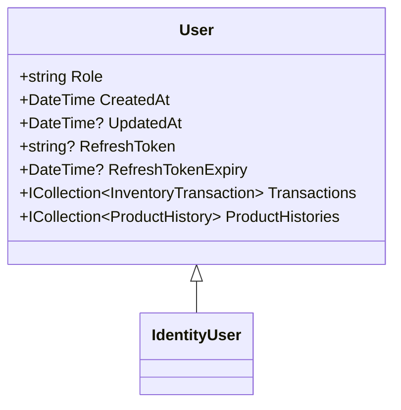
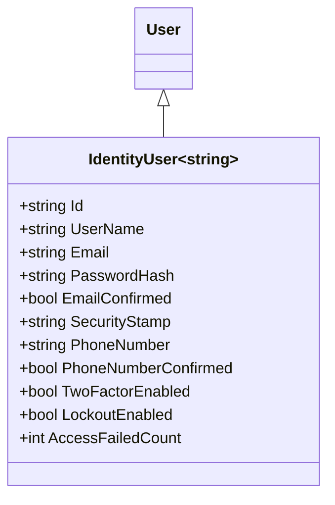
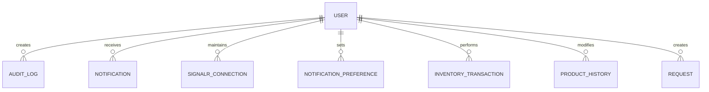
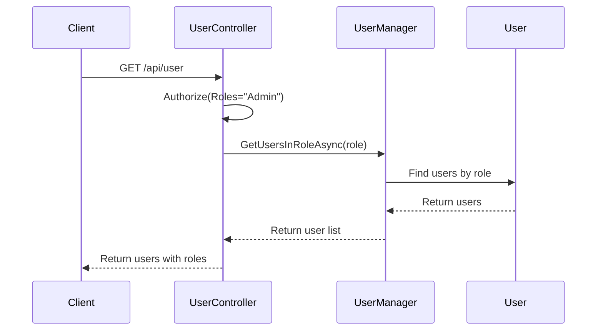
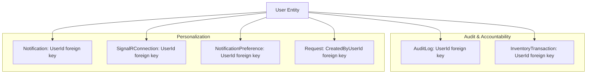
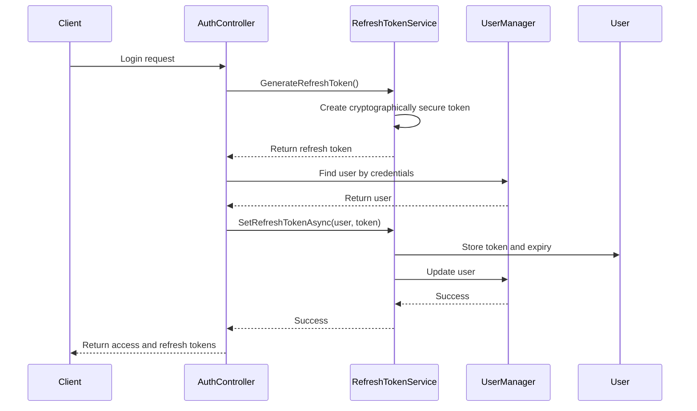

# User Model

<cite>
**Referenced Files in This Document**   
- [User.cs](file://src/Inventory.API/Models/User.cs)
- [AppDbContext.cs](file://src/Inventory.API/Models/AppDbContext.cs)
- [AuditLog.cs](file://src/Inventory.API/Models/AuditLog.cs)
- [SignalRConnection.cs](file://src/Inventory.API/Models/SignalRConnection.cs)
- [Notification.cs](file://src/Inventory.Shared/Models/Notification.cs)
- [NotificationPreference.cs](file://src/Inventory.Shared/Models/Notification.cs)
- [Request.cs](file://src/Inventory.API/Models/Request.cs)
- [RefreshTokenService.cs](file://src/Inventory.API/Services/RefreshTokenService.cs)
- [UserController.cs](file://src/Inventory.API/Controllers/UserController.cs)
- [AuditService.cs](file://src/Inventory.API/Services/AuditService.cs)
</cite>

## Table of Contents
1. [Introduction](#introduction)
2. [Core Data Model](#core-data-model)
3. [Inheritance and Identity Integration](#inheritance-and-identity-integration)
4. [Extended Properties](#extended-properties)
5. [Relationships](#relationships)
6. [Role-Based Authorization and Claims](#role-based-authorization-and-claims)
7. [Foreign Key Usage Across System](#foreign-key-usage-across-system)
8. [Data Validation and Constraints](#data-validation-and-constraints)
9. [User Management Operations](#user-management-operations)
10. [Security Considerations](#security-considerations)
11. [Appendices](#appendices)

## Introduction
The User model in InventoryCtrl_2 serves as the central identity entity for the application, extending ASP.NET Core Identity to support inventory-specific functionality. This document provides comprehensive documentation of the User entity, including its inheritance structure, extended properties, relationships, authorization integration, and security mechanisms.

**Section sources**
- [User.cs](file://src/Inventory.API/Models/User.cs#L2-L11)

## Core Data Model
The User entity is defined as a class that extends `IdentityUser<string>` from ASP.NET Core Identity, providing a robust foundation for user management while enabling application-specific extensions.

**Diagram sources**
- [User.cs](file://src/Inventory.API/Models/User.cs#L2-L11)

**Section sources**
- [User.cs](file://src/Inventory.API/Models/User.cs#L2-L11)

## Inheritance and Identity Integration
The User model inherits from `Microsoft.AspNetCore.Identity.IdentityUser<string>`, leveraging ASP.NET Core Identity for authentication and authorization. This inheritance provides essential identity properties and methods while allowing for custom extension.

The generic parameter `string` specifies that the User ID is of type string rather than the default GUID, facilitating easier integration with external systems and improved readability.

**Diagram sources**
- [User.cs](file://src/Inventory.API/Models/User.cs#L2-L3)

**Section sources**
- [User.cs](file://src/Inventory.API/Models/User.cs#L2-L3)

## Extended Properties
The User model extends the base IdentityUser with several custom properties to support application-specific functionality:

- **Role**: A string property that stores the user's role within the system (e.g., "Admin", "Manager", "User")
- **CreatedAt**: DateTime indicating when the user account was created
- **UpdatedAt**: Nullable DateTime indicating when the user account was last updated
- **RefreshToken**: Nullable string storing the JWT refresh token for session persistence
- **RefreshTokenExpiry**: Nullable DateTime indicating when the refresh token expires

These properties enhance the base identity model with audit and session management capabilities.

**Section sources**
- [User.cs](file://src/Inventory.API/Models/User.cs#L4-L10)

## Relationships
The User entity maintains several relationships with other entities in the system, establishing it as a central hub for user-related activities.

### One-to-Many Relationships

**Diagram sources**
- [AppDbContext.cs](file://src/Inventory.API/Models/AppDbContext.cs#L50-L55)
- [AppDbContext.cs](file://src/Inventory.API/Models/AppDbContext.cs#L75-L78)
- [AppDbContext.cs](file://src/Inventory.API/Models/AppDbContext.cs#L100-L103)
- [AppDbContext.cs](file://src/Inventory.API/Models/AppDbContext.cs#L135-L138)
- [User.cs](file://src/Inventory.API/Models/User.cs#L11-L12)

### Detailed Relationship Analysis
The User entity participates in multiple one-to-many relationships:

- **AuditLog**: Each user can generate multiple audit entries, with the relationship configured to restrict deletion of users with existing audit logs
- **Notification**: Users can receive multiple notifications, with cascade delete behavior when a user is removed
- **SignalRConnection**: Users can maintain multiple SignalR connections, enabling real-time communication
- **NotificationPreference**: Users can set preferences for different notification types
- **InventoryTransaction**: Users perform inventory transactions, establishing accountability for stock movements
- **ProductHistory**: Users are associated with product quantity changes for audit purposes
- **Request**: Users create and own inventory requests, establishing ownership and accountability

**Section sources**
- [AppDbContext.cs](file://src/Inventory.API/Models/AppDbContext.cs#L50-L55)
- [AppDbContext.cs](file://src/Inventory.API/Models/AppDbContext.cs#L75-L78)
- [AppDbContext.cs](file://src/Inventory.API/Models/AppDbContext.cs#L100-L103)
- [AppDbContext.cs](file://src/Inventory.API/Models/AppDbContext.cs#L135-L138)
- [User.cs](file://src/Inventory.API/Models/User.cs#L11-L12)

## Role-Based Authorization and Claims
The User model integrates with ASP.NET Core Identity's role-based authorization system, enabling fine-grained access control throughout the application.

### Role Management
The custom `Role` property complements the built-in role management of ASP.NET Core Identity, providing a simplified role assignment mechanism. Roles are used to control access to various endpoints, such as restricting user management operations to administrators.

**Diagram sources**
- [UserController.cs](file://src/Inventory.API/Controllers/UserController.cs#L20-L120)

### Claim-Based Authorization
The system utilizes claims-based authorization, with user information extracted from JWT tokens. Claims such as `ClaimTypes.NameIdentifier`, `ClaimTypes.Name`, and `ClaimTypes.Role` are used to identify users and their permissions.

The `RefreshTokenService` generates JWT tokens containing user claims, including role information, which is then used for authorization decisions throughout the application.

**Section sources**
- [UserController.cs](file://src/Inventory.API/Controllers/UserController.cs#L20-L120)
- [RefreshTokenService.cs](file://src/Inventory.API/Services/RefreshTokenService.cs#L80-L120)

## Foreign Key Usage Across System
The UserId serves as a foreign key across multiple entities in the system, establishing user accountability and enabling personalized experiences.

### Audit and Accountability
The UserId is used as a foreign key in the AuditLog entity to track user actions, providing a comprehensive audit trail. This enables:
- Tracking of all user activities
- Attribution of changes to specific users
- Investigation of security incidents
- Compliance with regulatory requirements

### Personalization
The UserId is used to personalize the user experience through:
- Targeted notifications
- User-specific preferences
- Customized dashboards
- Personalized request ownership

**Diagram sources**
- [AppDbContext.cs](file://src/Inventory.API/Models/AppDbContext.cs#L50-L55)
- [AppDbContext.cs](file://src/Inventory.API/Models/AppDbContext.cs#L75-L78)
- [AppDbContext.cs](file://src/Inventory.API/Models/AppDbContext.cs#L100-L103)
- [AppDbContext.cs](file://src/Inventory.API/Models/AppDbContext.cs#L135-L138)
- [Request.cs](file://src/Inventory.API/Models/Request.cs#L9-L12)

**Section sources**
- [AppDbContext.cs](file://src/Inventory.API/Models/AppDbContext.cs#L50-L55)
- [AppDbContext.cs](file://src/Inventory.API/Models/AppDbContext.cs#L75-L78)
- [AppDbContext.cs](file://src/Inventory.API/Models/AppDbContext.cs#L100-L103)
- [AppDbContext.cs](file://src/Inventory.API/Models/AppDbContext.cs#L135-L138)
- [Request.cs](file://src/Inventory.API/Models/Request.cs#L9-L12)

## Data Validation and Constraints
The User model and its relationships are subject to various validation rules and database constraints to ensure data integrity.

### Database Constraints
- **AuditLog**: UserId is required and has a maximum length of 450 characters
- **Notification**: UserId is optional with a maximum length of 450 characters
- **SignalRConnection**: UserId is required and has a maximum length of 450 characters
- **NotificationPreference**: UserId is required and has a maximum length of 450 characters, with a unique constraint on UserId + EventType

### Application-Level Validation
The UserController implements model validation for user operations, ensuring data integrity before persistence. This includes:
- Validation of required fields
- Checking for duplicate usernames and emails
- Ensuring role assignments are valid
- Verifying password complexity requirements

**Section sources**
- [AppDbContext.cs](file://src/Inventory.API/Models/AppDbContext.cs#L50-L55)
- [AppDbContext.cs](file://src/Inventory.API/Models/AppDbContext.cs#L75-L78)
- [AppDbContext.cs](file://src/Inventory.API/Models/AppDbContext.cs#L100-L103)
- [AppDbContext.cs](file://src/Inventory.API/Models/AppDbContext.cs#L135-L138)
- [UserController.cs](file://src/Inventory.API/Controllers/UserController.cs#L150-L200)

## User Management Operations
The UserController provides a comprehensive API for user management operations, accessible only to users with the Admin role.

### Available Operations
- **GetUsers**: Retrieve a paginated list of users with optional filtering
- **GetUser**: Retrieve a specific user by ID
- **CreateUser**: Create a new user with specified role and credentials
- **UpdateUser**: Modify user properties including role assignment
- **DeleteUser**: Remove a user account (excluding the current user)
- **ChangePassword**: Reset a user's password
- **ExportUsers**: Export user data to CSV format

These operations are protected by role-based authorization and include comprehensive error handling and logging.

**Section sources**
- [UserController.cs](file://src/Inventory.API/Controllers/UserController.cs#L20-L535)

## Security Considerations
The User model incorporates several security mechanisms to protect user accounts and system integrity.

### Refresh Token Management
The RefreshTokenService handles JWT refresh token operations, including:
- Generation of cryptographically secure refresh tokens
- Setting expiration times (configurable via Jwt:RefreshTokenExpireDays)
- Validation of refresh tokens against stored values and expiration
- Revocation of refresh tokens during logout or password changes
- Periodic cleanup of expired tokens

**Diagram sources**
- [RefreshTokenService.cs](file://src/Inventory.API/Services/RefreshTokenService.cs#L20-L80)

### Password Policies
While not explicitly defined in the User model, password policies are enforced through ASP.NET Core Identity configuration, including:
- Minimum length requirements
- Complexity requirements (uppercase, lowercase, numbers, special characters)
- Password history to prevent reuse
- Account lockout after failed attempts

### Additional Security Measures
- **Audit Logging**: All user management operations are logged via AuditService
- **Session Management**: Refresh tokens enable secure session persistence
- **Role-Based Access Control**: Administrative operations require Admin role
- **Input Validation**: All user inputs are validated to prevent injection attacks

**Section sources**
- [RefreshTokenService.cs](file://src/Inventory.API/Services/RefreshTokenService.cs#L20-L80)
- [AuditService.cs](file://src/Inventory.API/Services/AuditService.cs#L20-L100)

## Appendices

### Appendix A: User Model Properties
| Property | Type | Description | Constraints |
|--------|------|-------------|-------------|
| Id | string | Unique identifier | Primary key, inherited from IdentityUser |
| UserName | string | User's login name | Required, unique |
| Email | string | User's email address | Required, unique |
| Role | string | User's role in the system | Custom property, e.g., "Admin", "Manager" |
| CreatedAt | DateTime | Account creation timestamp | Required |
| UpdatedAt | DateTime? | Last update timestamp | Nullable |
| RefreshToken | string? | JWT refresh token | Nullable |
| RefreshTokenExpiry | DateTime? | Refresh token expiration | Nullable |

### Appendix B: Related Endpoints
| Endpoint | Method | Description | Authorization |
|---------|--------|-------------|---------------|
| /api/user | GET | Get paginated list of users | Admin only |
| /api/user/{id} | GET | Get specific user | Admin only |
| /api/user | POST | Create new user | Admin only |
| /api/user/{id} | PUT | Update user | Admin only |
| /api/user/{id} | DELETE | Delete user | Admin only |
| /api/user/{id}/change-password | POST | Change user password | Admin only |
| /api/user/export | GET | Export users to CSV | Admin only |
| /api/user/info | GET | Get current user info | Authenticated users |

**Section sources**
- [UserController.cs](file://src/Inventory.API/Controllers/UserController.cs#L20-L535)