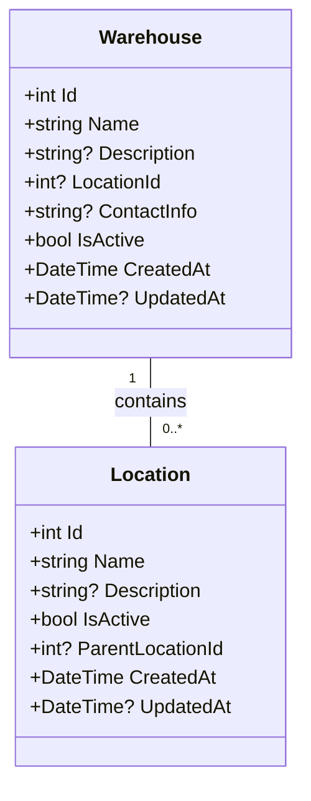

# Warehouse and Location Models

<cite>
**Referenced Files in This Document**   
- [Warehouse.cs](file://src/Inventory.API/Models/Warehouse.cs)
- [Location.cs](file://src/Inventory.API/Models/Location.cs)
- [WarehouseDto.cs](file://src/Inventory.Shared/DTOs/WarehouseDto.cs)
- [LocationDto.cs](file://src/Inventory.Shared/DTOs/LocationDto.cs)
- [AppDbContext.cs](file://src/Inventory.API/Models/AppDbContext.cs)
- [WarehouseController.cs](file://src/Inventory.API/Controllers/WarehouseController.cs)
- [LocationController.cs](file://src/Inventory.API/Controllers/LocationController.cs)
</cite>

## Table of Contents
1. [Introduction](#introduction)
2. [Warehouse Entity](#warehouse-entity)
3. [Location Entity](#location-entity)
4. [Relationship Between Warehouse and Location](#relationship-between-warehouse-and-location)
5. [Data Validation and Constraints](#data-validation-and-constraints)
6. [Hierarchical Structure and Inventory Operations](#hierarchical-structure-and-inventory-operations)
7. [Performance Considerations](#performance-considerations)
8. [Common Operations](#common-operations)
9. [Conclusion](#conclusion)

## Introduction
This document provides comprehensive documentation for the Warehouse and Location data models in the InventoryCtrl_2 system. These entities form the foundation of inventory organization, tracking, and transaction routing. The Warehouse model represents physical storage facilities, while the Location model defines specific areas within warehouses where inventory is stored. This documentation details their properties, relationships, validation rules, and operational impact on inventory management.

## Warehouse Entity

The Warehouse entity represents a physical storage facility within the inventory system. It serves as a container for inventory locations and transactions.

### Properties
- **Id**: Unique integer identifier for the warehouse
- **Name**: Required string name of the warehouse (2-100 characters)
- **Description**: Optional text description (up to 500 characters)
- **LocationId**: Optional foreign key linking to a parent Location entity
- **ContactInfo**: Optional contact information (up to 200 characters)
- **IsActive**: Boolean flag indicating whether the warehouse is active (default: true)
- **CreatedAt**: Timestamp of warehouse creation
- **UpdatedAt**: Timestamp of last modification

The warehouse model supports soft deletion through the IsActive flag, preventing deletion when associated transactions exist.

**Section sources**
- [Warehouse.cs](file://src/Inventory.API/Models/Warehouse.cs#L2-L14)
- [WarehouseDto.cs](file://src/Inventory.Shared/DTOs/WarehouseDto.cs#L2-L14)

## Location Entity

The Location entity represents specific storage areas within a warehouse or organizational hierarchy. Locations enable granular inventory tracking and management.

### Properties
- **Id**: Unique integer identifier for the location
- **Name**: Required string name of the location
- **Description**: Optional text description
- **IsActive**: Boolean flag indicating whether the location is active (default: true)
- **ParentLocationId**: Optional foreign key enabling hierarchical location structures
- **CreatedAt**: Timestamp of location creation
- **UpdatedAt**: Timestamp of last modification

Locations can be organized hierarchically through parent-child relationships, allowing for complex storage configurations (e.g., Zone → Aisle → Shelf → Bin).

**Section sources**
- [Location.cs](file://src/Inventory.API/Models/Location.cs#L2-L14)
- [LocationDto.cs](file://src/Inventory.Shared/DTOs/LocationDto.cs#L2-L13)

## Relationship Between Warehouse and Location

The system implements a one-to-many relationship between Warehouse and Location entities, where multiple locations belong to a single warehouse.

### Relationship Structure


**Diagram sources**
- [Warehouse.cs](file://src/Inventory.API/Models/Warehouse.cs#L8)
- [Location.cs](file://src/Inventory.API/Models/Location.cs#L6)

### Implementation Details
The relationship is established through the LocationId property in the Warehouse entity, which references a Location. This design allows warehouses to be associated with specific physical locations while maintaining a separate hierarchy for inventory storage locations. Inventory transactions reference both WarehouseId and LocationId to provide complete context for stock movements.

**Section sources**
- [AppDbContext.cs](file://src/Inventory.API/Models/AppDbContext.cs#L200-L203)
- [Warehouse.cs](file://src/Inventory.API/Models/Warehouse.cs#L8)

## Data Validation and Constraints

The system enforces data integrity through validation rules and database constraints.

### Validation Rules
- **Warehouse Name**: Required, 2-100 characters
- **ContactInfo**: Maximum 200 characters
- **Description**: Maximum 500 characters
- **Location Name**: Must be unique within the same parent location
- **Parent-Child Relationships**: Prevents circular references (a location cannot be its own parent)

### Database Constraints
- Unique constraint on Warehouse name to prevent duplicates
- Foreign key constraints ensure referential integrity between warehouses, locations, and transactions
- Soft delete pattern implemented through IsActive flag rather than physical deletion

**Section sources**
- [WarehouseDto.cs](file://src/Inventory.Shared/DTOs/WarehouseDto.cs#L36-L49)
- [LocationController.cs](file://src/Inventory.API/Controllers/LocationController.cs#L130-L140)

## Hierarchical Structure and Inventory Operations

The Warehouse-Location relationship enables sophisticated inventory tracking and operational workflows.

### Impact on Inventory Transactions
- **Transaction Routing**: All inventory transactions must specify both a warehouse and location, ensuring complete audit trails
- **Stock Visibility**: Inventory queries can be filtered by warehouse, location, or both for precise stock visibility
- **Reporting**: Reports can aggregate data at warehouse level or drill down to specific locations
- **Movement Tracking**: Transfers between locations within the same warehouse are fully tracked

### Hierarchical Organization
The location hierarchy supports multi-level storage organization:
- **Zone**: Major sections within a warehouse
- **Aisle**: Rows within a zone
- **Shelf**: Storage units within an aisle
- **Bin**: Specific containers on a shelf

This hierarchy enables efficient inventory picking, receiving, and put-away processes.

**Section sources**
- [TransactionController.cs](file://src/Inventory.API/Controllers/TransactionController.cs#L41)
- [LocationController.cs](file://src/Inventory.API/Controllers/LocationController.cs#L20-L30)

## Performance Considerations

The data model includes several performance optimizations for efficient querying and transaction processing.

### Indexing Strategy
```mermaid
erDiagram
WAREHOUSE ||--o{ LOCATION : "contains"
WAREHOUSE {
int Id PK
string Name
string? ContactInfo
bool IsActive
}
LOCATION {
int Id PK
string Name
int? ParentLocationId FK
bool IsActive
}
INVENTORY_TRANSACTION {
int Id PK
int WarehouseId FK
int? LocationId FK
}
WAREHOUSE ||--o{ INVENTORY_TRANSACTION : "has"
LOCATION ||--o{ INVENTORY_TRANSACTION : "associated_with"
```

**Diagram sources**
- [AppDbContext.cs](file://src/Inventory.API/Models/AppDbContext.cs#L229)
- [InitialCreate.cs](file://src/Inventory.API/Migrations/20250928092414_InitialCreate.cs#L739)

### Key Performance Features
- **WarehouseId Index**: Database index on WarehouseId in InventoryTransaction table for fast warehouse-based queries
- **Location Hierarchy Indexing**: ParentLocationId indexed to optimize hierarchical location queries
- **Filtered Queries**: API endpoints support filtering by warehouse and location status to reduce result set size
- **Pagination**: All list endpoints implement pagination to prevent performance issues with large datasets

**Section sources**
- [AppDbContext.cs](file://src/Inventory.API/Models/AppDbContext.cs#L229)
- [WarehouseController.cs](file://src/Inventory.API/Controllers/WarehouseController.cs#L10-L20)

## Common Operations

### Warehouse Creation
Creating a new warehouse requires:
1. Valid warehouse name (2-100 characters)
2. Associated location ID
3. Admin privileges
4. Unique name (no duplicates allowed)

The operation creates a warehouse record with IsActive=true and sets creation timestamp.

### Location Assignment in Transactions
When recording inventory transactions:
1. Specify the WarehouseId
2. Optionally specify LocationId for precise tracking
3. System validates both warehouse and location exist and are active
4. Transaction is linked to both entities for complete audit trail

### Querying Stock by Location
To retrieve inventory at specific locations:
1. Use the GetLocations endpoint with warehouse filter
2. Retrieve transactions filtered by WarehouseId and LocationId
3. Aggregate quantities for accurate stock levels
4. Include inactive locations only when explicitly requested

**Section sources**
- [WarehouseController.cs](file://src/Inventory.API/Controllers/WarehouseController.cs#L100-L150)
- [LocationController.cs](file://src/Inventory.API/Controllers/LocationController.cs#L50-L100)
- [TransactionController.cs](file://src/Inventory.API/Controllers/TransactionController.cs#L30-L80)

## Conclusion
The Warehouse and Location models in InventoryCtrl_2 provide a robust foundation for inventory management. The one-to-many relationship enables flexible organization of storage facilities while maintaining data integrity through validation rules and constraints. The hierarchical location structure supports granular inventory tracking, and performance optimizations ensure efficient operations at scale. These models are essential for accurate stock visibility, transaction routing, and comprehensive reporting across the inventory system.