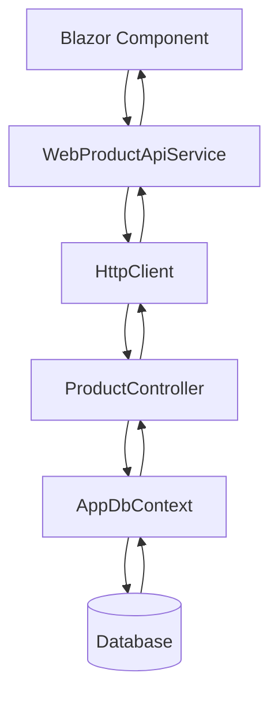
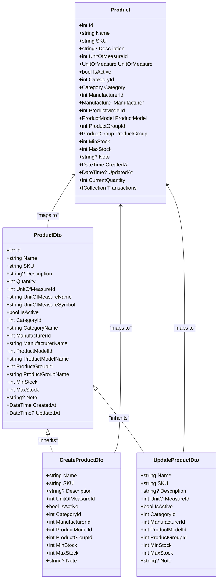
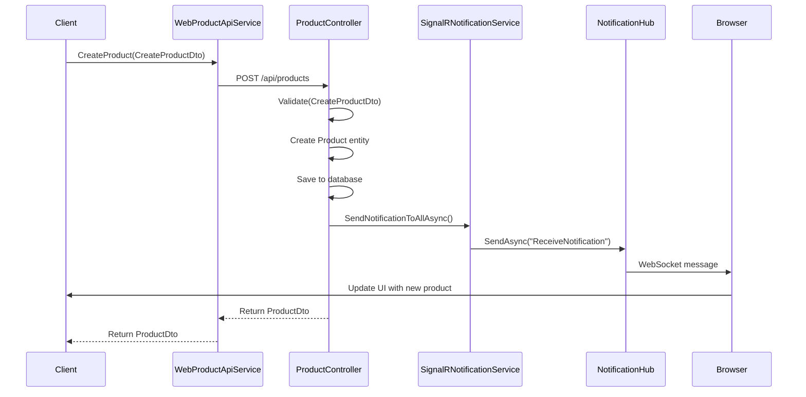
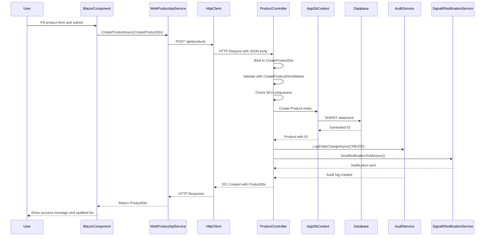

# Data Flow Between Layers

<cite>
**Referenced Files in This Document**   
- [ProductController.cs](file://src/Inventory.API/Controllers/ProductController.cs)
- [Product.cs](file://src/Inventory.API/Models/Product.cs)
- [Product.cs](file://src/Inventory.Shared/Models/Product.cs)
- [ProductDto.cs](file://src/Inventory.Shared/DTOs/ProductDto.cs)
- [NotificationHub.cs](file://src/Inventory.API/Hubs/NotificationHub.cs)
- [SignalRNotificationService.cs](file://src/Inventory.API/Services/SignalRNotificationService.cs)
- [WebProductApiService.cs](file://src/Inventory.Web.Client/Services/WebProductApiService.cs)
- [CreateProductDtoValidator.cs](file://src/Inventory.API/Validators/CreateProductDtoValidator.cs)
</cite>

## Table of Contents
1. [Data Flow Overview](#data-flow-overview)
2. [Blazor Component to API Client Flow](#blazor-component-to-api-client-flow)
3. [API Client to HTTP Transport Flow](#api-client-to-http-transport-flow)
4. [HTTP Transport to API Controller Flow](#http-transport-to-api-controller-flow)
5. [API Controller to Business Service Flow](#api-controller-to-business-service-flow)
6. [Business Service to Database Persistence Flow](#business-service-to-database-persistence-flow)
7. [DTO Mapping and Validation](#dto-mapping-and-validation)
8. [Real-Time Data Flow with SignalR](#real-time-data-flow-with-signalr)
9. [Sequence Diagrams for Key Operations](#sequence-diagrams-for-key-operations)
10. [Performance Considerations and Optimization](#performance-considerations-and-optimization)

## Data Flow Overview

The InventoryCtrl_2 system implements a layered architecture for data flow, starting from Blazor components in the UI layer, through API clients and HTTP transport, to API controllers and business services, and finally to database persistence via Entity Framework Core. This section details the complete pathway of data through these layers, focusing on product-related operations.

The system uses Data Transfer Objects (DTOs) extensively to transfer data between layers, ensuring type safety and reducing over-the-wire payload size. The ProductDto class serves as the primary DTO for product data, containing all necessary fields for display and editing while excluding sensitive or unnecessary information.

**Section sources**
- [ProductDto.cs](file://src/Inventory.Shared/DTOs/ProductDto.cs#L4-L29)

## Blazor Component to API Client Flow

In the InventoryCtrl_2 application, Blazor components initiate data operations by calling methods on service interfaces that are implemented by API client classes. When a user interacts with a product management component, such as creating a new product or updating an existing one, the component calls the appropriate method on the IProductService interface.

The WebProductApiService class implements this interface and provides concrete implementations for all product-related operations. For example, when creating a product, the Blazor component calls CreateProductAsync on the IProductService, which is handled by the WebProductApiService. This service receives a CreateProductDto object containing the product data entered by the user.

The API client service acts as an abstraction layer between the UI components and the underlying HTTP communication, allowing the components to work with strongly-typed methods and objects rather than raw HTTP requests and responses. This separation enables better type safety, easier testing, and more maintainable code.

**Section sources**
- [WebProductApiService.cs](file://src/Inventory.Web.Client/Services/WebProductApiService.cs#L7-L86)

## API Client to HTTP Transport Flow

The API client services in InventoryCtrl_2 use HttpClient to communicate with the backend API over HTTP. When a method like CreateProductAsync is called on WebProductApiService, it constructs an HTTP request using the appropriate endpoint from the ApiEndpoints constants class.

The request serialization process converts the CreateProductDto object to JSON format using the built-in JSON serialization capabilities of HttpClient. The request is then sent to the API with appropriate headers, including authentication tokens that are automatically added by the JwtHttpInterceptor service.

For GET requests, query parameters are constructed from method parameters and appended to the URL. For POST, PUT, and other methods that require a request body, the DTO object is serialized to JSON and sent as the request content. The API client handles the HTTP response, deserializing the JSON response back into strongly-typed objects like ApiResponse<ProductDto>.

Error handling is implemented through the ApiErrorHandler service, which intercepts HTTP responses and translates HTTP status codes into appropriate application-level errors that can be displayed to the user in the Blazor components.

**Section sources**
- [WebProductApiService.cs](file://src/Inventory.Web.Client/Services/WebProductApiService.cs#L7-L86)

## HTTP Transport to API Controller Flow

On the server side, the ProductController class handles incoming HTTP requests for product operations. The controller is decorated with the [ApiController] attribute, which enables automatic model validation and simplifies response formatting.

When an HTTP request arrives at the API, the ASP.NET Core routing system matches the URL to the appropriate controller and action method based on route attributes. For example, a POST request to /api/products is routed to the CreateProduct method of ProductController.

The model binding system automatically deserializes the JSON request body into a CreateProductDto object, performing basic type conversion and validation. If the request contains invalid data that cannot be bound to the DTO, the framework automatically returns a 400 Bad Request response.

The controller methods are also protected by authorization policies, ensuring that only authenticated users with appropriate roles can perform certain operations. The [Authorize] attribute checks for valid JWT tokens, and specific methods like DeleteProduct require the "Admin" role.

**Section sources**
- [ProductController.cs](file://src/Inventory.API/Controllers/ProductController.cs#L13-L719)

## API Controller to Business Service Flow

After receiving and validating the request data, the API controller interacts with business services to perform the requested operation. In the case of product creation, the controller validates the CreateProductDto using the CreateProductDtoValidator, which contains business rules such as ensuring the SKU is unique and meets formatting requirements.

Once the data is validated, the controller creates a Product entity from the CreateProductDto and adds it to the AppDbContext. The entity framework tracks changes to the context, and when SaveChangesAsync is called, it generates the appropriate SQL to insert the new product into the database.

The controller also interacts with the AuditService to log important operations. When a product is created, updated, or deleted, an audit entry is created with details about the operation, including the user who performed it, the timestamp, and the old and new values of changed fields.

For operations that affect inventory levels, such as stock adjustments, the controller creates InventoryTransaction records rather than directly modifying product quantities. This approach provides a complete audit trail of all inventory changes and allows for accurate calculation of current stock levels.

**Section sources**
- [ProductController.cs](file://src/Inventory.API/Controllers/ProductController.cs#L13-L719)
- [AuditService.cs](file://src/Inventory.API/Services/AuditService.cs#L12-L604)

## Business Service to Database Persistence Flow

The final stage of the data flow involves persisting changes to the database using Entity Framework Core. The AppDbContext class defines the data model and provides methods for querying and saving data.

When a new product is created, the Product entity is added to the Products DbSet, and SaveChangesAsync is called to persist the change. Entity Framework generates an INSERT statement and executes it against the database. The database assigns a primary key value, which is then populated back into the Product entity's Id property.

For read operations, the controller uses LINQ queries to retrieve data from the database. These queries are translated into SQL by Entity Framework and executed efficiently on the database server. The results are materialized into Product entities, which are then mapped to ProductDto objects for return to the client.

The system uses a view called ProductOnHandView to calculate current inventory levels. Instead of storing the current quantity directly in the Product entity, the quantity is calculated by summing all inventory transactions for a product. This approach ensures data consistency and provides a complete history of inventory changes.



**Diagram sources**
- [WebProductApiService.cs](file://src/Inventory.Web.Client/Services/WebProductApiService.cs#L7-L86)
- [ProductController.cs](file://src/Inventory.API/Controllers/ProductController.cs#L13-L719)
- [Product.cs](file://src/Inventory.API/Models/Product.cs#L4-L35)

**Section sources**
- [ProductController.cs](file://src/Inventory.API/Controllers/ProductController.cs#L13-L719)
- [Product.cs](file://src/Inventory.API/Models/Product.cs#L4-L35)

## DTO Mapping and Validation

The InventoryCtrl_2 system uses a comprehensive DTO mapping and validation strategy to ensure data integrity throughout the application. DTOs serve as the contract between the client and server, defining exactly what data is transferred for each operation.

The ProductDto class contains all the fields needed to display a product in the UI, including related entity names like CategoryName and ManufacturerName. This eliminates the need for additional API calls to retrieve related data. When creating or updating a product, separate DTOs (CreateProductDto and UpdateProductDto) are used, which include validation attributes to enforce business rules.

Validation occurs at multiple layers:
1. Client-side validation using Blazor's built-in validation features
2. API client validation through the ValidationService
3. Server-side validation using FluentValidation validators like CreateProductDtoValidator
4. Database-level validation through entity constraints

The mapping between ProductDto and Product entity is handled manually in the controller methods, allowing for custom logic such as setting default values and applying business rules. For example, when creating a product, non-admin users can only create active products, regardless of the IsActive value in the DTO.



**Diagram sources**
- [ProductDto.cs](file://src/Inventory.Shared/DTOs/ProductDto.cs#L4-L29)
- [Product.cs](file://src/Inventory.API/Models/Product.cs#L4-L35)

**Section sources**
- [ProductDto.cs](file://src/Inventory.Shared/DTOs/ProductDto.cs#L4-L29)
- [Product.cs](file://src/Inventory.API/Models/Product.cs#L4-L35)
- [CreateProductDtoValidator.cs](file://src/Inventory.API/Validators/CreateProductDtoValidator.cs#L8-L62)

## Real-Time Data Flow with SignalR

InventoryCtrl_2 implements real-time notifications using SignalR to provide immediate feedback to users about system events. The NotificationHub class handles WebSocket connections from clients and manages groups for different types of notifications.

When significant events occur, such as a product being created or inventory levels changing, the system sends notifications to relevant users. The SignalRNotificationService class provides methods for sending notifications to specific users, groups, or all connected clients.

For example, when a product's stock level falls below the minimum threshold, the system can send a low stock alert to users who have subscribed to inventory notifications. Users can subscribe to specific notification types through the SubscribeToNotifications method on the hub.

The real-time data flow works as follows:
1. A client connects to the NotificationHub and authenticates
2. The client subscribes to one or more notification types
3. When an event occurs on the server, the SignalRNotificationService sends a notification to the appropriate group
4. All clients subscribed to that group receive the notification in real-time
5. The client-side code updates the UI to reflect the new information

This approach enables features like live inventory updates, where multiple users viewing the same product list will see changes immediately when another user updates a product.



**Diagram sources**
- [WebProductApiService.cs](file://src/Inventory.Web.Client/Services/WebProductApiService.cs#L7-L86)
- [ProductController.cs](file://src/Inventory.API/Controllers/ProductController.cs#L13-L719)
- [SignalRNotificationService.cs](file://src/Inventory.API/Services/SignalRNotificationService.cs#L7-L190)
- [NotificationHub.cs](file://src/Inventory.API/Hubs/NotificationHub.cs#L10-L321)

**Section sources**
- [SignalRNotificationService.cs](file://src/Inventory.API/Services/SignalRNotificationService.cs#L7-L190)
- [NotificationHub.cs](file://src/Inventory.API/Hubs/NotificationHub.cs#L10-L321)

## Sequence Diagrams for Key Operations

### Product Creation Sequence

The product creation process involves multiple layers and services working together to create a new product record in the system.



**Diagram sources**
- [WebProductApiService.cs](file://src/Inventory.Web.Client/Services/WebProductApiService.cs#L7-L86)
- [ProductController.cs](file://src/Inventory.API/Controllers/ProductController.cs#L13-L719)
- [CreateProductDtoValidator.cs](file://src/Inventory.API/Validators/CreateProductDtoValidator.cs#L8-L62)
- [SignalRNotificationService.cs](file://src/Inventory.API/Services/SignalRNotificationService.cs#L7-L190)

### Stock Adjustment Sequence

Adjusting stock levels involves creating a transaction record rather than directly modifying the product quantity, ensuring a complete audit trail.

```mermaid
sequenceDiagram
    participant User
    participant