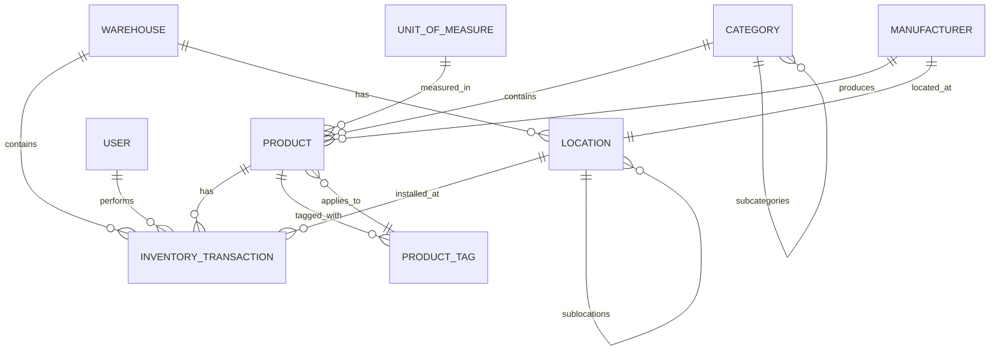
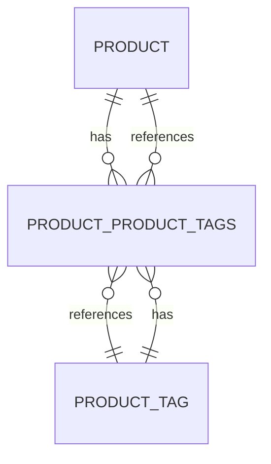

# Entity Relationships

<cite>
**Referenced Files in This Document**   
- [AppDbContext.cs](file://src/Inventory.API/Models/AppDbContext.cs)
- [Product.cs](file://src/Inventory.API/Models/Product.cs)
- [User.cs](file://src/Inventory.API/Models/User.cs)
- [InventoryTransaction.cs](file://src/Inventory.API/Models/InventoryTransaction.cs)
- [Warehouse.cs](file://src/Inventory.API/Models/Warehouse.cs)
- [Location.cs](file://src/Inventory.API/Models/Location.cs)
- [Category.cs](file://src/Inventory.API/Models/Category.cs)
- [Manufacturer.cs](file://src/Inventory.API/Models/Manufacturer.cs)
- [UnitOfMeasure.cs](file://src/Inventory.API/Models/UnitOfMeasure.cs)
- [ProductTag.cs](file://src/Inventory.API/Models/ProductTag.cs)
</cite>

## Table of Contents
1. [Introduction](#introduction)
2. [Core Entity Relationships](#core-entity-relationships)
3. [One-to-Many Relationships](#one-to-many-relationships)
4. [Many-to-One Relationships](#many-to-one-relationships)
5. [Many-to-Many Relationships](#many-to-many-relationships)
6. [Foreign Key Constraints and Referential Integrity](#foreign-key-constraints-and-referential-integrity)
7. [Cascading Delete Behaviors](#cascading-delete-behaviors)
8. [Entity Framework Core Navigation Properties](#entity-framework-core-navigation-properties)
9. [Querying Related Data](#querying-related-data)
10. [Performance Best Practices](#performance-best-practices)

## Introduction

This document provides comprehensive documentation of the core entity relationships in the InventoryCtrl_2 system. The data model is designed around key inventory management entities including Product, User, InventoryTransaction, Warehouse, Location, Category, Manufacturer, and UnitOfMeasure. These entities are interconnected through well-defined relationships that enforce business rules and maintain data integrity. The relationships are configured using Entity Framework Core's fluent API in the AppDbContext class, specifically within the OnModelCreating method. This documentation details the relationship types, foreign key constraints, cascading behaviors, and provides guidance on effectively querying related data while avoiding common performance pitfalls.

**Section sources**
- [AppDbContext.cs](file://src/Inventory.API/Models/AppDbContext.cs#L13-L179)

## Core Entity Relationships

The InventoryCtrl_2 system implements a comprehensive entity relationship model that captures the complex interactions between inventory items, transactions, locations, and organizational hierarchies. The core relationships form a network where products are categorized, measured, manufactured, stored in warehouses at specific locations, and tracked through transactions performed by users. These relationships are designed to enforce referential integrity and support the business logic of inventory management. The entity model uses both direct foreign key relationships and junction tables to represent different types of associations, with careful consideration given to cascading behaviors to prevent orphaned records while maintaining data consistency.

**Diagram sources**
- [AppDbContext.cs](file://src/Inventory.API/Models/AppDbContext.cs#L13-L179)
- [Product.cs](file://src/Inventory.API/Models/Product.cs#L1-L36)
- [InventoryTransaction.cs](file://src/Inventory.API/Models/InventoryTransaction.cs#L1-L39)

**Section sources**
- [AppDbContext.cs](file://src/Inventory.API/Models/AppDbContext.cs#L13-L179)
- [Product.cs](file://src/Inventory.API/Models/Product.cs#L1-L36)
- [InventoryTransaction.cs](file://src/Inventory.API/Models/InventoryTransaction.cs#L1-L39)

## One-to-Many Relationships

The system implements several one-to-many relationships that establish hierarchical structures and parent-child associations between entities. These relationships are configured with appropriate foreign key constraints and cascading behaviors to maintain data integrity. The one-to-many pattern is used extensively to represent organizational hierarchies such as categories with subcategories, locations with sublocations, and manufacturers with their products. Each relationship is defined using Entity Framework Core's fluent API in the OnModelCreating method of AppDbContext, ensuring that the database schema accurately reflects the business domain model.

### Category to Products

The Category entity has a one-to-many relationship with the Product entity, where each category can contain multiple products, but each product belongs to exactly one category. This relationship is implemented through the CategoryId foreign key in the Product table, which references the Id of the Category table. The navigation property `Products` in the Category class allows for easy access to all products within a category, while the `Category` navigation property in the Product class provides access to the parent category. This relationship supports the organizational structure of inventory items, allowing products to be grouped by type, department, or other classification criteria.

**Section sources**
- [Category.cs](file://src/Inventory.API/Models/Category.cs#L11)
- [Product.cs](file://src/Inventory.API/Models/Product.cs#L16)

### Manufacturer to Products

The Manufacturer entity maintains a one-to-many relationship with the Product entity, representing the production relationship where each manufacturer can produce multiple products, but each product is manufactured by exactly one manufacturer. This relationship is established through the ManufacturerId foreign key in the Product table, which references the Id of the Manufacturer table. The navigation property `Products` in the Manufacturer class enables retrieval of all products associated with a specific manufacturer, while the `Manufacturer` navigation property in the Product class provides access to the manufacturer details. This relationship supports inventory tracking by manufacturer and facilitates reporting on manufacturer-specific product lines.

**Section sources**
- [Manufacturer.cs](file://src/Inventory.API/Models/Manufacturer.cs#L16)
- [Product.cs](file://src/Inventory.API/Models/Product.cs#L18)

### UnitOfMeasure to Products

The UnitOfMeasure entity has a one-to-many relationship with the Product entity, where each unit of measure can be used by multiple products, but each product is measured using exactly one unit of measure. This relationship is implemented through the UnitOfMeasureId foreign key in the Product table, which references the Id of the UnitOfMeasure table. The navigation property `Products` in the UnitOfMeasure class allows for identification of all products that use a specific unit of measure, while the `UnitOfMeasure` navigation property in the Product class provides access to the unit of measure details. This relationship ensures consistency in how product quantities are measured and reported across the system.

**Section sources**
- [UnitOfMeasure.cs](file://src/Inventory.API/Models/UnitOfMeasure.cs#L26)
- [Product.cs](file://src/Inventory.API/Models/Product.cs#L13)

### Warehouse to Transactions

The Warehouse entity maintains a one-to-many relationship with the InventoryTransaction entity, where each warehouse can have multiple inventory transactions, but each transaction is associated with exactly one warehouse. This relationship is established through the WarehouseId foreign key in the InventoryTransaction table, which references the Id of the Warehouse table. The navigation property `Transactions` in the Warehouse class enables retrieval of all transactions for a specific warehouse, while the `Warehouse` navigation property in the InventoryTransaction class provides access to the warehouse details. This relationship is fundamental to tracking inventory movements within specific warehouse locations.

**Section sources**
- [Warehouse.cs](file://src/Inventory.API/Models/Warehouse.cs#L11)
- [InventoryTransaction.cs](file://src/Inventory.API/Models/InventoryTransaction.cs#L18)

## Many-to-One Relationships

The system implements several many-to-one relationships that represent the inverse of one-to-many associations, where multiple instances of one entity are associated with a single instance of another entity. These relationships are crucial for maintaining referential integrity and enabling efficient data retrieval. The many-to-one pattern is used to connect transactional data to reference data, such as linking inventory transactions to products, users, and locations. Each relationship is configured with appropriate foreign key constraints and cascading behaviors to ensure data consistency and prevent orphaned records.

### Product to Category

The Product entity has a many-to-one relationship with the Category entity, where multiple products can belong to the same category, but each product is assigned to exactly one category. This relationship is the inverse of the Category-to-Products one-to-many relationship and is implemented through the CategoryId foreign key in the Product table. The navigation property `Category` in the Product class provides direct access to the category details for a product, enabling efficient retrieval of category information without requiring explicit joins. This relationship supports product classification and filtering by category in user interfaces and reports.

**Section sources**
- [Product.cs](file://src/Inventory.API/Models/Product.cs#L16)
- [Category.cs](file://src/Inventory.API/Models/Category.cs#L11)

### Product to Manufacturer

The Product entity maintains a many-to-one relationship with the Manufacturer entity, where multiple products can be manufactured by the same manufacturer, but each product is produced by exactly one manufacturer. This relationship is the inverse of the Manufacturer-to-Products one-to-many relationship and is implemented through the ManufacturerId foreign key in the Product table. The navigation property `Manufacturer` in the Product class provides direct access to the manufacturer details for a product, enabling efficient retrieval of manufacturer information. This relationship supports inventory management by manufacturer and facilitates reporting on manufacturer-specific product performance.

**Section sources**
- [Product.cs](file://src/Inventory.API/Models/Product.cs#L18)
- [Manufacturer.cs](file://src/Inventory.API/Models/Manufacturer.cs#L16)

### Product to UnitOfMeasure

The Product entity has a many-to-one relationship with the UnitOfMeasure entity, where multiple products can use the same unit of measure, but each product is measured using exactly one unit of measure. This relationship is the inverse of the UnitOfMeasure-to-Products one-to-many relationship and is implemented through the UnitOfMeasureId foreign key in the Product table. The navigation property `UnitOfMeasure` in the Product class provides direct access to the unit of measure details for a product, enabling consistent display of measurement units across the application. This relationship ensures that product quantities are consistently measured and reported.

**Section sources**
- [Product.cs](file://src/Inventory.API/Models/Product.cs#L13)
- [UnitOfMeasure.cs](file://src/Inventory.API/Models/UnitOfMeasure.cs#L26)

### Transaction to Product

The InventoryTransaction entity maintains a many-to-one relationship with the Product entity, where multiple transactions can involve the same product, but each transaction is associated with exactly one product. This relationship is implemented through the ProductId foreign key in the InventoryTransaction table, which references the Id of the Product table. The navigation property `Product` in the InventoryTransaction class provides direct access to the product details for a transaction, enabling comprehensive transaction records that include product information. This relationship is essential for tracking the movement and status of specific inventory items.

**Section sources**
- [InventoryTransaction.cs](file://src/Inventory.API/Models/InventoryTransaction.cs#L16)
- [Product.cs](file://src/Inventory.API/Models/Product.cs#L33)

### Transaction to User

The InventoryTransaction entity has a many-to-one relationship with the User entity, where multiple transactions can be performed by the same user, but each transaction is associated with exactly one user. This relationship is implemented through the UserId foreign key in the InventoryTransaction table, which references the Id of the User table. The navigation property `User` in the InventoryTransaction class provides direct access to the user details for a transaction, enabling audit trails that track which user performed each inventory action. This relationship supports accountability and security by linking all inventory changes to specific users.

**Section sources**
- [InventoryTransaction.cs](file://src/Inventory.API/Models/InventoryTransaction.cs#L23)
- [User.cs](file://src/Inventory.API/Models/User.cs#L9)

### Transaction to Warehouse

The InventoryTransaction entity maintains a many-to-one relationship with the Warehouse entity, where multiple transactions can occur in the same warehouse, but each transaction is associated with exactly one warehouse. This relationship is implemented through the WarehouseId foreign key in the InventoryTransaction table, which references the Id of the Warehouse table. The navigation property `Warehouse` in the InventoryTransaction class provides direct access to the warehouse details for a transaction, enabling comprehensive tracking of inventory movements within specific warehouse locations. This relationship is fundamental to warehouse-specific inventory reporting and analysis.

**Section sources**
- [InventoryTransaction.cs](file://src/Inventory.API/Models/InventoryTransaction.cs#L18)
- [Warehouse.cs](file://src/Inventory.API/Models/Warehouse.cs#L11)

### Transaction to Location

The InventoryTransaction entity has a many-to-one relationship with the Location entity, where multiple transactions can be associated with the same location, but each transaction is linked to at most one location. This relationship is implemented through the nullable LocationId foreign key in the InventoryTransaction table, which references the Id of the Location table. The navigation property `Location` in the InventoryTransaction class provides access to the location details for a transaction, specifically for install-type transactions that record where products are installed. This relationship supports detailed inventory tracking at the location level within warehouses.

**Section sources**
- [InventoryTransaction.cs](file://src/Inventory.API/Models/InventoryTransaction.cs#L25)
- [Location.cs](file://src/Inventory.API/Models/Location.cs#L11)

## Many-to-Many Relationships

The system implements a many-to-many relationship between Product and ProductTag entities to support flexible product classification and filtering. This relationship allows products to have multiple tags and tags to be applied to multiple products, creating a flexible categorization system that complements the hierarchical category structure. The many-to-many association is implemented using a junction table named ProductProductTags, which contains foreign keys to both the Product and ProductTag tables. This design enables complex queries that can retrieve products based on multiple tags, supporting advanced search and filtering capabilities in the user interface.

### Product to ProductTag

The many-to-many relationship between Product and ProductTag is configured in the AppDbContext's OnModelCreating method using Entity Framework Core's fluent API. The relationship is defined with the HasMany-WithMany pattern, specifying that a Product can have many ProductTags and a ProductTag can be associated with many Products. The UsingEntity method is used to explicitly configure the junction table as "ProductProductTags", ensuring that the database schema accurately reflects this relationship. This implementation provides flexibility in how products are categorized and searched, allowing users to apply multiple descriptive tags to products for easier discovery and organization.

**Diagram sources**
- [AppDbContext.cs](file://src/Inventory.API/Models/AppDbContext.cs#L68-L71)
- [Product.cs](file://src/Inventory.API/Models/Product.cs#L34)
- [ProductTag.cs](file://src/Inventory.API/Models/ProductTag.cs#L14)

**Section sources**
- [AppDbContext.cs](file://src/Inventory.API/Models/AppDbContext.cs#L68-L71)
- [Product.cs](file://src/Inventory.API/Models/Product.cs#L34)
- [ProductTag.cs](file://src/Inventory.API/Models/ProductTag.cs#L14)

## Foreign Key Constraints and Referential Integrity

The InventoryCtrl_2 system enforces referential integrity through comprehensive foreign key constraints defined in the entity relationships. These constraints ensure that relationships between entities remain consistent and prevent orphaned records in the database. The foreign key constraints are configured using Entity Framework Core's fluent API in the OnModelCreating method of AppDbContext, with specific configurations for each relationship. The system uses both required and optional foreign keys, with appropriate nullability settings to reflect business rules. Required foreign keys enforce mandatory relationships, while optional foreign keys allow for nullable associations where appropriate.

### Required Foreign Keys

The system implements several required foreign key constraints that enforce mandatory relationships between entities. These include the CategoryId in Product, ManufacturerId in Product, UnitOfMeasureId in Product, ProductId in InventoryTransaction, WarehouseId in InventoryTransaction, and UserId in InventoryTransaction. These required foreign keys ensure that essential relationships are always established, preventing incomplete or invalid data from being entered into the system. For example, a product cannot exist without being assigned to a category, manufacturer, and unit of measure, ensuring that all products have the necessary classification and measurement information.

### Optional Foreign Keys

The system also implements optional foreign key constraints for relationships that are not mandatory. The primary example is the LocationId in InventoryTransaction, which is nullable to accommodate transaction types that do not involve a specific location. This design allows for flexibility in transaction recording while still supporting location-specific tracking when needed. Another example is the ParentLocationId in Location and ParentCategoryId in Category, which are nullable to support top-level locations and categories in the hierarchy. These optional foreign keys provide the necessary flexibility for the data model while maintaining referential integrity for established relationships.

**Section sources**
- [AppDbContext.cs](file://src/Inventory.API/Models/AppDbContext.cs#L13-L179)
- [Product.cs](file://src/Inventory.API/Models/Product.cs#L1-L36)
- [InventoryTransaction.cs](file://src/Inventory.API/Models/InventoryTransaction.cs#L1-L39)

## Cascading Delete Behaviors

The system implements specific cascading delete behaviors to maintain data integrity when entities are removed. These behaviors are configured in the OnModelCreating method of AppDbContext using the OnDelete method with appropriate DeleteBehavior settings. The cascading behaviors are carefully chosen to balance data consistency with the need to preserve historical records. The system avoids cascading deletes in most cases to prevent accidental data loss and instead uses restrictive or set-null behaviors to maintain referential integrity while preserving important historical information.

### Restrictive Deletion

The system uses DeleteBehavior.Restrict for the AuditLog to User relationship, preventing the deletion of a user if they have associated audit logs. This behavior protects historical audit records and ensures that the audit trail remains intact. When an attempt is made to delete a user with existing audit logs, the database will raise an exception, requiring the application to handle this scenario appropriately. This restrictive behavior is essential for maintaining