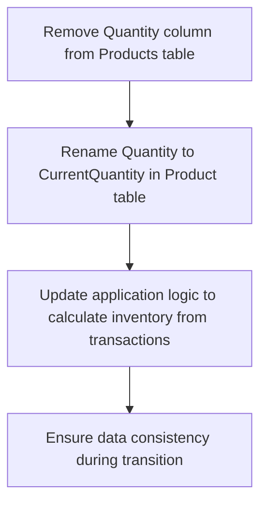
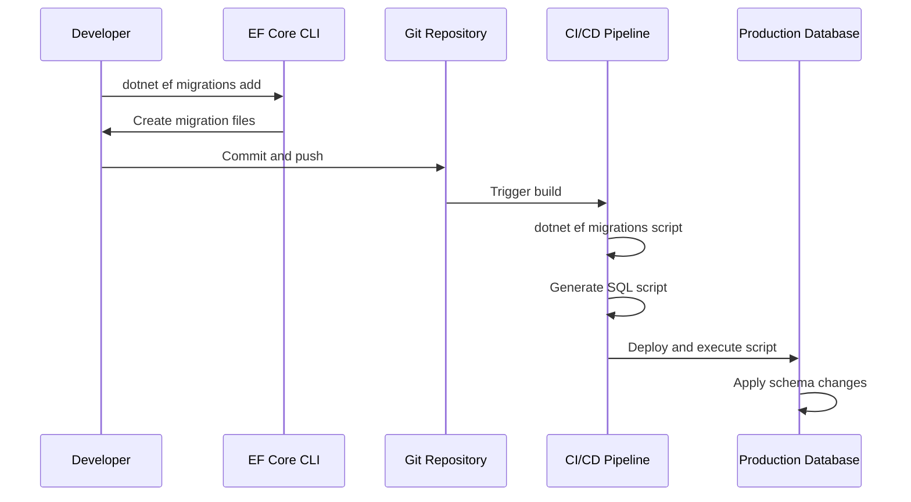
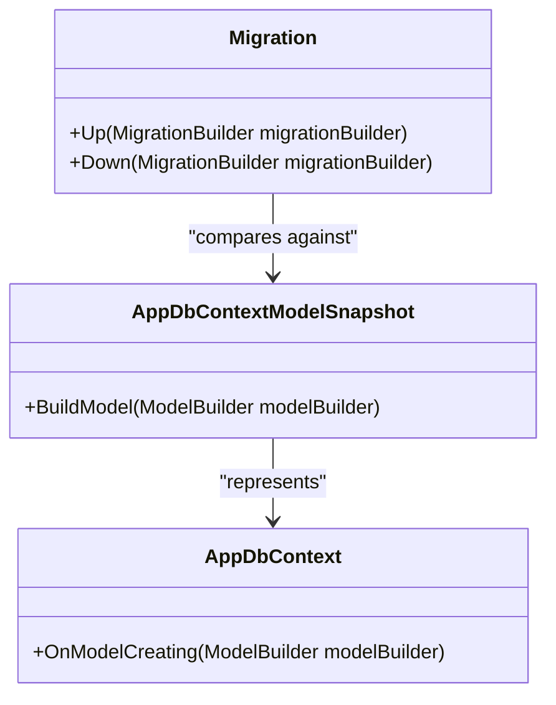
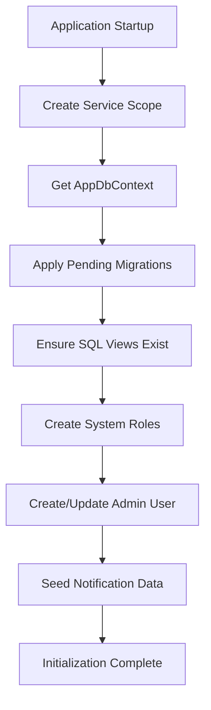

# Migration Strategy

<cite>
**Referenced Files in This Document**   
- [InitialCreate.cs](file://src/Inventory.API/Migrations/20250928092414_InitialCreate.cs)
- [RemoveProductQuantityField.cs](file://src/Inventory.API/Migrations/20250928112842_RemoveProductQuantityField.cs)
- [AddCriticalPerformanceIndexes.cs](file://src/Inventory.API/Migrations/20250928113056_AddCriticalPerformanceIndexes.cs)
- [AppDbContextModelSnapshot.cs](file://src/Inventory.API/Migrations/AppDbContextModelSnapshot.cs)
- [AppDbContext.cs](file://src/Inventory.API/Models/AppDbContext.cs)
- [DbInitializer.cs](file://src/Inventory.API/Models/DbInitializer.cs)
- [init-db.sql](file://scripts/init-db.sql)
</cite>

## Table of Contents
1. [Introduction](#introduction)
2. [Migration History](#migration-history)
3. [Migration Workflow](#migration-workflow)
4. [Model Snapshot and Consistency](#model-snapshot-and-consistency)
5. [Database Initialization and Seeding](#database-initialization-and-seeding)
6. [Migration Conflict Resolution](#migration-conflict-resolution)
7. [Deployment and Scripting](#deployment-and-scripting)
8. [Zero-Downtime Strategies](#zero-downtime-strategies)
9. [Conclusion](#conclusion)

## Introduction
This document details the Entity Framework Core migration strategy for the InventoryCtrl_2 application. It covers the evolution of the database schema through migrations, the workflow for managing schema changes, and best practices for maintaining data integrity across environments. The system uses PostgreSQL as the database backend, with migrations applied through EF Core's migration framework to ensure consistent schema evolution from development to production.

## Migration History

### InitialCreate Migration
The `InitialCreate` migration establishes the foundational database schema for the InventoryCtrl_2 application. It creates all core tables including Products, Categories, Users, InventoryTransactions, and related entities. This migration also sets up ASP.NET Identity tables for user authentication and authorization. The schema includes essential constraints, primary keys, and foreign key relationships to maintain referential integrity. This migration serves as the baseline for all future schema changes.

**Section sources**
- [InitialCreate.cs](file://src/Inventory.API/Migrations/20250928092414_InitialCreate.cs)

### RemoveProductQuantityField Migration
This migration addresses a data modeling issue by removing the redundant `Quantity` field from the `Products` table. The field was previously used to store current inventory levels but created data consistency risks due to potential discrepancies with transaction records. The migration also renames the `Quantity` column in the `Product` table to `CurrentQuantity` to clarify its purpose. This change enforces inventory calculation through transaction summation rather than direct storage, improving data accuracy and auditability.



**Diagram sources**
- [RemoveProductQuantityField.cs](file://src/Inventory.API/Migrations/20250928112842_RemoveProductQuantityField.cs)
- [AppDbContext.cs](file://src/Inventory.API/Models/AppDbContext.cs)

**Section sources**
- [RemoveProductQuantityField.cs](file://src/Inventory.API/Migrations/20250928112842_RemoveProductQuantityField.cs)

### AddCriticalPerformanceIndexes Migration
This migration significantly improves query performance by adding strategic database indexes. It creates composite indexes on frequently queried columns in the `InventoryTransactions` and `AuditLogs` tables. The indexes are designed to optimize common access patterns such as filtering transactions by product and date, or retrieving audit logs by user and timestamp. Partial indexes are used where appropriate to reduce index size and maintenance overhead. This migration demonstrates proactive performance optimization based on usage patterns.

```mermaid
erDiagram
INVENTORY_TRANSACTIONS ||--o{ INDEXES : "has"
AUDIT_LOGS ||--o{ INDEXES : "has"
INVENTORY_TRANSACTIONS {
integer Id PK
integer ProductId FK
timestamp Date
integer Type
integer WarehouseId FK
string UserId FK
integer RequestId FK
}
INDEXES {
string Name
string Columns
boolean IsPartial
}
INDEXES {
"IX_InventoryTransaction_ProductId_Date"
"ProductId, Date"
false
}
INDEXES {
"IX_InventoryTransaction_Type_Date"
"Type, Date"
false
}
INDEXES {
"IX_InventoryTransaction_RequestId"
"RequestId"
true
}
```

**Diagram sources**
- [AddCriticalPerformanceIndexes.cs](file://src/Inventory.API/Migrations/20250928113056_AddCriticalPerformanceIndexes.cs)

**Section sources**
- [AddCriticalPerformanceIndexes.cs](file://src/Inventory.API/Migrations/20250928113056_AddCriticalPerformanceIndexes.cs)

## Migration Workflow

### Development Environment
In development, migrations are created using the EF Core CLI tools. Developers make model changes in the `AppDbContext` and related entity classes, then generate migrations using `dotnet ef migrations add [MigrationName]`. The migration is applied to the local database using `dotnet ef database update`. This iterative process allows developers to refine their schema changes before committing to version control.

### Production Environment
For production deployments, migrations are applied through automated deployment scripts. The process begins with creating migration scripts using `dotnet ef migrations script` to generate SQL scripts from the current migration state to the target state. These scripts are reviewed, tested in staging environments, and incorporated into deployment pipelines. The actual application uses the `DbInitializer` to apply pending migrations during startup, ensuring the database schema is always up-to-date.



**Diagram sources**
- [DbInitializer.cs](file://src/Inventory.API/Models/DbInitializer.cs)

**Section sources**
- [DbInitializer.cs](file://src/Inventory.API/Models/DbInitializer.cs)

## Model Snapshot and Consistency
The `AppDbContextModelSnapshot.cs` file plays a critical role in maintaining migration consistency. It contains a compiled representation of the current model state, which EF Core uses to detect changes when creating new migrations. This snapshot ensures that migrations are generated accurately by comparing the current model against the snapshot. The file must be committed to version control alongside migrations to prevent conflicts when multiple developers work on the same codebase. It acts as a single source of truth for the model structure at any given point in the migration history.



**Diagram sources**
- [AppDbContextModelSnapshot.cs](file://src/Inventory.API/Migrations/AppDbContextModelSnapshot.cs)
- [AppDbContext.cs](file://src/Inventory.API/Models/AppDbContext.cs)

**Section sources**
- [AppDbContextModelSnapshot.cs](file://src/Inventory.API/Migrations/AppDbContextModelSnapshot.cs)

## Database Initialization and Seeding
Database initialization is handled by the `DbInitializer.cs` class, which orchestrates the setup process during application startup. The initializer first applies any pending migrations using `database.MigrateAsync()`, ensuring the schema is up-to-date. It then creates essential database views for inventory reporting and initializes system roles (Admin, Manager, User). The admin user account is created or updated based on configuration settings, and notification seed data is populated. This idempotent process ensures consistent database state across all environments.

The `init-db.sql` script provides the initial database setup when the PostgreSQL container starts. It configures the database timezone and creates necessary extensions like `uuid-ossp`. The actual schema is created by EF Core migrations when the API starts, ensuring consistency between the container initialization and application deployment.



**Diagram sources**
- [DbInitializer.cs](file://src/Inventory.API/Models/DbInitializer.cs)
- [init-db.sql](file://scripts/init-db.sql)

**Section sources**
- [DbInitializer.cs](file://src/Inventory.API/Models/DbInitializer.cs)
- [init-db.sql](file://scripts/init-db.sql)

## Migration Conflict Resolution
Migration conflicts typically occur when multiple developers create migrations simultaneously. The resolution strategy involves coordinating migration ordering and ensuring the model snapshot is up-to-date. When conflicts arise, developers should pull the latest changes, remove their local migration if it hasn't been pushed, and recreate it based on the current model state. The `dotnet ef migrations list` command helps identify the current migration state, while `dotnet ef migrations bundle` can be used to create consolidated migration scripts for complex scenarios.

## Deployment and Scripting
For production deployments, migrations are scripted to provide greater control and auditability. The `dotnet ef migrations script` command generates SQL scripts that can be reviewed, tested, and executed manually or through deployment automation. This approach allows for pre-deployment validation, rollback planning, and integration with database change management policies. Scripts are generated from a specific starting migration to the target migration, ensuring precise control over schema changes. The generated scripts include transaction handling to ensure atomic application of migration changes.

## Zero-Downtime Strategies
The migration strategy supports zero-downtime deployments through careful planning of schema changes. Additive changes (new tables, columns, indexes) can be applied without service interruption. For breaking changes, a two-phase deployment approach is used: first deploy application code that is compatible with both old and new schema, then apply the migration. The use of views and computed columns helps maintain backward compatibility during transitions. Performance-critical migrations are scheduled during low-traffic periods and monitored closely to ensure minimal impact on application performance.

## Conclusion
The Entity Framework Core migration strategy in InventoryCtrl_2 provides a robust framework for managing database schema evolution. By combining automated migration generation with scripted deployment and comprehensive initialization logic, the system ensures consistent, reliable database changes across environments. The migration history demonstrates thoughtful schema design, performance optimization, and data integrity considerations. Following the documented workflows and best practices will enable smooth database evolution while maintaining application reliability and data consistency.