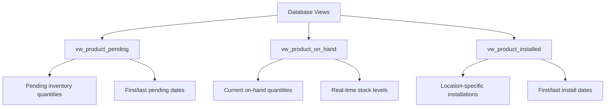
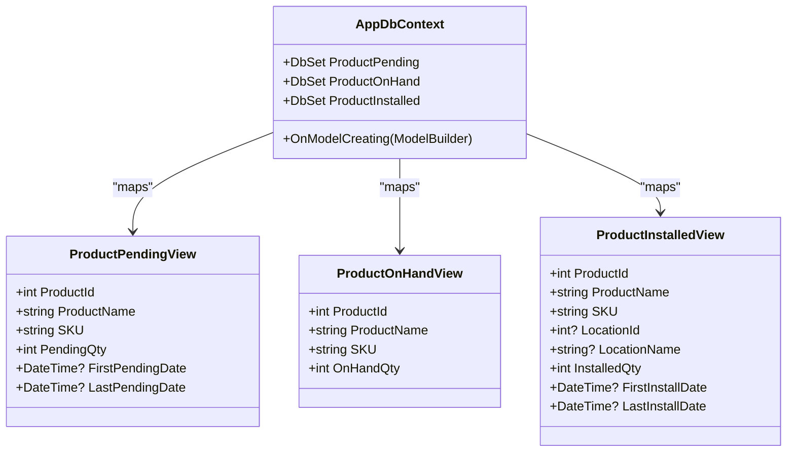

# Views and Indexes

<cite>
**Referenced Files in This Document**   
- [AppDbContext.cs](file://src/Inventory.API/Models/AppDbContext.cs)
- [ProductViews.cs](file://src/Inventory.API/Models/ProductViews.cs)
- [AddCriticalPerformanceIndexes.cs](file://src/Inventory.API/Migrations/20250928113056_AddCriticalPerformanceIndexes.cs)
- [apply-indexes.sql](file://scripts/sql/apply-indexes.sql)
- [reconcile-quantities.sql](file://scripts/sql/reconcile-quantities.sql)
- [DashboardController.cs](file://src/Inventory.API/Controllers/DashboardController.cs)
</cite>

## Table of Contents
1. [Introduction](#introduction)
2. [Database Views](#database-views)
3. [EF Core Keyless Entity Mapping](#ef-core-keyless-entity-mapping)
4. [Critical Performance Indexes](#critical-performance-indexes)
5. [Additional Indexing Strategies](#additional-indexing-strategies)
6. [Complex Query Examples](#complex-query-examples)
7. [Query Optimization Techniques](#query-optimization-techniques)
8. [Index Maintenance and Monitoring](#index-maintenance-and-monitoring)
9. [Conclusion](#conclusion)

## Introduction
This document provides comprehensive documentation for the database views and indexes in the InventoryCtrl_2 system. It details the three key SQL views—`vw_product_pending`, `vw_product_on_hand`, and `vw_product_installed`—that serve as the foundation for dashboard and reporting features. The document explains how these views are mapped in Entity Framework Core using keyless entities within `AppDbContext.cs`, and covers the critical performance indexes implemented via the `AddCriticalPerformanceIndexes` migration. Additional indexing strategies from `apply-indexes.sql` are examined, along with complex queries from `reconcile-quantities.sql` that leverage these views and indexes. The documentation also addresses query optimization techniques, index maintenance, and monitoring strategies for production environments.

## Database Views

The InventoryCtrl_2 system utilizes three key database views to provide optimized, pre-aggregated data for dashboard and reporting features. These views abstract complex joins and aggregations, enabling efficient data retrieval for critical business operations.

### vw_product_pending
This view aggregates pending inventory quantities for products, capturing items that have been ordered or allocated but not yet received or installed. It includes the total pending quantity, along with the first and last dates of pending transactions, providing temporal context for inventory planning.

### vw_product_on_hand
This view calculates the current on-hand quantity for each product by aggregating inventory transactions. It serves as the authoritative source for real-time stock levels, replacing the deprecated `Quantity` field in the `Products` table. The view is essential for low-stock alerts and inventory reconciliation processes.

### vw_product_installed
This view tracks installed products by location, providing granular visibility into asset deployment. It includes location-specific installation quantities and dates, enabling detailed analysis of product utilization across different sites or facilities.



**Diagram sources**
- [ProductViews.cs](file://src/Inventory.API/Models/ProductViews.cs#L2-L30)

**Section sources**
- [ProductViews.cs](file://src/Inventory.API/Models/ProductViews.cs#L2-L30)

## EF Core Keyless Entity Mapping

The database views are integrated into the Entity Framework Core model through keyless entities in `AppDbContext.cs`. This approach allows the views to be queried using LINQ while acknowledging that they do not represent updatable database tables with primary keys.

### Keyless Entity Configuration
In `AppDbContext.cs`, the `OnModelCreating` method configures each view as a keyless entity using the `HasNoKey()` method. This configuration instructs EF Core that the entity:
- Does not have a primary key
- Cannot be tracked for changes
- Is read-only and cannot be used in `SaveChanges()` operations
- Maps directly to a database view rather than a table

The `ToView()` method explicitly specifies the database view name, ensuring proper SQL generation during query execution.

### DbSet Properties
Three `DbSet` properties are defined in `AppDbContext` to expose the views to the application:
- `ProductPending` for `vw_product_pending`
- `ProductOnHand` for `vw_product_on_hand`
- `ProductInstalled` for `vw_product_installed`

These properties enable LINQ queries against the views using standard EF Core patterns, providing a seamless developer experience.



**Diagram sources**
- [AppDbContext.cs](file://src/Inventory.API/Models/AppDbContext.cs#L150-L185)
- [ProductViews.cs](file://src/Inventory.API/Models/ProductViews.cs#L2-L30)

**Section sources**
- [AppDbContext.cs](file://src/Inventory.API/Models/AppDbContext.cs#L150-L185)
- [ProductViews.cs](file://src/Inventory.API/Models/ProductViews.cs#L2-L30)

## Critical Performance Indexes

The `AddCriticalPerformanceIndexes` migration implements a comprehensive indexing strategy to optimize query performance across core entities. These indexes target the most frequently accessed columns and query patterns, significantly improving response times for dashboard and reporting operations.

### InventoryTransactions Indexes
Five critical indexes are created on the `InventoryTransactions` table to support various query patterns:
- `IX_InventoryTransaction_ProductId_Date`: Optimizes queries filtering by product and date range
- `IX_InventoryTransaction_Type_Date`: Supports transaction type analysis over time periods
- `IX_InventoryTransaction_WarehouseId_Type`: Enables efficient warehouse-specific transaction filtering
- `IX_InventoryTransaction_UserId_Date`: Facilitates user activity tracking and audit trails
- `IX_InventoryTransaction_RequestId`: Improves performance for request-linked transactions (partial index)

### AuditLogs Indexes
Two essential indexes enhance audit log performance:
- `IX_AuditLog_EntityName_EntityId`: Accelerates entity-specific audit trail retrieval
- `IX_AuditLog_UserId_Timestamp`: Optimizes user activity monitoring and security audits

### Products Indexes
Three additional indexes improve product query performance:
- `IX_Products_IsActive_CategoryId`: Speeds up active product filtering by category
- `IX_Products_IsActive_ManufacturerId`: Enhances manufacturer-based product queries
- `IX_Products_MinStock_MaxStock`: Optimizes inventory level analysis (conditional index)

```mermaid
graph TD
    A["Critical Performance Indexes"] --> B["InventoryTransactions"]
    A --> C["AuditLogs"]
    A --> D["Products"]
    
    B --> B1["ProductId + Date"]
    B --> B2["Type + Date"]
    B --> B3["WarehouseId + Type